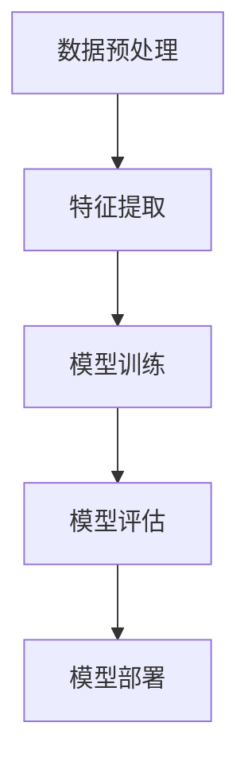

# Lucene与机器学习：构建智能搜索引擎

## 1.背景介绍

在当今信息爆炸的时代，搜索引擎已经成为人们获取信息的主要工具。传统的搜索引擎主要依赖于关键词匹配和布尔逻辑来检索信息，但随着数据量的增加和用户需求的多样化，传统方法逐渐显得力不从心。为了提高搜索引擎的智能化水平，机器学习技术被引入到搜索引擎的构建中。本文将探讨如何结合Lucene和机器学习技术来构建一个智能搜索引擎。

## 2.核心概念与联系

### 2.1 Lucene简介

Lucene是一个高性能、全功能的文本搜索引擎库，最初由Doug Cutting开发，现由Apache软件基金会维护。Lucene提供了强大的索引和搜索功能，广泛应用于各种搜索应用中。

### 2.2 机器学习简介

机器学习是一种通过数据训练模型，使计算机能够自动改进其性能的技术。常见的机器学习算法包括线性回归、决策树、支持向量机、神经网络等。

### 2.3 Lucene与机器学习的结合

将Lucene与机器学习结合，可以利用机器学习算法对搜索结果进行排序、分类、推荐等操作，从而提高搜索引擎的智能化水平。例如，可以使用机器学习算法对用户的搜索行为进行分析，预测用户的搜索意图，从而提供更精准的搜索结果。

## 3.核心算法原理具体操作步骤

### 3.1 数据预处理

数据预处理是构建智能搜索引擎的第一步。包括数据清洗、分词、去停用词、词干提取等操作。

### 3.2 特征提取

特征提取是将文本数据转换为机器学习算法可以处理的数值特征。常用的方法包括TF-IDF、词袋模型、词向量等。

### 3.3 模型训练

选择合适的机器学习算法，对预处理后的数据进行训练，得到一个能够对搜索结果进行排序或分类的模型。

### 3.4 模型评估

使用交叉验证等方法对模型进行评估，确保其在实际应用中的效果。

### 3.5 模型部署

将训练好的模型集成到搜索引擎中，对用户的搜索请求进行处理。

以下是一个简单的Mermaid流程图，展示了上述步骤：



## 4.数学模型和公式详细讲解举例说明

### 4.1 TF-IDF

TF-IDF（Term Frequency-Inverse Document Frequency）是一种常用的特征提取方法，用于衡量一个词在文档中的重要性。其公式如下：

$$
\text{TF-IDF}(t, d) = \text{TF}(t, d) \times \text{IDF}(t)
$$

其中，$\text{TF}(t, d)$表示词$t$在文档$d$中的词频，$\text{IDF}(t)$表示词$t$的逆文档频率，计算公式为：

$$
\text{IDF}(t) = \log \frac{N}{|\{d \in D : t \in d\}|}
$$

### 4.2 词向量

词向量是将词语表示为实数向量的方法，常用的模型包括Word2Vec、GloVe等。以Word2Vec为例，其目标是通过神经网络将词语映射到一个低维向量空间，使得相似词语的向量距离较近。

### 4.3 线性回归

线性回归是一种基本的机器学习算法，用于预测连续值。其模型形式为：

$$
y = \beta_0 + \beta_1 x_1 + \beta_2 x_2 + \cdots + \beta_n x_n + \epsilon
$$

其中，$y$是预测值，$x_i$是特征，$\beta_i$是回归系数，$\epsilon$是误差项。

## 5.项目实践：代码实例和详细解释说明

### 5.1 数据预处理

以下是一个简单的Python代码示例，展示如何使用NLTK进行数据预处理：

```python
import nltk
from nltk.corpus import stopwords
from nltk.tokenize import word_tokenize
from nltk.stem import PorterStemmer

# 下载停用词
nltk.download('stopwords')
nltk.download('punkt')

# 示例文本
text = "Lucene is a powerful search engine library."

# 分词
tokens = word_tokenize(text)

# 去停用词
filtered_tokens = [word for word in tokens if word.lower() not in stopwords.words('english')]

# 词干提取
ps = PorterStemmer()
stemmed_tokens = [ps.stem(word) for word in filtered_tokens]

print(stemmed_tokens)
```

### 5.2 特征提取

以下是一个使用Scikit-learn进行TF-IDF特征提取的示例：

```python
from sklearn.feature_extraction.text import TfidfVectorizer

# 示例文档
documents = [
    "Lucene is a powerful search engine library.",
    "Machine learning can improve search results."
]

# 创建TF-IDF向量器
vectorizer = TfidfVectorizer()

# 计算TF-IDF特征
tfidf_matrix = vectorizer.fit_transform(documents)

print(tfidf_matrix.toarray())
```

### 5.3 模型训练

以下是一个使用Scikit-learn进行线性回归模型训练的示例：

```python
from sklearn.linear_model import LinearRegression
import numpy as np

# 示例特征和标签
X = np.array([[1, 2], [2, 3], [3, 4], [4, 5]])
y = np.array([2, 3, 4, 5])

# 创建线性回归模型
model = LinearRegression()

# 训练模型
model.fit(X, y)

# 预测
predictions = model.predict(X)
print(predictions)
```

## 6.实际应用场景

### 6.1 个性化推荐

通过分析用户的搜索行为和历史记录，使用机器学习算法对用户进行个性化推荐。例如，电商网站可以根据用户的浏览和购买记录，推荐相关商品。

### 6.2 文档分类

使用机器学习算法对文档进行分类，可以提高搜索引擎的精度。例如，新闻网站可以根据文章内容自动分类到不同的栏目中。

### 6.3 搜索结果排序

通过机器学习算法对搜索结果进行排序，可以提高用户的搜索体验。例如，搜索引擎可以根据用户的点击行为，调整搜索结果的排序。

## 7.工具和资源推荐

### 7.1 Lucene

Lucene是一个高性能的文本搜索引擎库，适用于各种搜索应用。官方网站：[Lucene](https://lucene.apache.org/)

### 7.2 Scikit-learn

Scikit-learn是一个Python机器学习库，提供了丰富的机器学习算法和工具。官方网站：[Scikit-learn](https://scikit-learn.org/)

### 7.3 NLTK

NLTK是一个Python自然语言处理库，提供了丰富的文本处理工具。官方网站：[NLTK](https://www.nltk.org/)

## 8.总结：未来发展趋势与挑战

随着数据量的增加和用户需求的多样化，搜索引擎的智能化水平将不断提高。未来，搜索引擎将更加注重个性化推荐、语义理解和多模态搜索等方面的发展。然而，构建智能搜索引擎也面临着数据隐私、算法公平性和计算资源等方面的挑战。

## 9.附录：常见问题与解答

### 9.1 如何选择合适的机器学习算法？

选择合适的机器学习算法需要考虑数据的特性、任务的需求和算法的性能。可以通过实验和交叉验证来选择最优的算法。

### 9.2 如何处理大规模数据？

处理大规模数据可以采用分布式计算和并行处理技术，如Hadoop、Spark等。此外，可以使用增量学习算法，对数据进行分批处理。

### 9.3 如何评估搜索引擎的性能？

评估搜索引擎的性能可以使用精确率、召回率、F1值等指标。此外，可以通过用户实验和A/B测试来评估搜索引擎的用户体验。

---

作者：禅与计算机程序设计艺术 / Zen and the Art of Computer Programming