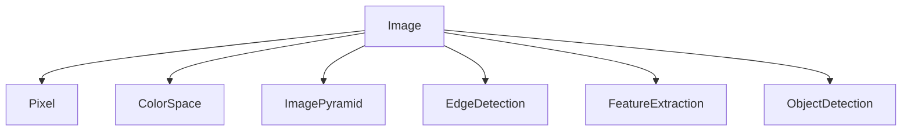

# OpenCV 原理与代码实战案例讲解

## 1.背景介绍
### 1.1 OpenCV的起源与发展
OpenCV(Open Source Computer Vision Library)是一个开源的计算机视觉库,由Intel公司发起并参与开发,以BSD许可证授权发布,可以在商业和研究领域中免费使用。OpenCV诞生于1999年,最初由Gary Bradsky在Intel公司创立,目的是为了加速计算机视觉研究和商业应用的开发。

### 1.2 OpenCV的应用领域
OpenCV主要应用于图像处理、计算机视觉以及模式识别等领域。在图像处理方面,OpenCV提供了大量的图像处理函数,如图像滤波、形态学处理、图像金字塔等。在计算机视觉方面,OpenCV实现了大量的计算机视觉算法,如目标检测、目标跟踪、人脸识别等。在模式识别方面,OpenCV也提供了机器学习算法,如支持向量机、K近邻、决策树等。

### 1.3 OpenCV的优势特点
- 开源免费:OpenCV采用BSD许可证,可以免费用于商业和研究。
- 跨平台:OpenCV可以在Windows、Linux、Android、iOS等多个平台上运行。  
- 高效性能:OpenCV采用C/C++编写,并对多核处理、GPU做了优化,运行效率高。
- 功能丰富:OpenCV集成了大量的计算机视觉、图像处理和机器学习算法。
- 文档齐全:OpenCV提供了完善的官方文档和大量的应用案例。

## 2.核心概念与联系
### 2.1 图像
图像是OpenCV处理的基本对象。在OpenCV中,图像以Mat类的对象存储。常见的图像有二值图像、灰度图像和彩色图像。

### 2.2 像素
像素是组成图像的基本单位。每个像素由一个或多个数值表示,如灰度图像每个像素由一个灰度值表示,彩色图像每个像素由RGB三个值表示。

### 2.3 颜色空间
颜色空间是对色彩的一种数学表示方法。常见的颜色空间有RGB、HSV、YCrCb等。不同的颜色空间适用于不同的应用场景。

### 2.4 图像金字塔
图像金字塔是一种多分辨率的图像表示方法。一个图像金字塔是由一组图像组成,底层是原始图像,每一层都是前一层的降采样。图像金字塔可以用于图像的特征提取、目标检测等。

### 2.5 边缘检测
边缘检测是提取图像边缘的方法。常见的边缘检测算法有Canny、Sobel、Laplacian等。边缘检测在目标检测、图像分割等领域有重要应用。

### 2.6 特征提取
特征提取是提取图像显著特征的方法。常见的特征有SIFT、SURF、ORB等。特征提取是图像配准、目标检测、图像检索等的基础。

### 2.7 目标检测
目标检测是检测图像中特定目标的方法。常见的目标检测算法有Haar特征分类器、HOG特征+SVM分类器等。目标检测在人脸识别、行人检测、车辆检测等领域应用广泛。

下图展示了这些核心概念之间的联系:



## 3.核心算法原理具体操作步骤
### 3.1 Canny边缘检测算法
Canny边缘检测算法是一种常用的边缘检测方法,具体步骤如下:
1. 使用高斯滤波器平滑图像,去除噪声。
2. 计算图像梯度的幅值和方向。
3. 对梯度幅值进行非极大值抑制,细化边缘。
4. 使用双阈值法检测和连接边缘。

### 3.2 SIFT特征提取算法
SIFT(Scale-Invariant Feature Transform)是一种尺度不变特征提取算法,具体步骤如下:
1. 尺度空间极值检测:在不同的尺度空间上检测局部极值点。
2. 关键点定位:去除边缘响应较差和不稳定的极值点。
3. 关键点方向赋值:基于关键点邻域计算出关键点的主方向。 
4. 关键点描述子生成:使用关键点邻域内的梯度信息生成128维的描述子。

### 3.3 Haar特征分类器
Haar特征分类器常用于目标检测,如人脸检测。其基本原理是:
1. 在训练阶段,从正样本(包含待检测目标的图像)和负样本中提取Haar特征。
2. 使用AdaBoost算法训练分类器,筛选出分类能力强的特征。
3. 将分类器级联,形成强分类器。
4. 在检测阶段,采用滑动窗口的方式在图像上进行多尺度检测。

## 4.数学模型和公式详细讲解举例说明
### 4.1 高斯滤波器
高斯滤波器是一种常用的图像平滑滤波器,它的数学模型为二维高斯函数:

$$G(x,y) = \frac{1}{2\pi\sigma^2}e^{-\frac{x^2+y^2}{2\sigma^2}}$$

其中$(x,y)$为像素坐标,$\sigma$为高斯函数的标准差,控制平滑程度。

例如,对于一个$3\times 3$的高斯滤波器,取$\sigma=1$,则滤波器模板为:

$$\frac{1}{16}\begin{bmatrix}
1 & 2 & 1\\
2 & 4 & 2\\
1 & 2 & 1
\end{bmatrix}$$

### 4.2 Sobel算子
Sobel算子用于计算图像梯度,包括水平方向和垂直方向的梯度。其数学模型为:

$$G_x = \begin{bmatrix}
-1 & 0 & +1\\
-2 & 0 & +2\\
-1 & 0 & +1
\end{bmatrix} * I$$

$$G_y = \begin{bmatrix}
-1 & -2 & -1\\
0 & 0 & 0\\
+1 & +2 & +1
\end{bmatrix} * I$$

其中$I$为图像,$G_x$和$G_y$分别为水平和垂直方向的梯度。

梯度幅值和方向可以通过下式计算:

$$G = \sqrt{G_x^2 + G_y^2}$$

$$\theta = \arctan(\frac{G_y}{G_x})$$

### 4.3 SIFT尺度空间
SIFT算法中,尺度空间定义为:

$$L(x,y,\sigma) = G(x,y,\sigma) * I(x,y)$$

其中$L$为尺度空间,$G$为高斯函数,$I$为原始图像。通过改变$\sigma$可以得到不同尺度的图像。

为了检测尺度空间的极值点,SIFT算法使用DoG(Difference of Gaussian)尺度空间:

$$D(x,y,\sigma) = L(x,y,k\sigma) - L(x,y,\sigma)$$

其中$k$为相邻尺度的比例系数。在DoG空间中,极值点对应于尺度不变的特征点。

## 5.项目实践:代码实例和详细解释说明
下面以Python和OpenCV为例,展示几个常用的图像处理和计算机视觉算法的实现。

### 5.1 图像读取、显示和保存

```python
import cv2

# 读取图像
img = cv2.imread('image.jpg')

# 显示图像
cv2.imshow('image', img)
cv2.waitKey(0)

# 保存图像
cv2.imwrite('output.jpg', img)
```

这段代码首先使用`cv2.imread()`函数读取一张名为`image.jpg`的图像,然后使用`cv2.imshow()`函数显示图像,`cv2.waitKey(0)`等待按键。最后使用`cv2.imwrite()`函数保存处理后的图像。

### 5.2 图像平滑

```python
import cv2

img = cv2.imread('image.jpg')

# 均值滤波
blur = cv2.blur(img, (5,5))

# 高斯滤波 
gaussian = cv2.GaussianBlur(img, (5,5), 0)

# 中值滤波
median = cv2.medianBlur(img, 5)

cv2.imshow('image', img)
cv2.imshow('blur', blur)
cv2.imshow('gaussian', gaussian) 
cv2.imshow('median', median)
cv2.waitKey(0)
```

这段代码分别演示了三种常见的图像平滑方法:均值滤波、高斯滤波和中值滤波。`cv2.blur()`函数实现均值滤波,`cv2.GaussianBlur()`函数实现高斯滤波,`cv2.medianBlur()`函数实现中值滤波。它们都接受两个参数:输入图像和滤波器大小。

### 5.3 边缘检测

```python
import cv2

img = cv2.imread('image.jpg', 0)

# Sobel边缘检测
sobelx = cv2.Sobel(img, cv2.CV_64F, 1, 0)
sobely = cv2.Sobel(img, cv2.CV_64F, 0, 1)
sobelx = cv2.convertScaleAbs(sobelx)
sobely = cv2.convertScaleAbs(sobely)
sobel = cv2.addWeighted(sobelx, 0.5, sobely, 0.5, 0)

# Canny边缘检测
canny = cv2.Canny(img, 100, 200)

cv2.imshow('image', img)
cv2.imshow('sobel', sobel)
cv2.imshow('canny', canny)
cv2.waitKey(0)
```

这段代码演示了Sobel算子和Canny算法进行边缘检测。首先将图像转为灰度图,然后分别在x和y方向上计算梯度,再将两个梯度合并。Canny边缘检测只需要调用`cv2.Canny()`函数,指定阈值即可。

### 5.4 人脸检测

```python
import cv2

face_cascade = cv2.CascadeClassifier('haarcascade_frontalface_default.xml')

img = cv2.imread('face.jpg')
gray = cv2.cvtColor(img, cv2.COLOR_BGR2GRAY)

faces = face_cascade.detectMultiScale(gray, 1.3, 5)

for (x,y,w,h) in faces:
    cv2.rectangle(img, (x,y), (x+w,y+h), (255,0,0), 2)

cv2.imshow('image', img)
cv2.waitKey(0)
```

这段代码使用Haar特征分类器进行人脸检测。首先加载训练好的分类器,然后读取图像并转为灰度图。`detectMultiScale()`函数进行多尺度检测,返回检测到的人脸位置。最后使用矩形框标注出人脸。

## 6.实际应用场景
OpenCV在很多领域都有广泛应用,下面列举几个典型的应用场景。

### 6.1 智能视频监控
在智能视频监控系统中,OpenCV可以用于运动目标检测、目标跟踪、行为分析等。通过分析视频中的目标,可以实现入侵检测、区域防范、人数统计等功能。

### 6.2 医学图像处理
OpenCV在医学图像处理中有重要应用。通过对医学图像进行分割、配准、三维重建等处理,可以辅助医生进行疾病诊断和手术规划。著名的医学图像处理库ITK就是基于OpenCV实现的。

### 6.3 人机交互
OpenCV在人机交互领域也有广泛应用,如手势识别、人脸识别、视线跟踪等。通过分析人的面部表情、肢体动作等,可以实现更自然的人机交互方式。

### 6.4 自动驾驶
OpenCV是自动驾驶系统的重要组成部分。通过对车载摄像头拍摄的道路图像进行分析,可以实现车道线检测、交通标志识别、行人检测等功能,从而辅助汽车进行自动驾驶。

## 7.工具和资源推荐
### 7.1 OpenCV官方网站
OpenCV官方网站(https://opencv.org/)提供了OpenCV的下载、文档、教程等资源。在Courses页面有完整的OpenCV学习教程。

### 7.2 OpenCV Github仓库  
OpenCV的Github仓库(https://github.com/opencv/opencv)提供了OpenCV的源代码和示例程序。通过阅读源代码可以深入理解OpenCV的实现原理。

### 7.3 学习书籍
- 《Learning OpenCV 3》是OpenCV的入门教程,适合