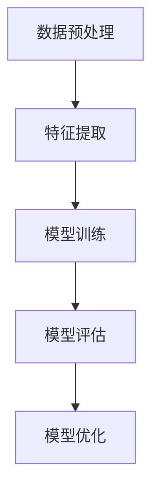

# Python机器学习实战：智能聊天机器人的构建与优化

## 1.背景介绍

在当今数字化时代，智能聊天机器人已经成为许多企业和个人的必备工具。无论是客户服务、在线购物还是个人助理，聊天机器人都在不断改变我们的互动方式。Python作为一种强大且易于学习的编程语言，已经成为构建智能聊天机器人的首选工具之一。本文将深入探讨如何使用Python和机器学习技术构建和优化智能聊天机器人。

## 2.核心概念与联系

在构建智能聊天机器人时，有几个核心概念需要理解：

### 2.1 自然语言处理 (NLP)

自然语言处理是计算机科学和人工智能的一个分支，致力于使计算机能够理解、解释和生成人类语言。NLP技术在聊天机器人中起着至关重要的作用。

### 2.2 机器学习

机器学习是人工智能的一个子领域，涉及使用算法和统计模型使计算机系统能够执行特定任务，而无需明确编程。机器学习在聊天机器人中用于理解用户输入并生成适当的响应。

### 2.3 深度学习

深度学习是机器学习的一个子领域，使用神经网络来模拟人脑的工作方式。深度学习在处理复杂的自然语言任务时表现出色。

### 2.4 语义分析

语义分析是理解用户输入的关键步骤，它涉及识别句子的含义和意图。通过语义分析，聊天机器人可以更准确地理解用户的需求。

### 2.5 对话管理

对话管理是聊天机器人的核心组件之一，它负责管理和跟踪对话的状态，并生成适当的响应。

## 3.核心算法原理具体操作步骤

在构建智能聊天机器人时，我们需要使用一些核心算法。以下是一些关键步骤：

### 3.1 数据预处理

数据预处理是机器学习的第一步。我们需要清理和准备数据，以便模型能够有效地学习。

### 3.2 特征提取

特征提取是将文本数据转换为机器学习模型可以理解的格式。常用的方法包括词袋模型、TF-IDF和词向量。

### 3.3 模型训练

在特征提取之后，我们需要训练机器学习模型。常用的模型包括朴素贝叶斯、支持向量机和神经网络。

### 3.4 模型评估

模型训练完成后，我们需要评估模型的性能。常用的评估指标包括准确率、精确率、召回率和F1分数。

### 3.5 模型优化

根据评估结果，我们可以调整模型的参数和结构，以提高其性能。

以下是一个Mermaid流程图，展示了构建智能聊天机器人的核心步骤：



## 4.数学模型和公式详细讲解举例说明

在构建智能聊天机器人时，数学模型和公式是不可或缺的。以下是一些关键的数学概念和公式：

### 4.1 词袋模型

词袋模型是一种简单而有效的文本表示方法。它将文本表示为词的集合，而不考虑词的顺序。假设我们有一个包含 $n$ 个单词的词汇表，词袋模型将每个文本表示为一个 $n$ 维向量，其中每个维度表示词汇表中相应单词的出现次数。

### 4.2 TF-IDF

TF-IDF（Term Frequency-Inverse Document Frequency）是一种常用的特征提取方法。它结合了词频和逆文档频率，以衡量单词在文档中的重要性。TF-IDF的公式如下：

$$
\text{TF-IDF}(t, d) = \text{TF}(t, d) \times \text{IDF}(t)
$$

其中，$\text{TF}(t, d)$ 表示单词 $t$ 在文档 $d$ 中的词频，$\text{IDF}(t)$ 表示单词 $t$ 的逆文档频率，计算公式为：

$$
\text{IDF}(t) = \log \frac{N}{\text{DF}(t)}
$$

其中，$N$ 是文档总数，$\text{DF}(t)$ 是包含单词 $t$ 的文档数。

### 4.3 朴素贝叶斯分类器

朴素贝叶斯分类器是一种基于贝叶斯定理的简单而高效的分类算法。假设我们有一个类别集合 $C$ 和一个特征集合 $X$，朴素贝叶斯分类器的目标是找到使后验概率最大的类别 $c$：

$$
c = \arg\max_{c \in C} P(c|X)
$$

根据贝叶斯定理，后验概率可以表示为：

$$
P(c|X) = \frac{P(X|c) \cdot P(c)}{P(X)}
$$

由于 $P(X)$ 对所有类别都是常数，我们可以简化为：

$$
c = \arg\max_{c \in C} P(X|c) \cdot P(c)
$$

## 5.项目实践：代码实例和详细解释说明

在本节中，我们将通过一个具体的项目实例，展示如何使用Python构建一个简单的智能聊天机器人。

### 5.1 数据预处理

首先，我们需要准备训练数据。假设我们有一个包含用户输入和相应响应的对话数据集。我们需要对数据进行预处理，包括去除停用词、标记化和词干提取。

```python
import nltk
from nltk.corpus import stopwords
from nltk.tokenize import word_tokenize
from nltk.stem import PorterStemmer

# 下载必要的NLTK数据
nltk.download('punkt')
nltk.download('stopwords')

# 示例对话数据
data = [
    ("你好", "你好！有什么我可以帮忙的吗？"),
    ("你叫什么名字", "我是一个智能聊天机器人。"),
    ("今天天气怎么样", "今天的天气很好。")
]

# 数据预处理函数
def preprocess(text):
    stop_words = set(stopwords.words('english'))
    words = word_tokenize(text)
    words = [word for word in words if word.isalnum()]
    words = [word for word in words if word not in stop_words]
    stemmer = PorterStemmer()
    words = [stemmer.stem(word) for word in words]
    return words

# 预处理示例数据
preprocessed_data = [(preprocess(input_text), preprocess(response_text)) for input_text, response_text in data]
print(preprocessed_data)
```

### 5.2 特征提取

接下来，我们需要将预处理后的文本数据转换为特征向量。我们可以使用词袋模型或TF-IDF进行特征提取。

```python
from sklearn.feature_extraction.text import TfidfVectorizer

# 提取输入和响应文本
input_texts = [" ".join(input_text) for input_text, _ in preprocessed_data]
response_texts = [" ".join(response_text) for _, response_text in preprocessed_data]

# 使用TF-IDF进行特征提取
vectorizer = TfidfVectorizer()
X = vectorizer.fit_transform(input_texts)
y = response_texts
```

### 5.3 模型训练

我们将使用朴素贝叶斯分类器来训练模型。

```python
from sklearn.naive_bayes import MultinomialNB

# 训练朴素贝叶斯分类器
model = MultinomialNB()
model.fit(X, y)
```

### 5.4 模型评估

我们可以使用交叉验证来评估模型的性能。

```python
from sklearn.model_selection import cross_val_score

# 使用交叉验证评估模型
scores = cross_val_score(model, X, y, cv=5)
print("模型准确率：", scores.mean())
```

### 5.5 模型优化

根据评估结果，我们可以调整模型的参数和结构，以提高其性能。例如，我们可以尝试使用不同的特征提取方法或调整朴素贝叶斯分类器的参数。

## 6.实际应用场景

智能聊天机器人在许多实际应用场景中都有广泛的应用。以下是一些常见的应用场景：

### 6.1 客户服务

智能聊天机器人可以用于自动化客户服务，帮助企业提高服务效率和客户满意度。例如，许多电商平台使用聊天机器人来处理客户的常见问题和订单查询。

### 6.2 在线购物

在在线购物场景中，聊天机器人可以充当购物助手，帮助用户查找商品、推荐产品和处理订单。

### 6.3 个人助理

智能聊天机器人可以作为个人助理，帮助用户管理日程、设置提醒和提供信息查询服务。

### 6.4 教育和培训

在教育和培训领域，聊天机器人可以用于提供个性化的学习建议、解答学生的问题和进行在线辅导。

## 7.工具和资源推荐

在构建智能聊天机器人时，有许多工具和资源可以帮助我们提高效率和效果。以下是一些推荐的工具和资源：

### 7.1 编程语言和库

- **Python**：Python是构建智能聊天机器人的首选编程语言，具有丰富的库和框架支持。
- **NLTK**：自然语言处理工具包，提供了丰富的NLP功能。
- **scikit-learn**：机器学习库，提供了多种机器学习算法和工具。
- **TensorFlow和PyTorch**：深度学习框架，适用于构建复杂的神经网络模型。

### 7.2 数据集

- **Cornell Movie Dialogues Corpus**：包含电影对话的数据集，适用于训练对话模型。
- **OpenSubtitles**：包含电影字幕的数据集，适用于训练对话模型。
- **ChatterBot Corpus**：包含常见对话的数据集，适用于训练聊天机器人。

### 7.3 在线资源

- **Kaggle**：数据科学竞赛平台，提供了丰富的数据集和教程。
- **Coursera和edX**：在线学习平台，提供了许多关于机器学习和自然语言处理的课程。
- **GitHub**：代码托管平台，提供了许多开源的聊天机器人项目和代码示例。

## 8.总结：未来发展趋势与挑战

智能聊天机器人在未来有着广阔的发展前景，但也面临一些挑战。

### 8.1 发展趋势

- **多模态交互**：未来的聊天机器人将不仅限于文本交互，还将支持语音、图像和视频等多种交互方式。
- **个性化服务**：通过用户画像和行为分析，聊天机器人将能够提供更加个性化的服务。
- **情感识别**：未来的聊天机器人将能够识别用户的情感状态，并做出相应的响应。

### 8.2 挑战

- **数据隐私**：在收集和处理用户数据时，如何保护用户的隐私是一个重要的挑战。
- **自然语言理解**：尽管NLP技术已经取得了显著进展，但在处理复杂的自然语言任务时仍然存在许多挑战。
- **对话管理**：如何有效地管理和跟踪对话的状态，以提供连贯和一致的响应，是一个关键的技术难题。

## 9.附录：常见问题与解答

### 9.1 如何选择合适的机器学习算法？

选择合适的机器学习算法取决于具体的应用场景和数据特征。对于文本分类任务，朴素贝叶斯、支持向量机和神经网络都是常用的选择。可以通过实验和交叉验证来评估不同算法的性能。

### 9.2 如何处理多轮对话？

处理多轮对话需要使用对话管理技术。可以使用状态机、规则引擎或深度学习模型来管理对话的状态和生成响应。

### 9.3 如何提高聊天机器人的响应质量？

提高聊天机器人的响应质量可以从以下几个方面入手：
- 使用更丰富和多样化的训练数据。
- 采用更先进的特征提取方法和模型。
- 结合上下文信息和用户画像进行个性化响应。

### 9.4 如何保护用户数据隐私？

保护用户数据隐私可以通过以下措施：
- 在数据收集和处理过程中，遵循相关的法律法规和隐私政策。
- 对用户数据进行匿名化和加密处理。
- 限制数据访问权限，确保只有授权人员可以访问用户数据。

### 9.5 如何评估聊天机器人的性能？

评估聊天机器人的性能可以使用以下指标：
- **准确率**：模型预测正确的比例。
- **精确率**：模型预测为正类的样本中，实际为正类的比例。
- **召回率**：实际为正类的样本中，模型预测为正类的比例。
- **F1分数**：精确率和召回率的调和平均数。

---

作者：禅与计算机程序设计艺术 / Zen and the Art of Computer Programming