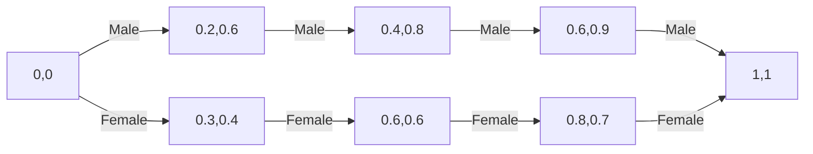

# ROC曲线与公平性：评估模型偏差

## 1. 背景介绍
### 1.1 机器学习模型中的偏差问题
在当今大数据时代，机器学习模型被广泛应用于各个领域，如金融、医疗、教育等。然而，这些模型可能存在偏差，导致对某些群体产生不公平的影响。模型偏差可能源于训练数据的偏差、模型算法的局限性等因素。
### 1.2 公平性评估的重要性
评估模型的公平性对于确保机器学习的道德和法律合规性至关重要。不公平的模型可能加剧社会不平等，损害个人权益。因此，开发公平的机器学习模型是一个亟待解决的问题。
### 1.3 ROC曲线在公平性评估中的作用
ROC（Receiver Operating Characteristic）曲线是一种常用的模型性能评估工具。它通过比较不同阈值下的真正率（TPR）和假正率（FPR），直观地展示了模型的分类能力。近年来，ROC曲线也被用于评估模型的公平性，帮助识别和量化模型偏差。

## 2. 核心概念与联系
### 2.1 ROC曲线
- 真正率（TPR）：在实际为正例的样本中，被正确预测为正例的比例。
- 假正率（FPR）：在实际为负例的样本中，被错误预测为正例的比例。
- ROC曲线：以FPR为横坐标，TPR为纵坐标绘制的曲线。
### 2.2 公平性指标
- 统计学平等（Statistical Parity）：不同群体的正例比例应该相等。
- 机会平等（Equal Opportunity）：不同群体的真正率应该相等。
- 预测平等（Predictive Equality）：不同群体的假正率应该相等。
### 2.3 ROC曲线与公平性指标的联系
通过比较不同群体的ROC曲线，可以直观地判断模型是否存在偏差。如果某个群体的ROC曲线明显低于其他群体，说明该群体遭受了不公平对待。此外，ROC曲线上的特定点对应着不同的公平性指标，如统计学平等点、机会平等点等。

## 3. 核心算法原理具体操作步骤
### 3.1 计算不同群体的ROC曲线
1. 将数据集按照敏感属性（如性别、种族等）划分为不同的群体。
2. 对每个群体，根据模型预测结果和真实标签，计算一系列阈值下的TPR和FPR。
3. 以FPR为横坐标，TPR为纵坐标，绘制每个群体的ROC曲线。
### 3.2 计算公平性指标
1. 统计学平等：比较不同群体的正例比例是否相等。
2. 机会平等：在ROC曲线上找到不同群体真正率相等的点，比较该点的阈值是否一致。
3. 预测平等：在ROC曲线上找到不同群体假正率相等的点，比较该点的阈值是否一致。
### 3.3 评估模型偏差
1. 比较不同群体ROC曲线的差异，判断是否存在偏差。
2. 计算公平性指标，量化偏差程度。
3. 分析偏差产生的原因，提出改进措施。

## 4. 数学模型和公式详细讲解举例说明
### 4.1 ROC曲线的数学定义
假设二分类问题中的阳性类别（正例）为1，阴性类别（负例）为0。对于一个分类阈值 $t$，可以定义以下四个指标：
- 真正例（TP）：实际为正例且预测为正例的样本数。
- 假正例（FP）：实际为负例但预测为正例的样本数。
- 真负例（TN）：实际为负例且预测为负例的样本数。
- 假负例（FN）：实际为正例但预测为负例的样本数。

基于这四个指标，可以计算出真正率和假正率：
- 真正率（TPR）：$TPR(t) = \frac{TP(t)}{TP(t) + FN(t)}$
- 假正率（FPR）：$FPR(t) = \frac{FP(t)}{FP(t) + TN(t)}$

ROC曲线就是在不同阈值 $t$ 下，以FPR为横坐标，TPR为纵坐标绘制的曲线。曲线下面积（AUC）越大，说明分类器性能越好。

### 4.2 公平性指标的数学定义
假设有两个群体A和B，分别用下标A和B表示。
- 统计学平等：$P(\hat{Y}=1|A) = P(\hat{Y}=1|B)$，其中 $\hat{Y}$ 表示预测标签。
- 机会平等：$TPR_A = TPR_B$，即 $\frac{TP_A}{TP_A + FN_A} = \frac{TP_B}{TP_B + FN_B}$。
- 预测平等：$FPR_A = FPR_B$，即 $\frac{FP_A}{FP_A + TN_A} = \frac{FP_B}{FP_B + TN_B}$。

### 4.3 举例说明
假设一个贷款审批模型，对男性和女性的ROC曲线如下图所示：



从图中可以看出，男性的ROC曲线整体高于女性，说明该模型对女性存在偏差。如果我们要求机会平等，就需要在男性和女性的ROC曲线上找到TPR相等的点，并比较这两个点的阈值是否一致。如果阈值不一致，就需要对模型进行调整，以消除偏差。

## 5. 项目实践：代码实例和详细解释说明
下面是一个使用Python和scikit-learn库计算ROC曲线和AUC的示例代码：

```python
from sklearn.metrics import roc_curve, auc
import matplotlib.pyplot as plt

# 假设y_true_male和y_pred_male分别是男性的真实标签和预测概率
fpr_male, tpr_male, thresholds_male = roc_curve(y_true_male, y_pred_male)
auc_male = auc(fpr_male, tpr_male)

# 假设y_true_female和y_pred_female分别是女性的真实标签和预测概率
fpr_female, tpr_female, thresholds_female = roc_curve(y_true_female, y_pred_female)
auc_female = auc(fpr_female, tpr_female)

# 绘制ROC曲线
plt.figure()
plt.plot(fpr_male, tpr_male, color='darkorange', lw=2, label='Male (AUC = %0.2f)' % auc_male)
plt.plot(fpr_female, tpr_female, color='blue', lw=2, label='Female (AUC = %0.2f)' % auc_female)
plt.plot([0, 1], [0, 1], color='navy', lw=2, linestyle='--')
plt.xlim([0.0, 1.0])
plt.ylim([0.0, 1.05])
plt.xlabel('False Positive Rate')
plt.ylabel('True Positive Rate')
plt.title('ROC Curve by Gender')
plt.legend(loc="lower right")
plt.show()
```

这段代码首先使用`roc_curve`函数分别计算男性和女性的FPR、TPR和阈值，然后使用`auc`函数计算AUC。接着，使用Matplotlib库绘制ROC曲线，并在图例中显示每个群体的AUC。通过比较不同群体的ROC曲线和AUC，可以直观地判断模型是否存在偏差。

## 6. 实际应用场景
ROC曲线和公平性评估在许多领域都有广泛应用，例如：
- 金融：评估信用评分模型是否对不同性别、种族的申请者公平。
- 医疗：评估疾病诊断模型是否对不同人口群体公平。
- 招聘：评估简历筛选模型是否存在性别、年龄等方面的偏差。
- 司法：评估量刑模型是否对不同种族的被告公平。

在这些场景中，使用ROC曲线和公平性指标可以帮助识别模型偏差，提高决策的公平性和透明度。

## 7. 工具和资源推荐
- scikit-learn：Python机器学习库，提供了计算ROC曲线和AUC的函数。
- Fairlearn：微软开源的Python库，用于评估和改进机器学习模型的公平性。
- AI Fairness 360：IBM开源的Python库，提供了多种公平性指标和算法。
- Aequitas：芝加哥大学开发的一个开源审计工具，用于评估机器学习模型的偏差和公平性。

这些工具和资源可以帮助研究者和从业者更方便地评估和改进模型的公平性。

## 8. 总结：未来发展趋势与挑战
随着人工智能技术的不断发展，公平性问题受到越来越多的关注。ROC曲线作为一种直观、有效的评估工具，在识别和量化模型偏差方面发挥着重要作用。未来，ROC曲线和其他公平性评估方法将进一步完善，以适应更复杂的场景和需求。

然而，实现真正的公平仍然面临许多挑战：
- 如何在保护隐私的同时获取敏感属性数据？
- 如何权衡模型性能和公平性？
- 如何在动态环境中持续监测和维护模型的公平性？

这些问题需要研究者、从业者和决策者共同努力，通过技术创新、伦理规范和政策制定来解决。只有不断探索和实践，才能让人工智能造福全人类，促进社会公平和正义。

## 9. 附录：常见问题与解答
### 9.1 ROC曲线和PR曲线有什么区别？
ROC曲线和PR（Precision-Recall）曲线都是评估二分类模型性能的工具，但有以下区别：
- ROC曲线以FPR为横坐标，TPR为纵坐标，PR曲线以Recall为横坐标，Precision为纵坐标。
- ROC曲线适用于正负样本比例相对平衡的情况，PR曲线适用于正负样本比例严重失衡的情况。
- ROC曲线的AUC值表示模型的整体性能，PR曲线的AP（Average Precision）值更关注正例的预测效果。

### 9.2 如何选择合适的公平性指标？
选择公平性指标需要考虑以下因素：
- 业务场景和需求：不同场景对公平性的要求不同，需要根据具体情况选择合适的指标。
- 数据特点：样本量、正负样本比例等数据特点会影响指标的适用性。
- 模型类型：不同类型的模型（如分类、回归、排序等）需要使用不同的公平性指标。

综合考虑这些因素，选择能够客观、全面反映模型公平性的指标组合，并结合业务背景进行解释和决策。

### 9.3 如何在满足公平性的同时提高模型性能？
提高模型性能和满足公平性并非完全对立，可以通过以下方法来权衡两者：
- 数据预处理：通过重采样、数据增强等技术，平衡不同群体的样本分布，减少数据偏差。
- 算法选择：使用对抗学习、因果推断等技术，设计能够自动学习公平表示的模型。
- 后处理：在模型训练完成后，通过阈值调整、结果校准等方法，纠正模型输出中的偏差。
- 多目标优化：将模型性能和公平性指标作为联合优化目标，通过权重调节来平衡两者。

需要注意的是，提高公平性可能会在一定程度上牺牲模型性能。决策者需要根据实际情况，权衡公平性和效率，选择最适合的方案。

---

作者：禅与计算机程序设计艺术 / Zen and the Art of Computer Programming