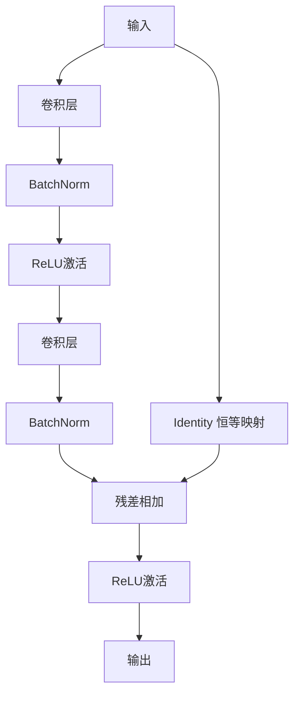

# ResNet：残差学习的突破

## 1. 背景介绍
### 1.1 深度学习的发展历程
### 1.2 深度神经网络面临的挑战
#### 1.2.1 梯度消失与梯度爆炸问题
#### 1.2.2 网络退化问题
### 1.3 ResNet的提出

## 2. 核心概念与联系
### 2.1 残差学习的概念
### 2.2 残差块的结构
#### 2.2.1 恒等映射
#### 2.2.2 短路连接
### 2.3 残差网络与传统网络的区别

## 3. 核心算法原理具体操作步骤
### 3.1 前向传播过程
### 3.2 反向传播过程
### 3.3 权重更新过程
### 3.4 ResNet的不同变体
#### 3.4.1 ResNet-18/34/50/101/152
#### 3.4.2 ResNeXt
#### 3.4.3 DenseNet

## 4. 数学模型和公式详细讲解举例说明 
### 4.1 残差块的数学表示
#### 4.1.1 传统的网络层表示
#### 4.1.2 引入残差连接的表示
### 4.2 前向传播公式推导
### 4.3 反向传播公式推导
### 4.4 梯度计算与权重更新公式

## 5. 项目实践：代码实例和详细解释说明
### 5.1 使用PyTorch实现ResNet
#### 5.1.1 残差块的代码实现
#### 5.1.2 ResNet网络结构的代码实现
### 5.2 在CIFAR-10数据集上训练ResNet
#### 5.2.1 数据预处理与加载
#### 5.2.2 模型训练与评估
### 5.3 使用预训练的ResNet进行迁移学习
#### 5.3.1 加载预训练权重
#### 5.3.2 微调模型进行特定任务

## 6. 实际应用场景
### 6.1 图像分类
### 6.2 目标检测
### 6.3 语义分割
### 6.4 人脸识别

## 7. 工具和资源推荐
### 7.1 深度学习框架
#### 7.1.1 PyTorch
#### 7.1.2 TensorFlow
#### 7.1.3 Keras
### 7.2 预训练模型库
#### 7.2.1 torchvision
#### 7.2.2 TensorFlow-Slim
### 7.3 数据集资源
#### 7.3.1 ImageNet
#### 7.3.2 CIFAR-10/100
#### 7.3.3 MS COCO

## 8. 总结：未来发展趋势与挑战
### 8.1 ResNet的影响与启示
### 8.2 残差学习在其他领域的应用
### 8.3 未来研究方向与挑战

## 9. 附录：常见问题与解答
### 9.1 为什么残差连接能够缓解梯度消失问题？
### 9.2 ResNet相比传统网络有哪些优势？
### 9.3 如何选择合适的ResNet变体？
### 9.4 在实际应用中如何fine-tune ResNet？



残差网络（ResNet）是由何凯明等人在2015年提出的一种革命性的深度神经网络结构。它通过引入残差学习的概念，有效地解决了深度神经网络训练中的梯度消失和网络退化问题，使得训练更深层次的网络成为可能。ResNet在图像分类、目标检测、语义分割等领域取得了显著的性能提升，并广泛应用于各种计算机视觉任务中。

ResNet的核心思想是在网络中引入残差块（Residual Block）。残差块由两个卷积层组成，并通过短路连接（Skip Connection）将输入直接传递到输出。这种结构允许网络学习残差函数，即学习输入和输出之间的差异，而不是直接学习完整的映射关系。通过残差学习，网络可以更容易地学习恒等映射，从而缓解了梯度消失问题，使得训练更深的网络成为可能。

在前向传播过程中，残差块的输出可以表示为：
$$y = F(x) + x$$
其中，$x$表示残差块的输入，$F(x)$表示残差块中的卷积层对输入进行的变换，$y$表示残差块的输出。通过恒等映射将输入$x$直接传递到输出，使得网络可以更容易地学习恒等函数，从而缓解了梯度消失问题。

在反向传播过程中，残差连接的存在使得梯度可以直接传递到前面的层，避免了梯度消失的问题。对于残差块的反向传播，梯度可以表示为：
$$\frac{\partial \mathcal{L}}{\partial x} = \frac{\partial \mathcal{L}}{\partial y} \cdot (1 + \frac{\partial F}{\partial x})$$
其中，$\mathcal{L}$表示损失函数，$\frac{\partial \mathcal{L}}{\partial y}$表示损失函数对残差块输出的梯度，$\frac{\partial F}{\partial x}$表示残差块中卷积层对输入的梯度。通过残差连接，梯度可以直接传递到前面的层，避免了梯度消失问题。

下面是使用PyTorch实现残差块的代码示例：

```python
import torch
import torch.nn as nn

class ResidualBlock(nn.Module):
    def __init__(self, in_channels, out_channels, stride=1):
        super(ResidualBlock, self).__init__()
        self.conv1 = nn.Conv2d(in_channels, out_channels, kernel_size=3, stride=stride, padding=1, bias=False)
        self.bn1 = nn.BatchNorm2d(out_channels)
        self.relu = nn.ReLU(inplace=True)
        self.conv2 = nn.Conv2d(out_channels, out_channels, kernel_size=3, stride=1, padding=1, bias=False)
        self.bn2 = nn.BatchNorm2d(out_channels)
        
        self.shortcut = nn.Sequential()
        if stride != 1 or in_channels != out_channels:
            self.shortcut = nn.Sequential(
                nn.Conv2d(in_channels, out_channels, kernel_size=1, stride=stride, bias=False),
                nn.BatchNorm2d(out_channels)
            )
        
    def forward(self, x):
        residual = x
        out = self.conv1(x)
        out = self.bn1(out)
        out = self.relu(out)
        out = self.conv2(out)
        out = self.bn2(out)
        out += self.shortcut(residual)
        out = self.relu(out)
        return out
```

在上述代码中，`ResidualBlock`类定义了残差块的结构。它由两个卷积层、批归一化层和ReLU激活函数组成。如果残差块的输入和输出维度不同，或者步长不为1，则使用一个额外的卷积层和批归一化层来调整维度。在前向传播过程中，输入先经过两个卷积层的变换，然后与输入进行相加，最后通过ReLU激活函数得到输出。

ResNet在图像分类任务上取得了显著的性能提升。在ImageNet数据集上，ResNet-152模型达到了3.57%的Top-5错误率，超过了人类的表现。ResNet的变体，如ResNeXt和DenseNet，通过引入更复杂的连接方式和更密集的连接，进一步提高了网络的表示能力和性能。

除了图像分类，ResNet还广泛应用于目标检测、语义分割、人脸识别等领域。在目标检测任务中，Faster R-CNN和Mask R-CNN等算法都采用了ResNet作为骨干网络，取得了优异的性能。在语义分割任务中，DeepLab系列算法使用了ResNet作为编码器，实现了高精度的像素级分割。在人脸识别任务中，ResNet也被用于提取鉴别性的人脸特征，取得了很好的识别效果。

ResNet的提出对深度学习领域产生了深远的影响。它展示了通过合理的网络结构设计，可以有效地训练非常深的神经网络，并获得显著的性能提升。ResNet的思想也启发了后续的许多研究工作，如残差密集连接、注意力机制等，进一步推动了深度学习的发展。

尽管ResNet取得了巨大的成功，但仍然存在一些挑战和未来的研究方向。如何设计更有效的残差块结构，如何在更大规模的数据集上训练和优化ResNet，如何将ResNet应用于更多的领域和任务，都是值得探索的问题。此外，如何进一步提高ResNet的计算效率，减少模型的参数量和计算量，也是一个重要的研究方向。

总之，ResNet通过残差学习的概念，突破了深度神经网络训练的瓶颈，实现了更深层次网络的训练，并在多个领域取得了显著的性能提升。它的提出对深度学习领域产生了深远的影响，启发了许多后续的研究工作。ResNet已经成为计算机视觉领域的重要工具和基础架构，并将继续在未来的研究和应用中发挥重要作用。

## 9. 附录：常见问题与解答

### 9.1 为什么残差连接能够缓解梯度消失问题？

残差连接通过将输入直接传递到输出，提供了一条梯度的"捷径"。在反向传播过程中，梯度可以直接流过残差连接，避免了梯度在深层网络中不断衰减的问题。这使得梯度能够更容易地传播到浅层，缓解了梯度消失问题。

### 9.2 ResNet相比传统网络有哪些优势？

相比传统的深度神经网络，ResNet的主要优势包括：
1. 能够训练更深的网络：通过残差连接，ResNet可以训练数百层甚至上千层的深度网络，而不会出现梯度消失或网络退化的问题。
2. 收敛速度更快：残差学习使得网络能够更容易地学习恒等映射，加速了网络的收敛速度。
3. 性能更优：在多个计算机视觉任务上，ResNet都取得了显著的性能提升，超过了之前的最佳方法。

### 9.3 如何选择合适的ResNet变体？

选择合适的ResNet变体取决于具体的任务和计算资源限制。一般来说，层数更多的ResNet变体（如ResNet-101、ResNet-152）在大规模数据集上表现更好，但计算量也更大。对于小规模数据集或计算资源有限的情况，可以选择层数较少的变体（如ResNet-18、ResNet-34）。此外，还可以考虑使用ResNeXt、DenseNet等变体，它们在某些任务上可能表现更优。

### 9.4 在实际应用中如何fine-tune ResNet？

在实际应用中，通常采用预训练的ResNet模型，并在特定任务的数据集上进行fine-tune。具体步骤包括：
1. 加载预训练的ResNet权重。
2. 根据任务的需要，修改ResNet的最后一层或几层，使其与任务的类别数匹配。
3. 冻结ResNet的前面几层，只fine-tune最后几层，这样可以更快地适应新任务，并避免过拟合。
4. 使用较小的学习率，在新任务的数据集上训练模型，直到收敛。
5. 根据需要调整超参数，如学习率、批量大小等，以获得最佳性能。

通过合理的fine-tune策略，可以在特定任务上快速获得高性能的ResNet模型，而无需从头训练整个网络。

作者：禅与计算机程序设计艺术 / Zen and the Art of Computer Programming