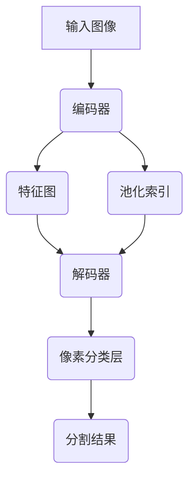

# SegNet模型搭建：构建适合项目的语义分割模型

## 1.背景介绍

语义分割是计算机视觉领域的一个核心任务,旨在将图像中的每个像素分配到一个预定义的类别。它广泛应用于自动驾驶、医疗影像分析、机器人视觉等领域。传统的分割方法如基于阈值、边缘检测等存在局限性,难以处理复杂场景。近年来,基于深度学习的语义分割模型取得了巨大进展,其中SegNet模型因其独特的编码器-解码器结构和高效的上采样方式而备受关注。

## 2.核心概念与联系

### 2.1 编码器-解码器架构

SegNet采用了编码器-解码器架构,编码器部分用于提取图像特征,解码器部分则将特征映射回输入图像的分辨率,生成每个像素的类别预测。这种架构能够有效地捕获图像的空间和语义信息,为精确的像素级分割奠定基础。

### 2.2 池化索引

SegNet的一大创新是引入了池化索引(Pooling Indices)机制。在编码器的最大池化层,除了输出下采样的特征图,还会存储最大池化操作的索引。这些索引在解码器阶段被用于上采样,能够精确地恢复特征图的空间分辨率,避免了传统上采样方法(如反卷积)中的信息损失。

### 2.3 全卷积网络

SegNet是一种全卷积网络,不含任何全连接层。这使得它能够处理任意尺寸的输入图像,并产生相应尺寸的分割结果,提高了模型的通用性和灵活性。

## 3.核心算法原理具体操作步骤

SegNet的核心算法原理可以分为以下几个步骤:

1. **编码器阶段**:输入图像经过一系列卷积和最大池化层,提取不同尺度的特征。每个最大池化层除了输出下采样的特征图外,还会存储池化索引。
2. **解码器阶段**:利用池化索引对编码器输出的特征图进行上采样,恢复原始分辨率。然后通过一系列反卷积层进一步精炼特征图。
3. **像素分类层**:最后一层是一个卷积层,将特征图映射到与输入图像相同分辨率的类别预测图,每个像素对应一个类别标签。
4. **损失函数**:通常使用像素级交叉熵损失函数进行训练。

以下是SegNet的基本流程图:



## 4.数学模型和公式详细讲解举例说明

### 4.1 最大池化与池化索引

最大池化操作可以用以下公式表示:

$$
y_{i,j}^{l} = \max\limits_{(i',j')\in R_{i,j}}x_{i',j'}^{l-1}
$$

其中 $x^{l-1}$ 是第 $l-1$ 层的特征图, $R_{i,j}$ 是以 $(i,j)$ 为中心的池化窗口区域, $y^{l}$ 是第 $l$ 层的池化输出。

池化索引记录了每个池化窗口中最大值的位置,可以用一个与池化输出同形状的矩阵表示:

$$
m_{i,j}^{l} = \arg\max\limits_{(i',j')\in R_{i,j}}x_{i',j'}^{l-1}
$$

在解码器阶段,利用这些索引可以精确地恢复特征图的空间分辨率。

### 4.2 上采样与反卷积

上采样操作可以看作是最大池化的逆过程,根据池化索引将特征图放大到原始分辨率:

$$
y_{i,j}^{l} = 
\begin{cases}
x_{k,q}^{l-1}, & \text{if } m_{i,j}^{l} = (k,q) \\
0, & \text{otherwise}
\end{cases}
$$

其中 $x^{l-1}$ 是上一层的特征图, $m^{l}$ 是对应的池化索引矩阵。

反卷积层则进一步精炼上采样后的特征图,提取更高级的语义信息。它可以看作是卷积层的转置操作,通过学习卷积核参数来重建像素级别的空间细节。

### 4.3 像素分类层

最后一层是一个卷积层,将特征图映射到与输入图像相同分辨率的类别预测图。对于每个像素 $(i,j)$,其类别预测 $\hat{y}_{i,j}$ 可以通过 softmax 函数计算:

$$
\hat{y}_{i,j,k} = \frac{e^{z_{i,j,k}}}{\sum_{c=1}^{C}e^{z_{i,j,c}}}
$$

其中 $z_{i,j,k}$ 是该像素在第 $k$ 类的logits值, $C$ 是总类别数。

### 4.4 损失函数

SegNet通常使用像素级交叉熵损失函数进行训练,公式如下:

$$
\mathcal{L} = -\frac{1}{N}\sum_{i=1}^{N}\sum_{j=1}^{H\times W}\sum_{k=1}^{C}y_{i,j,k}\log\hat{y}_{i,j,k}
$$

其中 $N$ 是批量大小, $H\times W$ 是图像分辨率, $y_{i,j,k}$ 是像素 $(i,j)$ 的真实标签(one-hot编码), $\hat{y}_{i,j,k}$ 是模型预测的概率分布。

通过最小化损失函数,可以使模型输出的分割结果逐渐逼近真实标签。

## 5.项目实践:代码实例和详细解释说明

以下是使用PyTorch实现SegNet的代码示例,包括模型定义和训练过程:

```python
import torch
import torch.nn as nn
import torch.nn.functional as F

# 定义SegNet编码器
class SegNetEncoder(nn.Module):
    def __init__(self, in_channels, out_channels):
        super(SegNetEncoder, self).__init__()
        self.conv1 = nn.Conv2d(in_channels, out_channels, 3, padding=1)
        self.bn1 = nn.BatchNorm2d(out_channels)
        self.conv2 = nn.Conv2d(out_channels, out_channels, 3, padding=1)
        self.bn2 = nn.BatchNorm2d(out_channels)
        self.pool = nn.MaxPool2d(2, return_indices=True)

    def forward(self, x):
        x = F.relu(self.bn1(self.conv1(x)))
        x = F.relu(self.bn2(self.conv2(x)))
        x, indices = self.pool(x)
        return x, indices

# 定义SegNet解码器
class SegNetDecoder(nn.Module):
    def __init__(self, in_channels, out_channels):
        super(SegNetDecoder, self).__init__()
        self.conv1 = nn.Conv2d(in_channels, out_channels, 3, padding=1)
        self.bn1 = nn.BatchNorm2d(out_channels)
        self.conv2 = nn.Conv2d(out_channels, out_channels, 3, padding=1)
        self.bn2 = nn.BatchNorm2d(out_channels)
        self.unpool = nn.MaxUnpool2d(2)

    def forward(self, x, indices, output_size):
        x = self.unpool(x, indices, output_size=output_size)
        x = F.relu(self.bn1(self.conv1(x)))
        x = F.relu(self.bn2(self.conv2(x)))
        return x

# 定义SegNet模型
class SegNet(nn.Module):
    def __init__(self, num_classes):
        super(SegNet, self).__init__()
        self.encoder1 = SegNetEncoder(3, 64)
        self.encoder2 = SegNetEncoder(64, 128)
        self.encoder3 = SegNetEncoder(128, 256)
        self.decoder3 = SegNetDecoder(256, 256)
        self.decoder2 = SegNetDecoder(256, 128)
        self.decoder1 = SegNetDecoder(128, 64)
        self.final = nn.Conv2d(64, num_classes, 3, padding=1)

    def forward(self, x):
        x, indices1 = self.encoder1(x)
        x, indices2 = self.encoder2(x)
        x, indices3 = self.encoder3(x)
        x = self.decoder3(x, indices3, output_size=indices2[0].size())
        x = self.decoder2(x, indices2, output_size=indices1[0].size())
        x = self.decoder1(x, indices1, output_size=x.size())
        x = self.final(x)
        return x

# 训练代码
device = torch.device('cuda' if torch.cuda.is_available() else 'cpu')
model = SegNet(num_classes=21).to(device)
criterion = nn.CrossEntropyLoss()
optimizer = torch.optim.Adam(model.parameters(), lr=0.001)

for epoch in range(num_epochs):
    for images, masks in train_loader:
        images = images.to(device)
        masks = masks.to(device)

        optimizer.zero_grad()
        outputs = model(images)
        loss = criterion(outputs, masks)
        loss.backward()
        optimizer.step()

    # 验证和日志记录
```

上述代码首先定义了SegNet的编码器和解码器模块。编码器包含两个卷积层、批归一化层和最大池化层,并返回池化后的特征图和池化索引。解码器则利用池化索引进行上采样,然后通过两个卷积层和批归一化层进一步精炼特征图。

SegNet模型由多个编码器和解码器模块堆叠而成,最后一层是一个卷积层,将特征图映射到分割结果。在训练过程中,使用交叉熵损失函数和Adam优化器进行端到端的训练。

需要注意的是,上述代码仅供参考,在实际项目中可能需要根据具体需求进行调整和优化,如添加数据增强、调整超参数、使用预训练模型等。

## 6.实际应用场景

SegNet模型在以下领域有广泛的应用:

1. **自动驾驶**:可用于道路场景分割,识别道路、车辆、行人等对象,为自动驾驶系统提供关键信息。
2. **医疗影像分析**:能够对CT、MRI等医学影像进行分割,辅助疾病诊断和治疗规划。
3. **遥感图像处理**:可用于对卫星遥感图像进行土地覆盖分类,如识别城市、农田、水体等区域。
4. **机器人视觉**:帮助机器人理解环境,识别物体和障碍物,实现智能导航和操作。
5. **增强现实(AR)**:通过对图像进行实时分割,可以准确地将虚拟元素融合到真实场景中。

除了上述领域,语义分割在图像编辑、视频监控、人机交互等领域也有广泛应用。SegNet作为一种高效且通用的分割模型,可以为各种视觉任务提供强大的支持。

## 7.工具和资源推荐

在实现和应用SegNet模型时,以下工具和资源可能会有所帮助:

1. **深度学习框架**:PyTorch、TensorFlow、Keras等主流深度学习框架,提供了便捷的模型构建和训练接口。
2. **预训练模型**:可以使用在ImageNet等大型数据集上预训练的模型(如VGG、ResNet等)作为SegNet的编码器部分,加速训练并提高性能。
3. **数据集**:CamVid、CityScapes、Pascal VOC等公开数据集,包含了大量标注的图像和分割掩码,可用于模型训练和评估。
4. **可视化工具**:Tensorboard、Visdom等工具,用于可视化训练过程和分割结果,便于调试和分析。
5. **模型评估指标**:常用的语义分割评估指标包括像素准确率(Pixel Accuracy)、平均交并比(Mean IoU)、频权交并比(Frequency Weighted IoU)等。
6. **在线社区和教程**:GitHub、Stack Overflow、课程网站(如Coursera、Udacity)等,提供了丰富的代码示例、技术讨论和学习资源。

利用这些工具和资源,可以更高效地开发和优化SegNet模型,满足不同项目的需求。

## 8.总结:未来发展趋势与挑战

语义分割是计算机视觉领域的一个核心任务,在未来仍将有广阔的发展空间。SegNet作为一种创新的分割模型,为该领域做出了重要贡献,但也面临一些挑战和发展方向:

1. **提高分割精