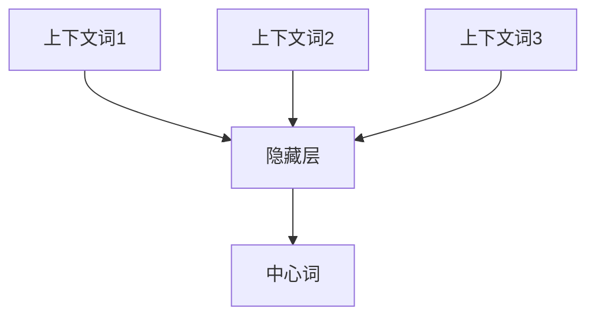
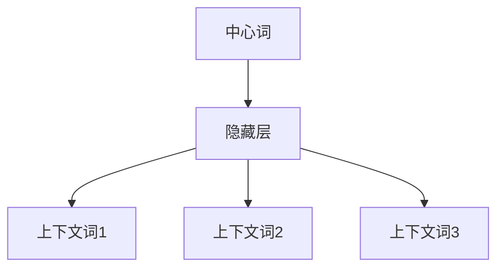
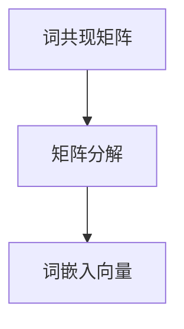

# Word Embeddings原理与代码实例讲解

## 1.背景介绍

在自然语言处理（NLP）领域，词嵌入（Word Embeddings）是一个至关重要的概念。它们通过将词语映射到高维向量空间中，使得计算机能够理解和处理人类语言。词嵌入的出现极大地提升了NLP任务的性能，如文本分类、情感分析和机器翻译等。

传统的词袋模型（Bag of Words）和TF-IDF方法虽然简单易用，但它们无法捕捉词语之间的语义关系。词嵌入通过将语义相似的词语映射到相近的向量空间中，解决了这一问题。本文将深入探讨词嵌入的核心概念、算法原理、数学模型，并通过代码实例进行详细讲解。

## 2.核心概念与联系

### 2.1 词嵌入的定义

词嵌入是将词语表示为实数向量的技术，这些向量通常位于高维空间中。通过这种表示，词语之间的语义关系可以通过向量之间的距离和方向来度量。

### 2.2 词嵌入的类型

- **静态词嵌入**：如Word2Vec、GloVe，这些方法生成的词嵌入在训练后是固定的。
- **动态词嵌入**：如ELMo、BERT，这些方法生成的词嵌入会根据上下文动态变化。

### 2.3 词嵌入的优点

- **捕捉语义关系**：词嵌入能够捕捉到词语之间的语义相似性。
- **降维**：将高维的词语表示降维到低维空间，减少计算复杂度。
- **增强模型性能**：在各种NLP任务中，使用词嵌入能够显著提升模型性能。

## 3.核心算法原理具体操作步骤

### 3.1 Word2Vec

Word2Vec是由Google提出的一种词嵌入方法，主要有两种模型：CBOW（Continuous Bag of Words）和Skip-gram。

#### 3.1.1 CBOW模型

CBOW模型通过上下文词语预测目标词语。其核心思想是给定上下文词语，预测中心词。



#### 3.1.2 Skip-gram模型

Skip-gram模型通过目标词语预测上下文词语。其核心思想是给定中心词，预测上下文词。



### 3.2 GloVe

GloVe（Global Vectors for Word Representation）是由斯坦福大学提出的一种词嵌入方法。它通过构建词共现矩阵，并对其进行矩阵分解来生成词嵌入。



## 4.数学模型和公式详细讲解举例说明

### 4.1 Word2Vec数学模型

#### 4.1.1 CBOW模型

CBOW模型的目标是最大化以下似然函数：

$$
L = \prod_{t=1}^{T} P(w_t | w_{t-m}, \ldots, w_{t-1}, w_{t+1}, \ldots, w_{t+m})
$$

其中，$w_t$ 是目标词，$w_{t-m}, \ldots, w_{t-1}, w_{t+1}, \ldots, w_{t+m}$ 是上下文词。

#### 4.1.2 Skip-gram模型

Skip-gram模型的目标是最大化以下似然函数：

$$
L = \prod_{t=1}^{T} \prod_{-m \leq j \leq m, j \neq 0} P(w_{t+j} | w_t)
$$

其中，$w_t$ 是中心词，$w_{t+j}$ 是上下文词。

### 4.2 GloVe数学模型

GloVe模型的目标是最小化以下损失函数：

$$
J = \sum_{i,j=1}^{V} f(X_{ij}) (w_i^T \tilde{w}_j + b_i + \tilde{b}_j - \log X_{ij})^2
$$

其中，$X_{ij}$ 是词 $i$ 和词 $j$ 的共现次数，$w_i$ 和 $\tilde{w}_j$ 是词 $i$ 和词 $j$ 的词嵌入向量，$b_i$ 和 $\tilde{b}_j$ 是偏置项，$f(X_{ij})$ 是加权函数。

## 5.项目实践：代码实例和详细解释说明

### 5.1 Word2Vec代码实例

以下是使用Gensim库实现Word2Vec的代码示例：

```python
from gensim.models import Word2Vec

# 训练数据
sentences = [["I", "love", "machine", "learning"], ["Word2Vec", "is", "a", "great", "tool"]]

# 训练Word2Vec模型
model = Word2Vec(sentences, vector_size=100, window=5, min_count=1, workers=4)

# 获取词嵌入向量
vector = model.wv['machine']
print(vector)
```

### 5.2 GloVe代码实例

以下是使用GloVe库实现GloVe的代码示例：

```python
from glove import Corpus, Glove

# 训练数据
sentences = [["I", "love", "machine", "learning"], ["GloVe", "is", "a", "great", "tool"]]

# 构建词共现矩阵
corpus = Corpus()
corpus.fit(sentences, window=10)

# 训练GloVe模型
glove = Glove(no_components=100, learning_rate=0.05)
glove.fit(corpus.matrix, epochs=30, no_threads=4, verbose=True)
glove.add_dictionary(corpus.dictionary)

# 获取词嵌入向量
vector = glove.word_vectors[glove.dictionary['machine']]
print(vector)
```

## 6.实际应用场景

### 6.1 文本分类

词嵌入可以用于文本分类任务，如垃圾邮件检测、情感分析等。通过将文本表示为词嵌入向量，可以显著提升分类器的性能。

### 6.2 机器翻译

在机器翻译任务中，词嵌入可以帮助模型更好地理解源语言和目标语言之间的语义关系，从而提高翻译质量。

### 6.3 信息检索

词嵌入可以用于信息检索任务，如搜索引擎。通过将查询和文档表示为词嵌入向量，可以更准确地匹配相关文档。

## 7.工具和资源推荐

### 7.1 工具

- **Gensim**：一个用于训练Word2Vec模型的Python库。
- **GloVe**：一个用于训练GloVe模型的Python库。
- **TensorFlow**：一个用于构建和训练深度学习模型的框架，支持动态词嵌入。

### 7.2 资源

- **Google News Word2Vec**：预训练的Word2Vec模型，包含300万个词向量。
- **Stanford GloVe**：预训练的GloVe模型，包含400万个词向量。

## 8.总结：未来发展趋势与挑战

### 8.1 未来发展趋势

- **动态词嵌入**：随着BERT等动态词嵌入模型的出现，词嵌入技术将更加灵活和强大。
- **多语言词嵌入**：未来的词嵌入技术将更加注重多语言支持，提升跨语言NLP任务的性能。
- **领域自适应**：词嵌入技术将更加注重领域自适应，提升在特定领域的表现。

### 8.2 挑战

- **计算资源**：训练高质量的词嵌入模型需要大量的计算资源。
- **数据质量**：词嵌入模型的性能高度依赖于训练数据的质量。
- **语义偏差**：词嵌入模型可能会捕捉到训练数据中的偏见，导致语义偏差。

## 9.附录：常见问题与解答

### 9.1 什么是词嵌入？

词嵌入是将词语表示为实数向量的技术，用于捕捉词语之间的语义关系。

### 9.2 Word2Vec和GloVe有什么区别？

Word2Vec通过上下文词语预测目标词语或通过目标词语预测上下文词语，而GloVe通过构建词共现矩阵并进行矩阵分解来生成词嵌入。

### 9.3 如何选择词嵌入的维度？

词嵌入的维度通常在50到300之间，具体选择取决于任务的复杂性和计算资源。

### 9.4 词嵌入可以用于哪些NLP任务？

词嵌入可以用于文本分类、机器翻译、信息检索等多种NLP任务。

### 9.5 预训练词嵌入和自训练词嵌入有什么区别？

预训练词嵌入是使用大规模语料库预先训练好的词嵌入，自训练词嵌入是使用特定任务的数据进行训练。预训练词嵌入适用于通用任务，自训练词嵌入适用于特定任务。

---

作者：禅与计算机程序设计艺术 / Zen and the Art of Computer Programming