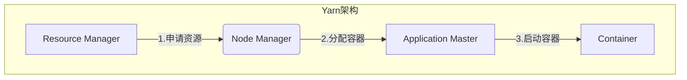

# Yarn原理与代码实例讲解

## 1.背景介绍

在大数据时代,Apache Hadoop作为一个开源的分布式系统基础架构,被广泛应用于存储和大规模数据处理方面。Hadoop生态圈涵盖了众多优秀的项目,而Yarn(Yet Another Resource Negotiator)作为Hadoop的资源管理和作业调度组件,为整个集群提供了统一的资源管理和使用方式,是确保Hadoop集群高效稳定运行的关键所在。

Yarn的出现是为了解决Hadoop MapReduce V1中存在的一些缺陷,比如只能运行MapReduce作业、资源调度不够灵活等。Yarn将资源管理和作业调度/监控从MapReduce中分离出来,形成一个独立的通用资源管理系统,使得Hadoop可以支持更多种类的分布式应用。

## 2.核心概念与联系

### 2.1 Yarn架构

Yarn采用主从架构,主要由资源管理器(Resource Manager)、节点管理器(Node Manager)、应用程序管理器(Application Master)和容器(Container)等组件组成。



- **Resource Manager(RM)**: 整个Yarn集群的资源管理者和协调者,负责接收应用程序的资源请求、监控资源使用情况并进行资源分配调度。
- **Node Manager(NM)**: 运行在每个节点上的资源和任务监控管理器,负责单节点上的资源管理和使用,并定期向RM汇报节点资源使用情况。
- **Application Master(AM)**: 每个应用程序都有一个AM实例作为应用程序的协调者,负责向RM申请资源、与NM通信协调任务运行等。
- **Container**: 资源抽象的封装单位,由内存、CPU等多维资源组成。AM会根据应用程序的需求向RM申请一定数量的Container运行任务。

### 2.2 工作流程

1. 应用程序的AM向RM申请运行应用程序所需的资源(Container)；
2. RM分配相应的Container给AM,并通知相应节点上的NM启动Container； 
3. AM收到通知后,即可在这些Container中运行自己的任务;
4. 应用程序运行完毕后,AM向RM释放使用的资源。

## 3.核心算法原理具体操作步骤

### 3.1 资源模型

Yarn中将资源按维度建模,每种资源维度独立管理,支持内存、CPU、GPU等多种资源维度。应用程序提交时需要指定所需的每种资源量,RM根据集群资源状况进行分配。

### 3.2 资源请求与分配

AM向RM申请资源时,需要描述资源请求向量,即对每个维度资源的需求量。RM根据整体资源状况以及分配策略,决定是否批准这个请求,并分配相应的Container给AM。

### 3.3 容器再利用

为提高资源利用率,Yarn支持Container再利用。当一个Container完成任务后,如果AM还有任务需要运行,可以继续使用这个Container,无需重新申请和启动,从而节省资源开销。

### 3.4 资源调度算法

Yarn采用可插拔式的调度器框架,支持多种调度算法,常用的有:

1. **FIFO调度器**: 先来先服务,按照应用程序的提交顺序分配资源。
2. **容量调度器**: 按队列容量比例分配资源,支持多队列、多租户等场景。
3. **公平调度器**: 根据应用程序运行时间的公平性来分配资源。

## 4.数学模型和公式详细讲解举例说明

在Yarn中,资源的分配与调度是一个经典的约束优化问题。我们可以将其建模为一个0-1整数规划问题:

**目标函数**:
$$\max \sum\limits_{i=1}^{n}w_i x_i$$
其中$n$为作业数量,$w_i$为作业$i$的权重(优先级),$x_i$为0-1变量,表示是否为作业$i$分配资源。

**约束条件**:

1. 资源约束:
$$\sum\limits_{i=1}^{n}a_{ij}x_i \leq b_j,\quad j=1,2,...,m$$
其中$m$为资源种类数量,$a_{ij}$为作业$i$对资源$j$的需求量,$b_j$为资源$j$的可用量。

2. 互斥约束:
$$\sum\limits_{i\in \mathcal{S}_k}x_i \leq 1,\quad k=1,2,...,l$$
其中$\mathcal{S}_k$为第$k$个互斥作业集合,表示这些作业最多只能有一个被分配资源。

3. 0-1约束:
$$x_i \in \{0,1\},\quad i=1,2,...,n$$

该模型的求解是一个NP-hard问题。Yarn采用启发式算法和在线逼近算法等方式进行求解,以获得一个近似最优的资源分配方案。

## 5.项目实践:代码实例和详细解释说明

下面通过一个示例应用程序,演示如何在Yarn上运行一个分布式WordCount作业:

```java
// 应用程序入口
public static void main(String[] args) throws Exception {
    Configuration conf = new Configuration();
    // 创建一个YarnClient
    YarnClient yarnClient = YarnClient.createYarnClient();
    yarnClient.init(conf);
    yarnClient.start();

    // 创建应用程序提交上下文
    YarnClientApplication app = yarnClient.createApplication();
    GetNewApplicationResponse appResponse = app.getNewApplicationResponse();

    // 设置应用程序资源需求
    ApplicationSubmissionContext appContext = app.getApplicationSubmissionContext();
    appContext.setApplicationName("WordCount");
    Map<String, LocalResource> localResources = new HashMap<>();
    setLocalResources(localResources);
    appContext.setResource(Resource.newInstance(1024, 1));

    // 设置应用程序主类和命令行参数
    appContext.setApplicationType("YARN");
    appContext.setKeepContainersAcrossApplicationAttempts(true);
    appContext.setCommandLine("$JAVA_HOME/bin/java"
                              + " -Xmx512M wordcount.WordCount"
                              + " /input /output");

    // 提交应用程序
    ApplicationId appId = appContext.getApplicationId();
    yarnClient.submitApplication(appContext);

    // 监控应用程序状态
    monitorApplication(yarnClient, appId);
}
```

这个示例中:

1. 创建一个YarnClient实例,作为与Yarn交互的入口点;
2. 通过YarnClient创建一个新的应用程序,并设置应用程序的资源需求(1G内存,1个vCPU核);
3. 设置应用程序的主类和命令行参数,指定WordCount类的入口以及输入输出路径;
4. 提交应用程序到Yarn集群,并监控应用程序的运行状态。

在应用程序提交后,Yarn的RM会根据资源情况分配Container给应用程序的AM,AM再在这些Container中启动WordCount任务运行。

## 6.实际应用场景

Yarn作为通用的资源管理和调度框架,可广泛应用于各种分布式计算场景,包括但不限于:

- **大数据处理**: 支持在Hadoop/Spark等系统上运行大数据分析作业;
- **机器学习**: 支持分布式训练深度学习模型,如TensorFlow on Yarn;
- **流处理**: 支持像Spark Streaming这样的流处理系统;
- **科学计算**: 支持运行需要大量计算资源的科学计算应用;
- **云计算**: 可作为公有云/私有云的资源管理调度器。

## 7.工具和资源推荐

- **Apache Hadoop**: Yarn是Hadoop项目的核心组件,官网提供了完整文档和下载;
- **Apache Ambari**: 一款开源的Hadoop集群管理工具,支持部署、配置和监控Hadoop集群;
- **Apache Slider**: 支持在Yarn上运行长期服务,如Storm/HBase/Accumulo等;
- **YARN.Rocks**: 一个活跃的Yarn用户社区,提供文档、视频和交流渠道;
- **Cloudera/Hortonworks**: 两家主要的Hadoop发行版供应商,提供商业支持。

## 8.总结:未来发展趋势与挑战

Yarn作为一款优秀的资源管理和调度框架,在未来仍将持续演进和发展:

- **多租户和多队列支持**: 增强多租户、多队列的资源隔离和公平性;
- **细粒度资源管理**: 支持对CPU缓存、网络带宽等更多资源维度进行管理;
- **优化调度算法**: 提高调度决策的实时性和精准性,支持更多调度策略;
- **与云原生架构集成**: 与Kubernetes等云原生技术栈进行无缝集成;
- **安全性和可靠性增强**: 提高系统的安全性、容错性和高可用性。

未来,Yarn还需要应对来自新兴技术(如AI硬件加速等)以及更高资源利用率等方面的挑战。

## 9.附录:常见问题与解答

1. **Yarn与传统Hadoop MapReduce V1有何区别?**

Yarn将资源管理与作业调度/监控相分离,提供了一个统一的资源管理平台,不仅支持MapReduce作业,还可以运行其他种类的分布式应用。相比之下,MapReduce V1的资源管理是耦合在作业执行框架中的。

2. **Yarn是如何实现资源隔离的?**

Yarn通过将不同应用程序的进程隔离在不同的Linux Cgroups中,从而实现了进程级别的资源隔离。此外,YARN还支持通过配置实现多租户和队列级别的资源隔离。

3. **如何监控和管理Yarn集群?**

可以通过Yarn的Web UI查看集群、应用程序和作业的运行状态。此外,还可以使用监控工具(如Ambari、Ganglia等)对Yarn集群进行全面监控。

4. **Yarn的高可用(HA)机制是什么?**

Yarn的ResourceManager支持配置多个实例实现HA,其中一个为Active状态,其余为Standby状态。当Active实例出现故障时,系统会自动选举一个Standby实例作为新的Active实例,从而保证服务的持续可用。

5. **如何提交一个Yarn应用程序?**

可以通过Yarn提供的Client接口编程方式提交应用程序,也可以使用Hadoop提供的命令行工具yarn命令进行提交。应用程序提交后,Yarn会为其分配资源并启动ApplicationMaster实例。

作者: 禅与计算机程序设计艺术 / Zen and the Art of Computer Programming