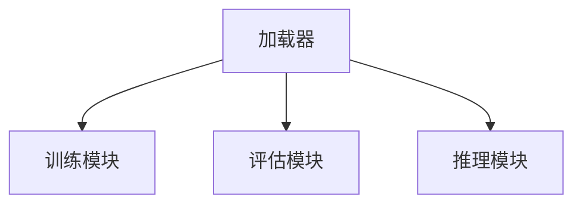

# 【LangChain编程：从入门到实践】加载器

## 1.背景介绍

在现代人工智能和自然语言处理领域，语言模型（Language Model, LM）已经成为了不可或缺的工具。LangChain是一个专门用于构建和操作语言模型的框架，它提供了丰富的功能和灵活的接口，帮助开发者更高效地构建复杂的语言处理应用。本文将深入探讨LangChain的加载器模块，帮助读者从入门到实践，全面掌握这一强大工具。

## 2.核心概念与联系

### 2.1 什么是LangChain

LangChain是一个开源的语言模型框架，旨在简化语言模型的训练、评估和部署。它支持多种语言模型架构，如Transformer、RNN等，并提供了丰富的工具和接口，方便开发者进行模型的加载、训练和推理。

### 2.2 加载器的作用

加载器是LangChain中的一个关键组件，负责将预训练的语言模型加载到内存中，以便进行进一步的操作。加载器不仅支持本地模型的加载，还支持从远程服务器或云端加载模型。

### 2.3 加载器与其他模块的联系

加载器与LangChain的其他模块，如训练模块、评估模块和推理模块紧密相关。加载器负责将模型加载到内存中，训练模块则利用加载的模型进行训练，评估模块对训练后的模型进行评估，而推理模块则使用训练好的模型进行推理。



## 3.核心算法原理具体操作步骤

### 3.1 模型加载的基本流程

模型加载的基本流程包括以下几个步骤：

1. **模型路径解析**：确定模型的存储路径，可以是本地路径或远程URL。
2. **模型文件读取**：读取模型文件，通常是一个或多个二进制文件。
3. **模型参数解析**：解析模型的参数配置文件，确定模型的架构和超参数。
4. **模型构建**：根据解析的参数构建模型对象。
5. **模型权重加载**：将模型权重加载到模型对象中。

### 3.2 具体操作步骤

以下是一个具体的操作步骤示例：

1. **确定模型路径**：
    ```python
    model_path = "path/to/your/model"
    ```

2. **读取模型文件**：
    ```python
    with open(model_path, 'rb') as f:
        model_data = f.read()
    ```

3. **解析模型参数**：
    ```python
    import json
    with open("path/to/your/model/config.json", 'r') as f:
        model_config = json.load(f)
    ```

4. **构建模型对象**：
    ```python
    from langchain.models import TransformerModel
    model = TransformerModel(config=model_config)
    ```

5. **加载模型权重**：
    ```python
    model.load_weights(model_data)
    ```

## 4.数学模型和公式详细讲解举例说明

### 4.1 语言模型的数学基础

语言模型的核心是概率论和统计学。给定一个词序列 $w_1, w_2, ..., w_n$，语言模型的目标是计算该序列的概率 $P(w_1, w_2, ..., w_n)$。根据链式法则，这个概率可以分解为：

$$
P(w_1, w_2, ..., w_n) = P(w_1) \cdot P(w_2|w_1) \cdot P(w_3|w_1, w_2) \cdot ... \cdot P(w_n|w_1, w_2, ..., w_{n-1})
$$

### 4.2 Transformer模型的数学原理

Transformer模型是目前最流行的语言模型架构之一。它的核心组件是自注意力机制（Self-Attention Mechanism），其计算公式为：

$$
\text{Attention}(Q, K, V) = \text{softmax}\left(\frac{QK^T}{\sqrt{d_k}}\right)V
$$

其中，$Q$、$K$、$V$分别表示查询矩阵、键矩阵和值矩阵，$d_k$是键矩阵的维度。

### 4.3 示例说明

假设我们有一个简单的句子 "I love programming"，我们希望计算这个句子的概率。首先，我们需要计算每个词的条件概率：

$$
P(I) = 0.1, \quad P(love|I) = 0.2, \quad P(programming|I, love) = 0.3
$$

则整个句子的概率为：

$$
P(I, love, programming) = P(I) \cdot P(love|I) \cdot P(programming|I, love) = 0.1 \cdot 0.2 \cdot 0.3 = 0.006
```

## 5.项目实践：代码实例和详细解释说明

### 5.1 环境配置

在开始项目实践之前，我们需要配置好开发环境。以下是一个基本的环境配置步骤：

1. **安装Python**：确保系统中安装了Python 3.6以上版本。
2. **安装LangChain**：使用pip安装LangChain库。
    ```bash
    pip install langchain
    ```

### 5.2 加载预训练模型

以下是一个加载预训练模型的完整代码示例：

```python
import langchain as lc

# 确定模型路径
model_path = "path/to/your/model"

# 读取模型文件
with open(model_path, 'rb') as f:
    model_data = f.read()

# 解析模型参数
import json
with open("path/to/your/model/config.json", 'r') as f:
    model_config = json.load(f)

# 构建模型对象
model = lc.models.TransformerModel(config=model_config)

# 加载模型权重
model.load_weights(model_data)

# 使用模型进行推理
input_text = "I love programming"
output = model.predict(input_text)
print(output)
```

### 5.3 详细解释

1. **导入LangChain库**：首先导入LangChain库。
2. **确定模型路径**：指定模型文件的路径。
3. **读取模型文件**：使用Python的文件操作函数读取模型文件。
4. **解析模型参数**：使用json库解析模型的配置文件。
5. **构建模型对象**：根据解析的配置文件构建模型对象。
6. **加载模型权重**：将模型权重加载到模型对象中。
7. **使用模型进行推理**：输入文本并使用模型进行推理，输出结果。

## 6.实际应用场景

### 6.1 自然语言生成

LangChain可以用于生成自然语言文本，如新闻文章、技术文档等。通过训练一个强大的语言模型，可以生成高质量的文本内容。

### 6.2 机器翻译

LangChain还可以用于机器翻译任务。通过训练一个双语模型，可以实现高质量的语言翻译。

### 6.3 问答系统

利用LangChain，可以构建智能问答系统。通过训练一个问答模型，可以实现对用户问题的智能回答。

### 6.4 情感分析

LangChain还可以用于情感分析任务。通过训练一个情感分类模型，可以对文本的情感进行分类，如正面、负面、中性等。

## 7.工具和资源推荐

### 7.1 开发工具

1. **Jupyter Notebook**：一个交互式的开发环境，适合进行数据分析和模型训练。
2. **PyCharm**：一个强大的Python集成开发环境，适合进行大型项目的开发。

### 7.2 数据集

1. **OpenAI GPT-3**：一个强大的预训练语言模型，可以用于多种语言处理任务。
2. **Google BERT**：一个预训练的双向Transformer模型，适合用于自然语言理解任务。

### 7.3 在线资源

1. **LangChain官方文档**：提供了详细的使用指南和API文档。
2. **GitHub**：LangChain的开源代码库，包含了丰富的示例代码和项目。

## 8.总结：未来发展趋势与挑战

### 8.1 未来发展趋势

随着人工智能和自然语言处理技术的不断发展，语言模型将变得越来越强大和智能。未来，LangChain将继续优化和扩展其功能，支持更多的语言模型架构和应用场景。

### 8.2 挑战

尽管语言模型在许多任务中表现出色，但仍然面临一些挑战，如模型的可解释性、数据隐私和安全性等。未来的研究将致力于解决这些问题，提高语言模型的可靠性和安全性。

## 9.附录：常见问题与解答

### 9.1 如何安装LangChain？

可以使用pip命令安装LangChain：
```bash
pip install langchain
```

### 9.2 如何加载本地模型？

可以参考本文的代码示例，使用LangChain的加载器模块加载本地模型。

### 9.3 LangChain支持哪些语言模型架构？

LangChain支持多种语言模型架构，如Transformer、RNN等。

### 9.4 如何进行模型评估？

可以使用LangChain的评估模块，对训练后的模型进行评估。评估模块提供了多种评估指标，如准确率、召回率等。

### 9.5 LangChain是否支持分布式训练？

是的，LangChain支持分布式训练，可以利用多台机器进行大规模模型训练。

---

作者：禅与计算机程序设计艺术 / Zen and the Art of Computer Programming