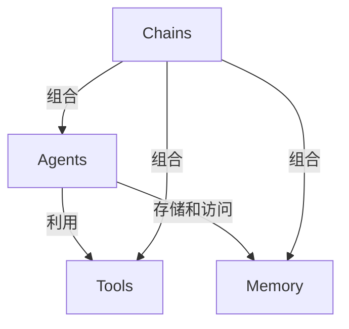
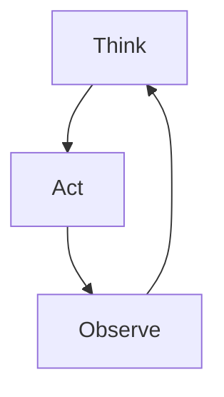

# 【LangChain编程：从入门到实践】定制大模型接口

## 1. 背景介绍

### 1.1 人工智能的崛起

近年来,人工智能(AI)技术的发展日新月异,大型语言模型的出现为各行各业带来了巨大的变革。这些模型能够理解和生成人类语言,展现出惊人的能力,为人类提供智能化的服务和解决方案。

### 1.2 大型语言模型的挑战

然而,大型语言模型也面临着一些挑战,例如:

- 访问受限:由于商业和隐私原因,大多数大型语言模型的访问受到严格限制。
- 定制化需求:不同的应用场景对语言模型有着不同的需求,需要进行定制化的优化和调整。
- 成本高昂:训练和部署大型语言模型需要大量的计算资源,成本高昂。

### 1.3 LangChain的作用

LangChain是一个强大的Python库,旨在解决上述挑战。它提供了一种标准化的方式来构建应用程序,利用大型语言模型的强大功能,同时保持对模型的控制和定制能力。LangChain使开发人员能够轻松地集成和扩展各种语言模型,构建智能化的应用程序。

## 2. 核心概念与联系

### 2.1 LangChain的核心概念

LangChain的核心概念包括:

- **Agents**: 代理是LangChain中的核心概念,它封装了语言模型的功能,并提供了一种标准化的方式来与之交互。
- **Tools**: 工具是代理可以利用的外部资源,例如网络搜索、数据库查询等。
- **Memory**: 内存是代理用来存储和访问历史信息的机制,有助于保持对话的连贯性。
- **Chains**: 链是将代理、工具和内存组合在一起的方式,用于构建复杂的应用程序流程。

### 2.2 核心概念之间的联系

这些核心概念之间紧密相连,共同构建了LangChain的应用程序框架。代理利用工具来执行任务,并将结果存储在内存中。链则定义了代理、工具和内存之间的交互方式,实现了特定的应用程序逻辑。



## 3. 核心算法原理具体操作步骤

### 3.1 代理的工作原理

LangChain中的代理是基于一种称为"思考-行动-观察"(Think-Act-Observe)的循环过程。代理根据当前状态和目标,通过思考决定采取何种行动。行动的结果会被观察到,并作为新的状态输入到下一个循环中。这个过程会持续进行,直到达成目标或者遇到终止条件。



### 3.2 代理选择工具的策略

代理需要选择合适的工具来执行任务。LangChain提供了多种策略来指导代理选择工具,例如:

1. **零射手策略(ZeroShotAgent)**: 代理根据工具的名称和描述,直接选择最合适的工具。
2. **反射射手策略(ReActAgent)**: 代理先尝试使用语言模型自身的能力,如果无法完成任务,再选择外部工具。
3. **基于奖励的强化学习策略(RLHF)**: 代理通过与人类互动和反馈来学习选择工具的策略。

### 3.3 代理执行任务的步骤

1. 代理接收到任务描述和相关上下文信息。
2. 代理根据选择策略,从可用工具中选择一个或多个工具。
3. 代理调用选定的工具,并获取执行结果。
4. 代理根据结果和目标,决定是否需要执行其他操作。
5. 如果需要,代理重复步骤2-4,直到完成任务或达到终止条件。
6. 代理返回最终结果。

## 4. 数学模型和公式详细讲解举例说明

在LangChain中,代理的行为可以用马尔可夫决策过程(MDP)来建模。MDP由一组状态$S$、一组行动$A$、状态转移概率$P(s'|s,a)$和奖励函数$R(s,a)$组成。

代理的目标是找到一个策略$\pi:S\rightarrow A$,使得在给定的初始状态$s_0$下,期望累积奖励$E[\sum_{t=0}^{\infty}\gamma^tR(s_t,a_t)]$最大化,其中$\gamma$是折现因子。

为了找到最优策略,可以使用值迭代或策略迭代等强化学习算法。值迭代通过更新状态值函数$V(s)$来逼近最优值函数$V^*(s)$:

$$V^*(s) = \max_a \mathbb{E}[R(s,a) + \gamma V^*(s')]$$

策略迭代则直接优化策略$\pi$,通过交替执行策略评估和策略改进两个步骤。

在LangChain中,代理可以利用强化学习技术来学习选择工具的最优策略,从而提高任务完成的效率和质量。

## 5. 项目实践:代码实例和详细解释说明

下面是一个使用LangChain构建问答系统的示例代码,展示了如何定义代理、工具和链,并将它们组合在一起实现应用程序逻辑。

### 5.1 导入必要的库

```python
from langchain.agents import initialize_agent, Tool
from langchain.llms import OpenAI
from langchain.agents import AgentType
from langchain.chains.conversation.memory import ConversationBufferMemory
```

### 5.2 定义工具

```python
# 定义搜索工具
search = Tool(
    name="Current Search",
    func=lambda query: f"搜索结果: {query}",
    description="使用当前搜索引擎搜索查询相关信息"
)

# 定义Wikipedia工具
wikipedia = Tool(
    name="Wikipedia",
    func=lambda query: f"Wikipedia结果: {query}",
    description="在Wikipedia上搜索查询相关信息"
)

tools = [search, wikipedia]
```

### 5.3 初始化代理

```python
# 初始化语言模型
llm = OpenAI(temperature=0)

# 初始化内存
memory = ConversationBufferMemory(memory_key="chat_history")

# 初始化代理
agent = initialize_agent(tools, llm, agent=AgentType.CONVERSATIONAL_REACT_DESCRIPTION, verbose=True, memory=memory)
```

### 5.4 与代理交互

```python
# 设置输入
agent.run("我想了解一下人工智能的最新发展情况")
```

在这个示例中,我们定义了两个工具:搜索引擎和Wikipedia。然后,我们初始化了一个基于OpenAI语言模型的反应式代理(ReActAgent),并为其提供了工具列表和内存。最后,我们可以通过`agent.run()`方法与代理交互,提出问题或任务。

代理会根据输入的问题,选择合适的工具执行搜索或查询操作,并将结果综合起来生成最终的回答。

## 6. 实际应用场景

LangChain可以应用于各种场景,包括但不限于:

1. **智能助手**: 构建具有问答、任务执行等功能的智能助手。
2. **知识管理**: 整合各种知识源,实现高效的知识检索和推理。
3. **自动化流程**: 自动化各种复杂的业务流程,提高效率和一致性。
4. **数据分析**: 利用语言模型的能力进行数据分析和可视化。
5. **内容生成**: 生成高质量的文本内容,如新闻报道、营销文案等。

## 7. 工具和资源推荐

- **LangChain官方文档**: https://python.langchain.com/en/latest/index.html
- **LangChain示例代码库**: https://github.com/hwchiu/langchain-examples
- **Hugging Face模型库**: https://huggingface.co/models
- **OpenAI API**: https://openai.com/api/
- **Anthropic API**: https://www.anthropic.com/

## 8. 总结:未来发展趋势与挑战

### 8.1 未来发展趋势

- **模型优化**: 持续优化和改进大型语言模型的性能和能力。
- **多模态融合**: 将语言模型与视觉、音频等其他模态相结合,实现多模态智能系统。
- **可解释性和可控性**:提高语言模型的可解释性和可控性,确保其行为符合预期和道德标准。
- **隐私和安全**:加强对语言模型的隐私和安全保护,防止数据泄露和滥用。

### 8.2 挑战

- **计算资源需求**: 训练和部署大型语言模型需要大量的计算资源,成本高昂。
- **数据质量和偏差**: 训练数据的质量和偏差可能会影响模型的表现和公正性。
- **知识更新**: 确保语言模型能够及时获取和整合最新的知识和信息。
- **隐私和伦理**: 解决语言模型可能带来的隐私和伦理问题,如个人信息泄露、有害内容生成等。

## 9. 附录:常见问题与解答

### 9.1 LangChain与其他框架相比有何优势?

LangChain提供了一种标准化和模块化的方式来构建基于语言模型的应用程序,使得开发过程更加灵活和可扩展。它还支持多种语言模型和工具,并提供了丰富的示例和文档,降低了入门门槛。

### 9.2 如何选择合适的语言模型?

选择语言模型时,需要考虑模型的性能、能力范围、成本、隐私和伦理等因素。您可以在Hugging Face模型库或OpenAI API中选择合适的模型。

### 9.3 如何处理语言模型的偏差和不确定性?

可以通过优化训练数据、引入反馈机制、增强模型的可解释性和可控性等方式来缓解语言模型的偏差和不确定性问题。同时,也需要提高用户对模型局限性的认识,合理设置期望值。

### 9.4 LangChain的性能如何?

LangChain的性能在很大程度上取决于所使用的语言模型和工具。通过优化代码、利用并行计算等方式,可以提高LangChain应用程序的性能。

### 9.5 LangChain的安全性如何?

LangChain本身不直接处理敏感数据,但在使用第三方语言模型和工具时,需要注意相关的隐私和安全风险。建议遵循最佳实践,如加密敏感数据、限制访问权限等。

作者: 禅与计算机程序设计艺术 / Zen and the Art of Computer Programming