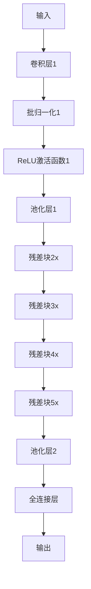
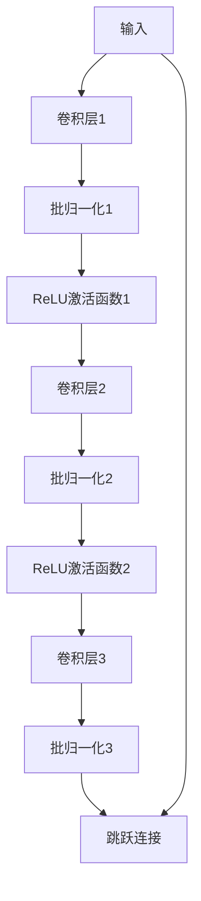

## 1. 背景介绍

随着计算机视觉技术的不断发展，深度学习在图像识别领域中的应用越来越广泛。然而，深度学习需要大量的数据来训练模型，而且数据的质量对模型的性能有着至关重要的影响。因此，构建一个大规模的高质量图像数据集对于深度学习的发展至关重要。

本文将介绍如何构建一个大规模的图像数据集，并使用深度学习算法进行图像分类任务。我们将使用一个开源的数据集，介绍其数据预处理、模型训练和评估等过程，并探讨如何优化模型性能。

## 2. 核心概念与联系

### 2.1 图像数据集

图像数据集是指由大量图像组成的数据集合。在计算机视觉领域中，图像数据集通常用于训练和测试图像分类、目标检测、图像分割等任务的深度学习模型。

### 2.2 深度学习

深度学习是一种基于神经网络的机器学习方法，其核心思想是通过多层非线性变换来学习数据的特征表示。深度学习在图像识别、自然语言处理、语音识别等领域中取得了很大的成功。

### 2.3 卷积神经网络

卷积神经网络是一种特殊的神经网络，其核心思想是通过卷积操作来提取图像的特征。卷积神经网络在图像分类、目标检测等任务中取得了很大的成功。

## 3. 核心算法原理具体操作步骤

### 3.1 数据预处理

数据预处理是指在训练模型之前对数据进行一系列的处理，以提高模型的性能。在图像分类任务中，数据预处理通常包括以下几个步骤：

- 图像缩放：将图像缩放到固定的大小，以便于模型的训练。
- 数据增强：通过对图像进行旋转、翻转、裁剪等操作，增加数据的多样性，提高模型的泛化能力。
- 归一化：将图像像素值归一化到0到1之间，以便于模型的训练。

### 3.2 模型训练

在本文中，我们将使用卷积神经网络进行图像分类任务。具体来说，我们将使用ResNet-50模型，该模型在ImageNet数据集上取得了很好的性能。

模型训练通常包括以下几个步骤：

- 初始化模型参数：将模型的参数随机初始化。
- 前向传播：将输入图像通过模型，得到模型的输出。
- 计算损失函数：将模型的输出与真实标签进行比较，计算损失函数。
- 反向传播：根据损失函数，计算模型参数的梯度。
- 更新模型参数：根据梯度，更新模型的参数。

### 3.3 模型评估

模型评估是指在训练完成后，对模型进行测试，以评估模型的性能。在图像分类任务中，模型评估通常使用准确率作为评价指标。

## 4. 数学模型和公式详细讲解举例说明

### 4.1 ResNet-50模型

ResNet-50模型是一种深度卷积神经网络，其核心思想是通过残差块来解决深度神经网络中的梯度消失问题。ResNet-50模型的结构如下图所示：



其中，残差块的结构如下图所示：



### 4.2 损失函数

在图像分类任务中，常用的损失函数是交叉熵损失函数。其数学表达式如下：

$$
L=-\frac{1}{N}\sum_{i=1}^{N}\sum_{j=1}^{C}y_{ij}\log(p_{ij})
$$

其中，$N$表示样本数量，$C$表示类别数量，$y_{ij}$表示第$i$个样本的第$j$个类别的真实标签，$p_{ij}$表示第$i$个样本的第$j$个类别的预测概率。

## 5. 项目实践：代码实例和详细解释说明

### 5.1 数据集下载

我们将使用ImageNet数据集进行图像分类任务。ImageNet数据集包含超过100万张图像，共1000个类别。我们可以使用torchvision库中的ImageNet数据集进行下载和预处理。

```python
import torchvision.datasets as datasets

train_dataset = datasets.ImageNet(root='./data', split='train', transform=transforms.ToTensor())
test_dataset = datasets.ImageNet(root='./data', split='val', transform=transforms.ToTensor())
```

### 5.2 模型训练

我们将使用PyTorch框架进行模型训练。具体来说，我们将使用ResNet-50模型，并使用交叉熵损失函数进行训练。

```python
import torch.nn as nn
import torch.optim as optim

model = models.resnet50(pretrained=True)
num_ftrs = model.fc.in_features
model.fc = nn.Linear(num_ftrs, 1000)

criterion = nn.CrossEntropyLoss()
optimizer = optim.SGD(model.parameters(), lr=0.001, momentum=0.9)

for epoch in range(num_epochs):
    for i, (inputs, labels) in enumerate(train_loader):
        optimizer.zero_grad()
        outputs = model(inputs)
        loss = criterion(outputs, labels)
        loss.backward()
        optimizer.step()
```

### 5.3 模型评估

我们将使用测试集对模型进行评估，并计算模型的准确率。

```python
correct = 0
total = 0
with torch.no_grad():
    for data in test_loader:
        images, labels = data
        outputs = model(images)
        _, predicted = torch.max(outputs.data, 1)
        total += labels.size(0)
        correct += (predicted == labels).sum().item()

accuracy = 100 * correct / total
print('Accuracy: %d %%' % accuracy)
```

## 6. 实际应用场景

图像分类是计算机视觉领域中的一个重要任务，其应用场景非常广泛。例如，图像搜索、人脸识别、自动驾驶等领域都需要使用图像分类技术。

## 7. 工具和资源推荐

- PyTorch：一个开源的深度学习框架，易于使用且功能强大。
- ImageNet数据集：一个大规模的图像数据集，用于训练和测试深度学习模型。
- ResNet-50模型：一种深度卷积神经网络，用于图像分类任务。

## 8. 总结：未来发展趋势与挑战

随着计算机视觉技术的不断发展，图像分类技术将会得到更广泛的应用。未来，我们可以期待更加高效、准确的图像分类算法的出现。同时，数据集的质量和规模也将会成为一个重要的挑战。

## 9. 附录：常见问题与解答

暂无。

作者：禅与计算机程序设计艺术 / Zen and the Art of Computer Programming