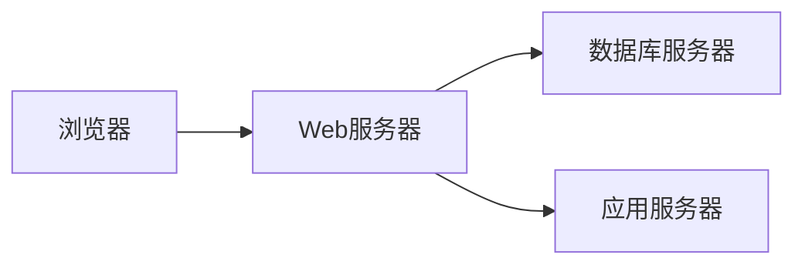
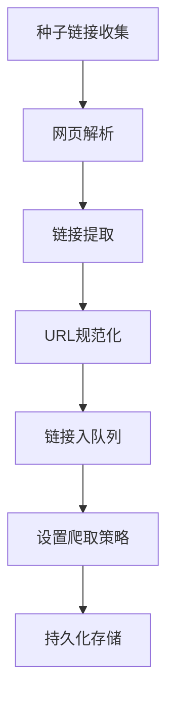
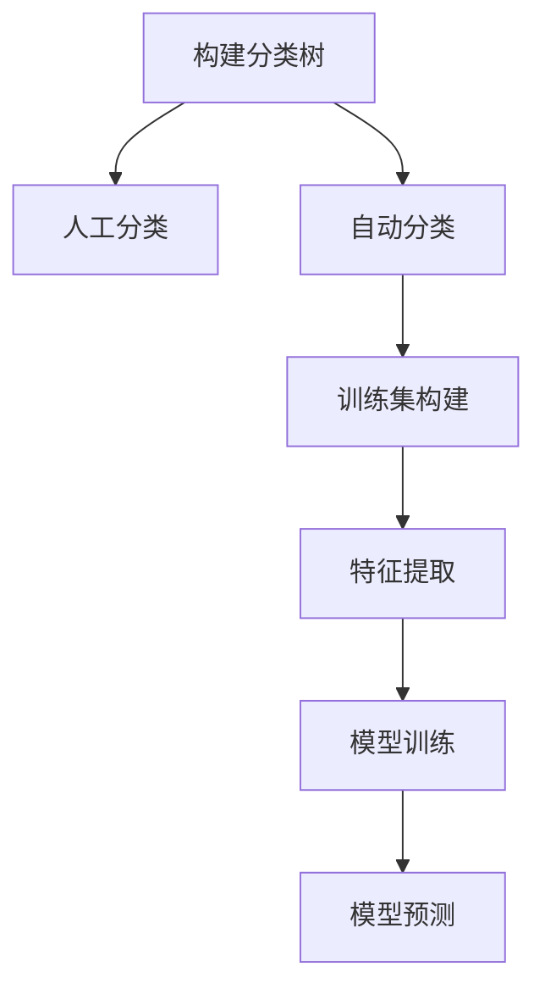
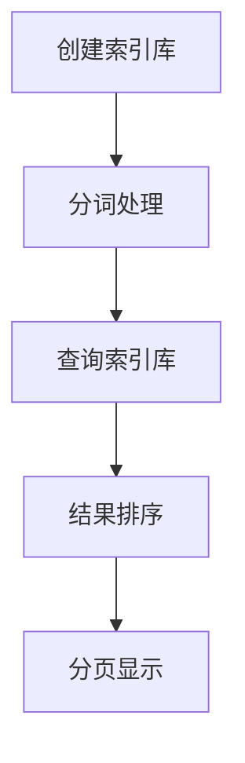

# 上网导航网站详细设计与具体代码实现

## 1.背景介绍

随着互联网的快速发展,网站数量激增,导航网站应运而生。导航网站作为互联网入口,可以帮助用户快速找到所需的网站和资源,提高上网效率。本文将详细介绍上网导航网站的设计和实现过程。

### 1.1 导航网站概述

导航网站是一种专门用于收集和整理网络资源链接的网站,它将互联网上的优秀网站按照一定的分类方式进行归纳和链接,为用户提供快捷、方便的上网导航服务。

### 1.2 导航网站作用

- 节省检索时间,提高上网效率
- 收集优质网站资源,方便用户访问
- 按类别组织网站,使浏览更有条理
- 个性化定制,满足不同用户需求

## 2.核心概念与联系

### 2.1 网站架构

导航网站通常采用 B/S 架构,即浏览器/服务器架构,由以下几个核心部分组成:



- **浏览器**: 用户通过浏览器访问导航网站
- **Web服务器**: 接收浏览器请求,返回HTML页面
- **数据库服务器**: 存储网站数据,如网址分类等
- **应用服务器**: 处理业务逻辑,如搜索、收藏等

### 2.2 关键技术

- **前端**: HTML/CSS/JavaScript 实现页面展示和交互
- **后端**: 采用 Java、Python、PHP 等语言开发服务端程序
- **数据库**: 使用 MySQL、MongoDB 等存储网址和用户数据  
- **搜索引擎**: 使用 Lucene、Elasticsearch 等实现网址搜索
- **缓存**: 使用 Redis、Memcached 等缓存热门数据,提高访问速度

## 3.核心算法原理具体操作步骤  

### 3.1 网址抓取

导航网站的核心是收集和管理优质网址链接。可以使用网络爬虫技术自动抓取网址。

1. **种子链接收集**: 手动或自动收集种子网址
2. **网页解析**: 使用解析库如 Jsoup 解析网页HTML
3. **链接提取**: 从HTML中提取新的链接URL  
4. **URL规范化**: 将链接标准化,去除重复链接
5. **链接入队列**: 将新链接放入待抓取队列
6. **设置爬取策略**: 如并发数、深度、间隔时间等
7. **持久化存储**: 将爬取结果存储到数据库



### 3.2 网址分类

为了便于查找和浏览,需要将网址按一定规则分类。可采用以下分类算法:

1. **构建分类树**: 设计合理的分类树结构
2. **人工分类**: 由人工编辑将网址分配到分类目录
3. **自动分类**: 使用机器学习算法自动进行分类
   - **训练集构建**: 标注一部分网址的分类作为训练集
   - **特征提取**: 将网址标题、描述等作为特征向量
   - **模型训练**: 使用算法如朴素贝叶斯、决策树等训练分类模型
   - **模型预测**: 将新网址输入模型,预测其所属分类



### 3.3 搜索引擎

为了方便用户搜索感兴趣的网址,需要在导航网站上集成搜索引擎功能。可以使用以下流程:

1. **创建索引库**: 使用 Lucene 等建立索引库,将网址及相关信息建立索引
2. **分词处理**: 对用户查询关键词进行分词处理
3. **查询索引库**: 在索引库中搜索分词结果,获取相关网址列表
4. **结果排序**: 根据相关度算分对结果排序
5. **分页显示**: 将搜索结果分页展示给用户



## 4.数学模型和公式详细讲解举例说明

### 4.1 网页相似度计算

在网址分类过程中,可以通过计算网页内容的相似度,将相似网页归为同一类别。常用的相似度计算模型有:

1. **TF-IDF模型**

   用于计算一个词对一个文档的重要程度。词频(TF)越高,代表词越重要。逆向文档频率(IDF)越高,代表词越具有区分能力。

   $$\mathrm{TF-IDF}(t,d)=\mathrm{TF}(t,d)\times\mathrm{IDF}(t)$$

   其中:
   - $\mathrm{TF}(t,d)$表示词$t$在文档$d$中出现的频率
   - $\mathrm{IDF}(t)=\log\frac{N}{n_t}$,其中$N$为语料库中文档总数,$n_t$为包含词$t$的文档数量

2. **余弦相似度**

   通过计算两个文档向量的夹角余弦值,来衡量文档的相似度。

   $$\mathrm{CosineSim}(X,Y)=\frac{\sum_{i=1}^{n}x_iy_i}{\sqrt{\sum_{i=1}^{n}x_i^2}\sqrt{\sum_{i=1}^{n}y_i^2}}$$

   其中$X$和$Y$为两个文档的TF-IDF向量。

### 4.2 PageRank算法

PageRank是谷歌使用的网页排名算法,通过网页之间的链接结构计算一个网页的重要程度。PageRank值越高,代表网页越重要。

PageRank算法的基本思想是:一个高质量的网页,如果被其他高质量网页链接,那么它的PageRank值也会相应提高。算法可以形式化为:

$$\mathrm{PR}(A)=(1-d)+d\left(\frac{\mathrm{PR}(T_1)}{C(T_1)}+\cdots+\frac{\mathrm{PR}(T_n)}{C(T_n)}\right)$$

其中:
- $\mathrm{PR}(A)$为网页A的PageRank值
- $T_1,...,T_n$为链接到A的网页
- $C(T_i)$为网页$T_i$的出链接数量
- $d$为阻尼系数,一般取0.85

该算法可以使用迭代的方式计算每个网页的最终PageRank值。

## 5.项目实践:代码实例和详细解释说明

### 5.1 网址抓取实例

以Python的Scrapy框架为例,实现一个简单的网址抓取爬虫:

```python
import scrapy

class UrlSpider(scrapy.Spider):
    name = "urlspider"
    start_urls = ["https://www.seed.com"] # 种子链接

    def parse(self, response):
        # 提取网页链接
        for href in response.css("a::attr(href)"):
            url = response.urljoin(href.extract())
            yield scrapy.Request(url, callback=self.parse)

        # 提取网页内容
        yield {
            "url": response.url,
            "title": response.css("title::text").extract_first(),
            "desc": response.css("meta[name=description]::attr(content)").extract_first(),
        }
```

该爬虫从种子链接开始,递归抓取网页,并提取链接和网页标题、描述等信息。可以通过配置设置爬取深度、并发数等策略。

### 5.2 网址分类实例

以Python的scikit-learn机器学习库为例,实现一个简单的网址自动分类:

```python
from sklearn.datasets import fetch_20newsgroups
from sklearn.feature_extraction.text import TfidfVectorizer
from sklearn.naive_bayes import MultinomialNB

# 加载20个新闻组数据集作为示例
data = fetch_20newsgroups()
X, y = data.data, data.target

# 将文本数据转换为TF-IDF向量
vectorizer = TfidfVectorizer()
X_vec = vectorizer.fit_transform(X)

# 训练朴素贝叶斯分类器
clf = MultinomialNB().fit(X_vec, y)

# 对新数据进行分类预测
new_data = ["This is a text about sports."]
new_vec = vectorizer.transform(new_data)
predicted = clf.predict(new_vec)
print(data.target_names[predicted[0]]) # 输出预测的分类名称
```

该示例使用20个新闻组数据集训练一个朴素贝叶斯分类器,对新数据进行分类预测。在实际应用中,可以使用网址标题、描述等文本作为训练数据,构建分类模型。

### 5.3 搜索引擎实例

以Java的Lucene库为例,实现一个简单的搜索引擎:

```java
import org.apache.lucene.analysis.standard.StandardAnalyzer;
import org.apache.lucene.document.Document;
import org.apache.lucene.document.Field;
import org.apache.lucene.document.TextField;
import org.apache.lucene.index.IndexWriter;
import org.apache.lucene.index.IndexWriterConfig;
import org.apache.lucene.store.Directory;
import org.apache.lucene.store.RAMDirectory;

// 创建索引库
Directory indexDir = new RAMDirectory();
IndexWriterConfig config = new IndexWriterConfig(new StandardAnalyzer());
IndexWriter indexWriter = new IndexWriter(indexDir, config);

// 添加文档到索引库
Document doc = new Document();
doc.add(new TextField("title", "Example Title", Field.Store.YES));
doc.add(new TextField("content", "This is an example content.", Field.Store.YES));
indexWriter.addDocument(doc);
indexWriter.close();

// 搜索索引库
// ...
```

该示例创建一个内存索引库,并添加一个文档。在实际应用中,可以将网址标题、内容等信息建立索引,并使用Lucene的查询语法进行搜索。

## 6.实际应用场景

导航网站在以下场景中具有广泛的应用:

- **个人导航**: 个人可以根据自身兴趣爱好,收集和分类自己常用的网址
- **企业导航**: 企业可以建立内部导航网站,方便员工查找工作相关资源
- **行业导航**: 为特定行业收集和分类优质网址资源
- **地区导航**: 收集和展示某个地区的本地网站信息
- **移动导航**: 为移动设备用户提供导航服务,如移动应用市场等

## 7.工具和资源推荐

以下是一些常用的导航网站开发工具和学习资源:

- **开发框架**: Django(Python)、Spring(Java)、Laravel(PHP)等
- **前端库**: React、Vue、Bootstrap等
- **数据库**: MySQL、MongoDB、Redis等
- **搜索引擎**: Lucene、Elasticsearch、Solr等
- **网络爬虫**: Scrapy(Python)、Selenium等
- **机器学习库**: scikit-learn(Python)、Spark ML等
- **在线教程**: 廖雪峰Python教程、Spring框架教程等
- **书籍推荐**: 《Python网络数据采集》、《Lucene实战》等

## 8.总结:未来发展趋势与挑战

导航网站的发展离不开以下几个方面的创新:

- **语义理解**: 通过自然语言处理技术,更好地理解用户需求
- **个性化推荐**: 基于用户行为数据,推荐感兴趣的网址资源
- **知识图谱**: 构建结构化的网址知识库,支持更智能的检索
- **人工智能**: 应用机器学习等AI技术,提升网址分类、排序等能力
- **多终端支持**: 适配移动端、车载端等不同终端设备
- **隐私保护**: 加强用户隐私保护,遵守数据合规性要求

未来,导航网站需要与新技术融合发展,提供更智能、个性化的导航服务。

## 9.附录:常见问题与解答

1. **如何评估导航网站的质量?**

   可以从以下几个方面评估:网址来源的可靠性、分类体系的合理性、搜索引擎的检索效率、网站的易用性和可访问性等。

2. **导航网站