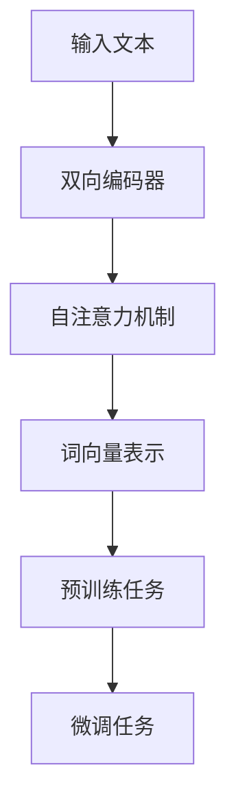

# 从零开始大模型开发与微调：使用Hugging Face获取BERT预训练模型

## 1.背景介绍

在自然语言处理（NLP）领域，BERT（Bidirectional Encoder Representations from Transformers）模型的出现引发了一场革命。BERT通过双向编码器表示，显著提升了多种NLP任务的性能。Hugging Face作为一个开源社区和工具集，提供了丰富的预训练模型和便捷的接口，使得开发者可以轻松地获取和微调BERT模型。

### 1.1 BERT的诞生与意义

BERT由Google AI Language团队在2018年提出，旨在通过双向Transformer架构捕捉上下文信息。与传统的单向语言模型不同，BERT能够同时考虑词汇的前后文，从而更好地理解句子结构和语义。

### 1.2 Hugging Face的角色

Hugging Face提供了Transformers库，包含了大量预训练的NLP模型，包括BERT。该库不仅支持模型的加载和微调，还提供了丰富的API接口，方便开发者进行各种NLP任务的开发。

## 2.核心概念与联系

在深入探讨BERT和Hugging Face之前，我们需要了解一些核心概念和它们之间的联系。

### 2.1 Transformer架构

Transformer是BERT的基础架构，由编码器和解码器组成。BERT只使用了编码器部分，通过多头自注意力机制和前馈神经网络来捕捉输入序列的全局信息。

### 2.2 预训练与微调

BERT的成功很大程度上依赖于预训练和微调两个阶段。预训练阶段，BERT在大规模文本数据上进行无监督学习；微调阶段，BERT在特定任务的数据集上进行有监督学习，以适应具体任务需求。

### 2.3 Hugging Face的Transformers库

Transformers库是Hugging Face的核心产品，提供了加载、训练和微调预训练模型的工具。该库支持多种模型架构和任务，包括文本分类、命名实体识别、问答系统等。

## 3.核心算法原理具体操作步骤

在这一部分，我们将详细介绍BERT的核心算法原理和具体操作步骤。

### 3.1 BERT的双向编码器

BERT使用双向Transformer编码器，通过自注意力机制捕捉输入序列的全局信息。自注意力机制计算输入序列中每个词与其他词的相关性，从而生成上下文敏感的词向量表示。

### 3.2 预训练任务

BERT的预训练包括两个任务：掩码语言模型（Masked Language Model, MLM）和下一句预测（Next Sentence Prediction, NSP）。MLM通过随机掩码部分词汇，训练模型预测被掩码的词汇；NSP通过预测两段文本是否连续，训练模型理解句子间的关系。

### 3.3 微调过程

微调过程中，BERT在特定任务的数据集上进行有监督学习。通过调整模型参数，使其在特定任务上达到最佳性能。



## 4.数学模型和公式详细讲解举例说明

在这一部分，我们将深入探讨BERT的数学模型和公式，并通过具体例子进行说明。

### 4.1 自注意力机制

自注意力机制是BERT的核心，通过计算输入序列中每个词与其他词的相关性来生成词向量表示。具体来说，自注意力机制通过以下公式计算：

$$
\text{Attention}(Q, K, V) = \text{softmax}\left(\frac{QK^T}{\sqrt{d_k}}\right)V
$$

其中，$Q$、$K$和$V$分别表示查询、键和值矩阵，$d_k$表示键的维度。

### 4.2 掩码语言模型

掩码语言模型通过随机掩码部分词汇，训练模型预测被掩码的词汇。具体来说，给定输入序列$X = [x_1, x_2, ..., x_n]$，掩码语言模型的目标是最大化以下概率：

$$
P(x_i | X_{\setminus i})
$$

其中，$X_{\setminus i}$表示去掉第$i$个词的输入序列。

### 4.3 下一句预测

下一句预测通过预测两段文本是否连续，训练模型理解句子间的关系。具体来说，给定两段文本$A$和$B$，下一句预测的目标是最大化以下概率：

$$
P(B | A)
$$

## 5.项目实践：代码实例和详细解释说明

在这一部分，我们将通过具体的代码实例，展示如何使用Hugging Face获取BERT预训练模型并进行微调。

### 5.1 环境配置

首先，我们需要安装Hugging Face的Transformers库和其他依赖项：

```bash
pip install transformers
pip install torch
pip install datasets
```

### 5.2 加载预训练模型

接下来，我们使用Transformers库加载预训练的BERT模型和分词器：

```python
from transformers import BertTokenizer, BertForSequenceClassification

tokenizer = BertTokenizer.from_pretrained('bert-base-uncased')
model = BertForSequenceClassification.from_pretrained('bert-base-uncased')
```

### 5.3 数据预处理

我们需要对输入文本进行分词和编码：

```python
inputs = tokenizer("Hello, my dog is cute", return_tensors="pt")
```

### 5.4 模型训练

使用预处理后的数据进行模型训练：

```python
from transformers import Trainer, TrainingArguments

training_args = TrainingArguments(
    output_dir='./results',
    num_train_epochs=3,
    per_device_train_batch_size=8,
    per_device_eval_batch_size=8,
    warmup_steps=500,
    weight_decay=0.01,
    logging_dir='./logs',
)

trainer = Trainer(
    model=model,
    args=training_args,
    train_dataset=train_dataset,
    eval_dataset=eval_dataset
)

trainer.train()
```

### 5.5 模型评估

训练完成后，我们可以使用验证集评估模型性能：

```python
results = trainer.evaluate()
print(results)
```

## 6.实际应用场景

BERT模型在多个NLP任务中表现出色，以下是一些实际应用场景。

### 6.1 文本分类

BERT可以用于文本分类任务，如情感分析、垃圾邮件检测等。通过微调BERT模型，我们可以在特定分类任务上取得优异的性能。

### 6.2 命名实体识别

命名实体识别（NER）是识别文本中实体（如人名、地名、组织名等）的任务。BERT通过捕捉上下文信息，可以有效地识别和分类实体。

### 6.3 问答系统

BERT在问答系统中也表现出色。通过微调BERT模型，我们可以构建高效的问答系统，回答用户提出的问题。

## 7.工具和资源推荐

在使用BERT和Hugging Face进行开发时，以下工具和资源可以提供帮助。

### 7.1 Hugging Face官方文档

Hugging Face的官方文档提供了详细的API说明和使用示例，是开发者的重要参考资料。

### 7.2 在线教程和课程

Coursera、Udacity等平台提供了丰富的NLP和深度学习课程，帮助开发者深入理解BERT和Transformer架构。

### 7.3 开源项目

GitHub上有许多开源项目和代码示例，可以作为学习和参考的资源。

## 8.总结：未来发展趋势与挑战

BERT的出现标志着NLP领域的一个重要里程碑，但也面临一些挑战和未来发展方向。

### 8.1 模型压缩与加速

BERT模型参数量大，计算资源消耗高。未来的研究方向之一是模型压缩与加速，如蒸馏、剪枝等技术，以提高模型的效率和实用性。

### 8.2 多语言支持

虽然BERT已经支持多种语言，但在多语言环境下的性能仍有提升空间。未来的研究可以进一步优化多语言模型，提升其在不同语言上的表现。

### 8.3 领域适应性

BERT在特定领域的表现可能不如通用领域。未来的研究可以探索如何更好地适应特定领域的数据和任务，提高模型的领域适应性。

## 9.附录：常见问题与解答

### 9.1 如何选择预训练模型？

选择预训练模型时，可以根据任务需求和计算资源选择合适的模型。例如，对于资源有限的环境，可以选择较小的模型版本。

### 9.2 如何处理长文本？

BERT对输入文本长度有限制，超过限制的文本需要进行截断或分段处理。可以使用滑动窗口等技术处理长文本。

### 9.3 如何提高模型性能？

提高模型性能的方法包括数据增强、超参数调优、模型集成等。可以通过实验和调试，找到最佳的配置和方法。

---

作者：禅与计算机程序设计艺术 / Zen and the Art of Computer Programming