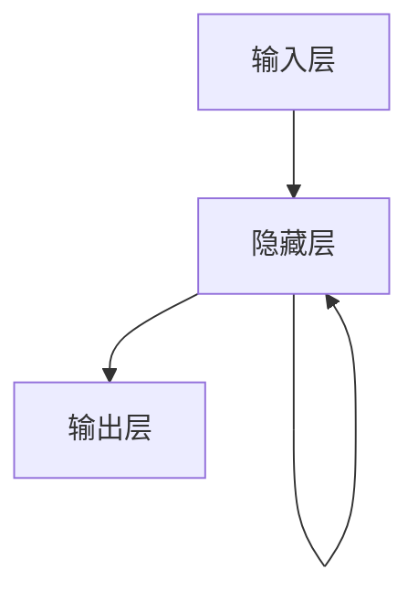
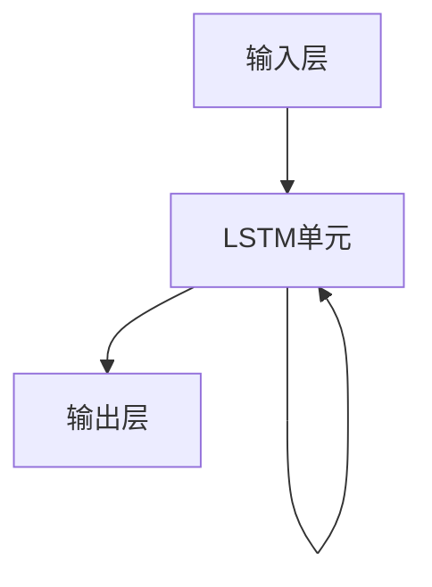

# 从零开始大模型开发与微调：循环神经网络理论讲解

## 1.背景介绍

在人工智能和深度学习的领域中，循环神经网络（RNN）因其在处理序列数据方面的卓越表现而备受关注。无论是自然语言处理、时间序列预测，还是语音识别，RNN都展现出了强大的能力。然而，尽管RNN的应用广泛，其背后的理论和实现细节却常常让人望而却步。本篇文章旨在从零开始，详细讲解RNN的核心概念、算法原理、数学模型、实际应用以及未来发展趋势，帮助读者全面理解并掌握这一重要技术。

## 2.核心概念与联系

### 2.1 循环神经网络简介

循环神经网络（Recurrent Neural Network, RNN）是一类用于处理序列数据的神经网络。与传统的前馈神经网络不同，RNN具有内部状态（记忆），能够捕捉序列中的时间依赖关系。

### 2.2 序列数据与时间依赖

序列数据是指数据点按时间或顺序排列的集合，如文本、时间序列数据等。RNN通过其循环结构，能够在处理当前输入时考虑之前的输入，从而捕捉序列中的时间依赖关系。

### 2.3 RNN的基本结构

RNN的基本结构包括输入层、隐藏层和输出层。隐藏层通过循环连接，将前一时刻的隐藏状态传递到当前时刻，从而实现对序列数据的处理。



### 2.4 RNN的变种

RNN有多种变种，包括长短期记忆网络（LSTM）和门控循环单元（GRU）。这些变种通过引入门控机制，解决了传统RNN在处理长序列时的梯度消失和梯度爆炸问题。

## 3.核心算法原理具体操作步骤

### 3.1 前向传播

在RNN中，前向传播的过程包括计算每个时间步的隐藏状态和输出。隐藏状态的计算公式为：

$$
h_t = \sigma(W_{xh}x_t + W_{hh}h_{t-1} + b_h)
$$

其中，$h_t$ 是当前时刻的隐藏状态，$x_t$ 是当前时刻的输入，$W_{xh}$ 和 $W_{hh}$ 分别是输入到隐藏层和隐藏层到隐藏层的权重矩阵，$b_h$ 是偏置，$\sigma$ 是激活函数。

### 3.2 反向传播

RNN的反向传播过程称为反向传播通过时间（Backpropagation Through Time, BPTT）。BPTT的基本思想是将RNN展开成一个时间步长的前馈神经网络，然后对每个时间步的误差进行反向传播。

### 3.3 梯度消失与梯度爆炸

在BPTT过程中，梯度消失和梯度爆炸是两个常见的问题。梯度消失指的是梯度在反向传播过程中逐渐变小，导致模型无法学习长时间依赖关系；梯度爆炸则是梯度在反向传播过程中逐渐变大，导致模型参数更新不稳定。

### 3.4 LSTM和GRU

LSTM和GRU通过引入门控机制，有效地解决了梯度消失和梯度爆炸问题。LSTM引入了输入门、遗忘门和输出门，而GRU则简化为更新门和重置门。



## 4.数学模型和公式详细讲解举例说明

### 4.1 RNN的数学模型

RNN的数学模型可以表示为：

$$
h_t = \sigma(W_{xh}x_t + W_{hh}h_{t-1} + b_h)
$$

$$
y_t = \phi(W_{hy}h_t + b_y)
$$

其中，$h_t$ 是隐藏状态，$y_t$ 是输出，$W_{xh}$、$W_{hh}$ 和 $W_{hy}$ 分别是输入到隐藏层、隐藏层到隐藏层和隐藏层到输出层的权重矩阵，$b_h$ 和 $b_y$ 是偏置，$\sigma$ 和 $\phi$ 分别是隐藏层和输出层的激活函数。

### 4.2 LSTM的数学模型

LSTM的数学模型包括三个门和一个记忆单元：

$$
f_t = \sigma(W_{xf}x_t + W_{hf}h_{t-1} + b_f)
$$

$$
i_t = \sigma(W_{xi}x_t + W_{hi}h_{t-1} + b_i)
$$

$$
o_t = \sigma(W_{xo}x_t + W_{ho}h_{t-1} + b_o)
$$

$$
\tilde{C}_t = \tanh(W_{xC}x_t + W_{hC}h_{t-1} + b_C)
$$

$$
C_t = f_t * C_{t-1} + i_t * \tilde{C}_t
$$

$$
h_t = o_t * \tanh(C_t)
$$

其中，$f_t$ 是遗忘门，$i_t$ 是输入门，$o_t$ 是输出门，$C_t$ 是记忆单元，$\tilde{C}_t$ 是候选记忆单元，$W$ 和 $b$ 分别是权重矩阵和偏置。

### 4.3 GRU的数学模型

GRU的数学模型包括两个门：

$$
z_t = \sigma(W_{xz}x_t + W_{hz}h_{t-1} + b_z)
$$

$$
r_t = \sigma(W_{xr}x_t + W_{hr}h_{t-1} + b_r)
$$

$$
\tilde{h}_t = \tanh(W_{xh}x_t + r_t * (W_{hh}h_{t-1}) + b_h)
$$

$$
h_t = (1 - z_t) * h_{t-1} + z_t * \tilde{h}_t
$$

其中，$z_t$ 是更新门，$r_t$ 是重置门，$\tilde{h}_t$ 是候选隐藏状态，$W$ 和 $b$ 分别是权重矩阵和偏置。

## 5.项目实践：代码实例和详细解释说明

### 5.1 基本RNN的实现

以下是一个简单的RNN实现示例，使用Python和TensorFlow：

```python
import tensorflow as tf
from tensorflow.keras.models import Sequential
from tensorflow.keras.layers import SimpleRNN, Dense

# 创建一个简单的RNN模型
model = Sequential()
model.add(SimpleRNN(50, input_shape=(None, 1)))
model.add(Dense(1))

# 编译模型
model.compile(optimizer='adam', loss='mse')

# 打印模型摘要
model.summary()
```

### 5.2 LSTM的实现

以下是一个LSTM实现示例：

```python
import tensorflow as tf
from tensorflow.keras.models import Sequential
from tensorflow.keras.layers import LSTM, Dense

# 创建一个LSTM模型
model = Sequential()
model.add(LSTM(50, input_shape=(None, 1)))
model.add(Dense(1))

# 编译模型
model.compile(optimizer='adam', loss='mse')

# 打印模型摘要
model.summary()
```

### 5.3 GRU的实现

以下是一个GRU实现示例：

```python
import tensorflow as tf
from tensorflow.keras.models import Sequential
from tensorflow.keras.layers import GRU, Dense

# 创建一个GRU模型
model = Sequential()
model.add(GRU(50, input_shape=(None, 1)))
model.add(Dense(1))

# 编译模型
model.compile(optimizer='adam', loss='mse')

# 打印模型摘要
model.summary()
```

### 5.4 训练与评估

训练和评估模型的代码如下：

```python
# 假设我们有训练数据X_train和y_train
# 训练模型
model.fit(X_train, y_train, epochs=10, batch_size=32)

# 假设我们有测试数据X_test和y_test
# 评估模型
loss = model.evaluate(X_test, y_test)
print(f'Test loss: {loss}')
```

## 6.实际应用场景

### 6.1 自然语言处理

RNN在自然语言处理（NLP）中的应用非常广泛，包括语言模型、机器翻译、文本生成等。例如，LSTM和GRU在处理长文本时表现出色，能够捕捉上下文信息，提高翻译和生成的质量。

### 6.2 时间序列预测

RNN在时间序列预测中的应用也非常广泛，如股票价格预测、天气预报等。通过捕捉时间序列中的模式和趋势，RNN能够提供准确的预测结果。

### 6.3 语音识别

RNN在语音识别中的应用包括语音到文本转换、语音情感分析等。通过处理语音信号的时间序列数据，RNN能够识别和理解语音中的信息。

### 6.4 图像字幕生成

RNN在图像字幕生成中的应用包括从图像生成描述性文本。通过结合卷积神经网络（CNN）和RNN，模型能够从图像中提取特征，并生成相应的描述性文本。

## 7.工具和资源推荐

### 7.1 开发工具

- **TensorFlow**：一个开源的深度学习框架，支持RNN、LSTM和GRU的实现。
- **PyTorch**：另一个流行的深度学习框架，提供灵活的RNN实现。

### 7.2 学习资源

- **《深度学习》**：由Ian Goodfellow等人编写的经典教材，详细介绍了RNN的理论和应用。
- **Coursera和Udacity**：提供多种深度学习和RNN的在线课程，适合不同水平的学习者。

### 7.3 数据集

- **IMDB电影评论数据集**：用于情感分析的文本数据集。
- **Kaggle**：提供多种时间序列预测和语音识别的数据集。

## 8.总结：未来发展趋势与挑战

### 8.1 未来发展趋势

随着深度学习技术的不断发展，RNN及其变种（如LSTM和GRU）将在更多领域展现其强大的能力。未来，RNN有望在以下几个方面取得突破：

- **更高效的模型**：通过优化算法和硬件，加速RNN的训练和推理过程。
- **更强的泛化能力**：通过改进模型结构和训练方法，提高RNN在不同任务和数据集上的泛化能力。
- **多模态融合**：结合图像、文本、语音等多种模态的数据，构建更强大的多模态RNN模型。

### 8.2 挑战

尽管RNN在许多领域取得了显著的成果，但仍面临一些挑战：

- **长时间依赖问题**：尽管LSTM和GRU在一定程度上解决了这一问题，但在处理非常长的序列时，仍可能出现性能下降。
- **计算复杂度**：RNN的训练和推理过程计算复杂度较高，尤其是在处理大规模数据时，可能需要大量的计算资源。
- **模型解释性**：RNN的内部状态和权重难以解释，导致模型的可解释性较差。

## 9.附录：常见问题与解答

### 9.1 什么是RNN？

RNN是一类用于处理序列数据的神经网络，具有内部状态（记忆），能够捕捉序列中的时间依赖关系。

### 9.2 RNN与LSTM、GRU的区别是什么？

LSTM和GRU是RNN的变种，通过引入门控机制，解决了传统RNN在处理长序列时的梯度消失和梯度爆炸问题。

### 9.3 如何选择RNN、LSTM和GRU？

选择RNN、LSTM或GRU取决于具体的应用场景和数据特性。一般来说，LSTM和GRU在处理长序列时表现更好，而RNN在处理短序列时可能更高效。

### 9.4 如何解决RNN的梯度消失和梯度爆炸问题？

可以通过使用LSTM和GRU等变种，或者采用梯度裁剪（Gradient Clipping）等技术，解决RNN的梯度消失和梯度爆炸问题。

### 9.5 RNN的实际应用有哪些？

RNN在自然语言处理、时间序列预测、语音识别、图像字幕生成等领域有广泛的应用。

---

作者：禅与计算机程序设计艺术 / Zen and the Art of Computer Programming