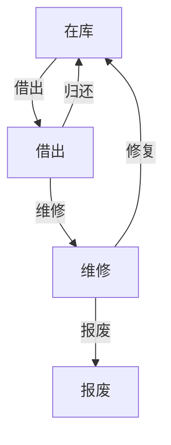
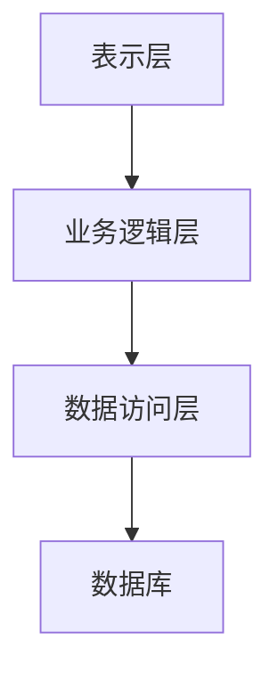

# 仪器管理系统详细设计与具体代码实现

## 1.背景介绍

在现代实验室和工业环境中，仪器设备的管理是一个至关重要的环节。随着科技的进步，仪器设备的种类和数量不断增加，如何高效地管理这些设备成为了一个亟待解决的问题。仪器管理系统（Instrument Management System, IMS）应运而生，它能够帮助用户实现对仪器设备的全生命周期管理，包括采购、使用、维护、报废等环节。

## 2.核心概念与联系

### 2.1 仪器管理系统的定义

仪器管理系统是一种专门用于管理实验室和工业环境中各种仪器设备的软件系统。它能够记录和跟踪仪器的状态、位置、使用情况、维护记录等信息，从而提高仪器的利用率和管理效率。

### 2.2 核心模块

一个完整的仪器管理系统通常包括以下几个核心模块：

- **仪器信息管理**：记录仪器的基本信息，如型号、序列号、采购日期等。
- **库存管理**：管理仪器的库存状态，包括在库、借出、维修等状态。
- **使用记录**：记录仪器的使用情况，包括使用者、使用时间、用途等。
- **维护管理**：记录仪器的维护和校准情况，包括维护日期、维护内容、维护人员等。
- **报废管理**：记录仪器的报废情况，包括报废原因、报废日期等。

### 2.3 核心概念之间的联系

这些核心模块之间存在紧密的联系。例如，仪器的使用记录和维护记录可以帮助管理者了解仪器的使用频率和维护需求，从而制定合理的维护计划。库存管理和报废管理则可以帮助管理者及时更新仪器的库存状态，避免资源浪费。

## 3.核心算法原理具体操作步骤

### 3.1 仪器状态跟踪算法

仪器状态跟踪是仪器管理系统的核心功能之一。其基本原理是通过记录仪器的各种状态变化，实时更新仪器的当前状态。

#### 3.1.1 状态转移图



#### 3.1.2 状态跟踪算法步骤

1. **初始化状态**：所有新采购的仪器初始状态为“在库”。
2. **状态转移**：根据仪器的使用情况和维护情况，更新仪器的状态。
3. **状态查询**：提供接口查询仪器的当前状态和历史状态变化记录。

### 3.2 维护计划生成算法

维护计划生成算法的目的是根据仪器的使用情况和维护记录，自动生成合理的维护计划。

#### 3.2.1 算法步骤

1. **数据收集**：收集仪器的使用记录和维护记录。
2. **数据分析**：分析仪器的使用频率和维护需求。
3. **计划生成**：根据分析结果生成维护计划，包括维护日期、维护内容、维护人员等。

## 4.数学模型和公式详细讲解举例说明

### 4.1 仪器利用率计算

仪器利用率是衡量仪器使用效率的重要指标。其计算公式为：

$$
U = \frac{T_u}{T_t} \times 100\%
$$

其中，$U$ 表示仪器利用率，$T_u$ 表示仪器的使用时间，$T_t$ 表示仪器的总时间。

#### 4.1.1 举例说明

假设某仪器在一个月内的总时间为720小时，其中使用时间为360小时，则该仪器的利用率为：

$$
U = \frac{360}{720} \times 100\% = 50\%
$$

### 4.2 维护周期计算

维护周期是指两次维护之间的时间间隔。其计算公式为：

$$
M = \frac{T_t}{N_m}
$$

其中，$M$ 表示维护周期，$T_t$ 表示总时间，$N_m$ 表示维护次数。

#### 4.2.1 举例说明

假设某仪器在一年内的总时间为8760小时，共进行了12次维护，则该仪器的维护周期为：

$$
M = \frac{8760}{12} = 730 \text{小时}
$$

## 5.项目实践：代码实例和详细解释说明

### 5.1 系统架构设计

仪器管理系统的架构设计通常采用分层架构，包括表示层、业务逻辑层和数据访问层。



### 5.2 代码实例

#### 5.2.1 仪器信息管理模块

```python
# 仪器信息管理模块
class Instrument:
    def __init__(self, id, model, serial_number, purchase_date):
        self.id = id
        self.model = model
        self.serial_number = serial_number
        self.purchase_date = purchase_date

    def get_info(self):
        return {
            "id": self.id,
            "model": self.model,
            "serial_number": self.serial_number,
            "purchase_date": self.purchase_date
        }
```

#### 5.2.2 库存管理模块

```python
# 库存管理模块
class Inventory:
    def __init__(self):
        self.instruments = {}

    def add_instrument(self, instrument):
        self.instruments[instrument.id] = instrument

    def get_instrument(self, id):
        return self.instruments.get(id)

    def update_status(self, id, status):
        if id in self.instruments:
            self.instruments[id].status = status
```

#### 5.2.3 使用记录模块

```python
# 使用记录模块
class UsageRecord:
    def __init__(self, instrument_id, user, usage_time, purpose):
        self.instrument_id = instrument_id
        self.user = user
        self.usage_time = usage_time
        self.purpose = purpose

    def get_record(self):
        return {
            "instrument_id": self.instrument_id,
            "user": self.user,
            "usage_time": self.usage_time,
            "purpose": self.purpose
        }
```

#### 5.2.4 维护管理模块

```python
# 维护管理模块
class MaintenanceRecord:
    def __init__(self, instrument_id, maintenance_date, maintenance_content, maintenance_person):
        self.instrument_id = instrument_id
        self.maintenance_date = maintenance_date
        self.maintenance_content = maintenance_content
        self.maintenance_person = maintenance_person

    def get_record(self):
        return {
            "instrument_id": self.instrument_id,
            "maintenance_date": self.maintenance_date,
            "maintenance_content": self.maintenance_content,
            "maintenance_person": self.maintenance_person
        }
```

#### 5.2.5 报废管理模块

```python
# 报废管理模块
class ScrapRecord:
    def __init__(self, instrument_id, scrap_date, scrap_reason):
        self.instrument_id = instrument_id
        self.scrap_date = scrap_date
        self.scrap_reason = scrap_reason

    def get_record(self):
        return {
            "instrument_id": self.instrument_id,
            "scrap_date": self.scrap_date,
            "scrap_reason": self.scrap_reason
        }
```

## 6.实际应用场景

### 6.1 实验室管理

在实验室环境中，仪器管理系统可以帮助实验室管理员高效地管理各种实验仪器，确保仪器的正常使用和维护。例如，实验室管理员可以通过系统实时查看仪器的库存状态、使用记录和维护记录，从而合理安排实验计划和维护计划。

### 6.2 工业生产

在工业生产环境中，仪器管理系统可以帮助企业管理各种生产设备，确保设备的正常运行和维护。例如，企业可以通过系统实时监控设备的运行状态和维护需求，从而提高生产效率和设备利用率。

### 6.3 医疗设备管理

在医疗环境中，仪器管理系统可以帮助医院管理各种医疗设备，确保设备的正常使用和维护。例如，医院可以通过系统实时查看设备的库存状态、使用记录和维护记录，从而合理安排医疗计划和维护计划。

## 7.工具和资源推荐

### 7.1 开发工具

- **Python**：一种高效、易学的编程语言，适用于开发各种应用程序。
- **Django**：一个高效的Python Web框架，适用于快速开发Web应用程序。
- **SQLite**：一个轻量级的关系型数据库，适用于小型应用程序的数据存储。

### 7.2 资源推荐

- **《Python编程：从入门到实践》**：一本适合初学者的Python编程书籍，涵盖了Python编程的基础知识和实践技巧。
- **《Django Web开发实战》**：一本适合Django开发者的书籍，涵盖了Django开发的基础知识和实践技巧。
- **SQLite官方网站**：提供了SQLite的下载、文档和示例代码。

## 8.总结：未来发展趋势与挑战

### 8.1 未来发展趋势

随着科技的不断进步，仪器管理系统将会朝着智能化、自动化和集成化的方向发展。例如，未来的仪器管理系统可能会集成物联网技术，实现对仪器设备的实时监控和远程管理；集成人工智能技术，实现对仪器设备的智能诊断和预测维护。

### 8.2 挑战

尽管仪器管理系统有着广阔的发展前景，但在实际应用中仍然面临一些挑战。例如，如何确保系统的安全性和可靠性，如何处理海量的仪器数据，如何实现系统的高效性和可扩展性等。这些问题需要我们在未来的研究和实践中不断探索和解决。

## 9.附录：常见问题与解答

### 9.1 仪器管理系统的主要功能有哪些？

仪器管理系统的主要功能包括仪器信息管理、库存管理、使用记录、维护管理和报废管理等。

### 9.2 如何计算仪器的利用率？

仪器利用率的计算公式为：

$$
U = \frac{T_u}{T_t} \times 100\%
$$

其中，$U$ 表示仪器利用率，$T_u$ 表示仪器的使用时间，$T_t$ 表示仪器的总时间。

### 9.3 如何生成维护计划？

维护计划生成算法的基本步骤包括数据收集、数据分析和计划生成。通过收集仪器的使用记录和维护记录，分析仪器的使用频率和维护需求，生成合理的维护计划。

### 9.4 仪器管理系统的未来发展趋势是什么？

仪器管理系统的未来发展趋势包括智能化、自动化和集成化。例如，集成物联网技术实现对仪器设备的实时监控和远程管理，集成人工智能技术实现对仪器设备的智能诊断和预测维护。

---

作者：禅与计算机程序设计艺术 / Zen and the Art of Computer Programming