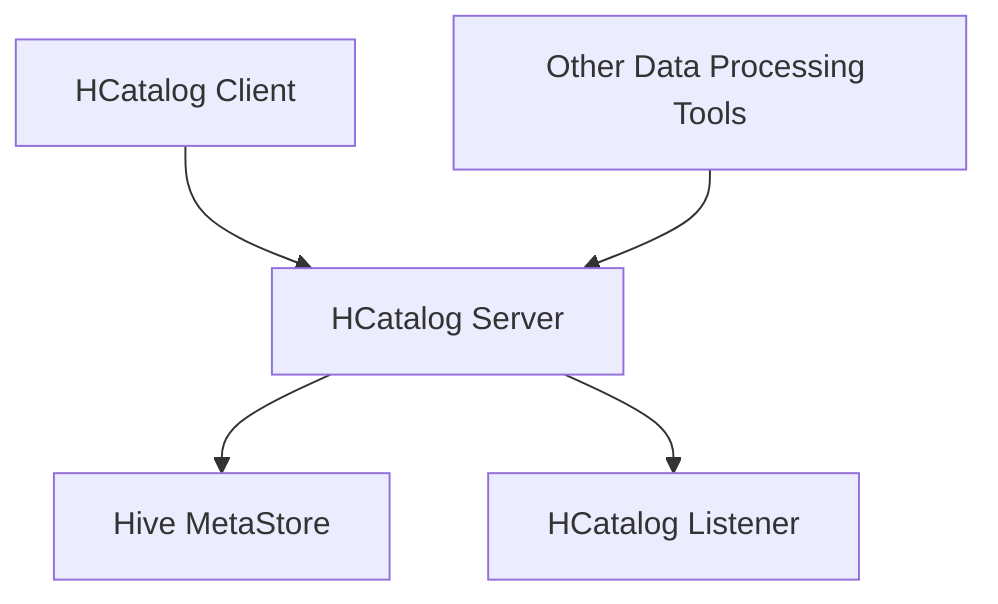

# 初识HCatalog：开启Hive数据管理新篇章

## 1.背景介绍

在大数据时代,数据的规模和多样性不断增长,传统的数据管理方式已经无法满足企业对数据的需求。Apache Hive作为一种建立在Hadoop之上的数据仓库工具,为结构化数据的存储和查询提供了强大的支持。然而,随着数据的不断增长和多样化,Hive也面临着一些挑战,例如元数据管理的复杂性、数据共享和发现的困难等。为了解决这些问题,Apache HCatalog应运而生。

HCatalog是Apache Hive项目的一个子项目,旨在为Hadoop生态系统提供一个统一的元数据服务。它允许不同的数据处理工具共享和管理Hive的元数据,从而实现数据的可发现性、可访问性和可互操作性。HCatalog还提供了一个RESTful API,使得外部应用程序可以轻松地与Hive元数据进行交互。

## 2.核心概念与联系

### 2.1 Hive元数据

在了解HCatalog之前,我们需要先了解Hive的元数据概念。Hive元数据描述了Hive表、分区、列等对象的结构和属性信息。这些信息存储在Hive的元数据存储(MetaStore)中,通常是一个关系数据库。Hive使用这些元数据来管理和访问存储在HDFS或其他存储系统中的数据文件。

### 2.2 HCatalog概念

HCatalog引入了以下几个关键概念:

1. **HCatRecord**: 表示一条记录,类似于数据库中的一行数据。
2. **HCatSchema**: 定义了HCatRecord的结构,描述了每个字段的名称、类型和其他元数据。
3. **HCatTable**: 表示一个表,包含了表的元数据信息,如表名、列信息、分区信息等。
4. **HCatPartition**: 表示表的一个分区,描述了分区的值和位置。
5. **HCatInputFormat/HCatOutputFormat**: 用于读写HCatTable数据的InputFormat和OutputFormat实现。

HCatalog将Hive的元数据抽象为上述概念,并提供了一组API和服务,使得其他工具可以轻松地与Hive元数据进行交互。

### 2.3 HCatalog架构

HCatalog的架构如下图所示:



1. **HCatalog Server**: 提供RESTful API和Thrift API,允许客户端访问和管理Hive元数据。
2. **Hive MetaStore**: Hive的元数据存储,通常是一个关系数据库。
3. **HCatalog Listener**: 监听Hive MetaStore的变化,并将变化同步到HCatalog Server。
4. **HCatalog Client**: 一个Java库,提供了访问HCatalog Server的API。
5. **Other Data Processing Tools**: 其他数据处理工具,如Pig、MapReduce等,可以通过HCatalog访问Hive元数据。

## 3.核心算法原理具体操作步骤

### 3.1 HCatalog表的创建

要在HCatalog中创建一个表,我们需要定义HCatSchema和HCatTable对象,然后将它们提交到HCatalog Server。下面是一个示例:

```java
// 定义Schema
HCatSchema schema = new HCatSchema(Arrays.asList(
    new HCatFieldSchema("id", TypeDescriptors.Types.INT_TYPE, ""),
    new HCatFieldSchema("name", TypeDescriptors.Types.STRING_TYPE, "")
));

// 定义表属性
HCatTable table = new HCatTable("my_table", schema);

// 提交到HCatalog Server
HCatClient client = HCatClient.create(conf);
client.createTable(table);
```

这将在HCatalog中创建一个名为"my_table"的表,包含两个字段"id"和"name"。

### 3.2 数据的读写

使用HCatInputFormat和HCatOutputFormat,我们可以读写HCatalog表中的数据。下面是一个示例MapReduce作业,用于统计表中记录的数量:

```java
Job job = Job.getInstance(conf);
job.setJarByClass(MyJob.class);

// 设置输入
HCatInputFormat.setInput(job, "my_table");

// 设置Mapper
job.setMapperClass(TokenizerMapper.class);
job.setCombinerClass(IntSumReducer.class);

// 设置输出
job.setOutputKeyClass(Text.class);
job.setOutputValueClass(IntWritable.class);
job.setOutputFormatClass(TextOutputFormat.class);

// 设置Reducer
job.setReducerClass(IntSumReducer.class);

System.exit(job.waitForCompletion(true) ? 0 : 1);
```

在这个例子中,我们使用HCatInputFormat将"my_table"表作为MapReduce作业的输入,然后使用标准的MapReduce流程进行数据处理。

### 3.3 分区管理

HCatalog支持对表进行分区,这可以提高查询性能和数据组织。下面是一个创建分区表的示例:

```java
HCatSchema schema = new HCatSchema(...);
HCatTable table = new HCatTable("partitioned_table", schema);

// 添加分区键
table.setPartCols(Arrays.asList(new HCatFieldSchema("year", TypeDescriptors.Types.INT_TYPE, "")));

// 创建表
client.createTable(table);

// 添加分区
client.addPartition(table, Arrays.asList("2022"));
client.addPartition(table, Arrays.asList("2023"));
```

在这个例子中,我们创建了一个名为"partitioned_table"的分区表,分区键为"year"。然后,我们添加了两个分区,分别对应2022年和2023年的数据。

## 4.数学模型和公式详细讲解举例说明

在大数据处理中,常常需要使用一些数学模型和公式来描述和优化数据处理过程。在HCatalog中,我们可以利用一些数学模型和公式来优化元数据管理和查询性能。

### 4.1 布隆过滤器

布隆过滤器是一种空间高效的概率数据结构,用于测试一个元素是否属于一个集合。在HCatalog中,我们可以使用布隆过滤器来加速分区裁剪(Partition Pruning)的过程。

假设我们有一个分区表,包含N个分区,每个分区包含M个元素。我们希望查询一个包含K个元素的集合。传统的方法是逐一检查每个分区,时间复杂度为O(N*M)。

使用布隆过滤器,我们可以将每个分区的元素插入到一个布隆过滤器中。查询时,我们首先检查查询集合中的每个元素是否在布隆过滤器中,如果不在,则可以直接跳过该分区。这样,时间复杂度降低为O(K + N)。

布隆过滤器的伪代码如下:

```
BF_INIT(m, k) // 初始化布隆过滤器,m为位数组大小,k为哈希函数个数
BF_ADD(x)     // 将元素x添加到布隆过滤器
BF_CHECK(x)   // 检查元素x是否在布隆过滤器中
```

布隆过滤器的核心公式是:

$$
m = -\frac{n\ln p}{(\ln 2)^2}
$$

其中,n是预期元素个数,p是允许的最大误报率。

### 4.2 局部敏感哈希

局部敏感哈希(Locality Sensitive Hashing,LSH)是一种近似最近邻搜索的算法,可以用于高维数据的相似性计算。在HCatalog中,我们可以使用LSH来加速元数据的查找和匹配。

假设我们有一个包含N个表的元数据库,每个表包含M个字段。我们希望查找与给定表T最相似的表。传统的方法是逐一计算T与每个表的相似度,时间复杂度为O(N*M)。

使用LSH,我们可以将每个表的字段信息映射到多个哈希桶中。查询时,我们只需要检查与T映射到相同哈希桶的表,大大减少了计算量。

LSH的核心思想是,相似的对象会被映射到相同的哈希桶中的概率较高。常用的LSH函数有MinHash和SimHash等。

LSH的伪代码如下:

```
LSH_INIT(k, l)  // 初始化LSH,k为哈希函数个数,l为哈希桶个数
LSH_ADD(x)      // 将对象x添加到LSH
LSH_QUERY(q, r) // 查询与q相似度至少为r的对象
```

LSH的核心公式是:

$$
P(h(x) = h(y)) = \text{sim}(x, y)
$$

其中,h是哈希函数,sim(x,y)是x和y的相似度。

## 5.项目实践：代码实例和详细解释说明

下面是一个使用HCatalog Java API的完整示例,包括创建表、插入数据、查询数据等操作。

### 5.1 创建HCatalog表

```java
// 定义Schema
List<HCatFieldSchema> cols = Arrays.asList(
    new HCatFieldSchema("id", TypeDescriptors.Types.INT_TYPE, ""),
    new HCatFieldSchema("name", TypeDescriptors.Types.STRING_TYPE, "")
);
HCatSchema schema = new HCatSchema(cols);

// 定义表属性
HCatTable table = new HCatTable("my_table", schema);

// 创建表
HCatClient client = HCatClient.create(conf);
client.createTable(table);
```

在这个示例中,我们创建了一个名为"my_table"的表,包含两个字段"id"和"name"。

### 5.2 插入数据

```java
// 创建HCatRecord对象
HCatRecord record = new DefaultHCatRecord(2);
record.set(0, 1);
record.set(1, "Alice");

// 写入数据
HCatOutputFormat.setOutput(job, output);
job.setMapperClass(MyMapper.class);
job.setOutputKeyClass(WritableComparable.class);
job.setOutputValueClass(DefaultHCatRecord.class);
job.setOutputFormatClass(HCatOutputFormat.class);
job.waitForCompletion(true);
```

在这个示例中,我们创建了一个HCatRecord对象,并设置了"id"和"name"字段的值。然后,我们使用HCatOutputFormat将这条记录写入到"my_table"表中。

### 5.3 查询数据

```java
// 设置输入
HCatInputFormat.setInput(job, "my_table");

// 设置Mapper
job.setMapperClass(MyMapper.class);
job.setOutputKeyClass(Text.class);
job.setOutputValueClass(IntWritable.class);

// 设置Reducer
job.setCombinerClass(IntSumReducer.class);
job.setReducerClass(IntSumReducer.class);

// 运行作业
job.waitForCompletion(true);
```

在这个示例中,我们使用HCatInputFormat将"my_table"表作为MapReduce作业的输入。然后,我们可以使用标准的MapReduce流程来处理和查询这些数据。

## 6.实际应用场景

HCatalog可以在多个场景下发挥作用,提高数据管理和处理的效率。

### 6.1 数据共享和发现

在大数据环境中,不同的团队和应用程序可能需要访问相同的数据集。HCatalog提供了一个统一的元数据服务,使得不同的工具可以轻松地发现和访问这些数据。这样可以避免数据孤岛,提高数据的可重用性。

### 6.2 元数据管理

随着数据量的增长,手动管理元数据变得越来越困难。HCatalog提供了一个集中式的元数据管理系统,可以自动化地管理表、分区、列等对象的元数据。这样可以减轻管理员的工作负担,并确保元数据的一致性和准确性。

### 6.3 数据治理

在企业级环境中,数据治理是一个重要的挑战。HCatalog可以作为数据治理的一个重要组成部分,提供元数据管理、数据发现、访问控制等功能,帮助企业更好地管理和控制其数据资产。

### 6.4 数据湖

数据湖是一种新兴的大数据架构,旨在存储各种格式的数据,并支持多种分析工具和框架。HCatalog可以作为数据湖的元数据服务,为不同的工具提供统一的数据访问接口,从而简化数据湖的管理和使用。

## 7.工具和资源推荐

### 7.1 HCatalog命令行工具

HCatalog提供了一个命令行工具,可以方便地管理和查询Hive元数据。这个工具支持多种命令,如创建表、添加分区