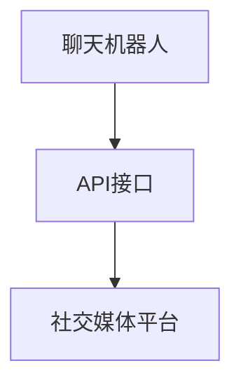
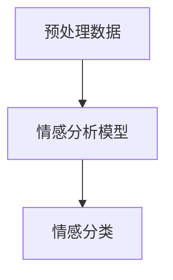

# 利用聊天机器人进行社交媒体监控和分析

## 1.背景介绍

在当今数字化时代，社交媒体已经成为人们日常生活中不可或缺的一部分。无论是个人用户还是企业，社交媒体都提供了一个广泛的交流和信息传播平台。然而，随着社交媒体数据量的爆炸性增长，如何有效地监控和分析这些数据成为了一个巨大的挑战。聊天机器人（Chatbot）作为一种智能化工具，能够在这一领域发挥重要作用。本文将深入探讨如何利用聊天机器人进行社交媒体监控和分析。

## 2.核心概念与联系

### 2.1 聊天机器人

聊天机器人是一种基于人工智能技术的自动化程序，能够模拟人类的对话行为。它们可以通过自然语言处理（NLP）技术理解和生成人类语言，从而与用户进行互动。

### 2.2 社交媒体监控

社交媒体监控是指通过技术手段实时跟踪和分析社交媒体平台上的内容和用户行为。其目的是了解用户的情感、需求和趋势，从而为决策提供支持。

### 2.3 社交媒体分析

社交媒体分析是对收集到的社交媒体数据进行深入分析，以提取有价值的信息。这包括情感分析、话题分析、用户行为分析等。

### 2.4 核心联系

聊天机器人可以作为社交媒体监控和分析的前端工具，通过与用户的互动收集数据，并利用后台的分析系统进行数据处理和分析。

## 3.核心算法原理具体操作步骤

### 3.1 数据收集

数据收集是社交媒体监控和分析的第一步。聊天机器人可以通过API接口从各大社交媒体平台获取数据。



### 3.2 数据预处理

收集到的数据通常是非结构化的，需要进行预处理。包括数据清洗、去重、分词等操作。

### 3.3 情感分析

情感分析是社交媒体分析中的一个重要环节。通过自然语言处理技术，聊天机器人可以识别用户的情感倾向。



### 3.4 话题分析

话题分析是指识别社交媒体上的热门话题和趋势。可以使用主题模型（如LDA）进行分析。

### 3.5 用户行为分析

用户行为分析是通过分析用户的互动行为，了解用户的兴趣和需求。这可以帮助企业制定更有效的营销策略。

## 4.数学模型和公式详细讲解举例说明

### 4.1 情感分析模型

情感分析通常使用分类模型，如朴素贝叶斯、支持向量机（SVM）等。假设我们使用朴素贝叶斯模型，其公式如下：

$$
P(c|d) = \frac{P(d|c)P(c)}{P(d)}
$$

其中，$P(c|d)$ 是在给定文档 $d$ 的情况下类别 $c$ 的概率，$P(d|c)$ 是在类别 $c$ 下文档 $d$ 的概率，$P(c)$ 是类别 $c$ 的先验概率，$P(d)$ 是文档 $d$ 的先验概率。

### 4.2 主题模型

主题模型如LDA（Latent Dirichlet Allocation）用于话题分析。其核心思想是将文档表示为主题的分布，将主题表示为词的分布。LDA的数学公式如下：

$$
P(w|d) = \sum_{k=1}^{K} P(w|z_k)P(z_k|d)
$$

其中，$P(w|d)$ 是在文档 $d$ 中词 $w$ 的概率，$P(w|z_k)$ 是在主题 $z_k$ 下词 $w$ 的概率，$P(z_k|d)$ 是在文档 $d$ 中主题 $z_k$ 的概率。

## 5.项目实践：代码实例和详细解释说明

### 5.1 数据收集

以下是一个使用Python和Tweepy库从Twitter收集数据的示例代码：

```python
import tweepy

# 认证信息
auth = tweepy.OAuthHandler('consumer_key', 'consumer_secret')
auth.set_access_token('access_token', 'access_token_secret')

api = tweepy.API(auth)

# 获取推文
tweets = api.search(q='chatbot', count=100)

for tweet in tweets:
    print(tweet.text)
```

### 5.2 数据预处理

使用NLTK库进行数据预处理：

```python
import nltk
from nltk.corpus import stopwords
from nltk.tokenize import word_tokenize

# 下载停用词
nltk.download('stopwords')
nltk.download('punkt')

# 预处理函数
def preprocess(text):
    tokens = word_tokenize(text)
    tokens = [word for word in tokens if word.isalpha()]
    tokens = [word for word in tokens if word not in stopwords.words('english')]
    return tokens

# 预处理推文
preprocessed_tweets = [preprocess(tweet.text) for tweet in tweets]
```

### 5.3 情感分析

使用TextBlob库进行情感分析：

```python
from textblob import TextBlob

# 情感分析函数
def analyze_sentiment(text):
    analysis = TextBlob(text)
    return analysis.sentiment.polarity

# 分析推文情感
sentiments = [analyze_sentiment(tweet.text) for tweet in tweets]
```

### 5.4 话题分析

使用Gensim库进行话题分析：

```python
from gensim import corpora, models

# 创建词典
dictionary = corpora.Dictionary(preprocessed_tweets)

# 创建语料库
corpus = [dictionary.doc2bow(text) for text in preprocessed_tweets]

# 训练LDA模型
lda_model = models.LdaModel(corpus, num_topics=5, id2word=dictionary, passes=15)

# 打印话题
for idx, topic in lda_model.print_topics(-1):
    print('Topic: {} \nWords: {}'.format(idx, topic))
```

## 6.实际应用场景

### 6.1 品牌监控

企业可以利用聊天机器人实时监控社交媒体上的品牌提及，了解用户对品牌的看法和反馈，从而及时调整营销策略。

### 6.2 客户服务

聊天机器人可以作为客户服务的前端工具，自动回复用户的常见问题，并将复杂问题转交给人工客服。

### 6.3 市场调研

通过分析社交媒体上的用户行为和话题趋势，企业可以进行市场调研，了解用户需求和市场动态。

### 6.4 危机管理

在危机事件发生时，聊天机器人可以实时监控社交媒体上的舆情，帮助企业及时应对和处理危机。

## 7.工具和资源推荐

### 7.1 开源工具

- **Tweepy**：用于从Twitter收集数据的Python库。
- **NLTK**：用于自然语言处理的Python库。
- **TextBlob**：用于情感分析的Python库。
- **Gensim**：用于话题建模的Python库。

### 7.2 在线资源

- **Twitter API**：提供从Twitter获取数据的接口。
- **Google Cloud Natural Language API**：提供强大的自然语言处理功能。
- **IBM Watson**：提供多种AI服务，包括情感分析和话题分析。

## 8.总结：未来发展趋势与挑战

### 8.1 未来发展趋势

随着人工智能技术的不断进步，聊天机器人在社交媒体监控和分析中的应用将越来越广泛。未来，聊天机器人将更加智能化，能够更好地理解和处理自然语言，提供更精准的分析结果。

### 8.2 挑战

尽管聊天机器人在社交媒体监控和分析中具有广泛的应用前景，但也面临一些挑战。首先是数据隐私和安全问题，如何在保护用户隐私的前提下进行数据收集和分析是一个重要课题。其次是技术挑战，如何提高聊天机器人的自然语言理解能力和分析精度也是一个需要解决的问题。

## 9.附录：常见问题与解答

### 9.1 聊天机器人如何处理多语言数据？

聊天机器人可以通过集成多语言自然语言处理模型来处理多语言数据。例如，使用Google Cloud Translation API进行语言翻译，然后再进行分析。

### 9.2 如何确保数据的隐私和安全？

在数据收集和分析过程中，必须遵守相关的法律法规，确保用户数据的隐私和安全。可以使用数据加密、匿名化等技术手段来保护数据。

### 9.3 聊天机器人能否实时监控社交媒体？

是的，聊天机器人可以通过API接口实时获取社交媒体数据，并进行实时分析。这对于品牌监控和危机管理非常有用。

### 9.4 如何提高情感分析的准确性？

可以通过使用更先进的自然语言处理模型（如BERT、GPT-3）来提高情感分析的准确性。此外，结合领域知识和上下文信息也有助于提高分析精度。

### 9.5 聊天机器人能否自动生成报告？

是的，聊天机器人可以将分析结果自动生成报告，并通过邮件或其他方式发送给相关人员。这可以大大提高工作效率。

---

作者：禅与计算机程序设计艺术 / Zen and the Art of Computer Programming