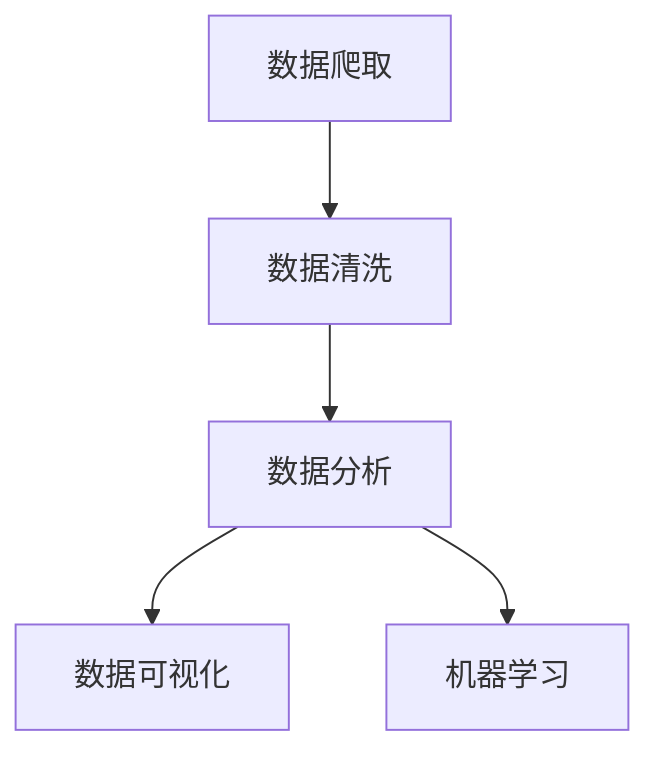

# 基于Python的电影票房爬取与分析

## 1.背景介绍

在大数据时代，数据的获取和分析变得尤为重要。电影票房数据作为娱乐行业的重要指标，不仅反映了电影的市场表现，还能为电影制作、发行和营销提供重要参考。通过爬取和分析电影票房数据，我们可以洞察市场趋势、预测票房走势，甚至为电影投资决策提供依据。

Python作为一种强大的编程语言，因其丰富的库和简洁的语法，成为数据爬取和分析的首选工具。本文将详细介绍如何使用Python爬取电影票房数据，并对其进行分析。

## 2.核心概念与联系

在进行电影票房数据爬取与分析之前，我们需要了解一些核心概念和它们之间的联系。

### 2.1 数据爬取

数据爬取是指通过编程手段从互联网上自动获取数据的过程。常用的技术包括HTTP请求、HTML解析等。

### 2.2 数据清洗

数据清洗是指对爬取到的数据进行处理，去除噪声和无关信息，使数据更加整洁和有用。

### 2.3 数据分析

数据分析是指对清洗后的数据进行统计分析和可视化，以发现数据中的规律和趋势。

### 2.4 数据可视化

数据可视化是指将数据以图表的形式展示出来，使数据更加直观和易于理解。

### 2.5 机器学习

机器学习是指通过算法从数据中学习规律，并进行预测和分类。它在票房预测中有广泛应用。

这些概念之间的联系可以用以下Mermaid流程图表示：



## 3.核心算法原理具体操作步骤

在进行电影票房数据爬取与分析时，我们需要遵循以下步骤：

### 3.1 确定数据源

首先，我们需要确定数据源。常见的电影票房数据源包括IMDb、Box Office Mojo、豆瓣电影等。

### 3.2 发送HTTP请求

使用Python的requests库发送HTTP请求，获取网页内容。

### 3.3 解析HTML

使用BeautifulSoup库解析HTML，提取所需的数据。

### 3.4 数据清洗

对提取的数据进行清洗，去除无关信息和噪声。

### 3.5 数据存储

将清洗后的数据存储到本地文件或数据库中。

### 3.6 数据分析

使用Pandas库对数据进行统计分析，发现数据中的规律和趋势。

### 3.7 数据可视化

使用Matplotlib和Seaborn库将数据以图表的形式展示出来。

### 3.8 机器学习

使用Scikit-learn库进行机器学习，预测电影票房走势。

## 4.数学模型和公式详细讲解举例说明

在电影票房分析中，常用的数学模型和公式包括线性回归、时间序列分析等。

### 4.1 线性回归

线性回归是一种简单的预测模型，假设因变量与自变量之间存在线性关系。其数学公式为：

$$
y = \beta_0 + \beta_1 x + \epsilon
$$

其中，$y$ 是因变量，$x$ 是自变量，$\beta_0$ 和 $\beta_1$ 是回归系数，$\epsilon$ 是误差项。

### 4.2 时间序列分析

时间序列分析用于分析和预测时间序列数据。常用的方法包括ARIMA模型，其数学公式为：

$$
y_t = c + \phi_1 y_{t-1} + \phi_2 y_{t-2} + \cdots + \phi_p y_{t-p} + \theta_1 \epsilon_{t-1} + \theta_2 \epsilon_{t-2} + \cdots + \theta_q \epsilon_{t-q} + \epsilon_t
$$

其中，$y_t$ 是时间序列数据，$c$ 是常数项，$\phi_i$ 是自回归系数，$\theta_i$ 是移动平均系数，$\epsilon_t$ 是误差项。

## 5.项目实践：代码实例和详细解释说明

### 5.1 确定数据源

我们选择豆瓣电影作为数据源。

### 5.2 发送HTTP请求

使用requests库发送HTTP请求：

```python
import requests

url = 'https://movie.douban.com/chart'
response = requests.get(url)
html_content = response.text
```

### 5.3 解析HTML

使用BeautifulSoup库解析HTML：

```python
from bs4 import BeautifulSoup

soup = BeautifulSoup(html_content, 'html.parser')
movies = soup.find_all('div', class_='pl2')
```

### 5.4 数据清洗

提取电影名称和评分：

```python
movie_data = []
for movie in movies:
    title = movie.find('a').text.strip()
    rating = movie.find('span', class_='rating_nums').text.strip()
    movie_data.append({'title': title, 'rating': rating})
```

### 5.5 数据存储

将数据存储到CSV文件：

```python
import csv

with open('movies.csv', 'w', newline='', encoding='utf-8') as csvfile:
    fieldnames = ['title', 'rating']
    writer = csv.DictWriter(csvfile, fieldnames=fieldnames)
    writer.writeheader()
    writer.writerows(movie_data)
```

### 5.6 数据分析

使用Pandas库进行数据分析：

```python
import pandas as pd

df = pd.read_csv('movies.csv')
print(df.describe())
```

### 5.7 数据可视化

使用Matplotlib和Seaborn库进行数据可视化：

```python
import matplotlib.pyplot as plt
import seaborn as sns

sns.histplot(df['rating'], kde=True)
plt.title('电影评分分布')
plt.xlabel('评分')
plt.ylabel('频数')
plt.show()
```

### 5.8 机器学习

使用Scikit-learn库进行线性回归预测：

```python
from sklearn.model_selection import train_test_split
from sklearn.linear_model import LinearRegression

# 假设我们有一个包含票房数据的DataFrame
df['box_office'] = [random data]  # 这里需要实际的票房数据

X = df[['rating']]
y = df['box_office']

X_train, X_test, y_train, y_test = train_test_split(X, y, test_size=0.2, random_state=42)
model = LinearRegression()
model.fit(X_train, y_train)

predictions = model.predict(X_test)
print(predictions)
```

## 6.实际应用场景

电影票房数据的爬取与分析在实际中有广泛的应用场景：

### 6.1 市场分析

通过分析电影票房数据，可以了解市场趋势，帮助电影制作公司和发行公司制定更好的营销策略。

### 6.2 票房预测

通过机器学习模型，可以预测电影的票房走势，为电影投资决策提供依据。

### 6.3 观众偏好分析

通过分析观众的评分和评论，可以了解观众的偏好，帮助电影制作公司制作更受欢迎的电影。

### 6.4 竞争对手分析

通过分析竞争对手的票房数据，可以了解竞争对手的市场表现，制定更有效的竞争策略。

## 7.工具和资源推荐

在进行电影票房数据爬取与分析时，以下工具和资源非常有用：

### 7.1 Python库

- requests：用于发送HTTP请求
- BeautifulSoup：用于解析HTML
- Pandas：用于数据分析
- Matplotlib：用于数据可视化
- Seaborn：用于高级数据可视化
- Scikit-learn：用于机器学习

### 7.2 在线资源

- IMDb：提供丰富的电影数据
- Box Office Mojo：提供详细的票房数据
- 豆瓣电影：提供电影评分和评论

### 7.3 学习资源

- 《Python编程：从入门到实践》：适合初学者的Python入门书籍
- 《Python数据科学手册》：详细介绍了Python在数据科学中的应用
- Coursera和Udacity上的数据科学和机器学习课程

## 8.总结：未来发展趋势与挑战

随着大数据和人工智能技术的发展，电影票房数据的爬取与分析将变得更加重要。未来，我们可以预见以下发展趋势和挑战：

### 8.1 趋势

- 数据源的多样化：除了传统的票房数据，社交媒体数据、观众评论数据等也将成为重要的数据源。
- 分析方法的智能化：机器学习和深度学习技术将被广泛应用于票房预测和观众偏好分析。
- 实时分析：随着计算能力的提升，实时票房数据分析将成为可能。

### 8.2 挑战

- 数据质量：如何保证爬取数据的准确性和完整性是一个重要挑战。
- 隐私问题：在爬取和分析数据时，需要注意保护用户隐私。
- 技术复杂性：数据爬取和分析涉及多种技术，需要掌握多种编程技能和算法。

## 9.附录：常见问题与解答

### 9.1 如何处理反爬虫机制？

在进行数据爬取时，可能会遇到反爬虫机制。可以通过设置请求头、使用代理IP等方法绕过反爬虫机制。

### 9.2 如何处理大规模数据？

对于大规模数据，可以使用分布式爬虫和分布式计算框架（如Apache Spark）进行处理。

### 9.3 如何选择合适的机器学习模型？

选择机器学习模型时，需要根据具体问题选择合适的模型。可以通过交叉验证和网格搜索等方法进行模型选择和参数调优。

### 9.4 如何提高数据分析的准确性？

提高数据分析准确性的方法包括数据清洗、特征工程、模型选择和参数调优等。

### 9.5 如何保护用户隐私？

在爬取和分析数据时，需要遵守相关法律法规，避免爬取和使用敏感数据，保护用户隐私。

---

作者：禅与计算机程序设计艺术 / Zen and the Art of Computer Programming