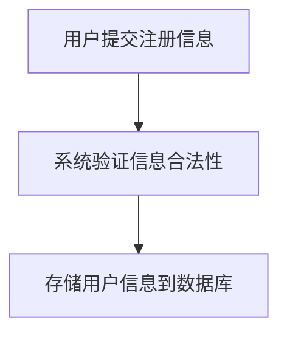
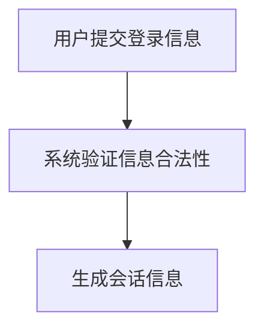
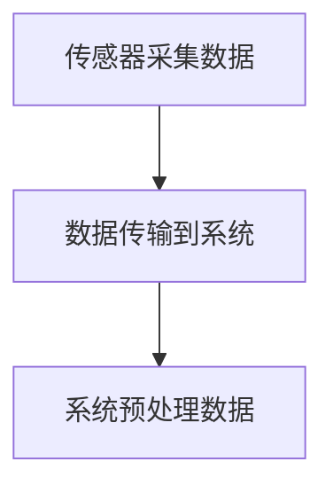
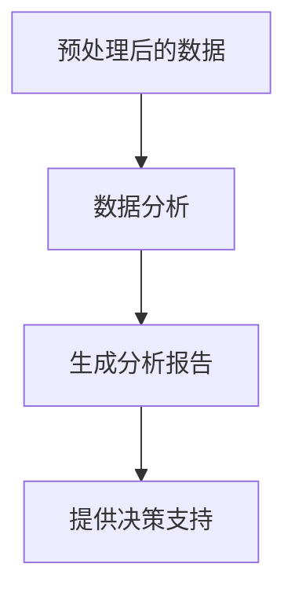

# 基于SSM的养老管理系统

## 1.背景介绍

随着全球老龄化问题的日益严重，养老管理系统的需求变得越来越迫切。传统的养老管理方式已经无法满足现代社会的需求，信息化、智能化的养老管理系统成为了必然趋势。SSM（Spring、Spring MVC、MyBatis）作为一种成熟的Java EE框架，因其高效、稳定、易于扩展的特点，成为了开发养老管理系统的理想选择。

## 2.核心概念与联系

### 2.1 SSM框架概述

SSM框架是由Spring、Spring MVC和MyBatis组成的Java EE开发框架。它们各自承担不同的职责，共同构建了一个高效、稳定的开发环境。

- **Spring**：提供了全面的基础设施支持，包括依赖注入（DI）、面向切面编程（AOP）等。
- **Spring MVC**：负责处理Web层的请求，提供了强大的MVC架构支持。
- **MyBatis**：负责数据持久层，提供了灵活的SQL映射功能。

### 2.2 养老管理系统的需求分析

养老管理系统需要涵盖以下几个方面的功能：

- **用户管理**：包括老人、护理人员、管理员等不同角色的管理。
- **健康监测**：实时监测老人的健康状况，提供预警功能。
- **服务管理**：包括日常护理、医疗服务、娱乐活动等。
- **数据分析**：对收集的数据进行分析，提供决策支持。

### 2.3 SSM与养老管理系统的结合

SSM框架的各个组件可以很好地满足养老管理系统的需求：

- **Spring**：通过依赖注入和AOP，简化了系统的开发和维护。
- **Spring MVC**：提供了强大的Web层支持，方便实现各种用户交互功能。
- **MyBatis**：灵活的SQL映射功能，方便实现复杂的数据操作。

## 3.核心算法原理具体操作步骤

### 3.1 用户管理模块

用户管理模块是养老管理系统的核心模块之一，主要包括用户的注册、登录、权限管理等功能。

#### 3.1.1 用户注册

用户注册的流程如下：

1. 用户提交注册信息。
2. 系统验证信息的合法性。
3. 将用户信息存储到数据库中。



#### 3.1.2 用户登录

用户登录的流程如下：

1. 用户提交登录信息。
2. 系统验证信息的合法性。
3. 验证通过后，生成会话信息。



### 3.2 健康监测模块

健康监测模块主要包括数据采集、数据存储、数据分析等功能。

#### 3.2.1 数据采集

数据采集的流程如下：

1. 通过传感器采集老人的健康数据。
2. 将数据传输到系统中。
3. 系统对数据进行预处理。



#### 3.2.2 数据分析

数据分析的流程如下：

1. 对预处理后的数据进行分析。
2. 生成分析报告。
3. 提供决策支持。



## 4.数学模型和公式详细讲解举例说明

### 4.1 数据预处理

数据预处理是数据分析的基础，主要包括数据清洗、数据归一化等步骤。

#### 4.1.1 数据清洗

数据清洗的目的是去除数据中的噪声和异常值。常用的方法包括均值填补、插值法等。

$$
x_{cleaned} = \frac{1}{n} \sum_{i=1}^{n} x_i
$$

#### 4.1.2 数据归一化

数据归一化的目的是将数据转换到同一量纲，常用的方法包括最小-最大归一化、Z-score归一化等。

$$
x_{normalized} = \frac{x - \min(x)}{\max(x) - \min(x)}
$$

### 4.2 数据分析

数据分析主要包括统计分析、机器学习等方法。

#### 4.2.1 统计分析

统计分析的方法包括均值、方差、标准差等。

$$
\text{均值} \ \mu = \frac{1}{n} \sum_{i=1}^{n} x_i
$$

$$
\text{方差} \ \sigma^2 = \frac{1}{n} \sum_{i=1}^{n} (x_i - \mu)^2
$$

$$
\text{标准差} \ \sigma = \sqrt{\sigma^2}
$$

#### 4.2.2 机器学习

机器学习的方法包括回归分析、分类、聚类等。

$$
\text{线性回归} \ y = \beta_0 + \beta_1 x + \epsilon
$$

$$
\text{逻辑回归} \ P(y=1|x) = \frac{1}{1 + e^{-(\beta_0 + \beta_1 x)}}
$$

## 5.项目实践：代码实例和详细解释说明

### 5.1 项目结构

养老管理系统的项目结构如下：

```
养老管理系统
├── src
│   ├── main
│   │   ├── java
│   │   │   ├── com
│   │   │   │   ├── example
│   │   │   │   │   ├── controller
│   │   │   │   │   ├── service
│   │   │   │   │   ├── dao
│   │   │   │   │   ├── model
│   │   │   │   │   └── util
│   │   ├── resources
│   │   │   ├── mapper
│   │   │   ├── applicationContext.xml
│   │   │   └── spring-mvc.xml
│   ├── test
│   │   ├── java
│   │   │   ├── com
│   │   │   │   ├── example
│   │   │   │   │   ├── controller
│   │   │   │   │   ├── service
│   │   │   │   │   ├── dao
│   │   │   │   │   ├── model
│   │   │   │   │   └── util
```

### 5.2 代码实例

#### 5.2.1 用户注册

```java
// UserController.java
@Controller
@RequestMapping("/user")
public class UserController {

    @Autowired
    private UserService userService;

    @RequestMapping(value = "/register", method = RequestMethod.POST)
    public String register(User user, Model model) {
        boolean isRegistered = userService.register(user);
        if (isRegistered) {
            model.addAttribute("message", "注册成功");
            return "success";
        } else {
            model.addAttribute("message", "注册失败");
            return "error";
        }
    }
}
```

#### 5.2.2 用户登录

```java
// UserController.java
@Controller
@RequestMapping("/user")
public class UserController {

    @Autowired
    private UserService userService;

    @RequestMapping(value = "/login", method = RequestMethod.POST)
    public String login(User user, Model model) {
        boolean isLoggedIn = userService.login(user);
        if (isLoggedIn) {
            model.addAttribute("message", "登录成功");
            return "dashboard";
        } else {
            model.addAttribute("message", "登录失败");
            return "error";
        }
    }
}
```

### 5.3 详细解释

#### 5.3.1 用户注册

在用户注册的代码中，首先通过`@RequestMapping`注解将`/register`路径映射到`register`方法。然后，通过`@Autowired`注解注入`UserService`服务。在`register`方法中，调用`userService.register(user)`方法进行用户注册，并根据注册结果返回相应的视图。

#### 5.3.2 用户登录

在用户登录的代码中，首先通过`@RequestMapping`注解将`/login`路径映射到`login`方法。然后，通过`@Autowired`注解注入`UserService`服务。在`login`方法中，调用`userService.login(user)`方法进行用户登录，并根据登录结果返回相应的视图。

## 6.实际应用场景

### 6.1 健康监测

通过传感器实时监测老人的健康状况，如心率、血压、体温等，并将数据传输到系统中进行分析。一旦发现异常，系统会自动发出预警，通知护理人员和家属。

### 6.2 服务管理

系统可以根据老人的健康状况和需求，自动安排日常护理、医疗服务和娱乐活动。例如，当老人需要进行体检时，系统会自动安排体检时间和地点，并通知相关人员。

### 6.3 数据分析

通过对收集到的数据进行分析，系统可以提供决策支持。例如，通过分析老人的健康数据，可以预测老人的健康趋势，提前采取预防措施。

## 7.工具和资源推荐

### 7.1 开发工具

- **IDEA**：IntelliJ IDEA 是一款功能强大的Java开发工具，支持SSM框架的开发。
- **Maven**：Maven 是一个项目管理工具，方便管理项目的依赖和构建过程。

### 7.2 资源推荐

- **Spring 官方文档**：提供了Spring框架的详细介绍和使用指南。
- **MyBatis 官方文档**：提供了MyBatis框架的详细介绍和使用指南。
- **GitHub**：可以在GitHub上找到很多开源的SSM项目，供参考和学习。

## 8.总结：未来发展趋势与挑战

### 8.1 未来发展趋势

随着技术的不断发展，养老管理系统将会越来越智能化和自动化。未来，养老管理系统可能会结合人工智能、大数据、物联网等技术，实现更加智能化的健康监测和服务管理。

### 8.2 挑战

尽管养老管理系统有着广阔的发展前景，但也面临着一些挑战。例如，如何保证数据的安全性和隐私性，如何提高系统的稳定性和可靠性，如何应对复杂的业务需求等。

## 9.附录：常见问题与解答

### 9.1 如何保证数据的安全性和隐私性？

可以通过以下几种方法保证数据的安全性和隐私性：

- **数据加密**：对敏感数据进行加密存储和传输。
- **权限控制**：通过权限控制，限制不同角色对数据的访问权限。
- **日志审计**：记录系统的操作日志，方便追踪和审计。

### 9.2 如何提高系统的稳定性和可靠性？

可以通过以下几种方法提高系统的稳定性和可靠性：

- **单元测试**：通过单元测试，保证代码的正确性。
- **负载均衡**：通过负载均衡，分散系统的负载，提高系统的稳定性。
- **容错机制**：通过容错机制，保证系统在出现故障时能够自动恢复。

### 9.3 如何应对复杂的业务需求？

可以通过以下几种方法应对复杂的业务需求：

- **模块化设计**：通过模块化设计，将复杂的业务需求拆分成多个独立的模块，方便开发和维护。
- **持续集成**：通过持续集成，保证系统的稳定性和一致性。
- **敏捷开发**：通过敏捷开发，快速响应业务需求的变化。

---

作者：禅与计算机程序设计艺术 / Zen and the Art of Computer Programming