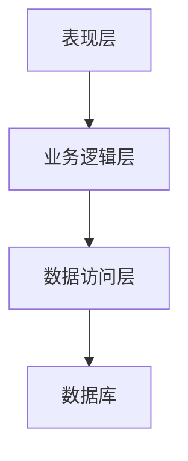
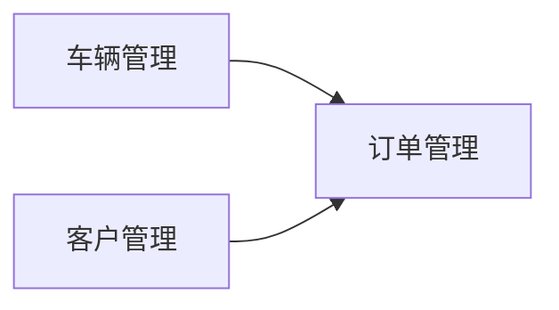

# 基于SSM的汽车租赁管理系统

## 1.背景介绍

随着经济的快速发展和人们生活水平的不断提高,汽车租赁业务逐渐成为一种新兴的消费模式。汽车租赁管理系统作为一种高效的信息化管理手段,可以有效地规范租赁流程,提高工作效率,优化资源配置,从而为企业创造更大的经济效益。

本文将介绍一种基于 SSM (Spring+SpringMVC+MyBatis)框架的汽车租赁管理系统的设计与实现。该系统包括租车、还车、车辆管理、客户管理、订单管理等核心功能模块,可满足汽车租赁公司的日常运营需求。

### 1.1 系统架构
该系统采用经典的三层架构设计,分为表现层、业务逻辑层和数据访问层。



### 1.2 技术选型
- 前端: HTML、CSS、JavaScript、Bootstrap
- 后端: Java、Spring、SpringMVC、MyBatis
- 数据库: MySQL
- 开发环境: Eclipse、Maven

## 2.核心概念与联系

### 2.1 车辆管理
车辆是汽车租赁业务的核心资源,需要对车辆的基本信息、状态、位置等进行精细化管理。

### 2.2 客户管理
客户是汽车租赁业务的服务对象,需要记录客户的基本信息、租车历史等,为客户提供个性化服务。

### 2.3 订单管理
订单是汽车租赁业务的核心流程,需要对订单的创建、修改、取消、支付等全生命周期进行跟踪管理。

### 2.4 系统关联
车辆管理、客户管理和订单管理三个模块相互关联、相互作用,共同构建了汽车租赁管理系统的核心业务流程。



## 3.核心算法原理具体操作步骤

### 3.1 车辆调度算法
为了有效利用车辆资源,提高车辆使用率,需要设计一种高效的车辆调度算法。该算法需要考虑多个因素,如车辆位置、车型、客户偏好等,并综合评估给出最优调度方案。

算法步骤:

1. 获取所有可租车辆列表和客户租车需求
2. 根据客户位置和需求车型筛选可用车辆
3. 对筛选结果按距离排序,距离客户最近的优先
4. 如有多辆车距离相同,按车辆使用时长排序,使用时长短的优先
5. 将最优车辆分配给客户

### 3.2 订单价格计算
订单价格的计算需要考虑多个因素,如租期长短、车型、节假日等,设计一种灵活的价格计算策略。

算法步骤:

1. 获取订单基本信息:起租时间、还车时间、车型
2. 计算租期天数 days
3. 查询该车型的日租金 dayPrice 和周租金 weekPrice
4. 判断是否跨节假日,如是则按节假日价格计算
5. 计算总价:

$$
totalPrice = 
\begin{cases}
days * dayPrice & \text{if } days \leq 6\\
(days \div 7) * weekPrice + (days \% 7) * dayPrice & \text{if } days > 6
\end{cases}
$$

## 4.数学模型和公式详细讲解举例说明

在汽车租赁管理系统中,我们需要对车辆的使用情况进行建模和分析,以优化车辆的调度和利用率。下面将介绍一种基于马尔可夫模型的车辆使用状态分析方法。

### 4.1 马尔可夫模型
马尔可夫模型是一种描述随机过程的数学模型。在该模型中,系统在下一时刻的状态只与当前状态有关,与过去的状态无关。我们可以使用马尔可夫模型来描述车辆的使用状态转移过程。

设车辆的状态空间为 $S=\{0,1\}$,其中 0 表示空闲状态,1 表示使用状态。令 $P(t)$ 表示时刻 $t$ 时车辆处于使用状态的概率,则有:

$$
P(t+1) = P(t) \times p + (1-P(t)) \times q
$$

其中 $p$ 表示车辆从使用状态转移到使用状态的概率, $q$ 表示车辆从空闲状态转移到使用状态的概率。

### 4.2 状态转移矩阵
我们可以使用状态转移矩阵来描述马尔可夫模型中状态之间的转移关系。对于车辆使用状态模型,状态转移矩阵为:

$$
P = \begin{bmatrix}
1-q & q\\
1-p & p
\end{bmatrix}
$$

其中矩阵的第一行表示从空闲状态转移到各个状态的概率,第二行表示从使用状态转移到各个状态的概率。

### 4.3 稳态分析
通过求解状态转移矩阵的特征值和特征向量,我们可以得到系统的稳态分布,即系统在长期运行后各个状态的概率分布。

设稳态分布为 $\pi = (\pi_0, \pi_1)$,则有:

$$
\begin{align}
\pi_0 + \pi_1 &= 1\\
\pi_0 \times (1-q) + \pi_1 \times (1-p) &= \pi_0\\
\pi_0 \times q + \pi_1 \times p &= \pi_1
\end{align}
$$

解上述方程组,我们可以得到:

$$
\pi_0 = \frac{1-p}{2-p-q}, \quad \pi_1 = \frac{q}{2-p-q}
$$

其中 $\pi_0$ 表示车辆长期处于空闲状态的概率, $\pi_1$ 表示车辆长期处于使用状态的概率。

通过分析上述结果,我们可以评估车辆的使用效率,并根据实际需求调整相关参数,以达到车辆资源的最优利用。

## 5.项目实践:代码实例和详细解释说明

### 5.1 车辆管理模块

#### 5.1.1 数据库设计
```sql
CREATE TABLE `car` (
  `id` int(11) NOT NULL AUTO_INCREMENT COMMENT '车辆id',
  `car_no` varchar(20) NOT NULL COMMENT '车牌号',
  `brand` varchar(20) NOT NULL COMMENT '品牌',
  `model` varchar(20) NOT NULL COMMENT '车型',
  `color` varchar(20) NOT NULL COMMENT '颜色',
  `mileage` int(11) NOT NULL COMMENT '里程数',
  `rent_price_day` decimal(10,2) NOT NULL COMMENT '日租金',
  `rent_price_week` decimal(10,2) NOT NULL COMMENT '周租金',
  `status` tinyint(1) NOT NULL DEFAULT '0' COMMENT '状态,0:未租出,1:已租出',
  `create_time` datetime NOT NULL DEFAULT CURRENT_TIMESTAMP COMMENT '创建时间',
  `update_time` datetime NOT NULL DEFAULT CURRENT_TIMESTAMP ON UPDATE CURRENT_TIMESTAMP COMMENT '更新时间',
  PRIMARY KEY (`id`),
  UNIQUE KEY `idx_car_no` (`car_no`)
) ENGINE=InnoDB AUTO_INCREMENT=1 DEFAULT CHARSET=utf8mb4 COMMENT='车辆信息表';
```

#### 5.1.2 数据访问层
```java
@Mapper
public interface CarMapper {
    List<Car> selectAll();
    Car selectById(Integer id);
    int insert(Car car);
    int updateById(Car car);
    int deleteById(Integer id);
}
```

#### 5.1.3 业务逻辑层
```java
@Service
public class CarService {
    @Autowired
    private CarMapper carMapper;

    public List<Car> getAllCars() {
        return carMapper.selectAll();
    }

    public Car getCarById(Integer id) {
        return carMapper.selectById(id);
    }

    public boolean addCar(Car car) {
        return carMapper.insert(car) > 0;
    }

    public boolean updateCar(Car car) {
        return carMapper.updateById(car) > 0;
    }

    public boolean deleteCar(Integer id) {
        return carMapper.deleteById(id) > 0;
    }
}
```

#### 5.1.4 表现层
```java
@Controller
@RequestMapping("/car")
public class CarController {
    @Autowired
    private CarService carService;

    @GetMapping("/list")
    public String list(Model model) {
        List<Car> cars = carService.getAllCars();
        model.addAttribute("cars", cars);
        return "car/list";
    }

    // 其他方法...
}
```

### 5.2 订单管理模块
#### 5.2.1 订单价格计算
```java
public class OrderPriceCalculator {
    public static double calculateTotalPrice(Date startDate, Date endDate, Car car) {
        long days = ChronoUnit.DAYS.between(startDate.toInstant(), endDate.toInstant());
        double dayPrice = car.getRentPriceDay();
        double weekPrice = car.getRentPriceWeek();

        double totalPrice;
        if (days <= 6) {
            totalPrice = days * dayPrice;
        } else {
            totalPrice = (days / 7) * weekPrice + (days % 7) * dayPrice;
        }
        return totalPrice;
    }
}
```

上述代码实现了订单价格计算的核心逻辑。首先计算租期天数,然后根据天数和车型的日租金、周租金,按照一定的规则计算总价格。

#### 5.2.2 订单创建
```java
@Service
public class OrderService {
    @Autowired
    private OrderMapper orderMapper;
    @Autowired
    private CarService carService;

    public boolean createOrder(Order order) {
        Car car = carService.getCarById(order.getCarId());
        if (car == null || car.getStatus() == 1) {
            // 车辆不存在或已被租出
            return false;
        }

        // 计算订单总价
        double totalPrice = OrderPriceCalculator.calculateTotalPrice(order.getStartDate(), order.getEndDate(), car);
        order.setTotalPrice(totalPrice);

        // 设置车辆状态为已租出
        car.setStatus(1);
        carService.updateCar(car);

        // 保存订单
        return orderMapper.insert(order) > 0;
    }

    // 其他方法...
}
```

上述代码展示了订单创建的核心逻辑。在创建订单之前,需要检查所选车辆是否可用。如果可用,则计算订单总价,更新车辆状态,并保存订单信息。

## 6.实际应用场景

汽车租赁管理系统在实际应用中可以解决以下问题:

1. **规范租赁流程**:通过系统化的管理,可以规范租车、还车等流程,提高工作效率。
2. **优化资源调配**:系统可以根据车辆状态、位置等信息,合理调配车辆资源,提高利用率。
3. **个性化服务**:记录客户信息和租车历史,为客户提供个性化的服务和优惠。
4. **数据分析决策**:收集和分析租车数据,为公司的决策提供依据。

该系统可以应用于各类型的汽车租赁公司,如机场租车、长租租车、网约租车等,并可根据具体需求进行定制开发。

## 7.工具和资源推荐

在开发汽车租赁管理系统的过程中,以下工具和资源可以给您提供帮助:

1. **Spring官方文档**:https://spring.io/docs
2. **MyBatis官方文档**:https://mybatis.org/mybatis-3/
3. **Bootstrap中文文档**:https://v3.bootcss.com/
4. **Maven官方文档**:https://maven.apache.org/guides/
5. **Git版本控制**:https://git-scm.com/book/zh/v2
6. **IntelliJ IDEA**:https://www.jetbrains.com/idea/
7. **Visual Studio Code**:https://code.visualstudio.com/

除此之外,一些优秀的在线社区和技术博客也可以为您提供宝贵的经验分享和问题解答,如:StackOverflow、GitHub等。

## 8.总结:未来发展趋势与挑战

随着互联网+、人工智能等新技术的不断发展,汽车租赁行业也将面临新的发展机遇和挑战:

1. **智能化租车**:利用人工智能技术,实现无人值守的智能租车服务。
2. **共享租车**:汽车共享租赁模式的兴起,将改变传统租车业务模式。
3. **个性化服务**:基于大数据分析,为用户提供更加个性化的租车体验。
4. **车联网应用**:利用车联网技术,实现车辆状态的实时监控和故障诊断。

未来,汽