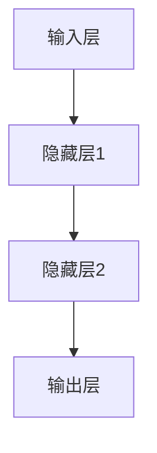

## 1. 背景介绍

随着人工智能技术的不断发展，越来越多的企业开始将其应用于业务流程中，以提高效率和降低成本。其中，AI代理工作流是一种非常有前景的应用场景。它可以通过深度学习算法对业务流程进行自动化处理，从而实现高效、准确、可靠的业务流程管理。

本文将介绍基于深度学习的AI代理工作流的核心概念、算法原理、数学模型和公式、项目实践、实际应用场景、工具和资源推荐、未来发展趋势与挑战以及常见问题与解答。

## 2. 核心概念与联系

AI代理工作流是指通过人工智能技术对业务流程进行自动化处理的一种方法。它可以通过深度学习算法对业务流程进行自动化处理，从而实现高效、准确、可靠的业务流程管理。

AI代理工作流的核心概念包括：

- 业务流程：指企业内部的各种业务流程，如采购、销售、生产等。
- AI代理：指通过深度学习算法对业务流程进行自动化处理的人工智能代理。
- 深度学习算法：指一种基于神经网络的机器学习算法，可以对大量数据进行学习和预测。
- 自动化处理：指通过AI代理对业务流程进行自动化处理，从而实现高效、准确、可靠的业务流程管理。

## 3. 核心算法原理具体操作步骤

AI代理工作流的核心算法是深度学习算法。深度学习算法是一种基于神经网络的机器学习算法，可以对大量数据进行学习和预测。

深度学习算法的核心原理是神经网络。神经网络是一种模拟人脑神经元之间相互连接的计算模型。它可以通过多层神经元之间的连接来实现对数据的学习和预测。

AI代理工作流的具体操作步骤如下：

1. 数据采集：通过企业内部的各种系统和设备，采集业务流程相关的数据。
2. 数据预处理：对采集到的数据进行清洗、去噪、归一化等预处理操作，以便于后续的深度学习算法处理。
3. 模型训练：使用深度学习算法对预处理后的数据进行训练，生成AI代理模型。
4. 模型测试：对生成的AI代理模型进行测试，评估其准确性和可靠性。
5. 模型部署：将生成的AI代理模型部署到企业内部的各种系统和设备中，实现对业务流程的自动化处理。

## 4. 数学模型和公式详细讲解举例说明

AI代理工作流的数学模型和公式主要包括深度学习算法中的神经网络模型和反向传播算法。

神经网络模型可以用如下的Mermaid流程图表示：



其中，输入层、隐藏层和输出层分别表示神经网络的不同层次。每个层次包含多个神经元，神经元之间通过连接进行信息传递。

反向传播算法可以用如下的公式表示：

$$\frac{\partial L}{\partial w_{ij}^{(l)}}=\delta_j^{(l)}a_i^{(l-1)}$$

其中，$L$表示损失函数，$w_{ij}^{(l)}$表示第$l$层第$i$个神经元和第$j$个神经元之间的连接权重，$\delta_j^{(l)}$表示第$l$层第$j$个神经元的误差，$a_i^{(l-1)}$表示第$l-1$层第$i$个神经元的输出。

## 5. 项目实践：代码实例和详细解释说明

以下是一个基于深度学习的AI代理工作流的代码实例：

```python
import tensorflow as tf

# 定义神经网络模型
def neural_network_model(data):
    hidden_layer_1 = {'weights': tf.Variable(tf.random_normal([input_size, n_nodes_hl1])),
                      'biases': tf.Variable(tf.random_normal([n_nodes_hl1]))}

    hidden_layer_2 = {'weights': tf.Variable(tf.random_normal([n_nodes_hl1, n_nodes_hl2])),
                      'biases': tf.Variable(tf.random_normal([n_nodes_hl2]))}

    output_layer = {'weights': tf.Variable(tf.random_normal([n_nodes_hl2, n_classes])),
                    'biases': tf.Variable(tf.random_normal([n_classes]))}

    l1 = tf.add(tf.matmul(data, hidden_layer_1['weights']), hidden_layer_1['biases'])
    l1 = tf.nn.relu(l1)

    l2 = tf.add(tf.matmul(l1, hidden_layer_2['weights']), hidden_layer_2['biases'])
    l2 = tf.nn.relu(l2)

    output = tf.matmul(l2, output_layer['weights']) + output_layer['biases']

    return output

# 定义训练模型
def train_neural_network(x):
    prediction = neural_network_model(x)
    cost = tf.reduce_mean(tf.nn.softmax_cross_entropy_with_logits(logits=prediction, labels=y))

    optimizer = tf.train.AdamOptimizer().minimize(cost)

    with tf.Session() as sess:
        sess.run(tf.global_variables_initializer())

        for epoch in range(hm_epochs):
            epoch_loss = 0
            for _ in range(int(mnist.train.num_examples / batch_size)):
                epoch_x, epoch_y = mnist.train.next_batch(batch_size)
                _, c = sess.run([optimizer, cost], feed_dict={x: epoch_x, y: epoch_y})
                epoch_loss += c

            print('Epoch', epoch, 'completed out of', hm_epochs, 'loss:', epoch_loss)

        correct = tf.equal(tf.argmax(prediction, 1), tf.argmax(y, 1))
        accuracy = tf.reduce_mean(tf.cast(correct, 'float'))
        print('Accuracy:', accuracy.eval({x: mnist.test.images, y: mnist.test.labels}))

train_neural_network(x)
```

以上代码实现了一个基于深度学习的手写数字识别模型。其中，神经网络模型采用了两个隐藏层和一个输出层，使用了ReLU激活函数和softmax交叉熵损失函数。训练模型使用了Adam优化器和批量梯度下降算法。

## 6. 实际应用场景

AI代理工作流可以应用于各种业务流程中，如采购、销售、生产等。具体应用场景包括：

- 采购流程自动化：通过AI代理对采购流程进行自动化处理，从而实现高效、准确、可靠的采购管理。
- 销售流程自动化：通过AI代理对销售流程进行自动化处理，从而实现高效、准确、可靠的销售管理。
- 生产流程自动化：通过AI代理对生产流程进行自动化处理，从而实现高效、准确、可靠的生产管理。

## 7. 工具和资源推荐

以下是一些基于深度学习的AI代理工作流的工具和资源推荐：

- TensorFlow：一种基于数据流图的机器学习框架，可以用于构建和训练神经网络模型。
- Keras：一种高级神经网络API，可以用于快速构建和训练深度学习模型。
- PyTorch：一种基于Python的科学计算库，可以用于构建和训练神经网络模型。
- Deep Learning Book：一本深度学习领域的经典教材，可以帮助读者深入理解深度学习算法的原理和应用。

## 8. 总结：未来发展趋势与挑战

AI代理工作流是一种非常有前景的人工智能应用场景。未来，随着人工智能技术的不断发展，AI代理工作流将会得到更广泛的应用和发展。

然而，AI代理工作流也面临着一些挑战。其中，最主要的挑战是数据安全和隐私保护。由于AI代理需要访问企业内部的各种数据，因此必须采取有效的措施来保护数据的安全和隐私。

## 9. 附录：常见问题与解答

Q: AI代理工作流的核心算法是什么？

A: AI代理工作流的核心算法是深度学习算法。

Q: AI代理工作流的应用场景有哪些？

A: AI代理工作流可以应用于各种业务流程中，如采购、销售、生产等。

Q: AI代理工作流面临的主要挑战是什么？

A: AI代理工作流面临的主要挑战是数据安全和隐私保护。