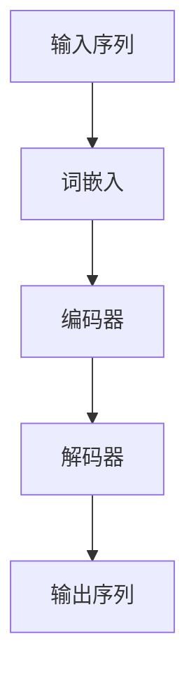

# 大语言模型原理与工程实践：大语言模型训练综述

## 1.背景介绍

大语言模型（Large Language Models, LLMs）近年来在自然语言处理（NLP）领域取得了显著的进展。自从OpenAI发布了GPT系列模型以来，LLMs在文本生成、翻译、问答系统等多个应用场景中展现了强大的能力。本文旨在深入探讨大语言模型的原理、训练方法、实际应用以及未来发展趋势。

## 2.核心概念与联系

### 2.1 语言模型

语言模型是通过统计或机器学习方法来预测文本序列中下一个词的概率分布。传统的语言模型包括n-gram模型和基于马尔可夫链的模型，而现代的语言模型则主要依赖于深度学习技术。

### 2.2 大语言模型

大语言模型是指参数量级达到数十亿甚至上百亿的深度学习模型。它们通常基于Transformer架构，通过大规模数据集进行训练，能够捕捉语言中的复杂模式和语义关系。

### 2.3 Transformer架构

Transformer是由Vaswani等人在2017年提出的一种神经网络架构，主要用于处理序列数据。其核心组件包括自注意力机制（Self-Attention）和前馈神经网络（Feed-Forward Neural Network）。



## 3.核心算法原理具体操作步骤

### 3.1 数据预处理

数据预处理是训练大语言模型的第一步，主要包括文本清洗、分词、词嵌入等步骤。

### 3.2 模型架构设计

选择合适的模型架构是训练大语言模型的关键。Transformer架构由于其并行计算能力和高效的自注意力机制，成为了大语言模型的首选。

### 3.3 模型训练

模型训练包括前向传播、损失计算、反向传播和参数更新。训练过程中需要大量的计算资源和时间。

### 3.4 模型评估

模型评估通常使用困惑度（Perplexity）和BLEU等指标来衡量模型的性能。

## 4.数学模型和公式详细讲解举例说明

### 4.1 自注意力机制

自注意力机制是Transformer的核心组件，其计算公式如下：

$$
\text{Attention}(Q, K, V) = \text{softmax}\left(\frac{QK^T}{\sqrt{d_k}}\right)V
$$

其中，$Q$、$K$、$V$分别表示查询矩阵、键矩阵和值矩阵，$d_k$是键矩阵的维度。

### 4.2 损失函数

大语言模型的损失函数通常采用交叉熵损失：

$$
L = -\sum_{i=1}^{N} y_i \log(\hat{y}_i)
$$

其中，$y_i$是实际标签，$\hat{y}_i$是预测概率。

## 5.项目实践：代码实例和详细解释说明

### 5.1 数据预处理

```python
import nltk
from nltk.tokenize import word_tokenize

# 下载必要的资源
nltk.download('punkt')

# 文本清洗和分词
def preprocess_text(text):
    tokens = word_tokenize(text.lower())
    return tokens

text = "大语言模型在自然语言处理领域取得了显著的进展。"
tokens = preprocess_text(text)
print(tokens)
```

### 5.2 模型训练

```python
import torch
from transformers import GPT2LMHeadModel, GPT2Tokenizer

# 加载预训练模型和分词器
model_name = 'gpt2'
model = GPT2LMHeadModel.from_pretrained(model_name)
tokenizer = GPT2Tokenizer.from_pretrained(model_name)

# 文本编码
input_text = "大语言模型在自然语言处理领域取得了显著的进展。"
input_ids = tokenizer.encode(input_text, return_tensors='pt')

# 模型前向传播
outputs = model(input_ids, labels=input_ids)
loss = outputs.loss
logits = outputs.logits

print(f"Loss: {loss.item()}")
```

## 6.实际应用场景

### 6.1 文本生成

大语言模型可以用于生成高质量的文本内容，如新闻报道、小说等。

### 6.2 机器翻译

通过大规模平行语料库训练，大语言模型在机器翻译任务中表现出色。

### 6.3 问答系统

大语言模型可以用于构建智能问答系统，提供准确的答案。

## 7.工具和资源推荐

### 7.1 开源框架

- TensorFlow
- PyTorch
- Hugging Face Transformers

### 7.2 数据集

- Wikipedia
- Common Crawl
- OpenWebText

## 8.总结：未来发展趋势与挑战

大语言模型在NLP领域展现了巨大的潜力，但也面临着诸多挑战，如计算资源消耗、数据隐私问题等。未来的发展方向可能包括更高效的模型架构、更智能的数据预处理方法以及更广泛的应用场景。

## 9.附录：常见问题与解答

### Q1: 大语言模型需要多少数据进行训练？

大语言模型通常需要数百GB甚至TB级别的数据进行训练。

### Q2: 如何选择合适的模型架构？

选择模型架构需要考虑任务需求、计算资源和数据规模。Transformer架构是目前的主流选择。

### Q3: 如何评估大语言模型的性能？

常用的评估指标包括困惑度（Perplexity）、BLEU等。

---

作者：禅与计算机程序设计艺术 / Zen and the Art of Computer Programming