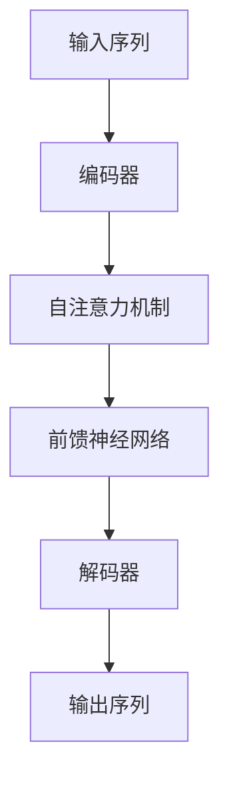

# 大语言模型应用指南：展望

## 1.背景介绍

大语言模型（Large Language Models, LLMs）是近年来人工智能领域的重大突破之一。它们通过深度学习技术，特别是基于变换器（Transformer）架构的模型，能够在自然语言处理（NLP）任务中表现出色。大语言模型的应用范围广泛，从文本生成、翻译、问答系统到代码生成等，几乎涵盖了所有需要语言理解和生成的领域。

### 1.1 大语言模型的发展历程

大语言模型的发展可以追溯到早期的统计语言模型和神经网络语言模型。随着计算能力和数据量的增加，研究人员逐渐转向更复杂的模型架构，如LSTM和GRU。然而，真正的突破来自于2017年提出的Transformer架构，它解决了传统RNN模型在处理长序列时的效率问题。

### 1.2 主要的语言模型

目前，最著名的大语言模型包括OpenAI的GPT系列、Google的BERT和T5、Facebook的RoBERTa等。这些模型在不同的NLP任务中都取得了显著的成果，并且不断推动着技术的前沿。

### 1.3 大语言模型的影响

大语言模型不仅在学术界引起了广泛关注，也在工业界得到了广泛应用。它们在提高生产力、自动化任务和增强用户体验方面发挥了重要作用。然而，随着应用的深入，也带来了诸如伦理、隐私和偏见等问题。

## 2.核心概念与联系

为了更好地理解大语言模型的应用，我们需要先掌握一些核心概念和它们之间的联系。

### 2.1 变换器（Transformer）架构

变换器架构是大语言模型的基础。它通过自注意力机制（Self-Attention）和多头注意力机制（Multi-Head Attention）来捕捉序列中的长距离依赖关系。其核心组件包括编码器（Encoder）和解码器（Decoder）。



### 2.2 自注意力机制

自注意力机制允许模型在处理每个词时都能关注到序列中的其他词，从而捕捉到全局信息。其计算公式为：

$$
\text{Attention}(Q, K, V) = \text{softmax}\left(\frac{QK^T}{\sqrt{d_k}}\right)V
$$

其中，$Q$、$K$、$V$分别表示查询、键和值矩阵，$d_k$是键的维度。

### 2.3 预训练和微调

大语言模型通常采用预训练和微调的策略。预训练阶段，模型在大规模无监督数据上进行训练，以学习通用的语言表示。微调阶段，模型在特定任务的有监督数据上进行训练，以适应具体的应用场景。

## 3.核心算法原理具体操作步骤

大语言模型的核心算法主要包括预训练和微调两个阶段。以下是具体的操作步骤。

### 3.1 数据准备

在预训练阶段，需要收集大规模的文本数据。这些数据可以来自互联网、书籍、新闻等多种来源。数据需要进行清洗和预处理，以确保质量。

### 3.2 模型初始化

模型的参数通常采用随机初始化或基于已有模型的参数进行初始化。常见的初始化方法包括Xavier初始化和He初始化。

### 3.3 预训练

预训练阶段，模型在大规模无监督数据上进行训练。常见的预训练任务包括语言模型任务（如GPT的自回归语言模型）和掩码语言模型任务（如BERT的掩码语言模型）。

### 3.4 微调

微调阶段，模型在特定任务的有监督数据上进行训练。常见的微调任务包括文本分类、问答系统、文本生成等。

### 3.5 模型评估

模型的性能需要通过一系列评估指标进行评估。常见的评估指标包括准确率、精确率、召回率、F1分数等。

## 4.数学模型和公式详细讲解举例说明

大语言模型的核心在于其数学模型和公式。以下是一些关键的数学概念和公式。

### 4.1 变换器的自注意力机制

自注意力机制的计算公式为：

$$
\text{Attention}(Q, K, V) = \text{softmax}\left(\frac{QK^T}{\sqrt{d_k}}\right)V
$$

其中，$Q$、$K$、$V$分别表示查询、键和值矩阵，$d_k$是键的维度。

### 4.2 多头注意力机制

多头注意力机制通过并行计算多个自注意力机制来捕捉不同的特征表示。其计算公式为：

$$
\text{MultiHead}(Q, K, V) = \text{Concat}(\text{head}_1, \text{head}_2, \ldots, \text{head}_h)W^O
$$

其中，$\text{head}_i = \text{Attention}(QW_i^Q, KW_i^K, VW_i^V)$，$W_i^Q$、$W_i^K$、$W_i^V$和$W^O$是可训练的权重矩阵。

### 4.3 前馈神经网络

变换器中的前馈神经网络由两个线性变换和一个激活函数组成。其计算公式为：

$$
\text{FFN}(x) = \text{ReLU}(xW_1 + b_1)W_2 + b_2
$$

其中，$W_1$、$W_2$、$b_1$和$b_2$是可训练的权重和偏置。

## 5.项目实践：代码实例和详细解释说明

为了更好地理解大语言模型的应用，我们可以通过一个具体的代码实例来进行实践。以下是一个基于PyTorch实现的简单大语言模型。

### 5.1 环境准备

首先，我们需要安装必要的库：

```bash
pip install torch transformers
```

### 5.2 数据准备

我们使用Hugging Face的`datasets`库来加载数据集：

```python
from datasets import load_dataset

dataset = load_dataset('wikitext', 'wikitext-2-raw-v1')
```

### 5.3 模型定义

我们使用Hugging Face的`transformers`库来定义模型：

```python
from transformers import GPT2LMHeadModel, GPT2Tokenizer

tokenizer = GPT2Tokenizer.from_pretrained('gpt2')
model = GPT2LMHeadModel.from_pretrained('gpt2')
```

### 5.4 训练模型

我们定义训练函数并进行训练：

```python
import torch
from torch.utils.data import DataLoader

def train(model, dataset, tokenizer, epochs=1, batch_size=8):
    model.train()
    dataloader = DataLoader(dataset, batch_size=batch_size, shuffle=True)
    optimizer = torch.optim.AdamW(model.parameters(), lr=5e-5)
    
    for epoch in range(epochs):
        for batch in dataloader:
            inputs = tokenizer(batch['text'], return_tensors='pt', padding=True, truncation=True)
            outputs = model(**inputs, labels=inputs['input_ids'])
            loss = outputs.loss
            loss.backward()
            optimizer.step()
            optimizer.zero_grad()
        print(f'Epoch {epoch+1}, Loss: {loss.item()}')

train(model, dataset['train'], tokenizer)
```

### 5.5 模型评估

我们定义评估函数并进行评估：

```python
def evaluate(model, dataset, tokenizer):
    model.eval()
    dataloader = DataLoader(dataset, batch_size=8, shuffle=False)
    total_loss = 0
    
    with torch.no_grad():
        for batch in dataloader:
            inputs = tokenizer(batch['text'], return_tensors='pt', padding=True, truncation=True)
            outputs = model(**inputs, labels=inputs['input_ids'])
            loss = outputs.loss
            total_loss += loss.item()
    
    avg_loss = total_loss / len(dataloader)
    print(f'Average Loss: {avg_loss}')

evaluate(model, dataset['validation'], tokenizer)
```

## 6.实际应用场景

大语言模型在实际中有广泛的应用场景。以下是一些典型的应用场景。

### 6.1 文本生成

大语言模型可以用于生成高质量的文本内容，如新闻报道、小说、技术文档等。它们能够根据给定的上下文生成连贯且有意义的文本。

### 6.2 机器翻译

大语言模型在机器翻译任务中表现出色。它们能够将一种语言的文本翻译成另一种语言，并且在翻译质量上接近甚至超过了传统的统计机器翻译方法。

### 6.3 问答系统

大语言模型可以用于构建智能问答系统。它们能够理解用户的问题并生成准确的答案，广泛应用于客服、教育等领域。

### 6.4 代码生成

大语言模型还可以用于生成代码。它们能够根据自然语言描述生成相应的代码，实现自动化编程，提高开发效率。

## 7.工具和资源推荐

在使用大语言模型时，有许多工具和资源可以帮助我们更好地进行开发和研究。以下是一些推荐的工具和资源。

### 7.1 开发工具

- **Hugging Face Transformers**：一个强大的NLP库，提供了许多预训练的大语言模型和便捷的API。
- **PyTorch**：一个流行的深度学习框架，支持动态计算图和自动微分。
- **TensorFlow**：另一个流行的深度学习框架，广泛应用于工业界和学术界。

### 7.2 数据集

- **Wikitext**：一个大规模的维基百科文本数据集，常用于语言模型的预训练。
- **GLUE**：一个通用的语言理解评估基准，包含多个NLP任务的数据集。
- **SQuAD**：一个问答系统的数据集，广泛用于评估问答模型的性能。

### 7.3 学术资源

- **arXiv**：一个开放的学术论文预印本平台，包含大量关于大语言模型的最新研究成果。
- **ACL Anthology**：一个NLP领域的学术论文库，收录了许多顶级会议和期刊的论文。

## 8.总结：未来发展趋势与挑战

大语言模型在过去几年中取得了显著的进展，但仍然面临许多挑战和未来的发展方向。

### 8.1 未来发展趋势

- **模型规模和性能**：随着计算能力的提升和数据量的增加，大语言模型的规模和性能将继续提升。
- **多模态学习**：未来的大语言模型将不仅限于文本，还将结合图像、音频等多种模态，实现更全面的理解和生成。
- **个性化和定制化**：大语言模型将更加注重个性化和定制化，以满足不同用户和应用场景的需求。

### 8.2 挑战

- **伦理和隐私**：大语言模型在生成内容时可能会涉及伦理和隐私问题，需要制定相应的规范和措施。
- **偏见和公平性**：大语言模型可能会在训练数据中学习到偏见，影响其公平性和公正性，需要进行有效的偏见检测和消除。
- **计算资源和能耗**：大语言模型的训练和推理需要大量的计算资源和能耗，需要寻找更加高效的算法和硬件解决方案。

## 9.附录：常见问题与解答

### 9.1 大语言模型的训练需要多长时间？

大语言模型的训练时间取决于模型的规模、数据量和计算资源。一般来说，训练一个大型语言模型可能需要数周甚至数月的时间。

### 9.2 如何选择合适的大语言模型？

选择大语言模型时需要考虑具体的应用场景和需求。可以根据模型的性能、规模和资源消耗等因素进行综合评估。

### 9.3 大语言模型是否可以用于实时应用？

大语言模型的推理速度较慢，可能不适用于实时应用。然而，通过模型压缩和加速技术，可以提高其推理速度，使其适用于某些实时应用场景。

### 9.4 如何处理大语言模型中的偏见问题？

处理偏见问题需要从数据、模型和评估等多个方面入手。可以通过数据清洗、偏见检测和消除、模型公平性评估等方法来减少偏见的影响。

### 9.5 大语言模型的未来发展方向是什么？

大语言模型的未来发展方向包括模型规模和性能的提升、多模态学习、个性化和定制化等。同时，还需要解决伦理、隐私、偏见和能耗等挑战。

---

作者：禅与计算机程序设计艺术 / Zen and the Art of Computer Programming