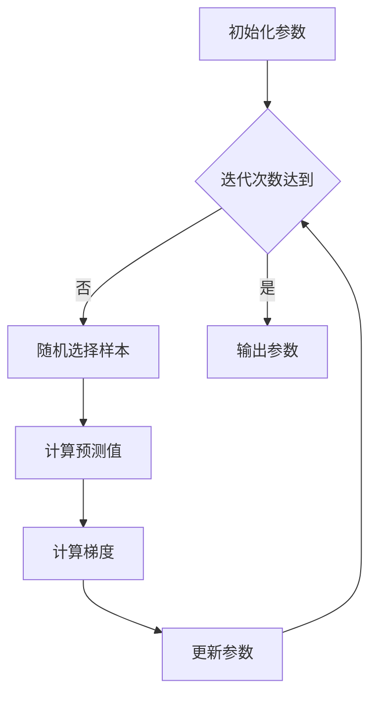

# 实现简单线性回归中的SGD：从理论到代码

## 1. 背景介绍
### 1.1 线性回归概述
线性回归是机器学习和统计学中最基础和广泛应用的算法之一。它旨在建立自变量和因变量之间的线性关系,通过拟合一条直线来最小化预测值和实际值之间的误差。线性回归在许多领域都有应用,如经济学、社会学、生物学等。

### 1.2 梯度下降算法
梯度下降(Gradient Descent, GD)是一种优化算法,通过迭代的方式寻找目标函数的最小值。在机器学习中,损失函数通常作为目标函数。GD通过计算损失函数对参数的梯度,并沿梯度的反方向更新参数,逐步逼近最优解。

### 1.3 随机梯度下降
随机梯度下降(Stochastic Gradient Descent, SGD)是GD的一个变种。与普通GD使用全部训练样本计算梯度不同,SGD每次迭代只使用一个样本来计算梯度并更新参数。SGD因其高效性和易于实现而广受欢迎。

## 2. 核心概念与联系
### 2.1 线性回归的数学表示
假设有 $n$ 个样本 $(x_i, y_i), i=1,2,...,n$,其中 $x_i$ 为第 $i$ 个样本的特征向量, $y_i$ 为相应的目标值。线性回归的目标是找到一个线性函数:

$$\hat{y} = w^Tx + b$$

其中 $w$ 为权重向量, $b$ 为偏置项, $\hat{y}$ 为预测值。我们希望找到最优的 $w$ 和 $b$,使预测值 $\hat{y}$ 尽可能接近真实值 $y$。

### 2.2 损失函数
为了衡量预测值与真实值的差异,引入损失函数。常用的损失函数是均方误差(Mean Squared Error, MSE):

$$J(w,b) = \frac{1}{2n}\sum_{i=1}^n(\hat{y}_i - y_i)^2$$

其中 $\hat{y}_i$ 是第 $i$ 个样本的预测值。我们的目标是最小化损失函数 $J(w,b)$。

### 2.3 SGD与线性回归的结合
SGD可用于优化线性回归的损失函数。每次迭代,随机选择一个样本 $(x_i, y_i)$,计算该样本的预测值 $\hat{y}_i$ 和损失 $J_i(w,b)$,然后根据梯度更新参数:

$$w := w - \alpha \frac{\partial J_i}{\partial w}$$
$$b := b - \alpha \frac{\partial J_i}{\partial b}$$

其中 $\alpha$ 是学习率,控制每次更新的步长。

## 3. 核心算法原理具体操作步骤
SGD在线性回归中的具体步骤如下:

1. 初始化权重向量 $w$ 和偏置项 $b$ 为0或随机小值。
2. 设置学习率 $\alpha$ 和迭代次数 $n_{\text{iter}}$。
3. 对于 $t=1,2,...,n_{\text{iter}}$:
   1. 随机选择一个样本 $(x_i, y_i)$。
   2. 计算该样本的预测值: $\hat{y}_i = w^Tx_i + b$。
   3. 计算损失函数的梯度:
      $\frac{\partial J_i}{\partial w} = (\hat{y}_i - y_i)x_i$
      $\frac{\partial J_i}{\partial b} = \hat{y}_i - y_i$
   4. 更新参数:
      $w := w - \alpha \frac{\partial J_i}{\partial w}$
      $b := b - \alpha \frac{\partial J_i}{\partial b}$
4. 输出最终的 $w$ 和 $b$。

算法流程图如下:



## 4. 数学模型和公式详细讲解举例说明
### 4.1 预测函数
对于第 $i$ 个样本 $(x_i, y_i)$,线性回归的预测函数为:

$$\hat{y}_i = w^Tx_i + b = w_1x_{i1} + w_2x_{i2} + ... + w_dx_{id} + b$$

其中 $d$ 是特征的维度。

例如,考虑一个两个特征的样本 $x_i = (2, 3)^T$,权重 $w = (1, 2)^T$,偏置 $b = 1$,则预测值为:

$$\hat{y}_i = 1 \cdot 2 + 2 \cdot 3 + 1 = 9$$

### 4.2 损失函数的梯度
对于第 $i$ 个样本,损失函数为:

$$J_i(w,b) = \frac{1}{2}(\hat{y}_i - y_i)^2$$

其梯度为:

$$\frac{\partial J_i}{\partial w_j} = (\hat{y}_i - y_i)x_{ij}, \quad j=1,2,...,d$$
$$\frac{\partial J_i}{\partial b} = \hat{y}_i - y_i$$

例如,假设真实值 $y_i = 7$,则损失函数的值为:

$$J_i(w,b) = \frac{1}{2}(9 - 7)^2 = 2$$

梯度为:

$$\frac{\partial J_i}{\partial w_1} = (9 - 7) \cdot 2 = 4$$
$$\frac{\partial J_i}{\partial w_2} = (9 - 7) \cdot 3 = 6$$
$$\frac{\partial J_i}{\partial b} = 9 - 7 = 2$$

### 4.3 参数更新
假设学习率 $\alpha = 0.01$,则参数更新为:

$$w_1 := 1 - 0.01 \cdot 4 = 0.96$$
$$w_2 := 2 - 0.01 \cdot 6 = 1.94$$
$$b := 1 - 0.01 \cdot 2 = 0.98$$

## 5. 项目实践：代码实例和详细解释说明
下面是使用Python实现简单线性回归的SGD:

```python
import numpy as np

class SGDRegressor:
    def __init__(self, learning_rate=0.01, n_iter=100):
        self.lr = learning_rate
        self.n_iter = n_iter
        self.w = None
        self.b = None

    def fit(self, X, y):
        n_samples, n_features = X.shape
        self.w = np.zeros(n_features)
        self.b = 0

        for _ in range(self.n_iter):
            idx = np.random.randint(n_samples)
            x_i = X[idx]
            y_i = y[idx]

            y_pred = np.dot(x_i, self.w) + self.b
            error = y_pred - y_i

            self.w -= self.lr * error * x_i
            self.b -= self.lr * error

    def predict(self, X):
        return np.dot(X, self.w) + self.b
```

代码解释:

- `__init__`方法初始化学习率和迭代次数,并将权重和偏置初始化为None。
- `fit`方法接收训练数据 `X` 和目标值 `y`,初始化权重和偏置为0,然后进行 `n_iter` 次迭代:
  - 随机选择一个样本。
  - 计算该样本的预测值。
  - 计算预测值与真实值的差。
  - 根据梯度更新权重和偏置。
- `predict`方法对新的数据进行预测。

使用示例:

```python
from sklearn.datasets import make_regression
from sklearn.model_selection import train_test_split

X, y = make_regression(n_samples=100, n_features=1, noise=20, random_state=42)
X_train, X_test, y_train, y_test = train_test_split(X, y, test_size=0.2, random_state=42)

regressor = SGDRegressor(learning_rate=0.01, n_iter=100)
regressor.fit(X_train, y_train)

y_pred = regressor.predict(X_test)
mse = np.mean((y_pred - y_test)**2)
print(f"Mean Squared Error: {mse:.2f}")
```

## 6. 实际应用场景
SGD在线性回归中的应用场景包括:

- 在线学习:当数据流不断到来时,SGD可以高效地更新模型。
- 大规模数据:对于大规模数据,使用普通GD可能会非常耗时,而SGD可以显著加快训练速度。
- 特征工程:SGD对不同的特征组合和转换的探索非常高效。

## 7. 工具和资源推荐
- scikit-learn: Python机器学习库,提供了SGDRegressor类。
- TensorFlow和PyTorch:流行的深度学习框架,支持使用SGD优化线性模型。
- Coursera的机器学习课程:Andrew Ng教授的课程对梯度下降有深入浅出的讲解。

## 8. 总结：未来发展趋势与挑战
SGD在线性回归中的优势在于其简单、高效,尤其适用于大规模数据。未来,SGD有望与其他技术相结合,如正则化、特征选择等,以进一步提高性能。

然而,SGD也面临一些挑战:
- 学习率的选择:不同的学习率会导致不同的收敛速度和解的质量。
- 鞍点问题:SGD可能会陷入鞍点,导致收敛速度变慢。
- 噪声数据:SGD对噪声数据比较敏感,可能导致收敛到次优解。

## 9. 附录：常见问题与解答
### 9.1 SGD的收敛速度如何?
SGD的收敛速度通常比普通GD快,但也取决于学习率的选择。合适的学习率可以加快收敛,而过大或过小的学习率都会减慢收敛。

### 9.2 SGD容易陷入局部最优吗?
与普通GD相比,SGD更容易逃离局部最优,因为它每次只使用一个样本,引入了一定的随机性。但SGD也可能陷入鞍点,导致收敛变慢。

### 9.3 如何选择学习率?
学习率的选择需要根据具体问题和数据集进行调整。常见的方法有:
- 网格搜索:尝试不同的学习率,选择性能最好的。
- 学习率衰减:随着迭代次数增加,逐渐减小学习率。
- 自适应学习率:根据梯度自动调整学习率,如AdaGrad、RMSprop等。

作者：禅与计算机程序设计艺术 / Zen and the Art of Computer Programming