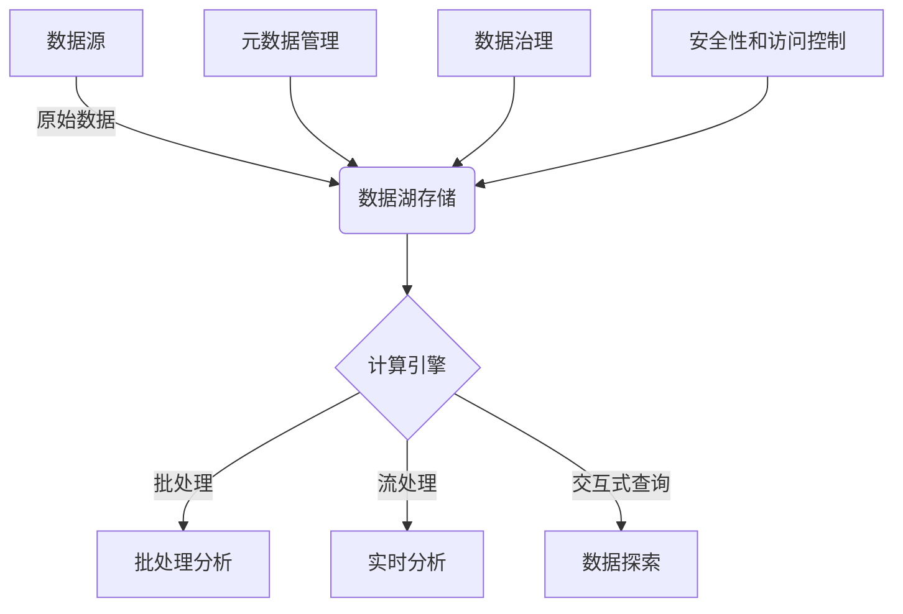
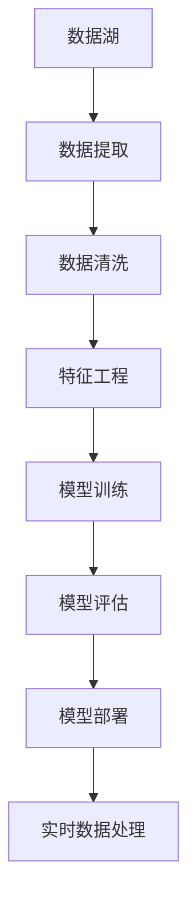

这是一篇关于数据湖赋能数据科学应用的技术博客文章。

# 数据湖赋能数据科学应用

## 1.背景介绍

### 1.1 数据科学的兴起

随着大数据时代的到来,数据科学(Data Science)作为一门新兴的跨学科领域逐渐兴起并得到广泛关注。数据科学融合了多个学科的理论与实践,包括数学、统计学、信息科学、计算机科学等,旨在从海量的结构化和非结构化数据中提取有价值的见解和知识,为企业或组织的决策提供数据驱动的分析支持。

### 1.2 数据湖的概念

为了满足数据科学对于存储和处理各种格式数据的需求,数据湖(Data Lake)应运而生。数据湖是一种新型的大数据存储和处理架构,它允许以低成本方式存储任意格式的原始数据,并支持各种分析工作负载,如数据探索、机器学习、实时分析等。相比于传统的数据仓库,数据湖具有更高的灵活性和可扩展性,能够存储和处理结构化、半结构化和非结构化数据。

### 1.3 数据湖与数据科学的关系

数据湖为数据科学应用提供了一个统一的数据平台,使数据科学家能够轻松访问和处理各种格式的数据源。通过数据湖,数据科学家可以快速获取所需的数据,进行数据探索、特征工程、模型构建和模型部署等工作,从而加速数据科学项目的开发周期。同时,数据湖还支持数据治理和元数据管理,确保数据的可追溯性和一致性。

## 2.核心概念与联系

### 2.1 数据湖架构

数据湖通常采用分布式存储系统,如Apache Hadoop的HDFS或对象存储服务,用于存储各种格式的原始数据。数据湖还包括计算引擎(如Apache Spark)用于数据处理和分析。此外,数据湖架构还包括元数据管理、数据治理、安全性和访问控制等组件。



### 2.2 数据处理范式

在数据湖中,通常采用以下几种数据处理范式:

1. **批处理**:批量处理大规模数据集,适用于离线分析场景。
2. **流处理**:实时处理持续到来的数据流,适用于实时分析场景。
3. **交互式查询**:对存储在数据湖中的数据进行ad-hoc查询和探索性分析。

### 2.3 数据湖与数据仓库的区别

数据湖和传统的数据仓库有以下几个主要区别:

1. **数据格式**:数据湖支持存储各种格式的原始数据,而数据仓库主要存储结构化数据。
2. **数据处理**:数据湖支持批处理、流处理和交互式查询等多种处理范式,而数据仓库主要用于批处理和OLAP分析。
3. **数据模型**:数据湖采用schema-on-read模式,而数据仓库采用schema-on-write模式。
4. **成本**:数据湖利用廉价的分布式存储,成本较低,而数据仓库需要昂贵的专用存储设备。

### 2.4 数据湖与数据科学的协同

数据湖为数据科学应用提供了一个统一的数据平台,使数据科学家能够轻松访问和处理各种格式的数据源。通过数据湖,数据科学家可以快速获取所需的数据,进行数据探索、特征工程、模型构建和模型部署等工作,从而加速数据科学项目的开发周期。同时,数据湖还支持数据治理和元数据管理,确保数据的可追溯性和一致性。

## 3.核心算法原理具体操作步骤

### 3.1 数据摄取

数据摄取是将各种数据源中的数据导入到数据湖中的过程。常见的数据摄取方式包括:

1. **批量摄取**:定期从数据源批量导入数据,适用于离线数据处理场景。
2. **流式摄取**:实时从数据源摄取数据流,适用于实时数据处理场景。
3. **变更数据捕获(CDC)**:捕获数据源中的增量变更数据,用于维护数据湖中的数据一致性。

数据摄取过程中,还需要考虑数据格式转换、数据压缩、数据分区等问题,以优化数据存储和查询性能。

### 3.2 数据存储

数据湖通常采用分布式存储系统,如Apache Hadoop的HDFS或对象存储服务,用于存储各种格式的原始数据。常见的数据存储格式包括:

1. **行式存储**:如Parquet、ORC等列式存储格式,适用于批处理分析场景。
2. **列式存储**:如HBase、Cassandra等宽表存储格式,适用于实时查询场景。
3. **对象存储**:如Amazon S3、Azure Blob Storage等对象存储服务,适用于存储非结构化数据。

在选择数据存储格式时,需要考虑数据格式、查询模式、压缩比率等因素,以平衡存储空间和查询性能。

### 3.3 数据处理

在数据湖中,常见的数据处理范式包括:

1. **批处理**:使用Apache Spark、Hive等框架进行批量数据处理,适用于离线分析场景。
2. **流处理**:使用Apache Spark Streaming、Apache Flink等流处理框架进行实时数据处理,适用于实时分析场景。
3. **交互式查询**:使用Apache Spark SQL、Presto等查询引擎进行ad-hoc数据探索和分析。

数据处理过程中,还需要考虑数据清洗、数据转换、特征工程等步骤,以确保数据质量和模型性能。

### 3.4 数据治理和元数据管理

数据治理和元数据管理是数据湖架构中的重要组成部分,用于确保数据的可追溯性、一致性和安全性。常见的数据治理和元数据管理实践包括:

1. **数据线程**:跟踪数据在整个生命周期中的流转路径,确保数据的可追溯性。
2. **数据质量管理**:定义和监控数据质量指标,确保数据的准确性和完整性。
3. **元数据管理**:收集和管理数据的元数据信息,如数据源、数据格式、数据字典等,方便数据发现和理解。
4. **访问控制**:实施基于角色的访问控制(RBAC)和数据掩码等安全措施,保护敏感数据。

## 4.数学模型和公式详细讲解举例说明

在数据科学应用中,常见的数学模型和算法包括:

### 4.1 线性回归

线性回归是一种常用的监督学习算法,用于建立自变量和因变量之间的线性关系模型。线性回归模型的数学表达式如下:

$$y = \beta_0 + \beta_1x_1 + \beta_2x_2 + ... + \beta_nx_n + \epsilon$$

其中:
- $y$是因变量
- $x_1, x_2, ..., x_n$是自变量
- $\beta_0$是常数项
- $\beta_1, \beta_2, ..., \beta_n$是各自变量的系数
- $\epsilon$是随机误差项

线性回归模型的训练过程是通过最小二乘法估计系数$\beta$,使残差平方和最小化:

$$\min_{\beta} \sum_{i=1}^{m}(y_i - ({\beta_0 + \beta_1x_{i1} + \beta_2x_{i2} + ... + \beta_nx_{in}}))^2$$

其中$m$是样本数量。

### 4.2 逻辑回归

逻辑回归是一种用于分类问题的监督学习算法。二元逻辑回归模型的数学表达式如下:

$$\log\left(\frac{p}{1-p}\right) = \beta_0 + \beta_1x_1 + \beta_2x_2 + ... + \beta_nx_n$$

其中:
- $p$是样本属于正类的概率
- $x_1, x_2, ..., x_n$是自变量
- $\beta_0$是常数项
- $\beta_1, \beta_2, ..., \beta_n$是各自变量的系数

通过对数几率(log odds)的线性组合,我们可以得到$p$的估计值:

$$p = \frac{e^{\beta_0 + \beta_1x_1 + \beta_2x_2 + ... + \beta_nx_n}}{1 + e^{\beta_0 + \beta_1x_1 + \beta_2x_2 + ... + \beta_nx_n}}$$

逻辑回归模型的训练过程是通过最大似然估计法估计系数$\beta$,使样本的联合概率最大化。

### 4.3 决策树

决策树是一种常用的监督学习算法,可用于分类和回归问题。决策树通过递归地对特征空间进行分割,构建一棵树状结构模型。

决策树的构建过程可以使用信息增益或基尼系数作为特征选择的准则。对于分类问题,信息增益定义为:

$$\text{Gain}(D, a) = \text{Entropy}(D) - \sum_{v=1}^{V}\frac{|D^v|}{|D|}\text{Entropy}(D^v)$$

其中:
- $D$是当前数据集
- $a$是特征
- $V$是特征$a$的取值集合
- $D^v$是在特征$a$取值为$v$的子集
- $\text{Entropy}(D)$是数据集$D$的信息熵,定义为$\text{Entropy}(D) = -\sum_{i=1}^{c}p_i\log_2p_i$,其中$c$是类别数,而$p_i$是第$i$类的概率

对于回归问题,可以使用均方差作为特征选择的准则。

决策树模型的优点是可解释性强,缺点是容易过拟合。通常需要对决策树进行剪枝,以提高其泛化能力。

### 4.4 支持向量机

支持向量机(SVM)是一种常用的监督学习算法,可用于分类和回归问题。SVM的基本思想是在高维特征空间中构建一个超平面,将不同类别的样本分开,同时使得超平面到最近样本点的距离(即间隔)最大化。

对于线性可分的二分类问题,SVM的目标是求解以下优化问题:

$$\begin{aligned}
&\min_{\mathbf{w},b} \frac{1}{2}\|\mathbf{w}\|^2\\
&\text{s.t. } y_i(\mathbf{w}^T\mathbf{x}_i + b) \geq 1, i=1,2,...,m
\end{aligned}$$

其中:
- $\mathbf{w}$是超平面的法向量
- $b$是超平面的偏移量
- $\mathbf{x}_i$是第$i$个样本的特征向量
- $y_i \in \{-1, 1\}$是第$i$个样本的类别标记
- $m$是样本数量

对于线性不可分的情况,可以引入松弛变量,将优化问题转化为软间隔最大化问题。

对于非线性问题,SVM通过核技巧将原始特征映射到高维特征空间,使得在高维空间中线性可分。常用的核函数包括线性核、多项式核和高斯核等。

SVM的优点是泛化能力强,缺点是对大规模数据的训练效率较低。

这些只是数据科学中常见的几种数学模型和算法,在实际应用中还有许多其他模型和算法,如聚类算法、降维算法、ensemble算法等。数据科学家需要根据具体的问题和数据特点,选择合适的模型和算法。

## 5.项目实践:代码实例和详细解释说明

在本节中,我们将通过一个实际项目案例,演示如何利用数据湖构建一个端到端的数据科学应用。我们将使用Python和Apache Spark进行数据处理和建模。

### 5.1 项目概述

假设我们是一家电子商务公司,需要构建一个推荐系统,为用户推## 5.项目实践:代码实例和详细解释说明

在本节中,我们将通过一个实际项目案例,演示如何利用数据湖构建一个端到端的数据科学应用。我们将使用Python和Apache Spark进行数据处理和建模。

### 5.1 项目概述

假设我们是一家电子商务公司,需要构建一个推荐系统,为用户推荐可能感兴趣的商品。数据湖将作为我们的数据存储和处理平台,我们将从数据湖中提取用户行为数据,进行数据清洗和特征工程,最终构建和评估推荐模型。

### 5.2 数据准备

首先,我们需要从数据湖中提取数据。假设我们的数据湖中存储了用户的浏览记录、购买记录和商品信息。我们可以使用Apache Spark来加载和处理这些数据。

```python
from pyspark.sql import SparkSession

# 初始化SparkSession
spark = SparkSession.builder \
    .appName("E-commerce Recommendation System") \
    .getOrCreate()

# 加载用户浏览记录数据
user_views = spark.read.format("parquet").load("s3://datalake/user_views/")

# 加载用户购买记录数据
user_purchases = spark.read.format("parquet").load("s3://datalake/user_purchases/")

# 加载商品信息数据
products = spark.read.format("parquet").load("s3://datalake/products/")
```

### 5.3 数据清洗

在加载数据后,我们需要对数据进行清洗和预处理。例如,我们需要去除缺失值、重复记录等。

```python
# 去除缺失值
user_views = user_views.dropna()
user_purchases = user_purchases.dropna()
products = products.dropna()

# 去除重复记录
user_views = user_views.dropDuplicates()
user_purchases = user_purchases.dropDuplicates()
products = products.dropDuplicates()
```

### 5.4 特征工程

接下来,我们需要进行特征工程,将原始数据转换为适合模型训练的特征。例如,我们可以计算每个用户的浏览次数、购买次数等。

```python
from pyspark.sql.functions import col, count

# 计算每个用户的浏览次数
user_view_counts = user_views.groupBy("user_id").agg(count("product_id").alias("view_count"))

# 计算每个用户的购买次数
user_purchase_counts = user_purchases.groupBy("user_id").agg(count("product_id").alias("purchase_count"))

# 合并特征
user_features = user_view_counts.join(user_purchase_counts, "user_id")
```

### 5.5 模型训练

在完成特征工程后,我们可以使用这些特征来训练推荐模型。这里我们使用协同过滤算法来构建推荐模型。

```python
from pyspark.ml.recommendation import ALS

# 初始化ALS模型
als = ALS(userCol="user_id", itemCol="product_id", ratingCol="purchase_count", coldStartStrategy="drop")

# 训练模型
model = als.fit(user_features)

# 生成推荐结果
recommendations = model.recommendForAllUsers(10)
```

### 5.6 模型评估

最后,我们需要评估模型的性能。这里我们使用均方根误差(RMSE)作为评估指标。

```python
from pyspark.ml.evaluation import RegressionEvaluator

# 生成预测结果
predictions = model.transform(user_features)

# 初始化评估器
evaluator = RegressionEvaluator(metricName="rmse", labelCol="purchase_count", predictionCol="prediction")

# 计算RMSE
rmse = evaluator.evaluate(predictions)
print(f"Root-mean-square error = {rmse}")
```

### 5.7 模型部署

在评估模型后,我们可以将模型部署到生产环境,为用户提供实时的推荐服务。我们可以使用Spark Streaming来处理实时数据流,并生成实时推荐结果。

```python
from pyspark.streaming import StreamingContext

# 初始化StreamingContext
ssc = StreamingContext(spark.sparkContext, 1)

# 模拟实时数据流
user_stream = ssc.socketTextStream("localhost", 9999)

# 处理实时数据流
def process_stream(rdd):
    if not rdd.isEmpty():
        user_data = spark.read.json(rdd)
        user_features = user_data.join(products, "product_id")
        recommendations = model.transform(user_features)
        recommendations.show()

user_stream.foreachRDD(process_stream)

# 启动流处理
ssc.start()
ssc.awaitTermination()
```

通过以上步骤,我们完成了一个端到端的数据科学应用,从数据湖中提取数据,进行数据清洗和特征工程,训练和评估推荐模型,并将模型部署到生产环境。

## 6.实际应用场景

数据湖在许多实际应用场景中都能发挥重要作用。以下是几个典型的应用场景:

### 6.1 电子商务

在电子商务领域,数据湖可以存储大量的用户行为数据和商品信息,通过数据湖进行数据分析和建模,可以构建推荐系统、用户画像、销售预测等应用。

### 6.2 金融服务

在金融服务领域,数据湖可以存储交易数据、用户行为数据、市场数据等,通过数据湖进行数据分析和建模,可以构建风险控制、欺诈检测、客户细分等应用。

### 6.3 医疗健康

在医疗健康领域,数据湖可以存储患者数据、医疗记录、基因数据等,通过数据湖进行数据分析和建模,可以构建疾病预测、个性化医疗、药物研发等应用。

### 6.4 物联网

在物联网领域,数据湖可以存储传感器数据、设备数据、网络数据等,通过数据湖进行数据分析和建模,可以构建设备监控、故障预测、智能家居等应用。

## 7.工具和资源推荐

在构建数据湖和数据科学应用过程中,以下工具和资源可以为你提供帮助:

### 7.1 Apache Hadoop

Apache Hadoop是一个开源的分布式计算框架,可以用于构建数据湖,支持大规模数据存储和处理。

### 7.2 Apache Spark

Apache Spark是一个开源的分布式计算框架,可以用于大规模数据处理和分析,支持批处理和流处理。

### 7.3 AWS S3

AWS S3是亚马逊提供的云存储服务,可以用于存储和管理数据湖中的数据,支持高可用性和高扩展性。

### 7.4 Databricks

Databricks是一个基于Apache Spark的云平台,提供了数据工程、数据科学和机器学习的集成环境,可以用于构建和管理数据湖和数据科学应用。

### 7.5 Jupyter Notebook

Jupyter Notebook是一个开源的交互式计算环境,可以用于数据分析和建模,支持Python、R等多种编程语言。

## 8.总结:未来发展趋势与挑战

数据湖作为一种新型的数据存储和管理方式,在数据科学应用中具有重要的作用。随着数据量的不断增加和数据类型的不断丰富,数据湖在未来的发展中将面临以下几个趋势和挑战:

### 8.1 趋势

1. **多云和混合云架构**: 随着云计算的普及,多云和混合云架构将成为数据湖的主流部署方式,可以提高数据的可用性和灵活性。

2. **实时数据处理**: 随着物联网和实时应用的兴起,实时数据处理将成为数据湖的重要需求,需要支持流数据的存储和处理。

3. **智能数据管理**: 随着人工智能和机器学习的发展,智能数据管理将成为数据湖的重要方向,可以提高数据的质量和价值。

### 8.2 挑战

1. **数据安全和隐私**: 随着数据量的增加和数据类型的丰富,数据安全和隐私将成为数据湖面临的重要挑战,需要加强数据的保护和管理。

2. **数据治理和合规**: 随着数据法规和合规要求的增加,数据治理和合规将成为数据湖面临的重要挑战,需要建立完善的数据治理体系。

3. **数据集成和互操作**: 随着数据来源的多样化和数据类型的丰富,数据集成和互操作将成为数据湖面临的重要挑战,需要支持多种数据格式和数据源的集成。

## 9.附录:常见问题与解答

### 9.1 数据湖和数据仓库的区别是什么?

数据湖和数据仓库都是用于存储和管理数据的系统,但它们有以下几个区别:

- 数据湖可以存储结构化、半结构化和非结构化数据,而数据仓库主要存储结构化数据。
- 数据湖可以存储原始数据,而数据仓库通常存储经过清洗和处理的数据。
- 数据湖具有较高的扩展性和灵活性,而数据仓库通常具有较高的查询性能和一致性。

### 9.2 如何选择合适的数据湖技术?

选择合适的数据湖技术需要考虑以下几个因素:

- 数据量和类型: 根据数据量和数据类型选择合适的数据湖技术。例如,如果需要存储和处理大规模的结构化和非结构化数据,可以选择Apache Hadoop或AWS S3。

- 数据处理需求: 根据数据处理需求选择合适的数据湖技术。例如,如果需要进行大规模数据分析和建模,可以选择Apache Spark或Databricks。

- 成本和预算: 根据成本和预算选择合适的数据湖技术。例如,如果需要低成本的存储和处理解决方案,可以选择开源的Apache Hadoop或云服务提供的AWS S3。

### 9.3 如何确保数据湖中的数据质量?

确保数据湖中的数据质量需要采取以下几个措施:

- 数据清洗: 在将数据存储到数据湖之前,进行数据清洗,去除缺失值、重复记录等。
- 数据验证: 在数据存储和处理过程中,进行数据验证,确保数据的准确性和一致性。
- 数据监控: 建立数据监控机制,实时监控数据的质量和变化,及时发现和处理数据问题。

### 9.4 如何实现数据湖的安全和隐私保护?

实现数据湖的安全和隐私保护需要采取以下几个措施:

- 数据加密: 对数据湖中的数据进行加密,确保数据在存储和传输过程中的安全性。
- 访问控制: 建立访问控制机制,限制对数据湖中数据的访问权限,确保只有授权用户可以访问数据。
- 数据审计: 建立数据审计机制,记录和监控数据的访问和操作行为,确保数据的安全性和合规性。

### 9.5 数据湖如何支持实时数据处理?

数据湖支持实时数据处理需要以下几个步骤:

- 数据流接入: 接入实时数据流,例如物联网传感器数据、用户行为数据等。
- 实时数据存储: 将实时数据流存储到数据湖中,可以使用分布式存储系统如Apache Kafka或AWS Kinesis。
- 实时数据处理: 使用实时数据处理框架如Apache Spark Streaming或Flink,对实时数据进行处理和分析,生成实时结果。

### 9.6 数据湖如何与机器学习结合?

数据湖与机器学习结合可以实现以下几个步骤:

- 数据准备: 从数据湖中提取和清洗数据,进行特征工程,生成适合机器学习模型训练的特征数据。
- 模型训练: 使用机器学习框架如TensorFlow或PyTorch,对特征数据进行模型训练,生成机器学习模型。
- 模型评估: 对训练好的模型进行评估,使用评估指标如准确率、召回率等,评估模型的性能。
- 模型部署: 将评估好的模型部署到生产环境,使用实时数据流对模型进行推理和预测。

## 10. 附录: Mermaid 流程图

为了更好地理解数据湖赋能数据科学应用的流程,我们提供了一个Mermaid流程图,展示了从数据提取到模型部署的整个过程。



通过以上流程图,我们可以清晰地看到数据湖赋能数据科学应用的各个步骤和联系。

## 11. 结论

数据湖作为一种新型的数据存储和管理方式,在数据科学应用中具有重要的作用。通过数据湖,我们可以存储和管理大规模的结构化、半结构化和非结构化数据,进行数据清洗和特征工程,训练和评估机器学习模型,并将模型部署到生产环境,实现从数据到价值的转化。

在未来的发展中,数据湖将面临多云和混合云架构、实时数据处理和智能数据管理等趋势,同时也将面临数据安全和隐私保护、数据治理和合规、数据集成和互操作等挑战。通过不断的技术创新和实践探索,我们可以充分发挥数据湖的潜力,赋能数据科学应用,推动各行业的数字化转型和智能化发展。

---

作者：禅与计算机程序设计艺术 / Zen and the Art of Computer Programming