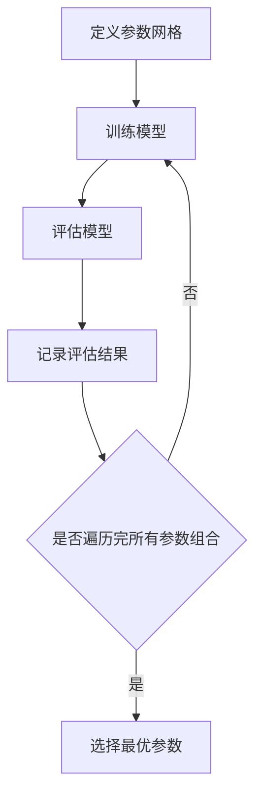
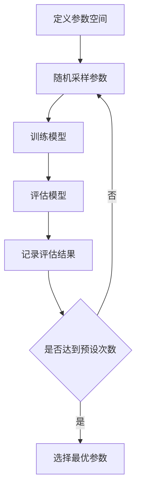
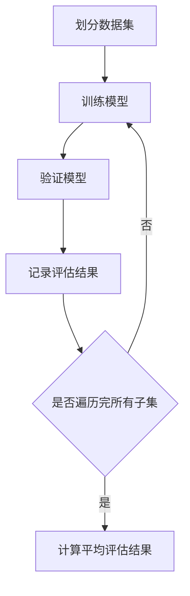

# 模型选择 (Model Selection)

## 1.背景介绍

在机器学习和数据科学领域，模型选择是一个至关重要的步骤。无论是分类、回归还是聚类任务，选择合适的模型直接影响到最终的预测性能和应用效果。模型选择不仅仅是选择一个算法，还包括选择合适的超参数、特征工程和评估方法。本文将深入探讨模型选择的核心概念、算法原理、数学模型、实际应用场景以及未来发展趋势。

## 2.核心概念与联系

### 2.1 模型选择的定义

模型选择是指在多个候选模型中选择一个最优模型的过程。这个过程通常包括以下几个步骤：

1. **定义问题**：明确任务类型（分类、回归、聚类等）。
2. **数据准备**：数据清洗、特征工程、数据分割。
3. **模型训练**：使用训练数据训练多个候选模型。
4. **模型评估**：使用验证数据评估模型性能。
5. **模型选择**：根据评估结果选择最优模型。

### 2.2 模型选择与模型评估的关系

模型选择和模型评估是密不可分的。模型评估是模型选择的基础，通过评估指标（如准确率、精确率、召回率、F1分数等）来衡量模型的性能，从而进行模型选择。

### 2.3 超参数调优

超参数调优是模型选择的重要组成部分。超参数是指在模型训练之前需要设置的参数，如学习率、正则化系数、树的深度等。常见的超参数调优方法包括网格搜索（Grid Search）和随机搜索（Random Search）。

## 3.核心算法原理具体操作步骤

### 3.1 网格搜索

网格搜索是一种穷举搜索方法，通过预定义的参数网格，逐一尝试每一种参数组合，找到最优参数。



### 3.2 随机搜索

随机搜索通过随机采样参数空间中的点来进行搜索，相比网格搜索更为高效。



### 3.3 交叉验证

交叉验证是一种评估模型性能的技术，通过将数据集分成多个子集，轮流使用一个子集作为验证集，其余子集作为训练集，最终取平均评估结果。



## 4.数学模型和公式详细讲解举例说明

### 4.1 交叉验证的数学原理

交叉验证的基本思想是将数据集 $D$ 划分为 $k$ 个子集 $D_1, D_2, \ldots, D_k$，每次使用一个子集作为验证集，其余子集作为训练集。假设模型的评估指标为 $E$，则交叉验证的评估结果为：

$$
E_{cv} = \frac{1}{k} \sum_{i=1}^{k} E(M_i, D_i)
$$

其中，$M_i$ 是在 $D \setminus D_i$ 上训练的模型。

### 4.2 正则化的数学原理

正则化是防止模型过拟合的一种技术。常见的正则化方法包括L1正则化和L2正则化。L1正则化的目标函数为：

$$
J(\theta) = \frac{1}{2m} \sum_{i=1}^{m} (h_\theta(x^{(i)}) - y^{(i)})^2 + \lambda \sum_{j=1}^{n} |\theta_j|
$$

L2正则化的目标函数为：

$$
J(\theta) = \frac{1}{2m} \sum_{i=1}^{m} (h_\theta(x^{(i)}) - y^{(i)})^2 + \lambda \sum_{j=1}^{n} \theta_j^2
$$

### 4.3 超参数调优的数学原理

超参数调优的目标是找到使模型性能最优的参数组合。假设模型的超参数为 $\theta$，评估指标为 $E$，则超参数调优的目标是：

$$
\theta^* = \arg\min_{\theta} E(M(\theta), D_{val})
$$

其中，$D_{val}$ 是验证集。

## 5.项目实践：代码实例和详细解释说明

### 5.1 数据准备

```python
import pandas as pd
from sklearn.model_selection import train_test_split

# 读取数据
data = pd.read_csv('data.csv')

# 特征和标签
X = data.drop('target', axis=1)
y = data['target']

# 划分训练集和测试集
X_train, X_test, y_train, y_test = train_test_split(X, y, test_size=0.2, random_state=42)
```

### 5.2 网格搜索实例

```python
from sklearn.model_selection import GridSearchCV
from sklearn.ensemble import RandomForestClassifier

# 定义参数网格
param_grid = {
    'n_estimators': [50, 100, 200],
    'max_depth': [None, 10, 20, 30],
    'min_samples_split': [2, 5, 10]
}

# 初始化模型
rf = RandomForestClassifier(random_state=42)

# 网格搜索
grid_search = GridSearchCV(estimator=rf, param_grid=param_grid, cv=5, scoring='accuracy')
grid_search.fit(X_train, y_train)

# 最优参数
print("Best parameters found: ", grid_search.best_params_)
```

### 5.3 随机搜索实例

```python
from sklearn.model_selection import RandomizedSearchCV
from scipy.stats import randint

# 定义参数空间
param_dist = {
    'n_estimators': randint(50, 200),
    'max_depth': [None, 10, 20, 30],
    'min_samples_split': randint(2, 10)
}

# 随机搜索
random_search = RandomizedSearchCV(estimator=rf, param_distributions=param_dist, n_iter=100, cv=5, scoring='accuracy', random_state=42)
random_search.fit(X_train, y_train)

# 最优参数
print("Best parameters found: ", random_search.best_params_)
```

### 5.4 交叉验证实例

```python
from sklearn.model_selection import cross_val_score

# 交叉验证
cv_scores = cross_val_score(rf, X_train, y_train, cv=5, scoring='accuracy')

# 平均评估结果
print("Cross-validation scores: ", cv_scores)
print("Mean cross-validation score: ", cv_scores.mean())
```

## 6.实际应用场景

### 6.1 金融领域

在金融领域，模型选择可以用于信用评分、风险评估和股票价格预测。例如，选择合适的分类模型来预测客户是否会违约，选择合适的回归模型来预测股票价格。

### 6.2 医疗领域

在医疗领域，模型选择可以用于疾病预测、药物反应预测和医学影像分析。例如，选择合适的分类模型来预测患者是否患有某种疾病，选择合适的回归模型来预测药物剂量。

### 6.3 电商领域

在电商领域，模型选择可以用于推荐系统、客户细分和销售预测。例如，选择合适的协同过滤模型来推荐商品，选择合适的聚类模型来进行客户细分。

## 7.工具和资源推荐

### 7.1 工具

- **Scikit-learn**：一个强大的Python机器学习库，提供了丰富的模型选择和评估工具。
- **TensorFlow**：一个开源的机器学习框架，支持深度学习模型的训练和评估。
- **Keras**：一个高层神经网络API，支持快速构建和训练深度学习模型。

### 7.2 资源

- **《机器学习实战》**：一本经典的机器学习入门书籍，涵盖了模型选择的基本概念和方法。
- **Coursera上的机器学习课程**：由斯坦福大学Andrew Ng教授讲授的机器学习课程，深入讲解了模型选择和评估方法。
- **Kaggle**：一个数据科学竞赛平台，提供了丰富的数据集和竞赛，适合进行模型选择的实践。

## 8.总结：未来发展趋势与挑战

### 8.1 未来发展趋势

随着数据量的增加和计算能力的提升，模型选择将变得更加复杂和重要。自动化机器学习（AutoML）是未来的发展趋势之一，通过自动化的方式进行模型选择和超参数调优，降低了人工干预的需求，提高了效率。

### 8.2 挑战

尽管模型选择技术已经取得了显著进展，但仍然面临一些挑战。首先，模型选择过程通常需要大量的计算资源和时间。其次，模型选择的结果可能受到数据集的影响，不同的数据集可能需要不同的模型和参数。最后，模型选择的过程需要考虑模型的可解释性和鲁棒性，确保模型在实际应用中的可靠性。

## 9.附录：常见问题与解答

### 9.1 什么是模型选择？

模型选择是指在多个候选模型中选择一个最优模型的过程，包括选择合适的算法、超参数和特征工程。

### 9.2 什么是交叉验证？

交叉验证是一种评估模型性能的技术，通过将数据集分成多个子集，轮流使用一个子集作为验证集，其余子集作为训练集，最终取平均评估结果。

### 9.3 什么是超参数调优？

超参数调优是指在模型训练之前，通过搜索参数空间找到使模型性能最优的参数组合。

### 9.4 网格搜索和随机搜索有什么区别？

网格搜索是通过穷举所有可能的参数组合来进行搜索，而随机搜索是通过随机采样参数空间中的点来进行搜索。随机搜索相比网格搜索更为高效。

### 9.5 如何选择合适的评估指标？

评估指标的选择取决于具体的任务和目标。对于分类任务，常用的评估指标包括准确率、精确率、召回率和F1分数。对于回归任务，常用的评估指标包括均方误差（MSE）、均方根误差（RMSE）和平均绝对误差（MAE）。

---

作者：禅与计算机程序设计艺术 / Zen and the Art of Computer Programming