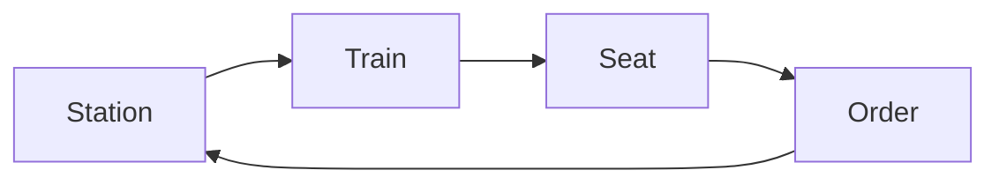

# 火车站订票系统详细设计与具体代码实现

## 1.背景介绍

火车是当今社会最重要的交通工具之一,每天都有数以百万计的人乘坐火车出行。为了满足旅客的需求,提高购票效率,火车站订票系统应运而生。这种系统通过计算机网络将各个车站连接起来,使得旅客可以在任意一个车站购买到所需车票。

订票系统的设计和实现是一个复杂的过程,需要考虑多方面的因素,如性能、可靠性、安全性等。本文将详细介绍火车站订票系统的设计思路、关键算法,并给出具体的代码实现。

## 2.核心概念与联系

在深入探讨系统设计之前,我们先了解一些核心概念:

- **车站(Station)**: 旅客可以在车站购买车票、乘车和下车。每个车站都有一个唯一的编号。

- **车次(Train)**: 每一趟行驶的列车都有一个唯一的车次号,并包含了该车次的始发站、终点站、运行时刻表等信息。

- **席位(Seat)**: 每一节车厢都有固定数量的座位,每个座位都有一个编号。根据座位类型的不同,价格也有所区别。

- **订单(Order)**: 旅客在购票时将生成一个订单,订单中包含了乘客信息、出发站、到达站、车次、座位等详细信息。

这些概念相互关联,构成了订票系统的基本框架。下面我们使用 Mermaid 流程图来直观地展示它们的关系:



## 3.核心算法原理具体操作步骤

订票系统的核心算法主要包括两个部分:

1. **查询可用车次和座位**
2. **生成订单并锁定座位**

### 3.1 查询可用车次和座位

当旅客想要购票时,首先需要查询符合出行需求的车次及其可用座位情况。算法流程如下:

1. 根据出发站和到达站,筛选出所有途经这两个站点的车次。
2. 对每一个符合条件的车次,检查该车次在给定的出发日期是否有余票。
3. 如果有余票,则进一步查询该车次中各个座位类型的剩余数量。
4. 将查询结果按照出发时间的先后顺序排列,返回给用户。

该算法的时间复杂度为 O(n*m),其中 n 为车次数量,m 为每个车次的座位数量。我们可以通过构建索引等方式来优化查询效率。

### 3.2 生成订单并锁定座位

当旅客选定了车次和座位后,系统需要生成订单并锁定所选座位,防止被其他用户预订。算法流程如下:

1. 检查所选座位是否仍然可用,如果不可用则返回错误信息。
2. 生成新的订单对象,填入乘客信息、车次信息和座位信息。
3. 锁定所选座位,将其状态标记为已预订。
4. 将订单信息持久化到数据库中。
5. 返回订单号给用户,作为购票凭证。

该算法的时间复杂度为 O(1),因为只涉及常数级别的操作。但是,为了保证系统的高并发性能,我们需要采用合理的锁机制和事务隔离级别。

## 4.数学模型和公式详细讲解举例说明

在订票系统中,我们需要对车次的运行时刻表进行建模和计算。假设一个车次从始发站到终点站需要经过 n 个车站,我们用 $t_i$ 表示该车次在第 i 个车站的到达时间,用 $s_i$ 表示在该车站的停留时间。那么,在第 i 个车站的出发时间可以表示为:

$$
d_i = t_i + s_i \quad (1 \leq i \leq n)
$$

其中 $d_1$ 为始发时间,已知。我们可以利用上述公式,递推地计算出每个车站的到达时间和出发时间。

此外,我们还需要考虑车次在运行过程中可能出现的延误情况。假设第 i 个车站的延误时间为 $\delta_i$,那么第 i 个车站的实际到达时间应修正为:

$$
t_i' = t_i + \delta_i \quad (1 \leq i \leq n)
$$

相应地,出发时间也需要作如下修正:

$$
d_i' = \begin{cases}
t_i' + s_i, & \text{if } t_i' + s_i \leq d_i\\
d_i, & \text{if } t_i' + s_i > d_i
\end{cases}
$$

上述公式确保了延误时间不会无限累积,车次将在可能的情况下追回计划时刻表。

通过建模和计算,我们可以准确掌握车次的实时运行状态,为旅客提供准确的行程信息。

## 5.项目实践:代码实例和详细解释说明

为了更好地理解订票系统的实现,我们给出了一些核心代码示例,并进行了详细的解释说明。

### 5.1 数据模型定义

首先,我们定义了系统中所需的数据模型,包括 `Station`、`Train`、`Seat` 和 `Order` 等。以 `Train` 模型为例:

```python
class Train:
    def __init__(self, train_id, start_station, end_station, schedule):
        self.train_id = train_id
        self.start_station = start_station
        self.end_station = end_station
        self.schedule = schedule  # 时刻表,包含每个车站的到达和出发时间
        self.seats = []  # 该车次包含的所有座位

    def add_seat(self, seat):
        self.seats.append(seat)

    def get_available_seats(self, start_station, end_station, date):
        # 根据出发站、到达站和日期,返回可用座位列表
        ...
```

`Train` 模型包含了车次的基本信息,如车次号、始发站、终点站和时刻表等。每个 `Train` 对象还维护了一个座位列表,用于存储该车次包含的所有座位。

### 5.2 查询可用车次和座位

下面是查询可用车次和座位的代码实现:

```python
def query_available_trains(start_station, end_station, date):
    available_trains = []
    for train in all_trains:
        if train.start_station == start_station and train.end_station == end_station:
            available_seats = train.get_available_seats(start_station, end_station, date)
            if available_seats:
                available_trains.append({
                    'train': train,
                    'available_seats': available_seats
                })
    return available_trains
```

该函数首先筛选出所有途经给定始发站和终点站的车次。对于每个符合条件的车次,它会调用 `get_available_seats` 方法获取在指定日期的可用座位列表。如果存在可用座位,则将该车次及其可用座位信息添加到结果列表中。最后,函数返回包含所有可用车次和座位信息的列表。

### 5.3 生成订单并锁定座位

下面是生成订单并锁定座位的代码实现:

```python
def create_order(passenger, train, seat, date):
    # 检查座位是否可用
    if seat not in train.get_available_seats(train.start_station, train.end_station, date):
        return None

    # 生成新订单
    order = Order(passenger, train, seat, date)

    # 锁定座位
    seat.lock()

    # 持久化订单信息
    save_order(order)

    return order
```

该函数首先检查所选座位是否仍然可用。如果不可用,则直接返回 `None`。否则,它会创建一个新的 `Order` 对象,并调用 `seat.lock()` 方法将所选座位锁定。最后,它会将订单信息持久化到数据库中,并返回新生成的订单对象。

在实际实现中,我们还需要考虑并发控制、事务管理等问题,以确保系统的正确性和高性能。

## 6.实际应用场景

火车站订票系统在现实生活中有着广泛的应用,为旅客提供了极大的便利。以下是一些典型的应用场景:

1. **网上购票**: 旅客可以通过互联网在线查询车次信息、预订座位并支付订单,无需亲自前往车站排队购票。

2. **自动售票机**: 在车站内部设置自助售票机,旅客可以直接在机器上完成购票流程,避免了人工服务的等候时间。

3. **呼叫中心**: 为了满足部分旅客的需求,火车公司还会设置呼叫中心,旅客可以通过电话与工作人员沟通,完成购票等操作。

4. **火车站大厅**: 传统的火车站大厅内也会设置人工售票窗口,为无法使用自助渠道的旅客提供服务。

无论是哪种购票方式,背后都依赖于高效、可靠的订票系统,为旅客提供统一的服务入口。

## 7.工具和资源推荐

在开发和维护订票系统的过程中,我们可以利用一些优秀的工具和资源,以提高效率和质量。

1. **版本控制系统**: 使用 Git 等版本控制系统,可以方便地管理代码变更,实现团队协作。

2. **持续集成(CI)工具**: 如 Jenkins、Travis CI 等,能够自动化构建、测试和部署流程,提高交付效率。

3. **性能测试工具**: 使用 JMeter、Locust 等工具对系统进行压力测试,发现和解决潜在的性能瓶颈。

4. **监控系统**: 如 Prometheus、Grafana 等,用于实时监控系统的运行状态,快速发现和定位问题。

5. **在线文档工具**: 使用 Confluence、ReadTheDocs 等工具,编写和管理项目文档,方便团队内外的知识共享。

6. **技术社区和论坛**: 如 StackOverflow、GitHub 等,可以在这些平台上寻求帮助、分享经验。

7. **开源框架和库**: 如 Spring、Django 等,可以利用成熟的开源框架和库,加速开发进程。

选择合适的工具和资源,可以极大地提高开发效率和系统质量。

## 8.总结:未来发展趋势与挑战

火车站订票系统在未来仍将面临一些发展趋势和挑战:

1. **移动化趋势**: 随着智能手机的普及,越来越多的旅客倾向于使用移动应用程序购票。因此,订票系统需要提供优秀的移动端体验,并支持多种移动支付方式。

2. **人工智能应用**: 利用人工智能技术,如自然语言处理、推荐系统等,可以为旅客提供更加智能化的服务,如语音购票、个性化行程推荐等。

3. **系统扩展性**: 随着业务规模的不断扩大,订票系统需要具备良好的扩展性,以应对不断增长的用户量和数据量。分布式架构、微服务等技术可以为系统扩展提供支持。

4. **安全性挑战**: 订票系统涉及大量敏感数据和财务交易,因此需要采取有效的安全措施,如数据加密、身份验证等,以防止黑客攻击和数据泄露。

5. **多模式出行整合**: 未来,订票系统可能需要与其他交通工具(如飞机、火车、地铁等)的出行系统进行整合,为旅客提供一站式的出行解决方案。

通过不断创新和完善,订票系统将为旅客带来更加便捷、智能和安全的出行体验。

## 9.附录:常见问题与解答

最后,我们列出一些关于订票系统的常见问题及解答,以帮助读者更好地理解和使用该系统。

1. **问:如何防止同一张车票被多个用户重复购买?**

   答:系统在生成订单时,会先检查所选座位是否仍然可用。如果可用,则立即锁定该座位,防止其他用户预订。同时,系统还会采用适当的并发控制机制和事务隔离级别,确保订单生成的原子性。

2. **问:如何处理火车延误导致的时刻表变化?**

   答:系统会实时监控火车的运行状态,获取延误信息。当发生延误时,系统会根据延误时间,重新计算每个车站的到达和出发时间,并将