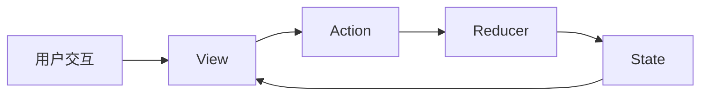

# 状态管理 原理与代码实例讲解

## 1.背景介绍

在现代软件开发中,状态管理是一个非常重要且复杂的话题。随着前端应用变得越来越复杂,管理应用程序的状态也变得越来越具有挑战性。无论是在前端还是后端开发中,高效地管理和维护应用程序的状态对于构建可扩展、可维护的应用程序至关重要。本文将深入探讨状态管理的原理,并通过代码实例详细讲解如何在实践中应用状态管理技术。

### 1.1 状态管理的重要性

#### 1.1.1 应用程序状态的定义
#### 1.1.2 状态管理在现代软件开发中的重要性
#### 1.1.3 没有合适的状态管理带来的问题

### 1.2 常见的状态管理模式

#### 1.2.1 MVC (Model-View-Controller)
#### 1.2.2 MVVM (Model-View-ViewModel) 
#### 1.2.3 Flux和Redux

## 2.核心概念与联系

要深入理解状态管理,我们需要了解一些核心概念以及它们之间的关系。

### 2.1 状态(State)

#### 2.1.1 状态的定义
#### 2.1.2 应用程序中的不同类型的状态
#### 2.1.3 状态的生命周期

### 2.2 动作(Action)

#### 2.2.1 动作的定义
#### 2.2.2 动作如何触发状态变化
#### 2.2.3 动作的分发机制

### 2.3 reducer

#### 2.3.1 reducer的定义
#### 2.3.2 reducer如何根据动作更新状态
#### 2.3.3 combineReducers的作用

### 2.4 store

#### 2.4.1 store的定义
#### 2.4.2 store的职责
#### 2.4.3 store与视图层的交互

### 2.5 单向数据流

#### 2.5.1 单向数据流的概念
#### 2.5.2 单向数据流的优势
#### 2.5.3 单向数据流在状态管理中的应用

以下是状态管理核心概念之间关系的Mermaid流程图:



## 3.核心算法原理具体操作步骤

状态管理的核心是通过一系列的算法和步骤来维护应用程序的状态,下面我们详细讲解其中的关键步骤。

### 3.1 状态的初始化

#### 3.1.1 定义初始状态
#### 3.1.2 创建根reducer
#### 3.1.3 创建store并传入根reducer

### 3.2 动作的创建与分发

#### 3.2.1 定义动作类型常量
#### 3.2.2 创建动作创建函数
#### 3.2.3 在视图层分发动作

### 3.3 reducer的编写

#### 3.3.1 编写针对不同动作类型的reducer
#### 3.3.2 使用combineReducers组合多个reducer
#### 3.3.3 在根reducer中处理未知的动作类型

### 3.4 状态的更新与订阅

#### 3.4.1 在reducer中根据动作更新状态
#### 3.4.2 在视图层订阅状态变化
#### 3.4.3 在状态变化时重新渲染视图

## 4.数学模型和公式详细讲解举例说明

状态管理的核心可以用数学模型和公式来表示,这有助于我们更好地理解其工作原理。

### 4.1 状态转移方程

我们可以将应用程序的状态看作一个状态机,每个动作都会触发状态的转移。这可以用以下公式表示:

$$
S' = R(S, A)
$$

其中,$S$表示当前状态,$A$表示触发的动作,$R$表示reducer函数,$S'$表示新的状态。

举例说明:假设我们有一个计数器应用,其状态为一个整数,表示当前计数。我们定义两个动作:INCREMENT和DECREMENT,分别表示增加和减少计数。那么状态转移方程可以表示为:

$$
\begin{aligned}
S' &= R(S, \text{INCREMENT}) = S + 1 \\
S' &= R(S, \text{DECREMENT}) = S - 1
\end{aligned}
$$

### 4.2 状态的组合与分解

在复杂的应用中,状态通常是一个嵌套的对象。我们可以使用combineReducers函数将多个reducer组合成一个根reducer。数学上,这相当于将状态空间分解为多个子空间,每个子空间对应一个reducer。

假设我们有两个reducer,分别管理状态的不同部分:

$$
\begin{aligned}
S_1' &= R_1(S_1, A) \\
S_2' &= R_2(S_2, A)
\end{aligned}
$$

那么组合后的根reducer可以表示为:

$$
S' = R(S, A) = \{S_1': R_1(S_1, A), S_2': R_2(S_2, A)\}
$$

## 5.项目实践:代码实例和详细解释说明

下面我们通过一个简单的Redux计数器示例来说明如何在实际项目中应用状态管理。

### 5.1 定义动作类型和动作创建函数

```javascript
// actionTypes.js
export const INCREMENT = 'INCREMENT';
export const DECREMENT = 'DECREMENT';

// actions.js
import { INCREMENT, DECREMENT } from './actionTypes';

export const increment = () => ({
  type: INCREMENT
});

export const decrement = () => ({
  type: DECREMENT
});
```

这里我们定义了两个动作类型常量INCREMENT和DECREMENT,以及对应的动作创建函数increment和decrement。

### 5.2 编写reducer

```javascript
// reducer.js
import { INCREMENT, DECREMENT } from './actionTypes';

const initialState = {
  count: 0
};

function counterReducer(state = initialState, action) {
  switch (action.type) {
    case INCREMENT:
      return { ...state, count: state.count + 1 };
    case DECREMENT:
      return { ...state, count: state.count - 1 };
    default:
      return state;
  }
}

export default counterReducer;
```

这里我们定义了初始状态initialState,以及counterReducer函数。reducer函数根据接收到的动作类型,返回新的状态。

### 5.3 创建store并传入根reducer

```javascript
// store.js
import { createStore } from 'redux';
import counterReducer from './reducer';

const store = createStore(counterReducer);

export default store;
```

这里我们使用Redux的createStore函数创建了一个store,并传入了counterReducer作为根reducer。

### 5.4 在视图层分发动作并订阅状态变化

```jsx
// Counter.js
import React from 'react';
import { connect } from 'react-redux';
import { increment, decrement } from './actions';

function Counter({ count, increment, decrement }) {
  return (
    <div>
      <p>Count: {count}</p>
      <button onClick={increment}>+</button>
      <button onClick={decrement}>-</button>
    </div>
  );
}

const mapStateToProps = (state) => ({
  count: state.count
});

const mapDispatchToProps = {
  increment,
  decrement
};

export default connect(mapStateToProps, mapDispatchToProps)(Counter);
```

这里我们定义了一个Counter组件,通过connect函数将Redux的状态和动作创建函数映射到组件的props中。在组件中,我们可以通过props.count访问状态,通过props.increment和props.decrement分发动作。

## 6.实际应用场景

状态管理在许多实际应用场景中都扮演着重要的角色,下面列举几个常见的应用场景。

### 6.1 电商平台中的购物车管理

在电商平台中,购物车是一个典型的需要状态管理的功能。购物车需要记录用户添加的商品、数量、价格等信息,并且需要响应用户的添加、删除、修改等操作。使用状态管理可以很好地解决购物车的数据同步和更新问题。

### 6.2 在线协作编辑器中的文档状态管理

在在线协作编辑器中,多个用户可以同时编辑同一份文档。这需要实时同步每个用户的编辑操作,并将编辑后的文档状态广播给所有用户。使用状态管理可以很好地解决文档状态的同步和更新问题。

### 6.3 即时通讯应用中的消息管理

在即时通讯应用中,需要管理用户的聊天记录、联系人列表、未读消息数等状态。使用状态管理可以很好地组织和维护这些状态,并在需要时触发相应的更新和通知。

## 7.工具和资源推荐

### 7.1 状态管理库

- Redux: https://redux.js.org/
- MobX: https://mobx.js.org/
- Vuex: https://vuex.vuejs.org/
- Recoil: https://recoiljs.org/

### 7.2 学习资源

- Redux官方文档: https://redux.js.org/tutorials/essentials/part-1-overview-concepts
- React Redux官方文档: https://react-redux.js.org/
- MobX官方文档: https://mobx.js.org/README.html
- Vuex官方文档: https://vuex.vuejs.org/guide/
- Recoil官方文档: https://recoiljs.org/docs/introduction/getting-started

## 8.总结:未来发展趋势与挑战

状态管理技术在过去几年中取得了长足的进步,但仍然存在许多挑战和机遇。

### 8.1 状态管理的未来发展趋势

- 更加声明式和函数式的状态管理方案
- 支持异步和副作用的状态管理方案
- 与服务端状态同步的解决方案
- 状态管理的性能优化和最佳实践

### 8.2 面临的挑战

- 状态的过度集中化导致的性能瓶颈
- 状态管理逻辑的复杂度和可维护性
- 状态管理与UI组件的解耦
- 大型应用中状态的拆分和组合

## 9.附录:常见问题与解答

### 9.1 什么时候需要使用状态管理库?

当应用程序中的状态变得复杂,难以维护时,就需要考虑使用状态管理库。一般来说,如果你的应用程序中存在以下情况,就可以考虑使用状态管理库:

- 多个组件需要共享同一个状态
- 状态的更新逻辑比较复杂
- 需要记录状态的变化历史,实现撤销/重做等功能
- 需要与服务端同步状态

### 9.2 Redux、MobX、Vuex等状态管理库有什么区别?

Redux、MobX、Vuex都是主流的状态管理库,它们之间有以下区别:

- Redux采用单一数据流和纯函数reducer的设计思想,状态是不可变的,需要通过触发action来更新状态。
- MobX采用响应式编程的思想,状态是可变的,通过observable和action来追踪和更新状态。
- Vuex是专门为Vue.js设计的状态管理库,与Vue.js深度集成,提供了更方便的API和插件机制。

### 9.3 状态管理与组件的本地状态有什么区别?

状态管理和组件的本地状态有以下区别:

- 状态管理是全局的,可以在多个组件之间共享;而组件的本地状态是局部的,只能在组件内部使用。
- 状态管理通常用于管理应用程序级别的状态,如用户信息、购物车等;而组件的本地状态通常用于管理组件内部的UI状态,如对话框的打开/关闭状态等。
- 状态管理需要遵循一定的模式和规范,如Redux的单一数据流模型;而组件的本地状态相对自由,没有固定的模式。

希望这篇文章能够帮助你深入理解状态管理的原理和实践,并在实际项目中灵活运用。如果你有任何问题或建议,欢迎留言讨论。

作者:禅与计算机程序设计艺术 / Zen and the Art of Computer Programming