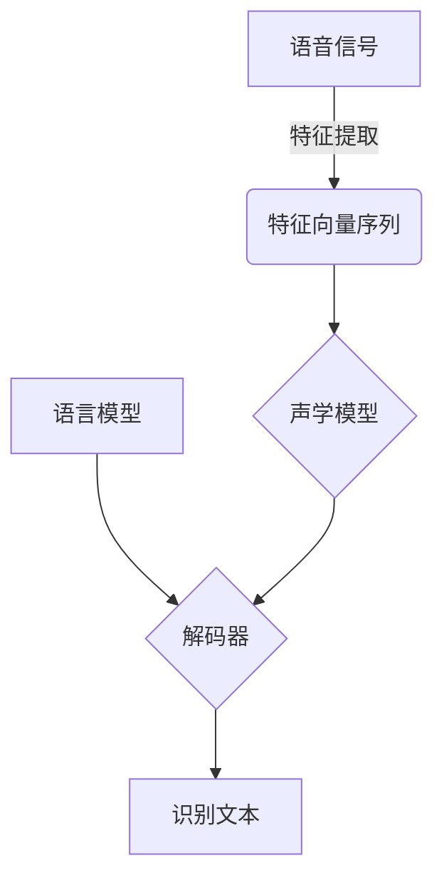

# 语音识别原理与代码实战案例讲解

## 1.背景介绍

语音识别技术是一种将人类语音转换为相应文本或命令的技术,它广泛应用于人机交互、语音助手、语音输入等场景。随着深度学习技术的快速发展,语音识别的准确率和鲁棒性也得到了显著提高。本文将详细介绍语音识别的核心原理、算法流程以及实战案例,为读者提供全面的理解和实践指导。

## 2.核心概念与联系

语音识别系统通常由以下几个核心模块组成:

1. **语音信号预处理**:将原始语音信号转换为特征向量序列,常用的特征提取方法有MFCC(Mel频率倒谱系数)、PLP(感知线性预测)等。

2. **声学模型**:将特征向量序列映射为潜在的语音单元序列,如音素、词等。常用的声学模型有高斯混合模型(GMM)、深度神经网络(DNN)等。

3. **语言模型**:估计语音单元序列对应的文本的概率,常用的语言模型有N-gram模型、递归神经网络语言模型等。

4. **解码器**:根据声学模型和语言模型的输出,搜索最可能的文本序列。常用的解码算法有Viterbi算法、束搜索算法等。

这些模块相互关联,共同决定了语音识别系统的性能。



## 3.核心算法原理具体操作步骤

### 3.1 语音信号预处理

1. **预加重**:增强高频部分,补偿高频信号在传输过程中的衰减。
2. **分帧**:将连续的语音信号分割为若干个短时间帧,通常帧长20-30ms。
3. **加窗**:对每一帧语音信号加窗,减小分帧带来的频谱失真。
4. **傅里叶变换**:对加窗后的帧进行傅里叶变换,得到频域谱。
5. **mel滤波器组**:将频域谱映射到mel频率刻度,模拟人耳听觉特性。
6. **离散余弦变换**:对mel频率谱进行离散余弦变换,得到MFCC系数。

### 3.2 声学模型

#### 3.2.1 高斯混合模型(GMM)

1. **向量量化**:将MFCC特征向量映射到有限个码本向量。
2. **计算观测概率**:使用GMM模型计算每个状态产生当前观测向量的概率。
3. **前向概率**:使用前向算法递推计算到达每个状态的概率。
4. **后向概率**:使用后向算法递推计算从每个状态到终止的概率。
5. **维特比路径**:根据前向/后向概率,使用维特比算法找到最可能的状态序列。

#### 3.2.2 深度神经网络(DNN)

1. **网络结构**:DNN通常由多个隐藏层组成,每层都是对上一层的非线性变换。
2. **前向传播**:MFCC特征向量经过隐藏层的变换,输出每个音素单元的概率。
3. **反向传播**:根据损失函数,计算每个权重的梯度,并使用优化算法(如SGD)更新权重。
4. **解码**:将DNN输出的音素概率序列解码为最可能的文本序列。

### 3.3 语言模型

1. **N-gram模型**:统计语料库中N个词的共现概率,估计下一个词的条件概率。
2. **平滑处理**:解决语料库中未出现的N-gram概率为0的问题。
3. **递归神经网络**:使用循环神经网络捕捉长程语义依赖关系。
4. **束搜索解码**:结合声学模型概率和语言模型概率,搜索最可能的文本序列。

## 4.数学模型和公式详细讲解举例说明

### 4.1 MFCC特征提取

MFCC特征提取的主要步骤如下:

1. 对语音信号进行预加重,公式为:

$$\hat{x}(n)=x(n)-\alpha x(n-1)$$

其中$\alpha$通常取值0.95~0.97。

2. 将语音信号分帧并加窗,常用的窗函数有汉明窗:

$$w(n)=0.54-0.46\cos\left(\frac{2\pi n}{N-1}\right),0\leq n\leq N-1$$

3. 对每帧进行傅里叶变换,得到功率谱:

$$X(k)=\sum_{n=0}^{N-1}x(n)e^{-j\frac{2\pi kn}{N}},0\leq k\leq N-1$$

4. 将功率谱映射到mel刻度,mel滤波器组的心理声学权重为:

$$H_m(k)=\begin{cases}
0&\text{if }k<f(m-1)\\
\frac{k-f(m-1)}{f(m)-f(m-1)}&\text{if }f(m-1)\leq k\leq f(m)\\
\frac{f(m+1)-k}{f(m+1)-f(m)}&\text{if }f(m)\leq k\leq f(m+1)\\
0&\text{if }k>f(m+1)
\end{cases}$$

其中$f(m)=\frac{700}{log(1+\frac{m}{1124})}$。

5. 对mel频率谱进行离散余弦变换,得到MFCC系数:

$$c_n=\sum_{m=1}^{M}\log(E_m)\cos\left[\frac{\pi n}{M}\left(m-\frac{1}{2}\right)\right],0\leq n\leq N$$

### 4.2 声学模型

#### 4.2.1 高斯混合模型(GMM)

GMM的概率密度函数为:

$$p(x|\lambda)=\sum_{m=1}^{M}c_m\mathcal{N}(x|\mu_m,\Sigma_m)$$

其中$\lambda=\{c_m,\mu_m,\Sigma_m\}$为GMM参数,$c_m$为混合权重,$\mu_m$为均值向量,$\Sigma_m$为协方差矩阵。

GMM参数通过期望最大值(EM)算法估计。在解码时,使用前向、后向和Viterbi算法求解最可能的状态序列。

#### 4.2.2 深度神经网络(DNN)

DNN将MFCC特征向量$x$映射为音素后验概率向量$y$:

$$y=f_L\circ f_{L-1}\circ\cdots\circ f_1(x)$$

其中$f_l$为第$l$层的非线性变换,常用的激活函数有ReLU、sigmoid等。

通过反向传播算法训练DNN参数,使用交叉熵损失函数:

$$J=-\sum_iy_i^*\log y_i$$

其中$y_i^*$为标记音素的真实标签。

### 4.3 语言模型

#### 4.3.1 N-gram模型

N-gram模型使用马尔可夫假设,估计下一个词的条件概率:

$$P(w_i|w_1,\ldots,w_{i-1})\approx P(w_i|w_{i-N+1},\ldots,w_{i-1})$$

N-gram概率通过最大似然估计或平滑处理得到。

#### 4.3.2 递归神经网络语言模型

RNN语言模型使用循环神经网络捕捉长程依赖关系:

$$h_t=\sigma(W_{hh}h_{t-1}+W_{xh}x_t)$$
$$y_t=\text{softmax}(W_{yh}h_t)$$

其中$h_t$为隐藏状态向量,$x_t$为当前输入词向量,$y_t$为下一词的概率分布。

## 5.项目实践:代码实例和详细解释说明

这里以Python语言为例,使用Kaldi工具包实现一个简单的语音识别系统。

### 5.1 安装依赖

```bash
# 安装Kaldi
git clone https://github.com/kaldi-asr/kaldi.git
cd kaldi/tools
extras/install_openfst.sh
cd ../src
./configure --shared
make -j 4

# 安装Python绑定
git clone https://github.com/alphacep/kaldi-python
cd kaldi-python
python setup.py install
```

### 5.2 特征提取

```python
import kaldi.feat as kfeat
import kaldi.matrix as kmat

# 创建MFCC特征管道
mfcc = kfeat.MfccOptions()
mfcc.use_energy = False  # 不使用能量系数
mfcc.frame_opts.dither = 0  # 设置信号抖动参数
mfcc.frame_opts.snip_edges = False  # 不修剪边缘帧
mfcc.frame_opts.allow_downsample = True  # 允许降采样
mfcc_computer = kfeat.MfccComputer(mfcc)

# 读取wav文件
wav_data = kfeat.WaveData()
wav_data.read_wav("test.wav")

# 计算MFCC特征
mfcc_mat = kmat.Matrix()
mfcc_computer.compute_features(wav_data.data(), wav_data.sample_freq(), 1.0, wav_data.data().size(), &mfcc_mat)
```

### 5.3 声学模型解码

```python
import kaldi.decoder as kdec
import kaldi.util.model as kmodel

# 加载声学模型
model = kmodel.Model("final.mdl")
decoder = kdec.SimpleDecoder(model)

# 设置解码参数
decoder.max_lm_state = 10000  # 语言模型状态数
decoder.beam = 13.0  # 束宽度
decoder.lattice_beam = 6.0  # 晶格束宽度

# 执行解码
decoder.decode(mfcc_mat)
best_path = decoder.get_best_path()
print("Recognized text:", best_path.get_string())
```

### 5.4 语言模型集成

```python
import kaldi.arpa as karpa

# 加载N-gram语言模型
lm = karpa.LmOptions()
lm.arpa_file = "lm.arpa"
decoder.set_lm(lm)

# 执行带语言模型的解码
decoder.decode(mfcc_mat)
best_path = decoder.get_best_path(True)  # 获取最佳路径(包含语言模型分数)
print("Recognized text:", best_path.get_string())
```

以上代码展示了如何使用Kaldi进行语音特征提取、声学模型解码以及与语言模型集成。读者可以根据实际需求进行定制和扩展。

## 6.实际应用场景

语音识别技术在以下场景中有着广泛的应用:

1. **语音助手**:如苹果Siri、亚马逊Alexa、谷歌Assistant等,用户可以通过语音与设备进行自然交互。

2. **会议记录**:自动将会议语音转录为文本,提高工作效率。

3. **车载系统**:驾驶员可以使用语音控制导航、音乐等车载设备,减少分心风险。

4. **医疗辅助**:医生可以使用语音输入病历、处方等,提高工作效率。

5. **教育领域**:自动将课堂内容转录为文本,方便学生复习和查阅。

6. **无障碍辅助**:为残障人士提供语音识别服务,提高生活质量。

## 7.工具和资源推荐

1. **Kaldi**: 一款开源的语音识别工具包,提供完整的工具链和模型。

2. **CMU Sphinx**: 卡内基梅隆大学开发的语音识别系统。

3. **RWTH ASR**: 德国亚琛工业大学的语音识别系统。

4. **Mozilla Common Voice**: 一个用于构建开源语音识别系统的众包语音数据集。

5. **VoxForge**: 一个收集多种语言语音数据的开源项目。

6. **Wav2Letter++**: 由Facebook AI研究院开发的端到端语音识别工具包。

## 8.总结:未来发展趋势与挑战

语音识别技术正在不断发展和完善,未来可能的发展趋势包括:

1. **端到端模型**:直接从语音信号到文本的端到端模型,避免了传统流程中的多个模块。

2. **多模态融合**:融合语音、视觉等多种模态信息,提高识别准确率。

3. **个性化模型**:针对不同场景、不同说话人训练个性化的语音识别模型。

4. **低资源语音识别**:提高小语种和低资源语言的识别能力。

5. **鲁棒性提升**:提高对噪音、重叠语音等