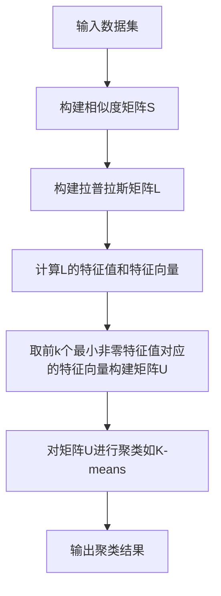

# 谱聚类(Spectral Clustering) - 原理与代码实例讲解

## 1. 背景介绍
### 1.1 聚类分析概述
#### 1.1.1 聚类的定义与目的
聚类分析是一种无监督学习方法,旨在将数据集划分为多个组或簇,使得同一簇内的数据点彼此相似,而不同簇之间的数据点差异较大。聚类可以帮助我们发现数据内在的结构和模式,广泛应用于模式识别、数据挖掘、图像分割等领域。

#### 1.1.2 常见的聚类算法
传统的聚类算法主要包括:
- K-means聚类
- 层次聚类 
- DBSCAN密度聚类
- 高斯混合模型聚类

这些算法各有优缺点,适用于不同类型的数据和场景。

### 1.2 谱聚类的产生背景
#### 1.2.1 传统聚类算法的局限性
虽然上述传统聚类算法应用广泛,但它们在处理某些复杂数据时存在局限性:
- 对非凸形状的数据聚类效果不佳
- 对高维数据聚类性能下降
- 容易陷入局部最优

#### 1.2.2 谱聚类的优势
谱聚类通过利用数据的拉普拉斯矩阵的特征值和特征向量,将聚类问题转化为图的最优划分问题。与传统方法相比,谱聚类具有以下优势:
- 能够发现任意形状的簇
- 对高维数据有更好的性能
- 全局最优解,避免局部最优
- 实现简单,易于理解

## 2. 核心概念与联系
### 2.1 图论基础
#### 2.1.1 无向加权图
谱聚类基于图论,将数据集表示为一个无向加权图$G=(V,E)$,其中$V$为顶点集,代表数据点;$E$为边集,代表数据点之间的相似性。边的权重$w_{ij}$表示点$i$和$j$之间的相似度。

#### 2.1.2 图的度矩阵与邻接矩阵
- 度矩阵$D$是一个对角矩阵,对角元素$d_i$表示第$i$个顶点的度,即与之相连的边的权重之和:
$$d_i=\sum_{j=1}^{n} w_{ij}$$
- 邻接矩阵$W$表示图中顶点之间的相连关系和边的权重,其中$w_{ij}$为顶点$i$和$j$之间的边权重。

### 2.2 谱图理论
#### 2.2.1 拉普拉斯矩阵
图的拉普拉斯矩阵定义为$L=D-W$,是度矩阵与邻接矩阵之差。它反映了图的结构特性,在谱聚类中起关键作用。

#### 2.2.2 拉普拉斯矩阵的特征值和特征向量
拉普拉斯矩阵$L$是一个对称矩阵,具有非负实数特征值。将特征值从小到大排序$0=\lambda_1\leq\lambda_2\leq...\leq\lambda_n$,对应的特征向量为$u_1,u_2,...,u_n$。前$k$个最小非零特征值对应的特征向量包含了图的重要结构信息。

### 2.3 谱聚类与图划分的关系
#### 2.3.1 图划分问题
谱聚类将数据聚类问题转化为图的最优划分问题。图划分的目标是将图划分为若干个子图,使得子图内部的边权重尽可能大,而不同子图之间的边权重尽可能小。这与聚类的目标一致。

#### 2.3.2 归一化割(Normalized Cut)
Shi和Malik提出了归一化割(Normalized Cut)准则来度量图划分的质量。对于一个划分$A,B$,其归一化割定义为:
$$Ncut(A,B)=\frac{cut(A,B)}{vol(A)}+\frac{cut(A,B)}{vol(B)}$$
其中,$cut(A,B)$表示$A$和$B$之间的割,即两个子图之间边的权重之和;$vol(A)$和$vol(B)$分别表示$A$和$B$的体积,即子图内所有顶点的度之和。

最优的图划分使得$Ncut$最小化。而这一问题可以通过拉普拉斯矩阵的特征值和特征向量来近似求解。

## 3. 核心算法原理具体操作步骤
谱聚类算法主要分为以下步骤:

### 3.1 构建相似度矩阵
根据数据点之间的相似性度量(如欧氏距离、高斯核函数等),计算数据点两两之间的相似度$s_{ij}$,构建相似度矩阵$S$。

### 3.2 构建拉普拉斯矩阵
由相似度矩阵$S$得到邻接矩阵$W$,再计算度矩阵$D$,最后得到拉普拉斯矩阵$L=D-W$。

### 3.3 计算拉普拉斯矩阵的特征值和特征向量
对拉普拉斯矩阵$L$进行特征值分解,得到特征值$\lambda_1,\lambda_2,...,\lambda_n$和对应的特征向量$u_1,u_2,...,u_n$。

### 3.4 构建特征向量矩阵
取前$k$个最小非零特征值对应的特征向量,构建特征向量矩阵$U=[u_1,u_2,...,u_k]$。每一行表示一个数据点,每一列表示一个特征向量。

### 3.5 对特征向量矩阵进行聚类
将特征向量矩阵$U$中的每一行看作是$k$维空间中的一个点,使用K-means等聚类算法对这些点进行聚类,得到最终的聚类结果。

以下是谱聚类算法的流程图:



## 4. 数学模型和公式详细讲解举例说明
### 4.1 相似度矩阵构建
常用的相似度度量包括:
- 欧氏距离:
$$s_{ij}=\exp(-\frac{\|x_i-x_j\|^2}{2\sigma^2})$$
- 高斯核函数:  
$$s_{ij}=\exp(-\frac{\|x_i-x_j\|^2}{2\sigma^2})$$

其中$\sigma$为核函数的带宽参数,控制相似度的衰减速度。

例如,对于一个包含4个二维数据点的集合$X=\{(1,1),(2,2),(8,8),(9,9)\}$,使用高斯核函数构建相似度矩阵:
$$
S=\begin{bmatrix} 
1 & 0.6065 & 2.8E{-8} & 1.5E{-11}\\
0.6065 & 1 & 1.2E{-6} & 2.8E{-8}\\
2.8E{-8} & 1.2E{-6} & 1 & 0.6065\\
1.5E{-11} & 2.8E{-8} & 0.6065 & 1
\end{bmatrix}
$$

### 4.2 归一化割的推导
将归一化割$Ncut$用拉普拉斯矩阵表示:
$$Ncut(A,B)=\frac{y^TLy}{y^TDy}$$
其中$y$是一个指示向量,表示数据点属于子图$A$还是$B$:
$$y_i=\begin{cases}
\sqrt{\frac{vol(B)}{vol(A)}}, & v_i\in A \\
-\sqrt{\frac{vol(A)}{vol(B)}}, & v_i\in B
\end{cases}$$

最小化$Ncut$等价于求解如下优化问题:
$$\min_y \frac{y^TLy}{y^TDy}, \quad s.t. \quad y^TD\mathbf{1}=0, \quad y^TDy=vol(V)$$
其中$\mathbf{1}$为全1向量。

利用拉格朗日乘子法,上述问题可转化为广义特征值问题:
$$Ly=\lambda Dy$$
求解该特征值问题,取最小非零特征值对应的特征向量作为$y$的近似解,进而得到图的划分。

### 4.3 谱聚类的正则化形式
为了得到更加稳定的数值解,通常使用正则化的拉普拉斯矩阵:
- 对称正则化拉普拉斯矩阵: $L_{sym}=D^{-1/2}LD^{-1/2}=I-D^{-1/2}WD^{-1/2}$
- 随机游走正则化拉普拉斯矩阵: $L_{rw}=D^{-1}L=I-D^{-1}W$

相应地,谱聚类算法使用正则化拉普拉斯矩阵的特征向量进行聚类。

## 5. 项目实践:代码实例和详细解释说明
下面使用Python和scikit-learn库实现谱聚类,并应用于月牙形数据集:

```python
import numpy as np
import matplotlib.pyplot as plt
from sklearn.datasets import make_moons
from sklearn.cluster import SpectralClustering

# 生成月牙形数据集
X, y = make_moons(n_samples=500, noise=0.1, random_state=42)

# 谱聚类
sc = SpectralClustering(n_clusters=2, affinity='rbf', random_state=42)
labels = sc.fit_predict(X)

# 可视化聚类结果
plt.scatter(X[:, 0], X[:, 1], c=labels, cmap='viridis')
plt.title('Spectral Clustering on Moon Dataset')
plt.show()
```

代码解释:
1. 使用`make_moons`函数生成月牙形数据集,包含500个数据点,噪声水平为0.1。
2. 创建`SpectralClustering`对象,指定聚类数为2,亲和度矩阵的构建方式为`rbf`(高斯核函数)。
3. 调用`fit_predict`方法对数据进行谱聚类,返回每个数据点的聚类标签。
4. 使用`scatter`函数可视化聚类结果,不同的聚类用不同的颜色表示。

运行结果:


可以看出,谱聚类能够准确地将月牙形数据集划分为两个簇。

## 6. 实际应用场景
谱聚类在许多领域都有广泛应用,例如:
- 图像分割:将图像划分为多个区域,每个区域对应一个物体或背景。谱聚类能够有效处理纹理、光照等复杂因素。
- 社交网络分析:在社交网络中识别社区结构,发现紧密联系的用户群体。谱聚类能够揭示网络的潜在结构。
- 生物信息学:对基因表达数据进行聚类,发现功能相关的基因模块。谱聚类有助于理解基因调控网络。  
- 文本挖掘:对文本数据进行主题聚类,自动发现文档集合中的主题结构。谱聚类能够处理高维稀疏的文本特征。

## 7. 工具和资源推荐
- scikit-learn:机器学习库,提供了谱聚类的高效实现。
- NetworkX:图分析库,可用于构建和操作复杂网络,与谱聚类结合应用。
- Laplacians.jl:Julia语言的一个包,提供了丰富的图拉普拉斯矩阵的功能。
- 谱聚类原理与应用:一本深入介绍谱聚类的理论基础和实践应用的书籍。

## 8. 总结:未来发展趋势与挑战
谱聚类是一种强大的聚类方法,能够处理复杂形状的数据,揭示数据的内在结构。未来谱聚类的研究和应用还有许多发展机会:
- 大规模谱聚类:针对海量数据,开发可扩展的、分布式的谱聚类算法。
- 多视图谱聚类:整合来自多个视角的数据,实现更全面、更