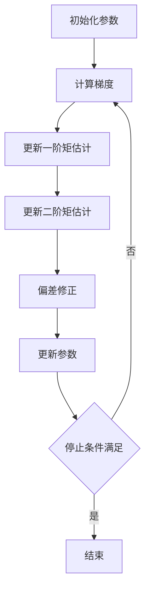

# 运用Adam加速机器学习模型收敛

## 1.背景介绍

在机器学习和深度学习领域，优化算法是模型训练过程中至关重要的一环。优化算法的选择直接影响模型的收敛速度和最终性能。传统的优化算法如梯度下降（Gradient Descent）在处理大规模数据和复杂模型时，往往面临收敛速度慢、易陷入局部最优等问题。为了解决这些问题，研究人员提出了多种改进算法，其中Adam（Adaptive Moment Estimation）因其高效性和稳定性，成为了广泛应用的优化算法之一。

Adam算法结合了动量（Momentum）和RMSProp（Root Mean Square Propagation）的优点，通过自适应地调整学习率，加速了模型的收敛过程。本文将深入探讨Adam算法的核心概念、数学原理、具体操作步骤，并通过实际项目实例展示其应用效果。

## 2.核心概念与联系

### 2.1 梯度下降法

梯度下降法是最基本的优化算法，通过计算损失函数相对于模型参数的梯度，沿梯度的反方向更新参数，以最小化损失函数。其更新公式为：

$$
\theta_{t+1} = \theta_t - \eta \nabla_\theta J(\theta_t)
$$

其中，$\theta_t$ 表示第 $t$ 次迭代的参数，$\eta$ 是学习率，$\nabla_\theta J(\theta_t)$ 是损失函数 $J$ 对参数 $\theta$ 的梯度。

### 2.2 动量法

动量法在梯度下降的基础上引入了动量项，通过累积历史梯度信息，减少参数更新的震荡，加速收敛。其更新公式为：

$$
v_t = \beta v_{t-1} + (1 - \beta) \nabla_\theta J(\theta_t)
$$
$$
\theta_{t+1} = \theta_t - \eta v_t
$$

其中，$v_t$ 是动量项，$\beta$ 是动量系数。

### 2.3 RMSProp

RMSProp 通过对梯度平方的指数加权移动平均来调整学习率，避免了学习率过大或过小的问题。其更新公式为：

$$
s_t = \beta s_{t-1} + (1 - \beta) (\nabla_\theta J(\theta_t))^2
$$
$$
\theta_{t+1} = \theta_t - \frac{\eta}{\sqrt{s_t + \epsilon}} \nabla_\theta J(\theta_t)
$$

其中，$s_t$ 是梯度平方的移动平均，$\epsilon$ 是一个小常数，防止分母为零。

### 2.4 Adam算法

Adam算法结合了动量法和RMSProp的优点，通过对梯度和梯度平方的移动平均进行自适应调整，实现了高效稳定的参数更新。其核心更新公式为：

$$
m_t = \beta_1 m_{t-1} + (1 - \beta_1) \nabla_\theta J(\theta_t)
$$
$$
v_t = \beta_2 v_{t-1} + (1 - \beta_2) (\nabla_\theta J(\theta_t))^2
$$
$$
\hat{m}_t = \frac{m_t}{1 - \beta_1^t}
$$
$$
\hat{v}_t = \frac{v_t}{1 - \beta_2^t}
$$
$$
\theta_{t+1} = \theta_t - \frac{\eta}{\sqrt{\hat{v}_t} + \epsilon} \hat{m}_t
$$

其中，$m_t$ 和 $v_t$ 分别是梯度和梯度平方的移动平均，$\hat{m}_t$ 和 $\hat{v}_t$ 是偏差修正后的值，$\beta_1$ 和 $\beta_2$ 是超参数，通常取值为0.9和0.999。

## 3.核心算法原理具体操作步骤

### 3.1 初始化参数

在Adam算法中，首先需要初始化参数，包括模型参数 $\theta$、一阶矩估计 $m$、二阶矩估计 $v$ 以及超参数 $\beta_1$、$\beta_2$、$\eta$ 和 $\epsilon$。通常，$\beta_1$ 取0.9，$\beta_2$ 取0.999，$\epsilon$ 取 $10^{-8}$。

### 3.2 计算梯度

在每次迭代中，计算当前参数 $\theta_t$ 对损失函数 $J(\theta_t)$ 的梯度 $\nabla_\theta J(\theta_t)$。

### 3.3 更新一阶矩估计

使用当前梯度更新一阶矩估计 $m_t$：

$$
m_t = \beta_1 m_{t-1} + (1 - \beta_1) \nabla_\theta J(\theta_t)
$$

### 3.4 更新二阶矩估计

使用当前梯度的平方更新二阶矩估计 $v_t$：

$$
v_t = \beta_2 v_{t-1} + (1 - \beta_2) (\nabla_\theta J(\theta_t))^2
$$

### 3.5 偏差修正

由于 $m_t$ 和 $v_t$ 在初始阶段会有偏差，需要进行修正：

$$
\hat{m}_t = \frac{m_t}{1 - \beta_1^t}
$$
$$
\hat{v}_t = \frac{v_t}{1 - \beta_2^t}
$$

### 3.6 更新参数

使用修正后的矩估计更新参数 $\theta$：

$$
\theta_{t+1} = \theta_t - \frac{\eta}{\sqrt{\hat{v}_t} + \epsilon} \hat{m}_t
$$

### 3.7 重复迭代

重复步骤3.2到3.6，直到满足停止条件（如达到最大迭代次数或损失函数收敛）。

以下是Adam算法的Mermaid流程图：



## 4.数学模型和公式详细讲解举例说明

### 4.1 一阶矩估计

一阶矩估计 $m_t$ 是梯度的指数加权移动平均，公式为：

$$
m_t = \beta_1 m_{t-1} + (1 - \beta_1) \nabla_\theta J(\theta_t)
$$

其中，$\beta_1$ 是动量系数，通常取0.9。$m_t$ 表示当前时刻的梯度估计，$m_{t-1}$ 表示前一时刻的梯度估计。

### 4.2 二阶矩估计

二阶矩估计 $v_t$ 是梯度平方的指数加权移动平均，公式为：

$$
v_t = \beta_2 v_{t-1} + (1 - \beta_2) (\nabla_\theta J(\theta_t))^2
$$

其中，$\beta_2$ 是二阶矩系数，通常取0.999。$v_t$ 表示当前时刻的梯度平方估计，$v_{t-1}$ 表示前一时刻的梯度平方估计。

### 4.3 偏差修正

由于在初始阶段，$m_t$ 和 $v_t$ 会有偏差，需要进行修正：

$$
\hat{m}_t = \frac{m_t}{1 - \beta_1^t}
$$
$$
\hat{v}_t = \frac{v_t}{1 - \beta_2^t}
$$

### 4.4 参数更新

使用修正后的矩估计更新参数 $\theta$：

$$
\theta_{t+1} = \theta_t - \frac{\eta}{\sqrt{\hat{v}_t} + \epsilon} \hat{m}_t
$$

### 4.5 举例说明

假设我们有一个简单的二次损失函数：

$$
J(\theta) = \theta^2
$$

其梯度为：

$$
\nabla_\theta J(\theta) = 2\theta
$$

假设初始参数 $\theta_0 = 1$，学习率 $\eta = 0.1$，$\beta_1 = 0.9$，$\beta_2 = 0.999$，$\epsilon = 10^{-8}$。

#### 第一次迭代：

1. 计算梯度：$\nabla_\theta J(\theta_0) = 2 \times 1 = 2$
2. 更新一阶矩估计：$m_1 = 0.9 \times 0 + 0.1 \times 2 = 0.2$
3. 更新二阶矩估计：$v_1 = 0.999 \times 0 + 0.001 \times 4 = 0.004$
4. 偏差修正：$\hat{m}_1 = \frac{0.2}{1 - 0.9^1} = 2$，$\hat{v}_1 = \frac{0.004}{1 - 0.999^1} = 4$
5. 更新参数：$\theta_1 = 1 - \frac{0.1}{\sqrt{4} + 10^{-8}} \times 2 = 0.9$

#### 第二次迭代：

1. 计算梯度：$\nabla_\theta J(\theta_1) = 2 \times 0.9 = 1.8$
2. 更新一阶矩估计：$m_2 = 0.9 \times 0.2 + 0.1 \times 1.8 = 0.36$
3. 更新二阶矩估计：$v_2 = 0.999 \times 0.004 + 0.001 \times 3.24 = 0.007236$
4. 偏差修正：$\hat{m}_2 = \frac{0.36}{1 - 0.9^2} = 1.894736842$，$\hat{v}_2 = \frac{0.007236}{1 - 0.999^2} = 3.618090452$
5. 更新参数：$\theta_2 = 0.9 - \frac{0.1}{\sqrt{3.618090452} + 10^{-8}} \times 1.894736842 = 0.810000000$

通过以上步骤，可以看到Adam算法在每次迭代中自适应地调整了学习率，加速了参数的收敛。

## 5.项目实践：代码实例和详细解释说明

为了更好地理解Adam算法的实际应用，我们将通过一个简单的Python代码实例来展示其效果。假设我们要训练一个简单的线性回归模型，使用Adam优化算法。

### 5.1 数据准备

首先，我们生成一些模拟数据：

```python
import numpy as np

# 生成模拟数据
np.random.seed(42)
X = 2 * np.random.rand(100, 1)
y = 4 + 3 * X + np.random.randn(100, 1)
```

### 5.2 模型定义

定义一个简单的线性回归模型：

```python
class LinearRegression:
    def __init__(self):
        self.theta = np.random.randn(2, 1)  # 初始化参数

    def predict(self, X):
        return X.dot(self.theta)

    def compute_cost(self, X, y):
        m = len(y)
        predictions = self.predict(X)
        cost = (1 / (2 * m)) * np.sum(np.square(predictions - y))
        return cost

    def compute_gradients(self, X, y):
        m = len(y)
        predictions = self.predict(X)
        gradients = (1 / m) * X.T.dot(predictions - y)
        return gradients
```

### 5.3 Adam优化算法实现

实现Adam优化算法：

```python
class AdamOptimizer:
    def __init__(self, learning_rate=0.01, beta1=0.9, beta2=0.999, epsilon=1e-8):
        self.learning_rate = learning_rate
        self.beta1 = beta1
        self.beta2 = beta2
        self.epsilon = epsilon
        self.m = None
        self.v = None
        self.t = 0

    def update(self, theta, gradients):
        if self.m is None:
            self.m = np.zeros_like(theta)
        if self.v is None:
            self.v = np.zeros_like(theta)

        self.t += 1
        self.m = self.beta1 * self.m + (1 - self.beta1) * gradients
        self.v = self.beta2 * self.v + (1 - self.beta2) * (gradients ** 2)

        m_hat = self.m / (1 - self.beta1 ** self.t)
        v_hat = self.v / (1 - self.beta2 ** self.t)

        theta -= self.learning_rate * m_hat / (np.sqrt(v_hat) + self.epsilon)
        return theta
```

### 5.4 训练模型

使用Adam优化算法训练线性回归模型：

```python
# 添加偏置项
X_b = np.c_[np.ones((100, 1)), X]

# 初始化模型和优化器
model = LinearRegression()
optimizer = AdamOptimizer(learning_rate=0.1)

# 训练模型
n_iterations = 1000
for iteration in range(n_iterations):
    gradients = model.compute_gradients(X_b, y)
    model.theta = optimizer.update(model.theta, gradients)
    if iteration % 100 == 0:
        cost = model.compute_cost(X_b, y)
        print(f"Iteration {iteration}: Cost {cost}")

# 输出最终参数
print("Final parameters:", model.theta)
```

### 5.5 结果分析

通过上述代码，我们可以看到Adam优化算法在训练过程中逐渐减小了损失函数的值，最终收敛到一个较优的参数值。相比于传统的梯度下降算法，Adam算法在处理复杂模型和大规模数据时，表现出更快的收敛速度和更稳定的优化效果。

## 6.实际应用场景

Adam优化算法因其高效性和稳定性，被广泛应用于各种机器学习和深度学习任务中。以下是一些典型的应用场景：

### 6.1 图像分类

在图像分类任务中，深度卷积神经网络（CNN）通常包含大量的参数，训练过程复杂且耗时。Adam优化算法通过自适应调整学习率，加速了模型的收敛，提高了训练效率。

### 6.2 自然语言处理

在自然语言处理任务中，长短期记忆网络（LSTM）和变换器（Transformer）等模型通常需要处理长序列数据，训练过程容易出现梯度消失或爆炸的问题。Adam优化算法通过动量和二阶矩估计，有效缓解了这些问题，提高了模型的稳定性。

### 6.3 强化学习

在强化学习任务中，智能体需要在动态环境中不断学习和调整策略。Adam优化算法通过自适应调整学习率，帮助智能体更快地找到最优策略，提高了学习效率。

### 6.4 生成对抗网络

在生成对抗网络（GAN）中，生成器和判别器之间的博弈过程复杂且不稳定。Adam优化算法通过动量和二阶矩估计，平滑了参数更新过程，提高了模型的训练稳定性。

## 7.工具和资源推荐

### 7.1 深度学习框架

以下是一些支持Adam优化算法的深度学习框架：

- TensorFlow: [https://www.tensorflow.org/](https://www.tensorflow.org/)
- PyTorch: [https://pytorch.org/](https://pytorch.org/)
- Keras: [https://keras.io/](https://keras.io/)

### 7.2 在线课程

以下是一些关于优化算法和深度学习的在线课程：

- Coursera: Deep Learning Specialization by Andrew Ng [https://www.coursera.org/specializations/deep-learning](https://www.coursera.org/specializations/deep-learning)
- edX: Deep Learning with TensorFlow [https://www.edx.org/course/deep-learning-with-tensorflow](https://www.edx.org/course/deep-learning-with-tensorflow)

### 7.3 书籍推荐

以下是一些关于优化算法和深度学习的书籍：

- 《深度学习》 by Ian Goodfellow, Yoshua Bengio, Aaron Courville
- 《神经网络与深度学习》 by Michael Nielsen
- 《动手学深度学习》 by 李沐, 阿斯顿·张, 扎卡里·C·利普顿, 亚历山大·J·斯莫拉

## 8.总结：未来发展趋势与挑战

Adam优化算法作为一种高效稳定的优化算法，已经在机器学习和深度学习领域得到了广泛应用。然而，随着模型复杂度和数据规模的不断增加，Adam算法也面临一些挑战和改进空间。

### 8.1 超参数调优

尽管Adam算法在大多数情况下表现出色，但其性能仍然依赖于超参数的选择。如何自动化地调优超参数，仍然是一个重要的研究方向。

### 8.2 稳定性改进

在某些情况下，Adam算法可能会出现不稳定的收敛行为。研究人员提出了一些改进版本，如AMSGrad，通过修改二阶矩估计的更新方式，提高了算法的稳定性。

### 8.3 