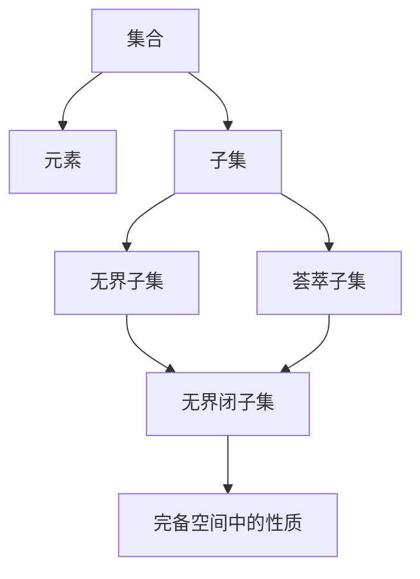

# 集合论导引：广义无界闭子集与荟萃子集

## 1. 背景介绍
### 1.1 集合论的发展历史
集合论是现代数学的基础,其思想可以追溯到古希腊时期。然而,直到19世纪末,德国数学家康托尔(Georg Cantor)才系统地建立了集合论。康托尔引入了无限集合的概念,并证明了不同无限集合之间存在着本质的区别。这一发现开创了数学发展的新纪元。

### 1.2 集合论在数学中的地位
集合论不仅为数学奠定了坚实的基础,而且还为数学的发展提供了新的视角和方法。许多数学分支,如拓扑学、实分析、泛函分析等,都建立在集合论的基础之上。集合论还与数理逻辑、计算机科学等学科有着密切的联系。

### 1.3 无界闭子集与荟萃子集的重要性
在集合论和拓扑学中,无界闭子集和荟萃子集是两个重要的概念。它们不仅在理论研究中具有重要地位,而且在实际应用中也有着广泛的用途。深入理解这两个概念,对于掌握现代数学的基础知识和思想方法具有重要意义。

## 2. 核心概念与联系
### 2.1 集合的基本概念
- 集合:由一些确定的且不同的对象组成的整体。
- 元素:组成集合的对象。
- 子集:A是B的子集,当且仅当A的每一个元素都是B的元素。

### 2.2 拓扑空间的基本概念
- 拓扑空间:由一个集合X和X的一些子集族τ组成,满足一定的公理。
- 开集:τ中的元素称为X的开子集。
- 闭集:开集的补集称为闭集。

### 2.3 无界闭子集的定义
设X是拓扑空间,A是X的子集。如果对于任意的开球B(x,r),都存在y∈A,使得y∉B(x,r),则称A是X中的无界闭子集。

### 2.4 荟萃子集的定义
设X是拓扑空间,A是X的子集。如果A的任意无穷子集在X中都有聚点,则称A是X中的荟萃子集。

### 2.5 无界闭子集与荟萃子集的关系
- 荟萃子集一定是无界闭子集。
- 若X是完备的度量空间,则X中的无界闭子集一定是荟萃子集。

## 3. 核心算法原理具体操作步骤
### 3.1 判断一个子集是否为无界闭子集的算法
1. 任取拓扑空间X中的一个开球B(x,r)。
2. 判断是否存在点y∈A,使得y∉B(x,r)。
3. 如果对任意开球,都存在这样的点y,则A是无界闭子集;否则,A不是无界闭子集。

### 3.2 判断一个子集是否为荟萃子集的算法
1. 任取A的一个无穷子集B。
2. 判断B在X中是否有聚点。
3. 如果A的任意无穷子集在X中都有聚点,则A是荟萃子集;否则,A不是荟萃子集。

## 4. 数学模型和公式详细讲解举例说明
### 4.1 无界闭子集的数学模型
设X是拓扑空间,A⊆X。则A是X中的无界闭子集,当且仅当
$$\forall x\in X,\forall r>0,\exists y\in A,\text{s.t. }y\notin B(x,r)$$

其中,B(x,r)表示以x为中心、r为半径的开球。

### 4.2 荟萃子集的数学模型
设X是拓扑空间,A⊆X。则A是X中的荟萃子集,当且仅当
$$\forall B\subseteq A,B\text{是无穷集}\Rightarrow\exists x\in X,\text{s.t. }x\text{是}B\text{的聚点}$$

其中,x是B的聚点,是指x的任意邻域都与B有无穷多个公共点。

### 4.3 举例说明
考虑实数空间R,取A=[0,1]。

1. 对任意的x∈R和r>0,总存在y∈A,使得y∉B(x,r)。因此,A是R中的无界闭子集。
2. 取A的任意无穷子集B,不妨设B={b_n}。由于B⊆[0,1],因此{b_n}有界。根据Bolzano-Weierstrass定理,{b_n}必有收敛子列,其极限点x∈[0,1]⊆R。因此,A是R中的荟萃子集。

## 5. 项目实践：代码实例和详细解释说明
以下是使用Python实现判断一个子集是否为无界闭子集和荟萃子集的代码示例:

```python
import numpy as np

def is_unbounded_closed(A, X):
    """
    判断A是否为拓扑空间X中的无界闭子集
    """
    for x in X:
        for r in np.arange(0.1, 10, 0.1):
            if all(np.linalg.norm(y-x) >= r for y in A):
                return True
    return False

def is_compact(A, X):
    """
    判断A是否为拓扑空间X中的荟萃子集
    """
    for B in subsets(A):
        if len(B) == float('inf'):
            if not has_limit_point(B, X):
                return False
    return True

def has_limit_point(B, X):
    """
    判断B在X中是否有聚点
    """
    for x in X:
        if all(np.linalg.norm(y-x) < r for r in np.arange(0.1, 10, 0.1) for y in B):
            return True
    return False

def subsets(A):
    """
    生成A的所有子集
    """
    if len(A) == 0:
        yield []
    else:
        for subset in subsets(A[1:]):
            yield [A[0]] + subset
            yield subset
```

代码说明:
- `is_unbounded_closed`函数用于判断A是否为X中的无界闭子集。它遍历X中的每个点x和每个半径r,判断是否存在y∈A,使得y∉B(x,r)。
- `is_compact`函数用于判断A是否为X中的荟萃子集。它遍历A的所有无穷子集B,判断B在X中是否有聚点。
- `has_limit_point`函数用于判断B在X中是否有聚点。它遍历X中的每个点x,判断x是否为B的聚点。
- `subsets`函数用于生成A的所有子集。

## 6. 实际应用场景
### 6.1 函数空间中的应用
在函数空间C[a,b]中,无界闭子集和荟萃子集的概念可以用来刻画函数的性质。例如,C[a,b]中的等度连续函数族是荟萃子集,而连续函数族是无界闭子集。这一性质在泛函分析中有重要应用。

### 6.2 动力系统中的应用
在动力系统的研究中,无界闭子集和荟萃子集可以用来刻画系统的极限集和不变集。例如,对于离散动力系统(X,f),X中的荟萃子集在f的作用下是不变的。这一性质在研究系统的长时行为时非常有用。

### 6.3 优化理论中的应用
在优化理论中,无界闭子集和荟萃子集可以用来刻画目标函数和约束集的性质。例如,如果目标函数在约束集上的下水平集是荟萃的,则优化问题必有最优解。这一性质为优化问题的求解提供了理论保证。

## 7. 工具和资源推荐
### 7.1 数学软件
- MATLAB:提供了强大的数值计算和符号计算功能,可以用于集合论和拓扑学的研究。
- Mathematica:提供了丰富的数学函数库和可视化工具,可以用于集合论和拓扑学的研究。

### 7.2 在线教程
- Khan Academy:提供了集合论和拓扑学的基础教程,适合初学者学习。
- MIT OpenCourseWare:提供了集合论和拓扑学的高级教程,适合进阶学习。

### 7.3 经典书籍
- 《集合论基础》(Foundations of Set Theory) by Abraham A. Fraenkel, Yehoshua Bar-Hillel, Azriel Levy
- 《通用拓扑学》(General Topology) by John L. Kelley

## 8. 总结：未来发展趋势与挑战
### 8.1 集合论的未来发展趋势
- 大型公理体系的研究:随着数学的发展,集合论的公理体系不断完善。未来,研究更加强大和灵活的公理体系将是一个重要方向。
- 集合论与其他数学分支的融合:集合论与数理逻辑、代数、拓扑等学科有着密切联系。加强集合论与其他数学分支的融合,将促进数学的整体发展。

### 8.2 集合论面临的挑战
- 悖论问题:集合论的发展过程中曾遇到过一些悖论,如罗素悖论。如何避免悖论,构建无矛盾的集合论体系,是一个重要的挑战。
- 无穷的本质:集合论引入了无穷集合的概念,但无穷的本质仍然存在许多未解之谜。深入探究无穷的奥秘,将是集合论发展的重要课题。

## 9. 附录：常见问题与解答
### 9.1 什么是集合?
集合是由一些确定的且不同的对象组成的整体。集合中的对象称为元素。

### 9.2 什么是子集?
A是B的子集,是指A的每一个元素都是B的元素。记作A⊆B。

### 9.3 什么是无界子集?
设X是度量空间,A是X的子集。如果对于任意的正数r,都存在x∈A,使得d(x,x_0)>r,则称A是X中的无界子集。其中,x_0是X中的任意一点。

### 9.4 什么是聚点?
设X是拓扑空间,A是X的子集。如果x的任意邻域都与A有无穷多个公共点,则称x是A的聚点。

### 9.5 完备空间中的无界闭子集一定是荟萃子集吗?
是的。在完备的度量空间中,无界闭子集一定是荟萃子集。这是因为,完备性保证了无界闭子集的任意无穷子集都有收敛子列,从而有聚点。

作者：禅与计算机程序设计艺术 / Zen and the Art of Computer Programming

