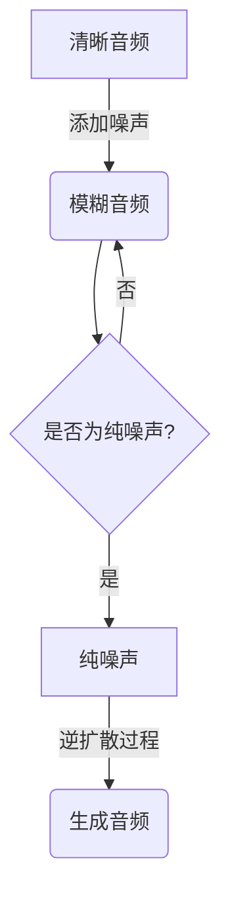

# 音频扩散Audio Diffusion原理与代码实例讲解

## 1.背景介绍

在过去几年中,生成式人工智能模型取得了令人瞩目的进展,尤其是在自然语言处理和计算机视觉领域。然而,音频生成领域的发展相对滞后。最近,扩散模型(Diffusion Model)在音频生成任务中展现出了出色的性能,引起了广泛关注。

音频扩散模型是一种新型的生成模型,它通过学习数据的概率分布,从噪声中生成高保真的音频样本。与传统的自回归模型(Autoregressive Model)相比,扩散模型具有更好的并行性能和更高的样本质量。这使得扩散模型在音频合成、音乐生成、语音转换等领域具有广阔的应用前景。

## 2.核心概念与联系

### 2.1 扩散过程(Forward Diffusion Process)

扩散过程是音频扩散模型的核心部分。它将清晰的音频数据逐步添加高斯噪声,最终将音频完全"扩散"为纯噪声。这个过程可以用马尔可夫链(Markov Chain)来描述,其中每一步都是从当前的音频和噪声中采样下一个更加模糊的音频。数学上,扩散过程可以表示为:

$$
q(\mathbf{x}_t|\mathbf{x}_{t-1}) = \mathcal{N}(\mathbf{x}_t;\sqrt{1-\beta_t}\mathbf{x}_{t-1},\beta_t\mathbf{I})
$$

其中 $\mathbf{x}_t$ 表示第 $t$ 步的音频数据, $\beta_t$ 是一个预先设定的扩散系数,控制了噪声的强度。

### 2.2 逆扩散过程(Reverse Diffusion Process)

逆扩散过程是生成音频的关键步骤。它从纯噪声开始,逐步去除噪声,最终生成清晰的音频数据。这个过程可以用条件概率密度 $p_\theta(\mathbf{x}_{t-1}|\mathbf{x}_t)$ 来建模,其中 $\theta$ 表示模型参数。我们通过最大化如下目标函数来训练模型参数:

$$
\mathbb{E}_{q(\mathbf{x}_{0:T})}\left[\sum_{t=1}^T\log p_\theta(\mathbf{x}_{t-1}|\mathbf{x}_t)\right]
$$

### 2.3 Mermaid流程图



## 3.核心算法原理具体操作步骤

音频扩散模型的核心算法包括以下几个步骤:

1. **预处理**:将原始音频数据进行预处理,例如重采样、幅度归一化等。

2. **扩散过程**:将清晰的音频数据逐步添加高斯噪声,直到完全"扩散"为纯噪声。这个过程由预先设定的扩散系数 $\beta_t$ 控制。

3. **训练逆扩散过程**:从纯噪声开始,利用条件概率密度 $p_\theta(\mathbf{x}_{t-1}|\mathbf{x}_t)$ 逐步去除噪声,最终生成清晰的音频数据。我们通过最大化目标函数来训练模型参数 $\theta$。

4. **采样**:在推理阶段,我们从纯噪声开始,利用训练好的模型参数 $\theta$ 逐步生成音频样本。

5. **后处理**:对生成的音频样本进行后处理,例如去噪、波形修剪等。

## 4.数学模型和公式详细讲解举例说明

### 4.1 扩散过程

扩散过程可以用马尔可夫链来描述,其中每一步都是从当前的音频和噪声中采样下一个更加模糊的音频。数学上,扩散过程可以表示为:

$$
q(\mathbf{x}_t|\mathbf{x}_{t-1}) = \mathcal{N}(\mathbf{x}_t;\sqrt{1-\beta_t}\mathbf{x}_{t-1},\beta_t\mathbf{I})
$$

其中 $\mathbf{x}_t$ 表示第 $t$ 步的音频数据, $\beta_t$ 是一个预先设定的扩散系数,控制了噪声的强度。

例如,假设我们有一段清晰的音频数据 $\mathbf{x}_0$,我们希望在第一步将其添加一些噪声,得到 $\mathbf{x}_1$。根据上式,我们可以从 $\mathcal{N}(\mathbf{x}_1;\sqrt{1-\beta_1}\mathbf{x}_0,\beta_1\mathbf{I})$ 这个高斯分布中采样得到 $\mathbf{x}_1$。随着 $t$ 增加, $\beta_t$ 也会增加,噪声的强度也会增强。

### 4.2 逆扩散过程

逆扩散过程是生成音频的关键步骤。它从纯噪声开始,逐步去除噪声,最终生成清晰的音频数据。这个过程可以用条件概率密度 $p_\theta(\mathbf{x}_{t-1}|\mathbf{x}_t)$ 来建模,其中 $\theta$ 表示模型参数。我们通过最大化如下目标函数来训练模型参数:

$$
\mathbb{E}_{q(\mathbf{x}_{0:T})}\left[\sum_{t=1}^T\log p_\theta(\mathbf{x}_{t-1}|\mathbf{x}_t)\right]
$$

这个目标函数实际上是在最小化 $\mathbf{x}_{t-1}$ 和 $\mathbf{x}_t$ 之间的负对数似然。通过训练,我们希望模型能够从 $\mathbf{x}_t$ 中恢复出 $\mathbf{x}_{t-1}$,即去除噪声。

例如,假设我们已经得到了一个模糊的音频数据 $\mathbf{x}_t$,我们希望从中恢复出清晰的音频数据 $\mathbf{x}_{t-1}$。根据上式,我们可以最大化 $\log p_\theta(\mathbf{x}_{t-1}|\mathbf{x}_t)$,使得模型输出的 $\mathbf{x}_{t-1}$ 与真实的 $\mathbf{x}_{t-1}$ 尽可能接近。

## 5.项目实践:代码实例和详细解释说明

以下是一个简单的音频扩散模型实现,基于 PyTorch 框架。

### 5.1 导入必要的库

```python
import torch
import torch.nn as nn
import torchaudio
```

### 5.2 定义扩散过程

```python
class GaussianDiffusion(nn.Module):
    def __init__(self, num_timesteps):
        super().__init__()
        self.num_timesteps = num_timesteps
        self.betas = torch.linspace(1e-4, 0.02, num_timesteps)

    def forward(self, x, t):
        batch_size = x.shape[0]
        noise = torch.randn_like(x)
        alpha = 1 - self.betas[t]
        alpha_bar = torch.sqrt(alpha)
        
        mean = alpha_bar * x
        variance = 1 - alpha
        
        noisy_x = mean + torch.sqrt(variance) * noise
        return noisy_x
```

这个类实现了扩散过程。`forward`函数接受原始音频数据 `x` 和时间步 `t`作为输入,并返回添加了噪声的音频数据。`betas`是预先设定的扩散系数。

### 5.3 定义逆扩散过程

```python
class Denoiser(nn.Module):
    def __init__(self):
        super().__init__()
        self.conv1 = nn.Conv1d(1, 32, kernel_size=3, padding=1)
        self.conv2 = nn.Conv1d(32, 32, kernel_size=3, padding=1)
        self.conv3 = nn.Conv1d(32, 1, kernel_size=3, padding=1)
        self.relu = nn.ReLU()

    def forward(self, x, t):
        t = t.unsqueeze(-1)
        t = torch.ones_like(x) * t
        x = torch.cat([x, t], dim=1)
        
        x = self.relu(self.conv1(x))
        x = self.relu(self.conv2(x))
        x = self.conv3(x)
        return x
```

这个类实现了逆扩散过程。`forward`函数接受添加了噪声的音频数据 `x` 和时间步 `t`作为输入,并返回去噪后的音频数据。这里使用了一个简单的卷积神经网络作为去噪器。

### 5.4 训练过程

```python
diffusion = GaussianDiffusion(num_timesteps=1000)
denoiser = Denoiser()
optimizer = torch.optim.Adam(denoiser.parameters(), lr=1e-3)

for epoch in range(num_epochs):
    for x in dataset:
        t = torch.randint(0, diffusion.num_timesteps, (x.shape[0],))
        noisy_x = diffusion(x, t)
        
        denoised = denoiser(noisy_x, t)
        loss = torch.mean((denoised - x) ** 2)
        
        optimizer.zero_grad()
        loss.backward()
        optimizer.step()
```

这段代码实现了训练过程。我们首先实例化扩散过程和逆扩散过程的模型。然后,我们遍历数据集,对每个音频样本执行以下操作:

1. 随机选择一个时间步 `t`。
2. 使用扩散过程模型在时间步 `t` 处添加噪声,得到 `noisy_x`。
3. 使用逆扩散过程模型(去噪器)对 `noisy_x` 进行去噪,得到 `denoised`。
4. 计算 `denoised` 与原始音频 `x` 之间的均方误差作为损失函数。
5. 反向传播并更新模型参数。

### 5.5 采样过程

```python
def sample(model, diffusion, num_samples, sample_length):
    samples = torch.randn(num_samples, 1, sample_length)
    
    for t in reversed(range(diffusion.num_timesteps)):
        noise = torch.randn_like(samples)
        alpha = 1 - diffusion.betas[t]
        alpha_bar = torch.sqrt(alpha)
        
        samples = (1 / alpha_bar) * (samples - (1 - alpha) / torch.sqrt(1 - diffusion.betas[t]) * model(samples, t))
        if t > 0:
            noise_factor = torch.sqrt(diffusion.betas[t])
            samples += noise_factor * noise
    
    return samples
```

这个函数实现了采样过程。我们从纯噪声开始,利用训练好的去噪器模型和扩散过程模型,逐步去除噪声,最终生成音频样本。

## 6.实际应用场景

音频扩散模型在以下领域具有广泔的应用前景:

1. **音乐生成**: 利用扩散模型生成新的音乐作品,为音乐创作提供灵感和素材。

2. **语音合成**: 将文本转换为自然流畅的语音,可应用于虚拟助手、有声读物等场景。

3. **音频增强**: 通过去噪、降噪等技术,提高音频的清晰度和质量。

4. **音频转换**: 将一种音频(如人声)转换为另一种音频(如乐器声音),实现音频风格迁移。

5. **音频插值**: 在两个给定的音频之间生成平滑过渡的中间音频,用于音频编辑和混音。

6. **声音设计**: 为游戏、电影等创造出新颖的声音效果。

## 7.工具和资源推荐

以下是一些有用的工具和资源,可以帮助您更好地理解和实践音频扩散模型:

1. **Diffwave**: 一个基于扩散模型的开源音频合成库,由 NVIDIA 开发。(https://github.com/NVIDIA/diffwave)

2. **Demucs**: 一个基于扩散模型的开源音乐源分离库,由 Meta AI 开发。(https://github.com/facebookresearch/demucs)

3. **Stable Diffusion**: 一个流行的文本到图像的扩散模型,也可以用于生成音频。(https://github.com/CompVis/stable-diffusion)

4. **Hugging Face Spaces**: 一个在线平台,提供了各种预训练的扩散模型供试用。(https://huggingface.co/spaces)

5. **Weights & Biases**: 一个机器学习实验跟踪和可视化工具,可以用于监控扩散模型的训练过程。(https://wandb.ai/)

## 8.