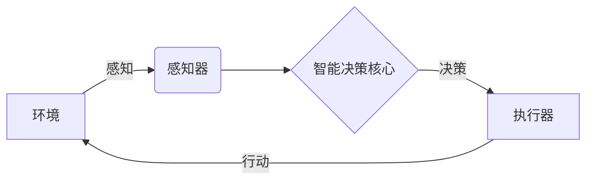

# AI Agent: AI的下一个风口 技术的发展趋势

## 1. 背景介绍

### 1.1 人工智能的发展历程

人工智能(Artificial Intelligence, AI)是当代科技发展的前沿领域,它的起源可以追溯到20世纪50年代。在过去的几十年里,AI技术经历了起伏跌宕的发展历程,从最初的知识库系统、专家系统,到机器学习算法的兴起,再到当前的深度学习浪潮。

### 1.2 AI Agent的重要性

在人工智能的大环境下,AI Agent(智能代理)作为一种通用的AI系统,正在引领着AI技术的新风向。AI Agent是指能够感知环境、做出决策并采取行动的自主系统,旨在帮助人类完成各种复杂任务。随着AI技术的不断进步,AI Agent将在越来越多的领域发挥关键作用。

## 2. 核心概念与联系

### 2.1 AI Agent的定义

AI Agent是一种具备自主性、响应性和主动性的智能系统,能够感知环境、处理信息、做出决策并采取行动,以实现预定的目标。它由感知器(Sensors)、执行器(Actuators)和智能决策核心(Intelligent Decision Core)三个核心组件组成。



### 2.2 AI Agent的分类

根据不同的决策机制,AI Agent可以分为以下几种类型:

- 反应型Agent(Reactive Agent):只根据当前环境状态做出反应,没有内部状态。
- 基于模型的Agent(Model-based Agent):利用环境模型进行规划和决策。
- 基于目标的Agent(Goal-based Agent):根据预设目标制定行动计划。
- 基于效用的Agent(Utility-based Agent):根据效用函数最大化预期效用。
- 学习型Agent(Learning Agent):通过学习算法优化决策过程。

### 2.3 AI Agent与其他AI系统的关系

AI Agent是一种通用的AI系统框架,可以集成多种AI技术,如机器学习、自然语言处理、计算机视觉等。许多具体的AI应用系统,如聊天机器人、自动驾驶汽车、智能家居助理等,都可以看作是特定领域的AI Agent实例。

## 3. 核心算法原理具体操作步骤

### 3.1 感知环境

AI Agent需要通过各种传感器获取环境信息,如视觉、听觉、触觉等。常见的感知算法包括:

1. 计算机视觉算法(如目标检测、图像分割等)
2. 自然语言处理算法(如语音识别、文本理解等)
3. 传感器融合算法(将多源传感器数据整合)

### 3.2 表征状态

获取的环境信息需要转换为Agent可以理解的内部状态表示,常用的表示方法有:

1. 特征向量(Feature Vector)
2. 符号逻辑表达式
3. 时序数据(如视频、语音等)

### 3.3 决策与规划

根据当前状态和目标,Agent需要选择合适的行动。主要的决策算法有:

1. 搜索算法(如A*、GBFS等图搜索算法)
2. 规划算法(如STRIPS、HSP等经典规划算法)
3. 强化学习算法(如Q-Learning、Policy Gradient等)
4. 多智能体决策算法(如博弈论、协作过滤等)

### 3.4 执行行动

Agent根据决策结果,通过执行器对环境产生影响,如机器人运动控制、语音合成等。

### 3.5 学习与优化

许多AI Agent需要通过学习来优化自身的决策模型,以提高性能。常见的学习算法有:

1. 监督学习算法(如深度神经网络)
2. 无监督学习算法(如聚类、降维等)
3. 强化学习算法
4. 迁移学习算法(跨领域知识迁移)

## 4. 数学模型和公式详细讲解举例说明  

### 4.1 马尔可夫决策过程(MDP)

马尔可夫决策过程是AI Agent决策的重要数学模型,可以形式化描述Agent与环境的交互过程。

MDP由一个四元组 $(S, A, P, R)$ 定义:
- $S$ 是有限的状态集合
- $A$ 是有限的行动集合 
- $P(s'|s,a)$ 是状态转移概率,表示在状态 $s$ 下执行行动 $a$ 后转移到状态 $s'$ 的概率
- $R(s,a,s')$ 是即时奖励函数,表示在状态 $s$ 下执行行动 $a$ 后转移到状态 $s'$ 所获得的奖励

Agent的目标是找到一个策略 $\pi: S \rightarrow A$,使得期望的累积奖励最大:

$$\max_\pi \mathbb{E}\left[\sum_{t=0}^\infty \gamma^t R(s_t, a_t, s_{t+1})\right]$$

其中 $\gamma \in [0, 1]$ 是折现因子,用于权衡即时奖励和长期奖励。

### 4.2 值函数和Q函数

值函数 $V^\pi(s)$ 表示在策略 $\pi$ 下,从状态 $s$ 开始执行所能获得的期望累积奖励:

$$V^\pi(s) = \mathbb{E}_\pi\left[\sum_{t=0}^\infty \gamma^t R(s_t, a_t, s_{t+1}) \big| s_0 = s\right]$$

Q函数 $Q^\pi(s,a)$ 表示在策略 $\pi$ 下,从状态 $s$ 执行行动 $a$ 后所能获得的期望累积奖励:

$$Q^\pi(s,a) = \mathbb{E}_\pi\left[\sum_{t=0}^\infty \gamma^t R(s_t, a_t, s_{t+1}) \big| s_0 = s, a_0 = a\right]$$

值函数和Q函数满足以下递推关系(Bellman方程):

$$\begin{aligned}
V^\pi(s) &= \sum_{a \in A} \pi(a|s)Q^\pi(s,a) \\
Q^\pi(s,a) &= R(s,a) + \gamma \sum_{s' \in S} P(s'|s,a)V^\pi(s')
\end{aligned}$$

这为求解最优策略提供了理论基础。

### 4.3 策略迭代与值迭代

求解最优策略的经典算法有策略迭代(Policy Iteration)和值迭代(Value Iteration)。

策略迭代算法包含两个阶段交替进行:

1. 策略评估(Policy Evaluation):对给定策略 $\pi$ 求解其值函数 $V^\pi$
2. 策略改善(Policy Improvement):根据值函数 $V^\pi$ 构造一个更优的策略 $\pi'$

值迭代算法则直接迭代更新值函数,使其收敛到最优值函数 $V^*$,然后从 $V^*$ 导出最优策略 $\pi^*$。

这些经典算法为现代强化学习算法奠定了理论基础。

## 5. 项目实践:代码实例和详细解释说明

以下是一个使用Python实现的简单格子世界(GridWorld)AI Agent示例,基于Q-Learning算法:

```python
import numpy as np

# 定义格子世界环境
WORLD = np.array([
    [0, 0, 0, 1],
    [0, None, 0, -1],
    [0, 0, 0, 0]
])

# 定义行动集合
ACTIONS = ['left', 'right', 'up', 'down']

# 初始化Q表
Q = np.zeros((WORLD.shape + (4,)))

# 设置学习率和折现因子
ALPHA = 0.1
GAMMA = 0.9

# 定义奖励函数
def get_reward(state, action):
    next_state = get_next_state(state, action)
    if WORLD[next_state] == 1:
        return 1
    elif WORLD[next_state] == -1:
        return -1
    else:
        return 0

# 定义状态转移函数
def get_next_state(state, action):
    row, col = state
    if action == 'left':
        col = max(col - 1, 0)
    elif action == 'right':
        col = min(col + 1, WORLD.shape[1] - 1)
    elif action == 'up':
        row = max(row - 1, 0)
    elif action == 'down':
        row = min(row + 1, WORLD.shape[0] - 1)
    next_state = (row, col)
    if WORLD[next_state] is None:
        next_state = state
    return next_state

# Q-Learning算法
for episode in range(1000):
    state = (0, 0)  # 初始状态
    while WORLD[state] != 1 and WORLD[state] != -1:
        action_idx = np.argmax(Q[state])
        action = ACTIONS[action_idx]
        next_state = get_next_state(state, action)
        reward = get_reward(state, action)
        Q[state][action_idx] += ALPHA * (reward + GAMMA * np.max(Q[next_state]) - Q[state][action_idx])
        state = next_state

# 根据Q表得到最优策略
policy = {(row, col): ACTIONS[np.argmax(Q[row, col])] for row in range(WORLD.shape[0]) for col in range(WORLD.shape[1])}

print('最优策略:')
for row in range(WORLD.shape[0]):
    for col in range(WORLD.shape[1]):
        if WORLD[row, col] == 0:
            print(f'({row}, {col}): {policy[(row, col)]}', end=' ')
    print()
```

上述代码实现了一个简单的Q-Learning Agent,用于求解格子世界问题。主要步骤如下:

1. 定义格子世界环境,包括状态集合、行动集合和奖励函数。
2. 初始化Q表,用于存储每个状态-行动对的Q值估计。
3. 实现状态转移函数和奖励函数。
4. 使用Q-Learning算法迭代更新Q表。
5. 根据最终的Q表得到最优策略。

该示例展示了如何将理论知识应用于实际问题,并使用Python进行编程实现。读者可以在此基础上进行扩展和改进,以加深对AI Agent的理解。

## 6. 实际应用场景

AI Agent技术在诸多领域都有广泛的应用前景,下面列举几个典型场景:

### 6.1 智能家居助理

智能家居助理是一种特殊的AI Agent,它能够通过语音、视觉等多模态交互方式,感知家居环境并执行各种家居控制任务,如调节温度、打开电器、播放音乐等。目前,亚马逊的Alexa、苹果的Siri、谷歌的Google Assistant等都是这一类型的AI Agent。

### 6.2 自动驾驶汽车

自动驾驶汽车系统是一种复杂的AI Agent,需要融合计算机视觉、决策规划、运动控制等多种技术。它通过感知路况、交通信号等环境信息,并结合导航目标,规划出最优路线和行驶策略,从而实现自主驾驶。

### 6.3 机器人系统

机器人系统通常被设计为一种AI Agent,能够根据环境感知信息做出决策并执行相应的机械运动。机器人可以应用于工业生产、家居服务、医疗护理、探索任务等多个领域。

### 6.4 游戏AI

游戏AI是AI Agent理论和技术的一个重要应用场景。游戏AI Agent需要根据游戏规则和状态,选择最优策略来对抗其他玩家或者完成游戏目标。经典的例子包括国际象棋AI、星际争霸AI等。

### 6.5 网络安全系统

网络安全系统可以被设计为一种AI Agent,通过持续监控网络流量和系统日志,感知潜在的安全威胁,并自主地执行防御和修复操作,以保护网络系统的安全。

## 7. 工具和资源推荐  

对于希望学习和实践AI Agent技术的读者,这里推荐一些有用的工具和资源:

### 7.1 AI Agent开发框架

- PyTorch Agents: Facebook AI Research开源的PyTorch库,提供了多种经典AI Agent算法的实现。
- RLlib: Ray项目中的一个可扩展的强化学习库,支持训练各种AI Agent。
- AI Gym: OpenAI开源的AI Agent模拟环境集合,涵盖多种经典问题。

### 7.2 AI Agent教程和课程

- AI Agent课程(Coursera): 加州大学伯克利分校的在线公开课程,系统讲解AI Agent理论和实践。
- 人工智能导论(edX): 哈佛大学的在线