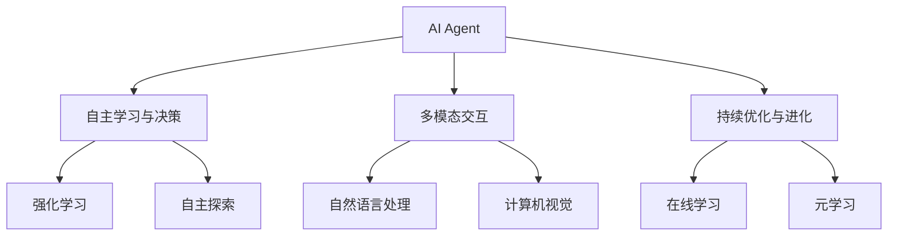

# AI Agent: AI的下一个风口 生成式AI的崛起

## 1. 背景介绍
### 1.1 人工智能的发展历程
#### 1.1.1 早期人工智能
#### 1.1.2 机器学习时代 
#### 1.1.3 深度学习的崛起

### 1.2 生成式AI的兴起
#### 1.2.1 生成式模型的概念
#### 1.2.2 生成式AI的应用场景
#### 1.2.3 生成式AI的发展现状

## 2. 核心概念与联系
### 2.1 AI Agent的定义
#### 2.1.1 智能体的概念
#### 2.1.2 AI Agent的特点
#### 2.1.3 AI Agent与传统AI的区别

### 2.2 生成式AI与AI Agent的关系
#### 2.2.1 生成式AI为AI Agent赋能
#### 2.2.2 AI Agent推动生成式AI的应用
#### 2.2.3 二者的协同发展

### 2.3 AI Agent的核心能力
#### 2.3.1 自主学习与决策
#### 2.3.2 多模态交互
#### 2.3.3 持续优化与进化



## 3. 核心算法原理具体操作步骤
### 3.1 生成式预训练模型(GPT)
#### 3.1.1 Transformer结构
#### 3.1.2 自回归语言模型
#### 3.1.3 预训练与微调

### 3.2 对比学习
#### 3.2.1 正负样本构建
#### 3.2.2 编码器训练
#### 3.2.3 对比损失函数

### 3.3 强化学习
#### 3.3.1 马尔可夫决策过程
#### 3.3.2 值函数与策略梯度
#### 3.3.3 探索与利用平衡

## 4. 数学模型和公式详细讲解举例说明
### 4.1 Transformer的注意力机制
$$
Attention(Q,K,V) = softmax(\frac{QK^T}{\sqrt{d_k}})V
$$
其中，$Q$、$K$、$V$ 分别表示查询、键、值向量，$d_k$ 为键向量的维度。

### 4.2 对比损失函数
$$
\mathcal{L}_{contrast} = -\log \frac{\exp(sim(z_i, z_j)/\tau)}{\sum_{k=1}^{2N} \mathbbm{1}_{[k \neq i]} \exp(sim(z_i, z_k)/\tau)}
$$
其中，$z_i$、$z_j$ 为正样本对的编码，$\tau$ 为温度超参数，$\mathbbm{1}$ 为指示函数。

### 4.3 策略梯度定理
$$
\nabla_\theta J(\theta) = \mathbb{E}_{\tau \sim \pi_\theta}[\sum_{t=0}^{T} \nabla_\theta \log \pi_\theta(a_t|s_t) Q^{\pi_\theta}(s_t, a_t)]
$$
其中，$\pi_\theta$ 为参数化策略，$\tau$ 为轨迹，$Q^{\pi_\theta}$ 为状态-动作值函数。

## 5. 项目实践：代码实例和详细解释说明
### 5.1 使用PyTorch实现Transformer
```python
import torch
import torch.nn as nn

class MultiHeadAttention(nn.Module):
    def __init__(self, d_model, num_heads):
        super().__init__()
        self.d_model = d_model
        self.num_heads = num_heads
        self.head_dim = d_model // num_heads
        
        self.q_linear = nn.Linear(d_model, d_model)
        self.k_linear = nn.Linear(d_model, d_model)
        self.v_linear = nn.Linear(d_model, d_model)
        self.out_linear = nn.Linear(d_model, d_model)
    
    def forward(self, query, key, value, mask=None):
        batch_size = query.size(0)
        
        Q = self.q_linear(query).view(batch_size, -1, self.num_heads, self.head_dim).transpose(1, 2)
        K = self.k_linear(key).view(batch_size, -1, self.num_heads, self.head_dim).transpose(1, 2)
        V = self.v_linear(value).view(batch_size, -1, self.num_heads, self.head_dim).transpose(1, 2)
        
        scores = torch.matmul(Q, K.transpose(-2, -1)) / (self.head_dim ** 0.5)
        
        if mask is not None:
            scores = scores.masked_fill(mask == 0, float("-inf"))
        
        attention = torch.softmax(scores, dim=-1)
        x = torch.matmul(attention, V)
        x = x.transpose(1, 2).contiguous().view(batch_size, -1, self.d_model)
        
        return self.out_linear(x)
```
上述代码实现了Transformer中的多头注意力机制。主要步骤包括：
1. 将输入的查询、键、值向量通过线性变换映射到多头空间。
2. 计算注意力分数，并进行尺度变换。
3. 对注意力分数应用Softmax函数，得到注意力权重。 
4. 将注意力权重与值向量相乘，得到加权后的表示。
5. 将多头的结果拼接并通过线性变换得到最终的输出。

### 5.2 使用TensorFlow实现对比学习
```python
import tensorflow as tf

def contrastive_loss(z_i, z_j, temperature=0.1):
    batch_size = tf.shape(z_i)[0]
    
    z_i_norm = tf.math.l2_normalize(z_i, axis=1)
    z_j_norm = tf.math.l2_normalize(z_j, axis=1)
    
    similarity_matrix = tf.matmul(z_i_norm, z_j_norm, transpose_b=True)
    sim_ij = tf.linalg.diag_part(similarity_matrix)
    
    numerator = tf.exp(sim_ij / temperature)
    denominator = tf.reduce_sum(tf.exp(similarity_matrix / temperature), axis=1) - numerator
    
    loss = -tf.math.log(numerator / (numerator + denominator))
    loss = tf.reduce_mean(loss)
    
    return loss
```
上述代码实现了对比学习中的对比损失函数。主要步骤包括：
1. 对编码后的正样本对进行L2归一化。
2. 计算归一化后的正样本对之间的相似度矩阵。
3. 提取对角线元素作为正样本对的相似度。
4. 计算对比损失，即最大化正样本对的相似度，同时最小化负样本对的相似度。
5. 对批次内的损失取平均值作为最终的损失函数。

### 5.3 使用PyTorch实现强化学习
```python
import torch
import torch.nn as nn
import torch.optim as optim

class PolicyNetwork(nn.Module):
    def __init__(self, state_dim, action_dim, hidden_dim):
        super().__init__()
        self.fc1 = nn.Linear(state_dim, hidden_dim)
        self.fc2 = nn.Linear(hidden_dim, action_dim)
    
    def forward(self, state):
        x = torch.relu(self.fc1(state))
        x = self.fc2(x)
        return torch.softmax(x, dim=-1)

def train_policy_gradient(env, policy_net, num_episodes, gamma=0.99, lr=0.001):
    optimizer = optim.Adam(policy_net.parameters(), lr=lr)
    
    for episode in range(num_episodes):
        state = env.reset()
        episode_rewards = []
        episode_log_probs = []
        
        while True:
            state_tensor = torch.FloatTensor(state).unsqueeze(0)
            action_probs = policy_net(state_tensor)
            action = torch.multinomial(action_probs, 1).item()
            
            next_state, reward, done, _ = env.step(action)
            
            episode_rewards.append(reward)
            episode_log_probs.append(torch.log(action_probs.squeeze(0)[action]))
            
            if done:
                break
            
            state = next_state
        
        episode_rewards = torch.FloatTensor(episode_rewards)
        episode_log_probs = torch.stack(episode_log_probs)
        
        discounted_rewards = torch.zeros_like(episode_rewards)
        running_add = 0
        for t in reversed(range(len(episode_rewards))):
            running_add = running_add * gamma + episode_rewards[t]
            discounted_rewards[t] = running_add
        
        discounted_rewards = (discounted_rewards - discounted_rewards.mean()) / (discounted_rewards.std() + 1e-7)
        
        policy_loss = -torch.sum(episode_log_probs * discounted_rewards)
        
        optimizer.zero_grad()
        policy_loss.backward()
        optimizer.step()
```
上述代码实现了使用PyTorch进行策略梯度的强化学习训练。主要步骤包括：
1. 定义策略网络，用于根据状态生成动作概率分布。
2. 在每个episode中，与环境交互并记录轨迹数据，包括状态、动作、奖励等。
3. 计算折扣累积奖励，作为每个动作的权重。
4. 计算策略损失，即最大化加权后的对数动作概率。
5. 使用梯度下降法更新策略网络的参数，优化策略。

## 6. 实际应用场景
### 6.1 智能客服
#### 6.1.1 基于生成式AI的对话系统
#### 6.1.2 个性化问答与推荐
#### 6.1.3 情感分析与用户满意度评估

### 6.2 智能助理
#### 6.2.1 语音交互与自然语言理解
#### 6.2.2 任务规划与执行
#### 6.2.3 个性化服务与用户适应

### 6.3 自动驾驶
#### 6.3.1 环境感知与状态估计
#### 6.3.2 决策规划与控制
#### 6.3.3 异常情况处理与风险评估

## 7. 工具和资源推荐
### 7.1 机器学习框架
- TensorFlow: https://www.tensorflow.org/
- PyTorch: https://pytorch.org/
- Keras: https://keras.io/

### 7.2 开源数据集
- ImageNet: http://www.image-net.org/
- COCO: https://cocodataset.org/
- SQuAD: https://rajpurkar.github.io/SQuAD-explorer/

### 7.3 学习资源
- 吴恩达的机器学习课程: https://www.coursera.org/learn/machine-learning
- 李飞飞的CS231n课程: http://cs231n.stanford.edu/
- 动手学深度学习: https://zh.d2l.ai/

## 8. 总结：未来发展趋势与挑战
### 8.1 AI Agent的发展趋势
#### 8.1.1 多模态融合与交互
#### 8.1.2 自主学习与持续进化
#### 8.1.3 人机协作与共生

### 8.2 生成式AI的发展趋势
#### 8.2.1 大规模预训练模型
#### 8.2.2 可解释性与可控性
#### 8.2.3 跨领域迁移与适应

### 8.3 面临的挑战
#### 8.3.1 数据隐私与安全
#### 8.3.2 算法偏差与公平性
#### 8.3.3 伦理与社会影响

## 9. 附录：常见问题与解答
### 9.1 什么是AI Agent？与传统AI有何不同？
AI Agent是一种具有自主学习、决策和交互能力的智能体，能够根据环境和任务的变化不断优化和进化。相比传统的AI系统，AI Agent更加灵活、适应性更强，能够处理更加复杂多变的现实世界问题。

### 9.2 生成式AI的原理是什么？与判别式模型有何区别？
生成式AI通过学习数据的生成过程，构建一个概率模型来刻画数据的分布特征。与判别式模型直接学习输入到输出的映射关系不同，生成式模型能够生成与训练数据相似的新样本，具有更强的表达能力和泛化能力。

### 9.3 如何评估AI Agent的性能？有哪些常用的指标？
评估AI Agent的性能需要考虑多个方面，包括任务完成质量、学习效率、泛化能力、鲁棒性等。常用的评估指标有准确率、召回率、F1值、平均奖励、成功率等，需要根据具体任务和场景选择合适的指标。同时，还需要关注AI Agent的可解释性、安全性和伦理影响等因素。

作者：禅与计算机程序设计艺术 / Zen and the Art of Computer Programming