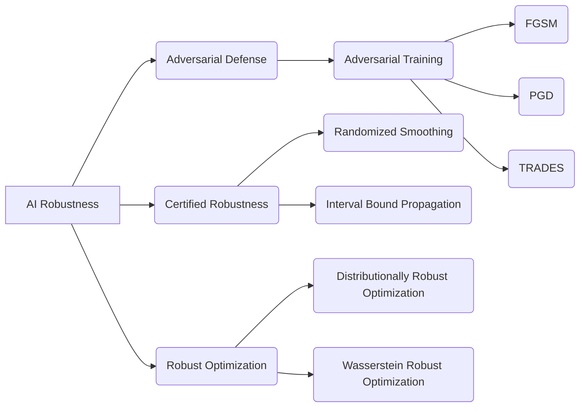

# AI Robustness原理与代码实例讲解

## 1.背景介绍
### 1.1 AI系统面临的挑战
#### 1.1.1 对抗攻击
#### 1.1.2 数据漂移
#### 1.1.3 模型泛化能力不足
### 1.2 AI Robustness的重要性
#### 1.2.1 保障AI系统安全
#### 1.2.2 提升AI模型性能
#### 1.2.3 增强用户信任

## 2.核心概念与联系
### 2.1 Robustness的定义
#### 2.1.1 模型鲁棒性
#### 2.1.2 数据鲁棒性 
#### 2.1.3 系统鲁棒性
### 2.2 Robustness与其他概念的关系
#### 2.2.1 Robustness与Generalization
#### 2.2.2 Robustness与Adversarial Defense
#### 2.2.3 Robustness与Interpretability

## 3.核心算法原理具体操作步骤
### 3.1 Adversarial Training
#### 3.1.1 FGSM
#### 3.1.2 PGD
#### 3.1.3 TRADES
### 3.2 Certified Robustness
#### 3.2.1 Randomized Smoothing
#### 3.2.2 Interval Bound Propagation
### 3.3 Robust Optimization
#### 3.3.1 Distributionally Robust Optimization
#### 3.3.2 Wasserstein Robust Optimization

## 4.数学模型和公式详细讲解举例说明 
### 4.1 Adversarial Training的数学原理
#### 4.1.1 对抗样本的生成
$$ \tilde{x} = x + \epsilon \cdot sign(\nabla_x L(\theta, x, y)) $$
#### 4.1.2 Robust Error的定义
$$ R_{adv}(f_\theta) = \mathbb{E}_{(x,y)\sim D} \left[\max_{\delta \in \Delta} L(f_\theta(x+\delta), y)\right] $$
### 4.2 Randomized Smoothing的数学原理
#### 4.2.1 Smoothed Classifier
$$ g(x) = \arg\max_{c \in \mathcal{Y}} \mathbb{P}(f(x+\epsilon)=c), \quad \epsilon \sim \mathcal{N}(0,\sigma^2I) $$
#### 4.2.2 Certified Radius
$$ R = \frac{\sigma}{2}(\Phi^{-1}(\underline{p_A})-\Phi^{-1}(\overline{p_B})) $$

## 5.项目实践：代码实例和详细解释说明
### 5.1 Adversarial Training with PyTorch
```python
def fgsm_attack(model, x, y, epsilon):
    x_adv = x.detach().clone()
    x_adv.requires_grad = True
    loss = F.cross_entropy(model(x_adv), y)
    model.zero_grad()
    loss.backward()
    
    x_adv = x_adv + epsilon * x_adv.grad.sign()
    x_adv = torch.clamp(x_adv, 0, 1)
    
    return x_adv

def train(model, train_loader, optimizer, epsilon):
    model.train()
    for x, y in train_loader:
        x, y = x.cuda(), y.cuda()
        x_adv = fgsm_attack(model, x, y, epsilon)
        
        optimizer.zero_grad()
        loss = F.cross_entropy(model(x_adv), y)
        loss.backward()
        optimizer.step()
```
这段代码实现了FGSM对抗训练。首先定义了`fgsm_attack`函数生成对抗样本，然后在训练过程中，将原始样本替换为对抗样本进行训练，提升模型的鲁棒性。

### 5.2 Randomized Smoothing with NumPy
```python
def predict(model, x, num_samples, sigma):
    counts = np.zeros(num_classes)
    for _ in range(num_samples):
        noise = np.random.normal(0, sigma, size=x.shape)
        x_noisy = x + noise
        x_noisy = np.clip(x_noisy, 0, 1)
        pred = model.predict(x_noisy)
        counts[pred] += 1
    
    return np.argmax(counts)

def certify(model, x, num_samples, sigma, alpha):
    counts = np.zeros(num_classes)
    for _ in range(num_samples):
        noise = np.random.normal(0, sigma, size=x.shape)
        x_noisy = x + noise
        x_noisy = np.clip(x_noisy, 0, 1)
        pred = model.predict(x_noisy)
        counts[pred] += 1
    
    top2 = counts.argsort()[::-1][:2]  
    p_A, p_B = counts[top2] / num_samples
    
    radius = sigma / 2 * (norm.ppf(p_A) - norm.ppf(p_B))
    return top2[0], radius
```
这段代码实现了Randomized Smoothing的预测和认证过程。`predict`函数通过对输入添加高斯噪声，进行多次采样，返回出现次数最多的类别作为预测结果。`certify`函数在预测的基础上，计算经过平滑后的分类器的置信半径，给出鲁棒性的理论保证。

## 6.实际应用场景
### 6.1 自动驾驶
自动驾驶系统需要具备很强的鲁棒性，能够应对各种复杂多变的道路环境和极端天气情况。可以利用Adversarial Training等技术，提升感知模型对对抗攻击的防御能力，保障行车安全。

### 6.2 人脸识别
人脸识别系统同样面临着数据漂移和对抗攻击的挑战，例如佩戴眼镜、口罩等配饰，会导致识别准确率下降。引入Randomized Smoothing等方法，可以在保证较高准确率的同时，提供鲁棒性保证，增强系统的可靠性。

### 6.3 医疗影像诊断
医学影像数据的获取成本较高，样本量有限，且不同医院、不同设备采集的数据分布差异较大，需要具备良好的鲁棒性和泛化能力。使用Robust Optimization方法，可以显式地考虑数据分布的偏移，学习一个在最坏情况下仍然表现良好的模型。

## 7.工具和资源推荐
- Adversarial Robustness Toolbox (ART): 一个专门用于对抗鲁棒性研究的Python库，包含了多种主流的攻防算法。
- RobustBench: 一个评测和比较鲁棒性算法的基准测试平台，收录了常见的数据集和模型。
- Foolbox: 一个Python工具箱，用于创建和分析对抗样本，支持多个深度学习框架。
- TRADES和MART的官方代码仓库: 两种先进的对抗训练算法的参考实现。
- Randomized Smoothing的官方代码仓库: Randomized Smoothing认证鲁棒性的参考实现。

## 8.总结：未来发展趋势与挑战
### 8.1 与Domain Generalization的结合
如何在模型部署时面对全新的数据分布，仍然保持较好的鲁棒性，是一个亟待解决的问题。将Domain Generalization与Robustness的思想结合，探索更加通用的鲁棒学习范式，是一大研究方向。

### 8.2 Robustness与其他目标的权衡
过分追求模型的鲁棒性，往往会损失一定的标准准确率。如何权衡准确率、鲁棒性、计算开销等多个目标，设计更加实用的鲁棒学习算法，是未来的一个重要挑战。

### 8.3 更多真实场景的验证
目前的鲁棒性研究主要集中在图像分类等简单任务上，亟需将这些方法拓展到如检测、分割等更复杂的任务中，并在更多真实场景中进行验证，以评估它们的实用性。

## 9.附录：常见问题与解答
### Q1: 对抗训练会显著增加训练时间和计算开销吗？
A1: 由于对抗训练需要在每个训练步骤生成对抗样本，因此训练时间和计算开销会有所增加。但是可以通过一些优化技巧如FGSM、免梯度对抗训练等方法，在保证鲁棒性的同时，尽量减小额外开销。

### Q2: Randomized Smoothing方法的局限性有哪些？ 
A2: Randomized Smoothing主要局限在以下几点：1)对高维数据的认证半径较小；2)在训练过程中需要额外的采样开销；3)很难直接用于生成任务如图像翻译等。但它作为一种通用的认证方法，仍然具有重要的理论意义和实用价值。

### Q3: 如何权衡模型的鲁棒性和准确率？
A3: 可以通过调节Adversarial Training中对抗样本的扰动强度，或Randomized Smoothing中高斯噪声的标准差，来平衡模型的鲁棒性和标准准确率。越大的扰动提供越强的鲁棒性，但也可能损失更多的准确率。需要根据具体任务的需求，选择合适的权衡点。



以上就是关于AI Robustness原理与代码实例的讲解。AI系统的鲁棒性问题越来越受到学术界和工业界的重视，其关键在于如何在面对未知的测试环境时，仍能保持稳定可靠的性能。本文从对抗防御、认证鲁棒性、鲁棒优化三个角度，对该领域的主流方法进行了系统梳理，并通过数学推导和代码实例，阐述了其原理和实现。展望未来，鲁棒性学习仍面临诸多挑战，需要与其他机器学习研究方向如Domain Generalization相结合，在更多实际场景中加以验证，不断提升AI系统的可信性和安全性，让AI造福人类社会。

作者：禅与计算机程序设计艺术 / Zen and the Art of Computer Programming