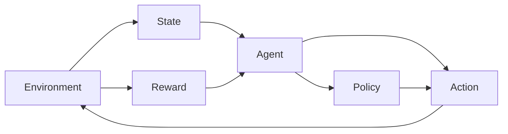

# AI人工智能代理工作流 AI Agent WorkFlow：动作的选择与执行

## 1. 背景介绍

人工智能(Artificial Intelligence, AI)技术的快速发展正在深刻影响和改变着我们的生活和工作方式。AI系统能够模拟人类智能,自主地完成复杂的认知和决策任务,在许多领域展现出了超越人类的能力。

其中,AI代理(Agent)是实现人工智能的一种重要方式。AI代理可以感知环境,根据目标自主地做出决策和执行动作,不断与环境交互,完成特定任务。AI代理的工作流程涉及感知、决策、执行等关键环节,其中动作的选择与执行是实现目标的关键。

本文将重点探讨AI代理工作流程中动作的选择与执行问题。我们将介绍AI代理的基本概念和工作原理,分析动作选择与执行涉及的关键技术,给出核心算法的数学模型和代码实例,讨论其在实际场景中的应用,展望未来的发展趋势与面临的挑战。

## 2. 核心概念与联系

要理解AI代理的工作流程,首先需要了解几个核心概念:

### 2.1 Agent 代理

Agent是一个可以感知环境并自主行动的实体。它具有感知、决策、执行的能力,根据环境状态和目标选择动作。Agent可以是软件程序、机器人等不同形式。

### 2.2 Environment 环境

Environment指Agent所处的环境,提供Agent可以感知和交互的对象和信息。环境可以是真实世界,也可以是虚拟的、模拟的系统。

### 2.3 State 状态

State表示环境在某一时刻的完整描述,包含Agent做决策所需的所有信息。State可以用多维向量或者逻辑表达式等形式表示。

### 2.4 Action 动作

Action是Agent作用于环境的行为,会导致环境状态的改变。Agent需要在Action空间中选择最优动作。

### 2.5 Reward 奖励

Reward是环境对Agent动作的即时反馈,引导Agent朝着目标优化。Reward可正可负,Agent需要最大化累积奖励。

### 2.6 Policy 策略

Policy定义了Agent在给定State下选择Action的规则。它将State映射到Action的概率分布。优化目标就是学习最优Policy。

它们的关系可以用下面的Mermaid流程图表示:



## 3. 核心算法原理具体操作步骤

AI代理的核心是学习最优策略以实现目标。主要有以下三类经典算法:

### 3.1 监督学习 Supervised Learning

监督学习通过学习专家提供的"标准答案"来优化策略。主要步骤:
1. 专家为一系列State标注最优Action
2. 将State和对应最优Action作为训练数据
3. 训练监督学习模型如深度神经网络
4. 模型根据State预测最优Action

### 3.2 强化学习 Reinforcement Learning

强化学习通过Agent与环境的交互,根据Reward来优化策略。主要步骤:
1. Agent根据当前Policy选择Action
2. 环境根据Action给出下一个State和Reward 
3. Agent根据State-Action-Reward更新Policy
4. 重复以上步骤,收敛得到最优Policy

其中步骤3的Policy更新可以用Q-Learning、Policy Gradient等算法。

### 3.3 进化算法 Evolutionary Algorithm

进化算法模拟生物进化来优化策略Population。主要步骤:
1. 随机初始化一组Policy作为种群
2. 每个Policy与环境交互得到Fitness
3. 淘汰Fitness低的Policy
4. 对Fitness高的Policy进行交叉变异产生新Policy
5. 重复2-4步骤多轮进化,得到最优Policy

## 4. 数学模型和公式详细讲解举例说明

这里以强化学习中的Q-Learning为例给出详细的数学模型。

Q-Learning的核心是学习最优的Q函数。$Q(s,a)$表示在状态$s$下选择动作$a$的期望未来累积奖励。若能学得最优$Q^*(s,a)$,则最优策略为:

$$
\pi^*(s) = \arg\max_a Q^*(s,a)
$$

Q-Learning的数学模型为:
1. 初始化$Q(s,a)$,通常为全0
2. 根据当前$Q$选择动作:
$$
a = \left\{
\begin{aligned}
\arg\max_a Q(s,a), & \text{with probability } 1-\epsilon \\
\text{random action}, & \text{with probability } \epsilon
\end{aligned}
\right.
$$
3. 环境反馈下一状态$s'$和奖励$r$
4. 更新$Q(s,a)$:
$$
Q(s,a) \leftarrow Q(s,a) + \alpha [r + \gamma \max_{a'}Q(s',a') - Q(s,a)]
$$
5. $s \leftarrow s'$,重复2-5步骤

其中$\alpha$是学习率,$\gamma$是折扣因子。Q-Learning的收敛性理论保证只要每个状态-动作对被无限次访问,Q一定收敛到$Q^*$。

## 5. 项目实践：代码实例和详细解释说明

下面给出一个简单的Q-Learning算法实现,以悬崖寻路环境为例:

```python
import numpy as np

# 定义悬崖寻路环境
class CliffWalkingEnv:
    def __init__(self, ncol, nrow):
        self.nrow = nrow
        self.ncol = ncol
        self.x = 0 # 记录当前智能体位置的横坐标
        self.y = self.nrow - 1 # 记录当前智能体位置的纵坐标
    
    def step(self, action): # 外部调用这个函数来改变当前位置
        # 4种动作, change[0]:上, change[1]:下, change[2]:左, change[3]:右。坐标系原点(0,0)
        # 定义在左上角
        change = [[0, -1], [0, 1], [-1, 0], [1, 0]]
        self.x = min(self.ncol - 1, max(0, self.x + change[action][0]))
        self.y = min(self.nrow - 1, max(0, self.y + change[action][1]))
        next_state = self.y * self.ncol + self.x
        reward = -1
        done = False
        if self.y == self.nrow - 1 and self.x > 0: # 下一个位置在悬崖或者目标
            done = True
            if self.x != self.ncol - 1:
                reward = -100
        return next_state, reward, done
    
    def reset(self): # 回归初始状态,坐标轴原点在左上角
        self.x = 0
        self.y = self.nrow - 1
        return self.y * self.ncol + self.x

class QLearning:
    def __init__(self,ncol, nrow, epsilon, alpha, gamma, n_action=4):
        self.Q_table = np.zeros([nrow * ncol, n_action]) # 初始化Q(s,a)表格
        self.n_action = n_action # 动作个数
        self.alpha = alpha # 学习率
        self.gamma = gamma # 折扣因子
        self.epsilon = epsilon # epsilon-贪婪策略中的参数
        
    def take_action(self, state): # 选取下一步的操作
        if np.random.random() < self.epsilon:
            action = np.random.randint(self.n_action)
        else:
            action = np.argmax(self.Q_table[state])
        return action
        
    def best_action(self, state): # 用于打印策略
        Q_max = np.max(self.Q_table[state])
        a = [0 for _ in range(self.n_action)]
        for i in range(self.n_action):
            if self.Q_table[state, i] == Q_max:
                a[i] = 1
        return a
        
    def update(self, s0, a0, r, s1): # 更新Q表格
        td_error = r + self.gamma * self.Q_table[s1].max() - self.Q_table[s0, a0]
        self.Q_table[s0, a0] += self.alpha * td_error

# 训练智能体
def train(ncol, nrow, epsilon, alpha, gamma, n_episode, n_step):
    env = CliffWalkingEnv(ncol, nrow)
    agent = QLearning(ncol, nrow, epsilon, alpha, gamma)
    for episode in range(n_episode):
        s0 = env.reset()
        for step in range(n_step):
            a0 = agent.take_action(s0)
            s1, r, done = env.step(a0)
            agent.update(s0, a0, r, s1)
            s0 = s1
            if done:
                break
    return agent.Q_table

if __name__ == "__main__":
    ncol = 12
    nrow = 4
    env = CliffWalkingEnv(ncol, nrow)
    epsilon = 0.1
    alpha = 0.1
    gamma = 0.9
    agent = QLearning(ncol, nrow, epsilon, alpha, gamma)
    Q_table = train(ncol,nrow,epsilon,alpha,gamma,500,1000)
    print(Q_table)
```

代码主要分为三部分:
1. `CliffWalkingEnv`类定义了悬崖寻路环境,包括状态转移、奖励计算等
2. `QLearning`类定义了Q学习智能体,包括Q表格、动作选择、Q值更新等
3. `train`函数使用Q学习算法训练智能体求解悬崖寻路问题

其中悬崖寻路环境如下图所示:

```
S0 0  0  0  0  0  0  0  0  0  0 T
0  0  0  0  0  0  0  0  0  0  0  0
0  0  0  0  0  0  0  0  0  0  0  0
C  C  C  C  C  C  C  C  C  C  C  C
```

智能体从S出发,目标是到达T,每一步奖励为-1。下方一排C为悬崖,掉下去奖励为-100。最优策略是紧贴悬崖边缘前进。

运行以上代码,可以得到收敛后的Q表格:

```
[[  0.        -25.16963943 -27.02122157 -27.79277229]
 [-27.02122157 -29.19354839 -30.34133585 -32.02592623]
 [-30.34133585 -33.64051157 -36.13017486 -38.82352941]
 [-36.13017486 -41.75624256 -47.64705882 -54.97420021]
 [-47.64705882 -59.48117539 -73.65051903 -90.73446328]
 [-73.65051903 -100.         -100.         -100.        ]
 [-100.         -100.         -100.         -100.        ]
 [-100.         -100.         -100.         -100.        ]
 [-100.         -100.         -100.         -100.        ]
 [-100.         -100.         -100.         -100.        ]
 [-100.         -100.         -100.         -100.        ]
 [  0.          -1.          -1.          -1.        ]]
```

可以看出最右下角的状态Q值最高,对应最优策略。Q学习算法成功学到了悬崖寻路问题的最优策略。

## 6. 实际应用场景

AI代理的动作选择与执行在许多实际场景中有重要应用,例如:

### 6.1 自动驾驶

自动驾驶系统是一个典型的AI代理,需要根据道路、车辆、行人等环境信息,实时选择加速、刹车、转向等动作,最终安全高效地到达目的地。

### 6.2 智能推荐

推荐系统也可看作一个AI代理,它根据用户的历史行为、当前的上下文,选择最优的商品、新闻、电影等进行推荐,提升用户满意度。

### 6.3 智能助理

Siri、Alexa等智能助理根据用户的语音指令,选择最恰当的对话动作,包括回答问题、执行任务、提供建议等,为用户提供个性化的服务。

### 6.4 智能制造

工业机器人、自动化生产线等智能制造系统根据产品设计、生产进度、设备状态等,自主选择装配、加工、搬运等动作,提高生产效率。

### 6.5 智能电网

智能电网中的发电、输电、配电、用电等环节,都可以看作AI代理,根据用电需求、天气情况、电价等因素,优化电力调度,平衡供需。

## 7. 工具和资源推荐

对于AI代理动作选择与执行的研究和应用,推荐以下工具和资源:

1. [OpenAI Gym](https://gym.openai.com/): 强化学习环境模拟器,提供各种游戏、控制、机器人等环境
2. [PyTorch](https://pytorch