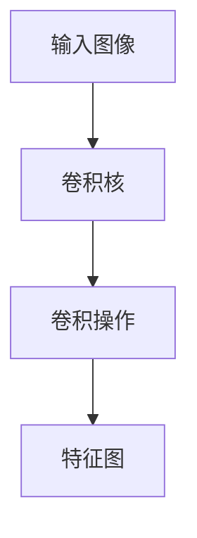
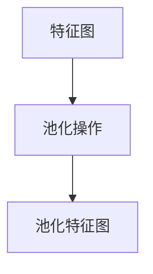
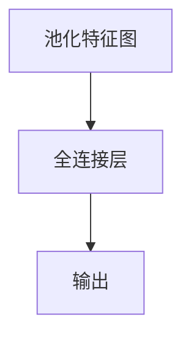

# AI人工智能深度学习算法：智能深度学习代理的计算机视觉运用

## 1.背景介绍

在过去的十年中，人工智能（AI）和深度学习（DL）技术取得了显著的进展，尤其是在计算机视觉领域。计算机视觉是AI的一个重要分支，旨在使计算机能够理解和解释视觉信息。深度学习通过模拟人脑的神经网络结构，极大地提升了计算机视觉的性能，使其在图像识别、物体检测、图像生成等任务中表现出色。

### 1.1 计算机视觉的历史与发展

计算机视觉的研究可以追溯到20世纪60年代，但直到最近，随着计算能力的提升和大数据的普及，才迎来了突破性的发展。早期的计算机视觉算法主要依赖于手工设计的特征提取方法，而深度学习的引入则彻底改变了这一局面。

### 1.2 深度学习在计算机视觉中的重要性

深度学习通过多层神经网络自动学习图像中的特征，避免了手工设计特征的繁琐过程。卷积神经网络（CNN）是深度学习在计算机视觉中的核心模型，它通过卷积层、池化层和全连接层的组合，实现了对图像的高效处理。

### 1.3 文章目标与结构

本文旨在深入探讨深度学习算法在计算机视觉中的应用，涵盖核心概念、算法原理、数学模型、项目实践、实际应用场景、工具和资源推荐、未来发展趋势与挑战等方面。

## 2.核心概念与联系

在深入探讨深度学习算法在计算机视觉中的应用之前，我们需要了解一些核心概念和它们之间的联系。

### 2.1 人工智能（AI）

人工智能是计算机科学的一个分支，旨在开发能够执行通常需要人类智能的任务的系统。这些任务包括学习、推理、问题解决、感知和语言理解。

### 2.2 机器学习（ML）

机器学习是实现人工智能的一种方法，通过从数据中学习模式和规律，使计算机能够在没有明确编程的情况下执行任务。机器学习包括监督学习、无监督学习和强化学习等不同类型。

### 2.3 深度学习（DL）

深度学习是机器学习的一个子领域，利用多层神经网络来模拟人脑的工作方式。深度学习在处理复杂数据（如图像、音频和文本）方面表现出色。

### 2.4 计算机视觉（CV）

计算机视觉是人工智能的一个分支，旨在使计算机能够理解和解释视觉信息。计算机视觉任务包括图像分类、物体检测、图像分割、姿态估计等。

### 2.5 核心联系

深度学习是实现计算机视觉的关键技术，通过多层神经网络自动学习图像中的特征，从而实现对图像的高效处理和理解。

## 3.核心算法原理具体操作步骤

在计算机视觉中，深度学习算法的核心是卷积神经网络（CNN）。下面我们将详细介绍CNN的基本原理和具体操作步骤。

### 3.1 卷积神经网络（CNN）

卷积神经网络是深度学习中最常用的模型之一，特别适用于图像处理任务。CNN通过卷积层、池化层和全连接层的组合，实现了对图像的高效处理。

#### 3.1.1 卷积层

卷积层是CNN的核心组件，通过卷积操作提取图像中的局部特征。卷积操作是将一个小的滤波器（卷积核）在图像上滑动，并计算滤波器与图像局部区域的点积。



#### 3.1.2 池化层

池化层用于减少特征图的尺寸，从而降低计算复杂度和防止过拟合。常见的池化操作包括最大池化和平均池化。



#### 3.1.3 全连接层

全连接层将卷积层和池化层提取的特征映射到输出空间，用于最终的分类或回归任务。



### 3.2 具体操作步骤

1. **数据预处理**：对输入图像进行归一化、数据增强等预处理操作。
2. **构建模型**：定义卷积层、池化层和全连接层的结构。
3. **训练模型**：使用训练数据对模型进行训练，调整模型参数。
4. **评估模型**：使用验证数据评估模型性能，调整超参数。
5. **部署模型**：将训练好的模型部署到实际应用中。

## 4.数学模型和公式详细讲解举例说明

在这一部分，我们将详细讲解卷积神经网络的数学模型和公式，并通过具体例子说明其工作原理。

### 4.1 卷积操作

卷积操作是卷积神经网络的核心，通过卷积核在图像上滑动并计算点积来提取特征。假设输入图像为 $I$，卷积核为 $K$，则卷积操作的输出 $O$ 可以表示为：

$$
O(i, j) = \sum_{m=0}^{M-1} \sum_{n=0}^{N-1} I(i+m, j+n) \cdot K(m, n)
$$

其中，$M$ 和 $N$ 分别是卷积核的高度和宽度。

### 4.2 池化操作

池化操作用于减少特征图的尺寸，常见的池化操作包括最大池化和平均池化。假设输入特征图为 $F$，池化窗口大小为 $P \times P$，则最大池化的输出 $P_{max}$ 可以表示为：

$$
P_{max}(i, j) = \max_{0 \leq m < P, 0 \leq n < P} F(i+m, j+n)
$$

### 4.3 全连接层

全连接层将池化层的输出展平并映射到输出空间。假设池化层的输出为 $F_{pool}$，全连接层的权重矩阵为 $W$，偏置为 $b$，则全连接层的输出 $O_{fc}$ 可以表示为：

$$
O_{fc} = W \cdot F_{pool} + b
$$

### 4.4 具体例子

假设输入图像为 $3 \times 3$ 的灰度图像，卷积核为 $2 \times 2$，池化窗口大小为 $2 \times 2$，我们可以通过以下步骤计算卷积和池化操作的输出。

1. **输入图像**：

$$
I = \begin{bmatrix}
1 & 2 & 3 \\
4 & 5 & 6 \\
7 & 8 & 9
\end{bmatrix}
$$

2. **卷积核**：

$$
K = \begin{bmatrix}
1 & 0 \\
0 & -1
\end{bmatrix}
$$

3. **卷积操作**：

$$
O(0, 0) = 1 \cdot 1 + 2 \cdot 0 + 4 \cdot 0 + 5 \cdot (-1) = -4
$$

$$
O(0, 1) = 2 \cdot 1 + 3 \cdot 0 + 5 \cdot 0 + 6 \cdot (-1) = -4
$$

$$
O(1, 0) = 4 \cdot 1 + 5 \cdot 0 + 7 \cdot 0 + 8 \cdot (-1) = -4
$$

$$
O(1, 1) = 5 \cdot 1 + 6 \cdot 0 + 8 \cdot 0 + 9 \cdot (-1) = -4
$$

4. **池化操作**：

$$
P_{max}(0, 0) = \max(-4, -4, -4, -4) = -4
$$

## 5.项目实践：代码实例和详细解释说明

在这一部分，我们将通过一个具体的项目实例，展示如何使用深度学习算法实现计算机视觉任务。我们将使用Python和TensorFlow/Keras框架来实现一个简单的图像分类模型。

### 5.1 数据集准备

我们将使用著名的CIFAR-10数据集，该数据集包含10个类别的60000张彩色图像，每个类别有6000张图像。

```python
import tensorflow as tf
from tensorflow.keras.datasets import cifar10
from tensorflow.keras.utils import to_categorical

# 加载数据集
(x_train, y_train), (x_test, y_test) = cifar10.load_data()

# 数据预处理
x_train = x_train.astype('float32') / 255.0
x_test = x_test.astype('float32') / 255.0
y_train = to_categorical(y_train, 10)
y_test = to_categorical(y_test, 10)
```

### 5.2 构建模型

我们将构建一个简单的卷积神经网络模型，包括卷积层、池化层和全连接层。

```python
from tensorflow.keras.models import Sequential
from tensorflow.keras.layers import Conv2D, MaxPooling2D, Flatten, Dense

model = Sequential([
    Conv2D(32, (3, 3), activation='relu', input_shape=(32, 32, 3)),
    MaxPooling2D((2, 2)),
    Conv2D(64, (3, 3), activation='relu'),
    MaxPooling2D((2, 2)),
    Flatten(),
    Dense(64, activation='relu'),
    Dense(10, activation='softmax')
])

model.compile(optimizer='adam', loss='categorical_crossentropy', metrics=['accuracy'])
```

### 5.3 训练模型

使用训练数据对模型进行训练，并评估模型性能。

```python
model.fit(x_train, y_train, epochs=10, batch_size=64, validation_data=(x_test, y_test))
```

### 5.4 评估模型

使用测试数据评估模型性能。

```python
test_loss, test_acc = model.evaluate(x_test, y_test)
print(f'Test accuracy: {test_acc}')
```

## 6.实际应用场景

深度学习算法在计算机视觉中的应用非常广泛，涵盖了多个领域和场景。

### 6.1 图像分类

图像分类是计算机视觉的基本任务之一，旨在将输入图像分配到预定义的类别中。常见的应用包括人脸识别、物体识别和手写数字识别等。

### 6.2 物体检测

物体检测不仅需要识别图像中的物体类别，还需要确定物体在图像中的位置。常见的应用包括自动驾驶、安防监控和智能零售等。

### 6.3 图像分割

图像分割是将图像划分为多个区域，每个区域对应一个特定的物体或背景。常见的应用包括医学图像分析、遥感图像处理和图像编辑等。

### 6.4 姿态估计

姿态估计是识别图像中人体的关键点位置，从而推断出人体的姿态。常见的应用包括运动分析、人机交互和虚拟现实等。

## 7.工具和资源推荐

在进行深度学习和计算机视觉研究时，选择合适的工具和资源非常重要。以下是一些推荐的工具和资源。

### 7.1 深度学习框架

- TensorFlow：谷歌开发的开源深度学习框架，支持多种平台和设备。
- PyTorch：Facebook开发的开源深度学习框架，具有灵活的动态计算图和强大的社区支持。

### 7.2 数据集

- CIFAR-10：包含10个类别的60000张彩色图像，常用于图像分类任务。
- COCO：包含多种物体类别的大规模图像数据集，常用于物体检测和图像分割任务。
- ImageNet：包含1000个类别的1400万张图像，常用于图像分类和物体检测任务。

### 7.3 在线资源

- Coursera：提供多种深度学习和计算机视觉课程，适合初学者和进阶学习者。
- GitHub：开源代码库，包含大量深度学习和计算机视觉项目的实现。

## 8.总结：未来发展趋势与挑战

深度学习算法在计算机视觉中的应用已经取得了显著的成果，但仍然面临一些挑战和未来的发展趋势。

### 8.1 未来发展趋势

- **自监督学习**：通过利用未标注数据进行训练，减少对大量标注数据的依赖。
- **多模态学习**：结合视觉、语言、音频等多种模态的信息，提高模型的理解能力。
- **边缘计算**：在边缘设备上部署深度学习模型，实现实时处理和低延迟。

### 8.2 挑战

- **数据隐私**：在处理敏感数据时，如何保护用户隐私是一个重要问题。
- **模型解释性**：深度学习模型的黑箱特性使得其决策过程难以解释，需要开发更具解释性的模型。
- **计算资源**：深度学习模型的训练和推理需要大量的计算资源，如何提高计算效率是一个重要挑战。

## 9.附录：常见问题与解答

### 9.1 什么是卷积神经网络（CNN）？

卷积神经网络是一种深度学习模型，特别适用于图像处理任务。它通过卷积层、池化层和全连接层的组合，实现了对图像的高效处理。

### 9.2 如何选择合适的深度学习框架？

选择深度学习框架时，可以考虑以下因素：框架的性能、社区支持、易用性和与现有工具的兼容性。TensorFlow和PyTorch是目前最常用的深度学习框架。

### 9.3 如何处理深度学习中的过拟合问题？

可以通过以下方法处理过拟合问题：增加训练数据、使用数据增强、正则化（如L2正则化和Dropout）、使用更小的模型和早停法。

### 9.4 什么是自监督学习？

自监督学习是一种机器学习方法，通过利用未标注数据进行训练，减少对大量标注数据的依赖。常见的方法包括生成对抗网络（GAN）和对比学习。

### 9.5 如何提高深度学习模型的计算效率？

可以通过以下方法提高计算效率：使用高效的硬件（如GPU和TPU）、优化模型结构、量化模型参数和使用分布式训练。

---

作者：禅与计算机程序设计艺术 / Zen and the Art of Computer Programming