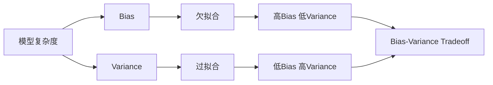

# Bias-Variance Tradeoff 原理与代码实战案例讲解

## 1. 背景介绍
### 1.1 机器学习中的误差来源
#### 1.1.1 Bias 偏差  
#### 1.1.2 Variance 方差
#### 1.1.3 Irreducible Error 不可约误差
### 1.2 Bias-Variance Tradeoff 的重要性
#### 1.2.1 对模型泛化能力的影响  
#### 1.2.2 对模型选择和优化的指导意义

## 2. 核心概念与联系
### 2.1 Bias 偏差
#### 2.1.1 Bias 的定义与数学表示
#### 2.1.2 Bias 反映模型的拟合能力
#### 2.1.3 Bias 与欠拟合的关系
### 2.2 Variance 方差
#### 2.2.1 Variance 的定义与数学表示  
#### 2.2.2 Variance 反映模型的稳定性
#### 2.2.3 Variance 与过拟合的关系
### 2.3 Bias 和 Variance 的权衡
#### 2.3.1 Bias 和 Variance 对模型性能的影响
#### 2.3.2 Bias-Variance Tradeoff 的图示与解释

## 3. 核心算法原理具体操作步骤
### 3.1 线性回归中的 Bias-Variance 分解
#### 3.1.1 线性回归的基本假设
#### 3.1.2 均方误差的 Bias-Variance 分解公式
#### 3.1.3 正则化对 Bias 和 Variance 的影响
### 3.2 决策树中的 Bias-Variance 分析 
#### 3.2.1 决策树的生成过程
#### 3.2.2 决策树的剪枝操作
#### 3.2.3 剪枝对 Bias 和 Variance 的平衡
### 3.3 集成学习中的 Bias-Variance 权衡
#### 3.3.1 Bagging 的 Bias-Variance 分析
#### 3.3.2 Boosting 的 Bias-Variance 分析
#### 3.3.3 Stacking 的 Bias-Variance 权衡

## 4. 数学模型和公式详细讲解举例说明
### 4.1 Bias 和 Variance 的数学定义
#### 4.1.1 Bias 的数学定义与计算公式
$$Bias(\hat{f}(x))=E[\hat{f}(x)]-f(x)$$
#### 4.1.2 Variance 的数学定义与计算公式  
$$Var(\hat{f}(x))=E[(\hat{f}(x)-E[\hat{f}(x)])^2]$$
### 4.2 均方误差的 Bias-Variance 分解
#### 4.2.1 均方误差的定义
#### 4.2.2 均方误差分解为 Bias 和 Variance 的推导过程
$$E[(y-\hat{f}(x))^2]=Bias^2(\hat{f}(x))+Var(\hat{f}(x))+\sigma^2$$
### 4.3 Bias-Variance 分解的例子
#### 4.3.1 线性回归中的 Bias-Variance 分解例子
#### 4.3.2 决策树中的 Bias-Variance 分解例子

## 5. 项目实践：代码实例和详细解释说明
### 5.1 线性回归中 Bias-Variance 的代码实现
#### 5.1.1 生成模拟数据集
#### 5.1.2 不同正则化系数下的模型训练
#### 5.1.3 计算并绘制 Bias 和 Variance 曲线
### 5.2 决策树中 Bias-Variance 的代码实现  
#### 5.2.1 加载真实数据集
#### 5.2.2 不同剪枝参数下的决策树训练
#### 5.2.3 计算并绘制 Bias 和 Variance 曲线
### 5.3 集成学习中 Bias-Variance 的代码实现
#### 5.3.1 Bagging 集成下 Bias-Variance 的计算与绘制
#### 5.3.2 Boosting 集成下 Bias-Variance 的计算与绘制
#### 5.3.3 Stacking 集成下 Bias-Variance 的计算与绘制

## 6. 实际应用场景
### 6.1 图像分类任务中的 Bias-Variance 权衡
#### 6.1.1 不同模型复杂度下的 Bias 和 Variance 分析
#### 6.1.2 数据增强对 Bias 和 Variance 的影响  
### 6.2 自然语言处理任务中的 Bias-Variance 权衡
#### 6.2.1 不同模型规模下的 Bias 和 Variance 分析
#### 6.2.2 迁移学习对 Bias 和 Variance 的影响
### 6.3 推荐系统中的 Bias-Variance 权衡  
#### 6.3.1 不同模型类型的 Bias 和 Variance 比较
#### 6.3.2 冷启动问题中的 Bias-Variance 权衡

## 7. 工具和资源推荐
### 7.1 Bias-Variance 分析工具
#### 7.1.1 Scikit-learn 中的学习曲线模块
#### 7.1.2 Yellowbrick 中的模型复杂度曲线可视化
### 7.2 相关论文与学习资源
#### 7.2.1 经典论文推荐
#### 7.2.2 在线课程与教程推荐

## 8. 总结：未来发展趋势与挑战
### 8.1 自动机器学习中的 Bias-Variance 权衡
#### 8.1.1 超参数优化中的 Bias-Variance 考量
#### 8.1.2 神经网络架构搜索中的 Bias-Variance 平衡
### 8.2 大数据场景下的 Bias-Variance 挑战
#### 8.2.1 数据不平衡问题的 Bias-Variance 分析
#### 8.2.2 数据噪声问题的 Bias-Variance 权衡
### 8.3 Bias-Variance Tradeoff 的新思路与未来方向
#### 8.3.1 多目标优化视角下的 Bias-Variance 权衡
#### 8.3.2 结合因果推断的 Bias-Variance 分析

## 9. 附录：常见问题与解答
### 9.1 如何定性判断模型的 Bias 和 Variance 情况？
### 9.2 Bias-Variance Tradeoff 在深度学习中是否还适用？  
### 9.3 数据集大小对 Bias 和 Variance 有何影响？
### 9.4 如何权衡 Bias-Variance Tradeoff 与模型的可解释性？

作者：禅与计算机程序设计艺术 / Zen and the Art of Computer Programming