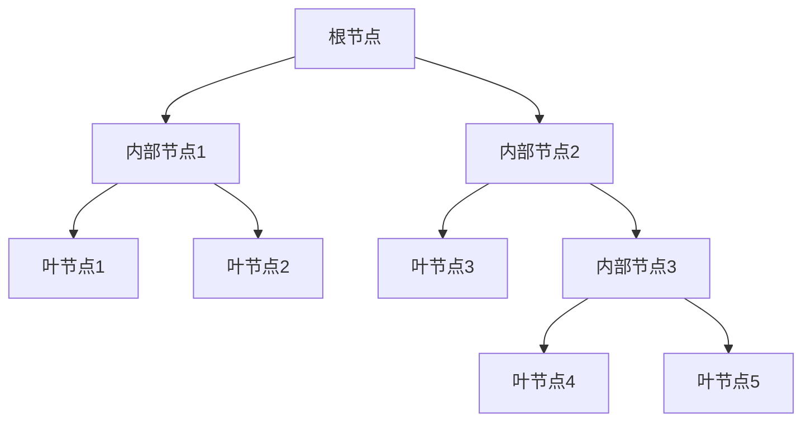

# Decision Trees 原理与代码实战案例讲解

## 1.背景介绍

决策树(Decision Tree)是一种强大的监督学习算法,广泛应用于分类和回归问题。它以树形结构的方式对数据进行建模,通过一系列的决策规则将数据划分为不同的子集,最终达到预测目标。决策树模型易于理解和解释,能够处理数值型和类别型数据,并且可以很好地捕捉数据中的非线性关系。

决策树算法源于20世纪60年代,最初用于无人机飞行模拟。随后在统计学、机器学习和数据挖掘等领域得到广泛应用。著名的决策树算法包括ID3、C4.5、CART等。随着大数据时代的到来,决策树在金融风险管理、医疗诊断、客户关系管理等领域发挥着重要作用。

## 2.核心概念与联系

### 2.1 决策树模型表示

决策树由节点(node)和有向边(edge)组成。节点分为三种类型:

1. 根节点(root node):树的起始节点。
2. 内部节点(internal node):需要进一步决策的节点。
3. 叶节点(leaf node):决策终止的节点,对应最终的预测结果。

每个内部节点代表一个特征,边代表该特征取值的不同情况。从根节点开始,按照特征值测试,沿着相应的边遍历,直到到达叶节点。



### 2.2 决策树学习

决策树学习的目标是从训练数据中构建一棵能够很好地对新数据进行预测的决策树。常用的决策树学习算法包括ID3、C4.5和CART。它们采用自顶向下的递归分治策略,根据某种准则选择最优特征,将数据集划分为子集,反复构建子树,直到满足停止条件。

### 2.3 特征选择准则

在决策树学习过程中,选择最优特征是关键步骤。常用的特征选择准则包括:

- 信息增益(Information Gain):衡量特征对数据集的不确定性减少程度。
- 信息增益比(Information Gain Ratio):对信息增益进行修正,减少对特征取值数量的偏好。
- 基尼指数(Gini Index):衡量数据集的不纯度。

## 3.核心算法原理具体操作步骤

以ID3算法为例,其核心思想是基于信息增益准则选择最优特征,递归地构建决策树。算法步骤如下:

1. 从根节点开始,计算数据集的信息熵$H(D)$。

$$H(D) = -\sum_{i=1}^{n}p_ilog_2p_i$$

其中$p_i$是第$i$个类别的概率。

2. 对于每个特征$A$,计算条件熵$H(D|A)$。

$$H(D|A) = \sum_{j=1}^{V}\frac{|D_j|}{|D|}H(D_j)$$

其中$V$是特征$A$的取值个数,$D_j$是特征$A$取值为$a_j$的数据子集。

3. 计算信息增益$Gain(A)$。

$$Gain(A) = H(D) - H(D|A)$$

4. 选择信息增益最大的特征$A_g$作为当前节点的特征,根据$A_g$的取值创建子节点。

5. 对每个子节点,递归地调用步骤1-4,构建子树,直到满足停止条件。

停止条件通常包括:

- 当前节点的所有实例属于同一类别。
- 没有剩余特征可用于进一步划分。
- 当前节点的实例数小于预设阈值。

## 4.数学模型和公式详细讲解举例说明

### 4.1 信息熵(Entropy)

信息熵是度量数据集纯度的指标,其值越小,数据集的纯度越高。对于二分类问题,设数据集$D$中正例的比例为$p$,负例的比例为$1-p$,则信息熵为:

$$H(D) = -plog_2p - (1-p)log_2(1-p)$$

例如,如果数据集$D$中有9个正例,1个负例,则$p=0.9$,$1-p=0.1$,信息熵为:

$$H(D) = -0.9log_20.9 - 0.1log_20.1 \approx 0.469$$

### 4.2 条件熵(Conditional Entropy)

条件熵是在已知特征$A$的条件下,数据集$D$的熵。设特征$A$有$V$个可能取值$\{a_1,a_2,...,a_V\}$,则条件熵为:

$$H(D|A) = \sum_{j=1}^{V}\frac{|D_j|}{|D|}H(D_j)$$

其中,$D_j$是特征$A$取值为$a_j$的数据子集,$|D_j|$是$D_j$的实例数,$|D|$是$D$的总实例数。

例如,设有特征$A$,取值为$\{a_1,a_2\}$,其中$D_{a_1}$包含6个正例,2个负例;$D_{a_2}$包含3个正例,3个负例。则条件熵为:

$$\begin{aligned}
H(D|A) &= \frac{8}{14}H(D_{a_1}) + \frac{6}{14}H(D_{a_2})\\
       &= \frac{8}{14}(-\frac{6}{8}log_2\frac{6}{8} - \frac{2}{8}log_2\frac{2}{8}) + \frac{6}{14}(-\frac{3}{6}log_2\frac{3}{6} - \frac{3}{6}log_2\frac{3}{6})\\
       &\approx 0.892
\end{aligned}$$

### 4.3 信息增益(Information Gain)

信息增益是衡量特征$A$对数据集$D$的不确定性减少程度的指标,定义为:

$$Gain(A) = H(D) - H(D|A)$$

信息增益越大,说明特征$A$对数据集$D$的分类能力越强。在决策树学习中,我们选择信息增益最大的特征作为当前节点的特征。

## 5.项目实践:代码实例和详细解释说明

以下是使用Python和scikit-learn库实现决策树分类器的代码示例:

```python
from sklearn.tree import DecisionTreeClassifier
from sklearn.datasets import load_iris
from sklearn.model_selection import train_test_split
from sklearn.metrics import accuracy_score

# 加载鸢尾花数据集
iris = load_iris()
X, y = iris.data, iris.target

# 将数据集拆分为训练集和测试集
X_train, X_test, y_train, y_test = train_test_split(X, y, test_size=0.2, random_state=42)

# 创建决策树分类器对象
clf = DecisionTreeClassifier(criterion='entropy', max_depth=3)

# 训练决策树模型
clf.fit(X_train, y_train)

# 在测试集上进行预测
y_pred = clf.predict(X_test)

# 计算准确率
accuracy = accuracy_score(y_test, y_pred)
print(f"Accuracy: {accuracy:.2f}")
```

代码解释:

1. 导入必要的库和函数。
2. 加载鸢尾花数据集,将特征数据和目标值分别赋值给`X`和`y`。
3. 使用`train_test_split`函数将数据集拆分为训练集和测试集,测试集占20%。
4. 创建`DecisionTreeClassifier`对象,指定信息增益(entropy)作为特征选择准则,最大树深度为3。
5. 使用`fit`方法在训练集上训练决策树模型。
6. 在测试集上进行预测,得到预测值`y_pred`。
7. 使用`accuracy_score`函数计算预测准确率。

上述代码展示了如何使用scikit-learn库快速构建和训练决策树分类器。在实际应用中,你可以根据具体问题调整模型参数,如最大深度、最小样本数等,以获得更好的性能。

## 6.实际应用场景

决策树在多个领域有着广泛的应用:

1. **金融风险管理**: 决策树可用于信用评分、欺诈检测等场景,帮助金融机构评估客户的信用风险和识别潜在欺诈行为。

2. **医疗诊断**: 决策树能够根据患者的症状和检查结果,对疾病进行诊断和预测,为医生提供辅助决策支持。

3. **客户关系管理(CRM)**: 通过分析客户的购买记录、人口统计特征等数据,决策树可以预测客户的购买意向,从而制定有针对性的营销策略。

4. **图像识别**: 决策树在图像分类、目标检测等计算机视觉任务中发挥着重要作用。

5. **自然语言处理(NLP)**: 决策树可用于文本分类、情感分析等NLP任务。

6. **网络入侵检测**: 决策树能够根据网络流量特征,识别潜在的网络攻击和入侵行为。

## 7.工具和资源推荐

1. **Python scikit-learn库**: 提供了决策树算法的实现,以及数据预处理、模型评估等功能。

2. **R rpart包**: 实现了CART决策树算法,可用于分类和回归任务。

3. **Weka**: 一款流行的数据挖掘软件,内置了多种决策树算法。

4. **Orange**: 一款开源的数据可视化、机器学习和数据挖掘工具,支持决策树算法。

5. **UCI机器学习数据库**: 提供了多个可用于决策树学习的数据集。

6. **《决策树算法:原理、应用及实践》**:一本全面介绍决策树理论和实践的经典书籍。

## 8.总结:未来发展趋势与挑战

决策树算法具有简单、高效、可解释性强等优点,但也存在一些局限性和挑战:

1. **过拟合问题**: 决策树容易过度拟合训练数据,导致泛化能力差。通常需要进行剪枝或限制树深度来防止过拟合。

2. **数据不平衡问题**: 当训练数据中某些类别的实例数量远少于其他类别时,决策树的性能会受到影响。需要采取过采样或欠采样等策略来处理数据不平衡问题。

3. **缺失值处理**: 决策树对缺失值的处理能力有限,通常需要进行数据填充或删除缺失值实例。

4. **特征相关性**: 决策树无法很好地捕捉特征之间的相关性,可能导致模型性能下降。

5. **可解释性挑战**: 虽然决策树本身具有较好的可解释性,但对于深度较大的树,解释起来仍然具有一定挑战。

未来,决策树算法可能会在以下方面得到进一步发展:

1. **集成学习**: 将决策树与其他算法(如随机森林、Boosting等)相结合,形成更强大的集成模型。

2. **深度决策树**: 借鉴深度学习的思想,构建更深层次的决策树模型,提高模型的表达能力。

3. **在线学习**: 设计能够在线更新和学习的决策树算法,适应动态变化的数据环境。

4. **可解释性增强**: 开发更加直观、易于理解的决策树可视化和解释技术。

5. **弱监督学习**: 扩展决策树算法,使其能够从弱监督或无监督数据中学习。

总之,决策树算法在未来仍将是机器学习领域的重要组成部分,并将在理论和实践层面不断得到发展和完善。

## 9.附录:常见问题与解答

1. **什么是决策树?**

   决策树是一种监督学习算法,以树形结构对数据进行建模,通过一系列的决策规则将数据划分为不同的子集,最终达到预测目标。它易于理解和解释,能够处理数值型和类别型数据,并且可以很好地捕捉数据中的非线性关系。

2. **决策树的优缺点是什么?**

   优点:
   - 简单易懂,可解释性强
   - 能够处理数值型和类别型数据
   - 无需进行数据归一化
   - 能够捕捉数据中的非线性关系

   