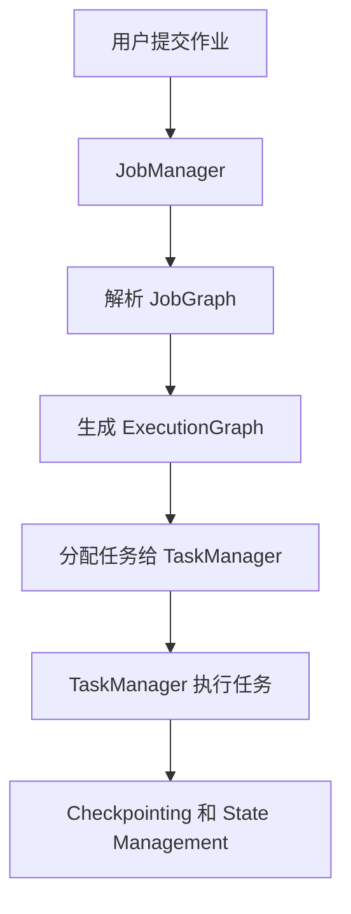

# Flink JobManager原理与代码实例讲解

## 1.背景介绍

Apache Flink 是一个开源的流处理框架，广泛应用于实时数据处理和大数据分析领域。Flink 的核心组件之一是 JobManager，它负责管理和协调 Flink 作业的执行。理解 JobManager 的工作原理和实现细节，对于优化和调试 Flink 应用至关重要。

## 2.核心概念与联系

### 2.1 JobManager

JobManager 是 Flink 集群的控制中心，负责作业的调度、资源管理、故障恢复等任务。它接收用户提交的作业，解析作业 DAG（有向无环图），并将任务分配给 TaskManager 执行。

### 2.2 TaskManager

TaskManager 是 Flink 集群中的工作节点，负责执行具体的任务。每个 TaskManager 包含多个 Task Slot，每个 Slot 可以执行一个并行任务。

### 2.3 JobGraph 和 ExecutionGraph

JobGraph 是用户提交的作业的逻辑表示，包含作业的所有算子和数据流。ExecutionGraph 是 JobGraph 的物理执行计划，包含具体的执行任务和并行度信息。

### 2.4 Checkpointing 和 State Management

Flink 提供了强大的状态管理和容错机制，通过 Checkpointing 机制定期保存作业状态，以便在故障发生时进行恢复。



## 3.核心算法原理具体操作步骤

### 3.1 作业提交与解析

用户通过 Flink 提交作业，JobManager 接收到作业后，首先解析用户定义的 JobGraph。JobGraph 是一个有向无环图，表示作业的逻辑执行计划。

### 3.2 生成 ExecutionGraph

JobManager 将 JobGraph 转换为 ExecutionGraph。ExecutionGraph 是作业的物理执行计划，包含具体的执行任务和并行度信息。JobManager 根据集群资源情况，决定每个任务的并行度。

### 3.3 任务调度与执行

JobManager 将 ExecutionGraph 中的任务分配给 TaskManager 执行。TaskManager 是 Flink 集群中的工作节点，负责具体的任务执行。每个 TaskManager 包含多个 Task Slot，每个 Slot 可以执行一个并行任务。

### 3.4 Checkpointing 和故障恢复

Flink 提供了强大的状态管理和容错机制。通过 Checkpointing 机制，JobManager 定期保存作业状态。当任务发生故障时，JobManager 可以从最近的 Checkpoint 恢复作业状态，继续执行。

## 4.数学模型和公式详细讲解举例说明

### 4.1 作业调度模型

Flink 的作业调度可以看作是一个资源分配问题。假设集群中有 $M$ 个 TaskManager，每个 TaskManager 有 $N$ 个 Task Slot。作业包含 $T$ 个任务，每个任务需要 $S$ 个 Slot。作业调度的目标是最小化任务的执行时间和资源的使用。

### 4.2 Checkpointing 模型

Checkpointing 机制可以用马尔可夫链模型来描述。假设作业状态在时间 $t$ 时刻为 $S_t$，Checkpointing 机制每隔 $\Delta t$ 时间保存一次状态。故障发生时，作业可以从最近的 Checkpoint 恢复，继续执行。

$$
P(S_{t+\Delta t} | S_t) = P(S_{t+\Delta t} | S_{t-\Delta t})
$$

### 4.3 资源分配公式

假设集群中有 $M$ 个 TaskManager，每个 TaskManager 有 $N$ 个 Task Slot。作业包含 $T$ 个任务，每个任务需要 $S$ 个 Slot。资源分配的目标是最小化任务的执行时间和资源的使用。

$$
\text{Minimize} \sum_{i=1}^{T} \text{ExecutionTime}(Task_i)
$$

$$
\text{Subject to} \sum_{i=1}^{T} \text{SlotUsage}(Task_i) \leq M \times N
$$

## 5.项目实践：代码实例和详细解释说明

### 5.1 环境准备

首先，确保已经安装了 Apache Flink 和 Java 开发环境。可以通过以下命令下载并解压 Flink：

```bash
wget https://archive.apache.org/dist/flink/flink-1.13.2-bin-scala_2.11.tgz
tar -xzf flink-1.13.2-bin-scala_2.11.tgz
cd flink-1.13.2
```

### 5.2 提交作业

以下是一个简单的 Flink 作业示例，计算文本文件中的单词频率：

```java
import org.apache.flink.api.java.ExecutionEnvironment;
import org.apache.flink.api.java.operators.DataSource;
import org.apache.flink.api.java.tuple.Tuple2;
import org.apache.flink.api.java.utils.ParameterTool;

public class WordCount {
    public static void main(String[] args) throws Exception {
        final ParameterTool params = ParameterTool.fromArgs(args);
        final ExecutionEnvironment env = ExecutionEnvironment.getExecutionEnvironment();
        env.getConfig().setGlobalJobParameters(params);

        DataSource<String> text = env.readTextFile(params.get("input"));

        text.flatMap((String line, Collector<Tuple2<String, Integer>> out) -> {
            for (String word : line.split(" ")) {
                out.collect(new Tuple2<>(word, 1));
            }
        }).groupBy(0).sum(1).writeAsCsv(params.get("output"), "\n", " ");

        env.execute("Word Count Example");
    }
}
```

### 5.3 运行作业

将上述代码保存为 `WordCount.java`，编译并运行：

```bash
javac -cp flink-1.13.2/lib/* WordCount.java
java -cp flink-1.13.2/lib/*:. WordCount --input input.txt --output output.txt
```

### 5.4 代码解释

- `ExecutionEnvironment`：Flink 的执行环境，用于定义作业的执行配置。
- `DataSource`：数据源，读取输入文件。
- `flatMap`：将每一行文本拆分为单词，并输出 (word, 1) 的二元组。
- `groupBy` 和 `sum`：按单词分组，并计算每个单词的频率。
- `writeAsCsv`：将结果写入输出文件。

## 6.实际应用场景

### 6.1 实时数据处理

Flink 广泛应用于实时数据处理场景，如实时日志分析、实时监控和告警、实时推荐系统等。通过 JobManager 的高效调度和资源管理，Flink 可以处理大规模实时数据流。

### 6.2 大数据分析

Flink 也可以用于批处理和大数据分析，如数据清洗、ETL（抽取、转换、加载）流程等。通过 Checkpointing 机制，Flink 提供了强大的容错能力，确保作业的高可靠性。

### 6.3 机器学习

Flink 还可以用于分布式机器学习任务，如在线学习、模型训练和预测等。通过 TaskManager 的并行执行能力，Flink 可以高效地处理大规模机器学习任务。

## 7.工具和资源推荐

### 7.1 Flink 官方文档

Flink 官方文档是学习和使用 Flink 的最佳资源，包含详细的 API 说明、使用指南和示例代码。

### 7.2 Flink 社区

Flink 社区是一个活跃的技术社区，包含邮件列表、论坛和 Slack 频道。通过参与社区活动，可以获取最新的技术动态和最佳实践。

### 7.3 开源项目

GitHub 上有许多开源的 Flink 项目，可以参考这些项目的代码和实现，学习 Flink 的最佳实践和应用场景。

## 8.总结：未来发展趋势与挑战

### 8.1 未来发展趋势

随着大数据和实时数据处理需求的不断增长，Flink 的应用场景将越来越广泛。未来，Flink 将继续优化性能和扩展性，支持更多的数据源和计算模型。

### 8.2 挑战

Flink 在实际应用中也面临一些挑战，如复杂的调优和配置、资源管理和调度的优化等。通过深入理解 JobManager 的工作原理和实现细节，可以更好地应对这些挑战，提升 Flink 应用的性能和可靠性。

## 9.附录：常见问题与解答

### 9.1 如何调优 Flink 作业的性能？

调优 Flink 作业的性能可以从以下几个方面入手：
- 优化并行度：根据集群资源情况，合理设置作业的并行度。
- 调整内存配置：根据作业的内存需求，调整 TaskManager 的内存配置。
- 使用高效的数据源和数据格式：选择合适的数据源和数据格式，减少数据读取和写入的开销。

### 9.2 如何处理 Flink 作业的故障？

Flink 提供了强大的容错机制，通过 Checkpointing 和 State Management，可以在故障发生时恢复作业状态。确保 Checkpointing 机制配置正确，并定期检查 Checkpoint 的状态。

### 9.3 如何监控 Flink 作业的运行状态？

Flink 提供了丰富的监控和管理工具，如 Flink Dashboard 和 REST API。通过这些工具，可以实时监控作业的运行状态、资源使用情况和性能指标。

---

作者：禅与计算机程序设计艺术 / Zen and the Art of Computer Programming