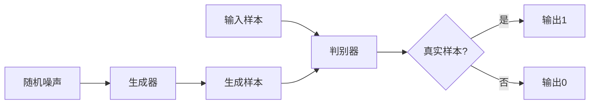

# GAN 判别模型：判别器 (Discriminator) 原理与代码实例讲解

## 1. 背景介绍

### 1.1 生成式对抗网络 (GAN) 概述

生成式对抗网络（Generative Adversarial Networks，简称GAN）是一种无监督学习的机器学习方法，由 Ian Goodfellow 等人于2014年提出。GAN 由两个神经网络模型组成：生成器（Generator）和判别器（Discriminator）。生成器的目标是生成尽可能逼真的样本数据，而判别器的目标是判断输入的样本是真实数据还是生成器生成的假数据。

### 1.2 判别器在 GAN 中的作用

在 GAN 中，判别器扮演着至关重要的角色。它的主要任务是区分真实样本和生成样本，并为生成器提供反馈，帮助生成器不断改进生成样本的质量。判别器通过最小化真实样本和生成样本之间的差异，推动生成器生成更加逼真的样本。

## 2. 核心概念与联系

### 2.1 判别器的损失函数

判别器的损失函数由两部分组成：真实样本的损失和生成样本的损失。对于真实样本，判别器的目标是最大化将其正确分类为真实样本的概率；对于生成样本，判别器的目标是最大化将其正确分类为生成样本的概率。

### 2.2 判别器与生成器的博弈关系

GAN 的训练过程可以看作是判别器和生成器之间的博弈过程。生成器试图生成尽可能逼真的样本来欺骗判别器，而判别器则试图准确区分真实样本和生成样本。通过这种对抗性训练，生成器和判别器不断优化，最终达到纳什均衡状态。

## 3. 核心算法原理具体操作步骤

### 3.1 判别器的训练过程

1. 从真实数据集中采样一批真实样本，标记为1。
2. 从生成器生成一批假样本，标记为0。
3. 将真实样本和生成样本输入判别器，计算判别器的损失函数。
4. 通过反向传播算法更新判别器的参数，最小化损失函数。

### 3.2 判别器的网络结构

判别器通常采用卷积神经网络（CNN）或全连接神经网络（FCN）的结构。以图像分类任务为例，判别器的网络结构可以包括以下几个部分：

1. 输入层：接收真实样本或生成样本。
2. 卷积层：提取图像的局部特征。
3. 池化层：降低特征图的空间维度，提高特征的鲁棒性。
4. 全连接层：将提取的特征映射到高维空间。
5. 输出层：通过 sigmoid 激活函数输出样本为真实样本的概率。

## 4. 数学模型和公式详细讲解举例说明

### 4.1 判别器的损失函数

判别器的损失函数可以表示为：

$$L_D = -\mathbb{E}_{x \sim p_{data}(x)}[\log D(x)] - \mathbb{E}_{z \sim p_z(z)}[\log(1 - D(G(z)))]$$

其中，$x$ 表示真实样本，$z$ 表示随机噪声，$p_{data}(x)$ 表示真实数据的分布，$p_z(z)$ 表示随机噪声的分布，$D(x)$ 表示判别器将样本 $x$ 分类为真实样本的概率，$G(z)$ 表示生成器生成的样本。

### 4.2 判别器的梯度更新

判别器的参数通过最小化损失函数来更新，使用梯度下降法：

$$\theta_D \leftarrow \theta_D - \eta \nabla_{\theta_D} L_D$$

其中，$\theta_D$ 表示判别器的参数，$\eta$ 表示学习率，$\nabla_{\theta_D} L_D$ 表示损失函数对判别器参数的梯度。

## 5. 项目实践：代码实例和详细解释说明

下面是一个使用 PyTorch 实现判别器的代码示例：

```python
import torch
import torch.nn as nn

class Discriminator(nn.Module):
    def __init__(self, input_size):
        super(Discriminator, self).__init__()
        self.fc1 = nn.Linear(input_size, 256)
        self.fc2 = nn.Linear(256, 1)
        self.relu = nn.ReLU()
        self.sigmoid = nn.Sigmoid()

    def forward(self, x):
        x = self.relu(self.fc1(x))
        x = self.sigmoid(self.fc2(x))
        return x
```

这个判别器使用全连接层构建，包括两个隐藏层和一个输出层。输入层的大小由 `input_size` 参数指定。第一个隐藏层使用 ReLU 激活函数，第二个隐藏层的输出通过 sigmoid 函数映射到 [0, 1] 区间，表示样本为真实样本的概率。

在训练过程中，判别器的损失函数可以使用二元交叉熵损失：

```python
criterion = nn.BCELoss()
```

优化器可以选择 Adam：

```python
optimizer_D = torch.optim.Adam(discriminator.parameters(), lr=0.0002, betas=(0.5, 0.999))
```

在每个训练步骤中，先从真实数据集中采样一批真实样本，然后从生成器生成一批假样本。将真实样本和假样本输入判别器，计算损失函数，并通过反向传播更新判别器的参数：

```python
# 训练判别器
optimizer_D.zero_grad()
real_output = discriminator(real_samples)
real_loss = criterion(real_output, torch.ones_like(real_output))
fake_output = discriminator(fake_samples.detach())
fake_loss = criterion(fake_output, torch.zeros_like(fake_output))
d_loss = real_loss + fake_loss
d_loss.backward()
optimizer_D.step()
```

## 6. 实际应用场景

判别器在 GAN 的各种应用中都发挥着重要作用，例如：

1. 图像生成：判别器帮助生成器生成逼真的图像。
2. 图像翻译：判别器帮助生成器将图像从一个域转换到另一个域，如将草图转换为真实图像。
3. 图像超分辨率：判别器帮助生成器从低分辨率图像生成高分辨率图像。
4. 文本生成：判别器帮助生成器生成逼真的文本数据。

## 7. 工具和资源推荐

以下是一些有助于深入理解和实现判别器的工具和资源：

1. PyTorch：一个流行的深度学习框架，提供了易于使用的 API 和丰富的文档。
2. TensorFlow：另一个广泛使用的深度学习框架，提供了强大的工具和资源。
3. GAN Lab：一个交互式的在线演示，帮助理解 GAN 的工作原理。
4. GAN Zoo：一个收集各种 GAN 模型的资源库，包括代码实现和论文。

## 8. 总结：未来发展趋势与挑战

### 8.1 未来发展趋势

1. 更稳定的训练方法：研究者正在探索新的训练技术，如 Wasserstein GAN（WGAN）和 Spectral Normalization GAN（SNGAN），以提高 GAN 的训练稳定性。
2. 更多样化的应用：GAN 将在更多领域得到应用，如视频生成、3D 对象生成和语音合成等。
3. 与其他技术的结合：GAN 将与其他机器学习技术结合，如强化学习和迁移学习，以解决更复杂的问题。

### 8.2 面临的挑战

1. 模式崩溃：生成器可能会倾向于生成一些特定的样本，导致生成样本的多样性下降。
2. 训练不稳定：GAN 的训练过程可能会出现振荡或崩溃，导致生成质量下降。
3. 评估困难：评估 GAN 生成样本的质量仍然是一个挑战，缺乏统一的评估指标。

## 9. 附录：常见问题与解答

### 9.1 判别器和生成器的区别是什么？

判别器是一个二分类器，用于区分真实样本和生成样本；生成器是一个生成模型，用于生成尽可能逼真的样本。

### 9.2 为什么判别器使用 sigmoid 激活函数？

sigmoid 函数将判别器的输出映射到 [0, 1] 区间，表示样本为真实样本的概率。这与判别器的目标（二分类）相对应。

### 9.3 判别器的损失函数为什么要最大化真实样本的概率和最小化生成样本的概率？

最大化真实样本的概率可以让判别器更好地识别真实样本，最小化生成样本的概率可以让判别器更好地识别生成样本。这两个目标共同促进判别器的性能提升。

### 9.4 判别器和生成器的博弈关系如何影响 GAN 的训练？

判别器和生成器的博弈关系决定了 GAN 的训练动态。如果判别器太强，生成器可能难以学习；如果生成器太强，判别器可能无法提供有效的反馈。保持两者的平衡对 GAN 的成功训练至关重要。

## 判别器核心原理与架构图



作者：禅与计算机程序设计艺术 / Zen and the Art of Computer Programming