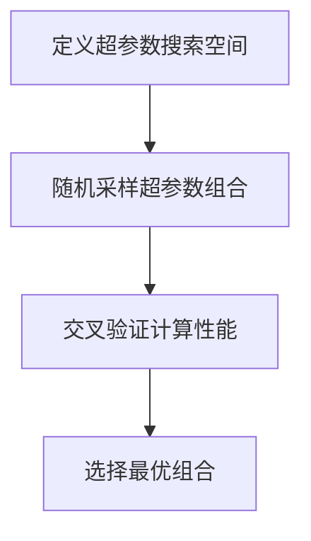
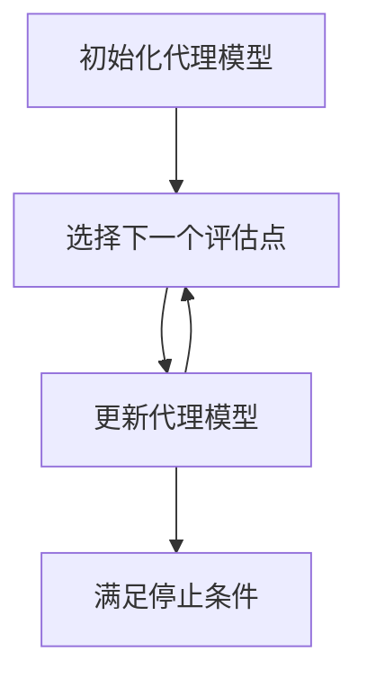

# Hyperparameter Tuning 原理与代码实战案例讲解

## 1.背景介绍

在机器学习和深度学习的领域中，超参数调优（Hyperparameter Tuning）是一个至关重要的步骤。超参数是那些在模型训练之前需要设置的参数，它们对模型的性能有着显著的影响。与模型参数不同，超参数不能通过训练数据直接学习得到，而需要通过实验和优化来确定。本文将深入探讨超参数调优的原理、算法、数学模型，并通过实际代码示例展示如何进行超参数调优。

## 2.核心概念与联系

### 2.1 超参数与模型参数

超参数是指在模型训练之前需要设置的参数，例如学习率、正则化参数、树的深度等。模型参数则是在训练过程中通过数据学习得到的参数，例如线性回归中的权重和偏置。

### 2.2 超参数调优的重要性

超参数调优直接影响模型的性能。一个好的超参数设置可以显著提高模型的准确性和泛化能力，而不合适的超参数可能导致模型过拟合或欠拟合。

### 2.3 超参数调优的挑战

超参数调优面临的主要挑战包括搜索空间大、计算成本高和调优过程复杂。为了应对这些挑战，研究人员提出了多种调优算法和策略。

## 3.核心算法原理具体操作步骤

### 3.1 网格搜索（Grid Search）

网格搜索是一种穷举搜索方法，通过遍历所有可能的超参数组合来找到最佳配置。其主要步骤如下：

1. 定义超参数的搜索空间。
2. 遍历所有可能的超参数组合。
3. 对每个组合进行交叉验证，计算模型性能。
4. 选择性能最优的超参数组合。


### 3.2 随机搜索（Random Search）

随机搜索通过随机采样超参数空间中的点来进行调优。其主要步骤如下：

1. 定义超参数的搜索空间。
2. 随机采样超参数组合。
3. 对每个组合进行交叉验证，计算模型性能。
4. 选择性能最优的超参数组合。



### 3.3 贝叶斯优化（Bayesian Optimization）

贝叶斯优化通过构建代理模型来预测超参数的性能，并逐步优化超参数。其主要步骤如下：

1. 初始化代理模型。
2. 选择下一个评估点。
3. 更新代理模型。
4. 重复步骤2和3，直到满足停止条件。



## 4.数学模型和公式详细讲解举例说明

### 4.1 网格搜索的数学模型

网格搜索的目标是找到使验证误差最小的超参数组合。假设有 $n$ 个超参数，每个超参数有 $m_i$ 个可能的取值，则总的组合数为 $\prod_{i=1}^{n} m_i$。网格搜索通过遍历所有组合，找到使验证误差最小的组合。

### 4.2 随机搜索的数学模型

随机搜索通过在超参数空间中随机采样 $k$ 个点来进行调优。假设超参数空间为 $H$，则随机搜索的目标是找到使验证误差最小的点 $h \in H$。随机搜索的效率取决于采样点的数量和分布。

### 4.3 贝叶斯优化的数学模型

贝叶斯优化通过构建代理模型 $f$ 来预测超参数的性能，并使用采集函数 $a$ 来选择下一个评估点。其目标是最大化代理模型的期望改进：

$$
h_{next} = \arg\max_{h \in H} a(h|f)
$$

代理模型通常使用高斯过程（Gaussian Process）来构建，采集函数可以是期望改进（Expected Improvement）或上置信限（Upper Confidence Bound）。

## 5.项目实践：代码实例和详细解释说明

### 5.1 网格搜索代码示例

```python
from sklearn.model_selection import GridSearchCV
from sklearn.ensemble import RandomForestClassifier

# 定义模型
model = RandomForestClassifier()

# 定义超参数搜索空间
param_grid = {
    'n_estimators': [50, 100, 200],
    'max_depth': [None, 10, 20, 30],
    'min_samples_split': [2, 5, 10]
}

# 定义网格搜索
grid_search = GridSearchCV(estimator=model, param_grid=param_grid, cv=5, scoring='accuracy')

# 进行网格搜索
grid_search.fit(X_train, y_train)

# 输出最佳超参数组合
print("Best parameters found: ", grid_search.best_params_)
```

### 5.2 随机搜索代码示例

```python
from sklearn.model_selection import RandomizedSearchCV
from sklearn.ensemble import RandomForestClassifier
from scipy.stats import randint

# 定义模型
model = RandomForestClassifier()

# 定义超参数搜索空间
param_dist = {
    'n_estimators': randint(50, 200),
    'max_depth': [None, 10, 20, 30],
    'min_samples_split': randint(2, 10)
}

# 定义随机搜索
random_search = RandomizedSearchCV(estimator=model, param_distributions=param_dist, n_iter=100, cv=5, scoring='accuracy')

# 进行随机搜索
random_search.fit(X_train, y_train)

# 输出最佳超参数组合
print("Best parameters found: ", random_search.best_params_)
```

### 5.3 贝叶斯优化代码示例

```python
from skopt import BayesSearchCV
from sklearn.ensemble import RandomForestClassifier

# 定义模型
model = RandomForestClassifier()

# 定义超参数搜索空间
param_space = {
    'n_estimators': (50, 200),
    'max_depth': (10, 30),
    'min_samples_split': (2, 10)
}

# 定义贝叶斯优化
bayes_search = BayesSearchCV(estimator=model, search_spaces=param_space, n_iter=32, cv=5, scoring='accuracy')

# 进行贝叶斯优化
bayes_search.fit(X_train, y_train)

# 输出最佳超参数组合
print("Best parameters found: ", bayes_search.best_params_)
```

## 6.实际应用场景

### 6.1 图像分类

在图像分类任务中，超参数调优可以显著提高卷积神经网络（CNN）的性能。例如，调整学习率、批量大小和卷积层数等超参数，可以使模型在验证集上的准确率大幅提升。

### 6.2 自然语言处理

在自然语言处理任务中，超参数调优同样至关重要。例如，在训练Transformer模型时，调整学习率、注意力头数和隐藏层大小等超参数，可以显著提高模型的翻译质量和文本生成效果。

### 6.3 强化学习

在强化学习任务中，超参数调优可以帮助找到最优的策略。例如，调整折扣因子、探索率和神经网络结构等超参数，可以使智能体在复杂环境中获得更高的奖励。

## 7.工具和资源推荐

### 7.1 工具推荐

- **Scikit-learn**: 提供了网格搜索和随机搜索的实现，适用于大多数机器学习任务。
- **Optuna**: 一个高效的超参数调优框架，支持多种优化算法，包括贝叶斯优化。
- **Hyperopt**: 一个开源的Python库，专门用于分布式超参数优化。

### 7.2 资源推荐

- **《Hyperparameter Optimization in Machine Learning》**: 一本详细介绍超参数调优方法和实践的书籍。
- **Kaggle**: 一个数据科学竞赛平台，提供了大量的超参数调优案例和代码示例。
- **ArXiv**: 一个学术论文预印本平台，可以查阅最新的超参数调优研究成果。

## 8.总结：未来发展趋势与挑战

### 8.1 未来发展趋势

随着机器学习和深度学习的不断发展，超参数调优方法也在不断演进。未来，自动化机器学习（AutoML）将成为一个重要趋势，通过自动化的超参数调优和模型选择，进一步降低机器学习的门槛。

### 8.2 挑战

尽管超参数调优方法已经取得了显著进展，但仍然面临一些挑战。例如，如何在大规模数据集和复杂模型上高效地进行超参数调优，如何处理多目标优化问题等，都是亟待解决的难题。

## 9.附录：常见问题与解答

### 9.1 什么是超参数调优？

超参数调优是指在模型训练之前，通过实验和优化来确定最佳的超参数设置，以提高模型的性能。

### 9.2 网格搜索和随机搜索的区别是什么？

网格搜索通过遍历所有可能的超参数组合来找到最佳配置，而随机搜索通过随机采样超参数空间中的点来进行调优。

### 9.3 贝叶斯优化的优势是什么？

贝叶斯优化通过构建代理模型来预测超参数的性能，并逐步优化超参数，能够在较少的评估次数下找到性能较优的超参数组合。

### 9.4 如何选择合适的超参数调优方法？

选择超参数调优方法时，需要考虑搜索空间的大小、计算资源和时间成本等因素。对于小规模搜索空间，可以使用网格搜索；对于大规模搜索空间，可以使用随机搜索或贝叶斯优化。

### 9.5 超参数调优的常见工具有哪些？

常见的超参数调优工具包括Scikit-learn、Optuna和Hyperopt等。

---

作者：禅与计算机程序设计艺术 / Zen and the Art of Computer Programming