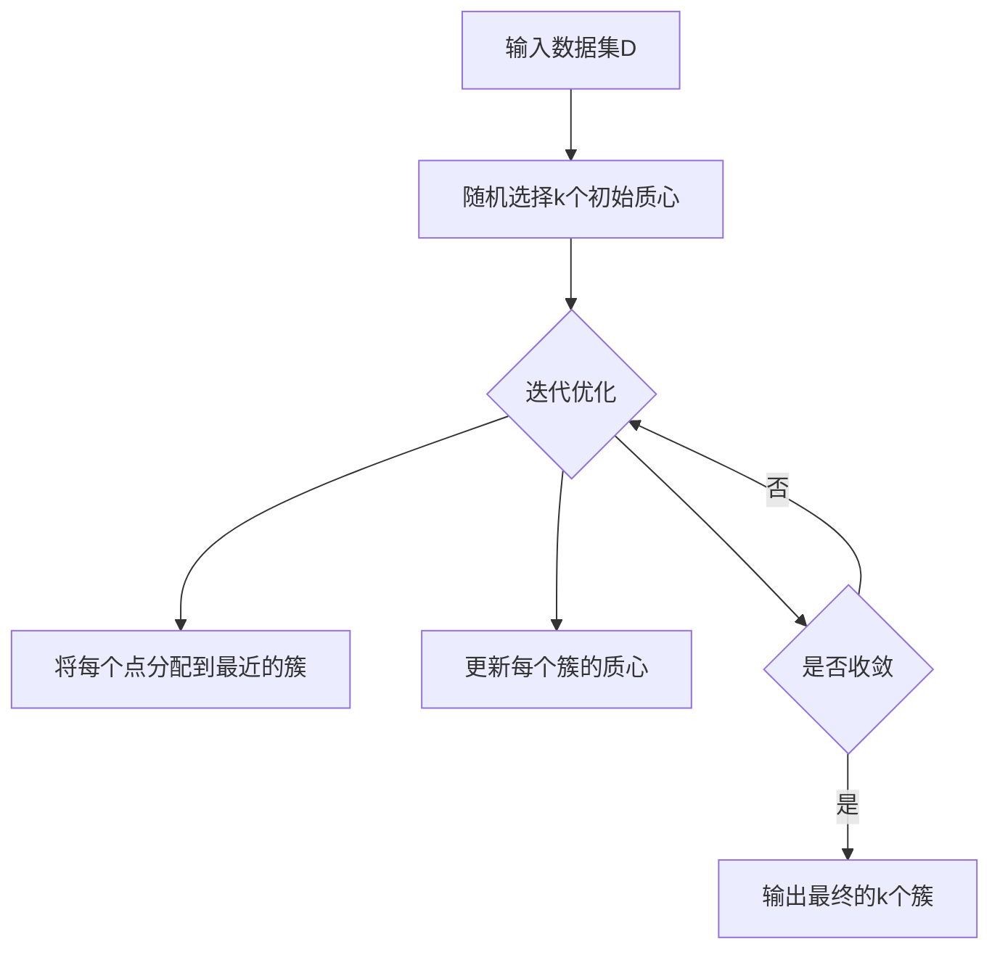

# K-Means - 原理与代码实例讲解

## 1.背景介绍
### 1.1 聚类分析概述
聚类分析是数据挖掘和机器学习领域的一个重要分支,其目标是将数据集划分为若干个有意义的簇(Cluster),使得同一个簇内的数据点彼此相似,而不同簇间的数据点差异较大。聚类分析广泛应用于模式识别、图像分割、信息检索、推荐系统等众多领域。

### 1.2 K-Means算法简介
K-Means是最经典、应用最广泛的聚类算法之一。该算法以 k 个簇的均值(Means)作为聚类的中心点,通过迭代优化的方式将数据点分配到最近的簇,并不断更新簇的中心点,直至达到收敛条件。K-Means算法简单、高效,易于理解和实现,因而成为聚类分析的首选算法。

### 1.3 K-Means的优缺点
K-Means算法的主要优点包括:
1. 原理简单,易于实现;
2. 计算复杂度较低,适用于大规模数据集;
3. 聚类效果较好,对球形数据集尤为适用。

但K-Means算法也存在一些缺点:
1. 需要预先指定聚类数 k,对 k 值敏感;  
2. 对噪声和异常点敏感;
3. 容易陷入局部最优;
4. 对非凸形数据集聚类效果较差。

## 2.核心概念与联系
### 2.1 距离度量
K-Means算法基于距离度量来衡量数据点之间的相似性。常用的距离度量包括欧氏距离、曼哈顿距离、余弦相似度等。其中,欧氏距离是最常用的距离度量,定义为两点坐标差的平方和的平方根:

$$d(x,y)=\sqrt{\sum_{i=1}^n(x_i-y_i)^2}$$

其中,$x=(x_1,x_2,...,x_n)$和$y=(y_1,y_2,...,y_n)$是 n 维空间中的两个点。

### 2.2 质心
质心(Centroid)是一个簇的中心点,通常定义为簇内所有点的算术平均:

$$\mu_j=\frac{1}{|C_j|}\sum_{x_i\in C_j}x_i$$

其中,$\mu_j$是第 j 个簇$C_j$的质心,$|C_j|$表示簇$C_j$的样本数。

### 2.3 目标函数
K-Means算法的目标是最小化所有数据点到其所属簇质心的距离平方和,即最小化目标函数:

$$J=\sum_{j=1}^k\sum_{x_i\in C_j}\|x_i-\mu_j\|^2$$

其中,k 是聚类数,$\mu_j$是第 j 个簇的质心。

## 3.核心算法原理具体操作步骤 
K-Means算法通过迭代优化的方式求解聚类问题,其基本步骤如下:

1. 随机选择 k 个数据点作为初始质心; 
2. 重复下列步骤直至收敛:
   a. 对每个数据点,计算其到 k 个质心的距离,并将其分配到最近的簇;
   b. 对每个簇,重新计算其质心(即簇内所有点的均值); 
3. 输出最终的 k 个簇及其质心。

算法收敛的条件通常为质心不再变化,或者目标函数值的变化小于某个阈值。

## 4.数学模型和公式详细讲解举例说明
下面以一个简单的二维数据集为例,详细说明K-Means算法的数学模型和公式。

假设有数据集$D=\{x_1,x_2,...,x_m\}$,其中每个数据点$x_i=(x_{i1},x_{i2})$是二维空间中的一个点。我们希望将 D 划分为 k=3 个簇。

首先,随机选择 k=3 个点作为初始质心$\{\mu_1,\mu_2,\mu_3\}$。

然后,进入迭代优化过程:

1. 对每个数据点$x_i$,计算其到 3 个质心的欧氏距离:

$$d(x_i,\mu_j)=\sqrt{(x_{i1}-\mu_{j1})^2+(x_{i2}-\mu_{j2})^2},j=1,2,3$$

并将$x_i$分配到距离最近的簇$C_j$。

2. 对每个簇$C_j$,重新计算其质心:

$$\mu_j=(\frac{1}{|C_j|}\sum_{x_i\in C_j}x_{i1},\frac{1}{|C_j|}\sum_{x_i\in C_j}x_{i2}),j=1,2,3$$

3. 计算目标函数值:

$$J=\sum_{j=1}^3\sum_{x_i\in C_j}\|x_i-\mu_j\|^2$$

4. 重复步骤1-3,直至质心不再变化,或目标函数值变化小于某个阈值。

最终,我们得到 3 个簇$\{C_1,C_2,C_3\}$及其质心$\{\mu_1,\mu_2,\mu_3\}$,实现了对数据集 D 的聚类。

## 5.项目实践：代码实例和详细解释说明
下面给出K-Means算法的Python实现,并对关键代码进行详细解释。

```python
import numpy as np

class KMeans:
    def __init__(self, k=3, max_iter=100, tol=1e-4):
        self.k = k  # 聚类数
        self.max_iter = max_iter  # 最大迭代次数
        self.tol = tol  # 收敛阈值
        self.centroids = None  # 簇质心
        self.labels = None  # 数据点的簇标签
        
    def fit(self, X):
        # 随机选择k个点作为初始质心
        idx = np.random.choice(X.shape[0], self.k, replace=False)
        self.centroids = X[idx]
        
        for _ in range(self.max_iter):
            # 计算每个点到质心的距离,并分配到最近的簇
            distances = self._calc_distances(X)
            self.labels = np.argmin(distances, axis=1)
            
            # 更新质心
            centroids_old = self.centroids
            for i in range(self.k):
                self.centroids[i] = np.mean(X[self.labels == i], axis=0)
            
            # 判断是否收敛
            if np.sum(np.abs(self.centroids - centroids_old)) < self.tol:
                break
                
    def _calc_distances(self, X):
        distances = np.zeros((X.shape[0], self.k))
        for i in range(self.k):
            distances[:,i] = np.linalg.norm(X - self.centroids[i], axis=1)
        return distances
```

代码解释:
- `__init__`方法初始化KMeans类,设置聚类数 k、最大迭代次数`max_iter`和收敛阈值`tol`,并初始化质心`centroids`和数据点标签`labels`。
- `fit`方法对数据集 X 进行聚类。首先随机选择 k 个点作为初始质心,然后进入迭代优化过程:
  - 调用`_calc_distances`方法计算每个数据点到 k 个质心的距离,并将其分配到最近的簇。
  - 对每个簇,更新其质心为簇内所有点的均值。 
  - 判断质心是否收敛,若收敛则退出迭代。
- `_calc_distances`方法计算数据点到质心的欧氏距离。

使用该算法进行聚类的示例代码如下:

```python
from sklearn.datasets import make_blobs

# 生成示例数据
X, _ = make_blobs(n_samples=100, centers=3, random_state=42)

# 构建KMeans模型并训练
kmeans = KMeans(k=3)  
kmeans.fit(X)

# 输出聚类结果
print(kmeans.labels)
print(kmeans.centroids)
```

## 6.实际应用场景
K-Means算法在实际中有广泛的应用,下面列举几个典型场景:

1. 客户细分:根据客户的属性(如年龄、收入、消费行为等)将其划分为不同的群体,制定针对性的营销策略。
2. 图像分割:将图像划分为前景和背景,或不同的目标区域,实现目标检测和识别。
3. 文本聚类:根据文本的主题、关键词等将文档划分为不同的类别,实现文本组织和检索。
4. 异常检测:将正常数据聚为一类,异常数据作为离群点,实现异常行为和故障的检测。

## 7.工具和资源推荐
1. scikit-learn:机器学习领域著名的Python库,提供了易用、高效的K-Means实现。
2. ELKI:专门用于聚类分析的Java库,包含多种聚类算法,并提供了丰富的评估指标。
3. Weka:基于Java的机器学习和数据挖掘平台,包含K-Means等多种聚类算法,适合初学者学习使用。
4. 《数据挖掘导论》:经典的数据挖掘教材,对K-Means等聚类算法有深入浅出的讲解。
5. 《模式识别与机器学习》:经典的机器学习教材,对聚类分析有系统全面的介绍。

## 8.总结：未来发展趋势与挑战
K-Means算法虽然简单高效,但也面临一些挑战,如对 k 值和初始质心敏感、容易陷入局部最优等。未来K-Means算法的改进和发展方向主要包括:

1. 自适应确定聚类数 k,避免人工设置带来的不确定性。
2. 采用启发式策略选择初始质心,提高聚类质量和收敛速度。
3. 引入模拟退火、遗传算法等全局优化技术,跳出局部最优。
4. 针对高维数据,采用降维、子空间聚类等技术,克服维度灾难。
5. 针对流数据、图数据等新型数据,设计增量式、分布式的K-Means变体。

总之,K-Means算法作为聚类分析的基础算法,仍有很大的改进空间和广阔的应用前景。

## 9.附录：常见问题与解答
1. 如何选择合适的聚类数 k?
   - 根据先验知识,了解数据的大致分布和类别数。
   - 采用手肘法、轮廓系数等评估指标,选择聚类效果最优的 k 值。
   - 尝试多个 k 值,对比聚类结果的可解释性和实用性。

2. K-Means算法对异常点敏感怎么办?
   - 采用中位数等稳健的聚类中心,减少异常点的影响。
   - 引入模糊隶属度,允许数据点属于多个簇,降低硬分配的影响。 
   - 先用异常检测方法移除异常点,再进行聚类。

3. K-Means算法如何避免局部最优?
   - 采用K-Means++等启发式策略,选择尽可能分散的初始质心。
   - 多次运行K-Means算法,选择目标函数最小的结果。
   - 引入模拟退火等全局优化策略,跳出局部最优。

4. K-Means算法的时间复杂度是多少?
   - 单次迭代的时间复杂度为O(kmn),其中 k 为聚类数,m 为数据点数,n 为数据维度。
   - 迭代次数通常为几十到几百,故总体复杂度为O(Ikmn),其中 I 为迭代次数。
   - 采用K-D树、Mini-Batch K-Means等优化方法,可将复杂度降至O(km+Ikm)。

5. K-Means算法如何处理高维数据?
   - 先对数据进行PCA、t-SNE等降维,再进行聚类。
   - 采用子空间聚类,在不同子空间进行局部聚类,再整合结果。
   - 引入稀疏正则化,自动选择重要特征,降低维度。

下图展示了K-Means算法的核心原理和流程:



以上就是对K-Means算法的全