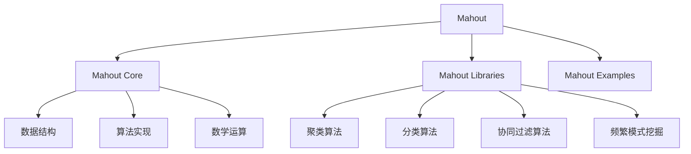
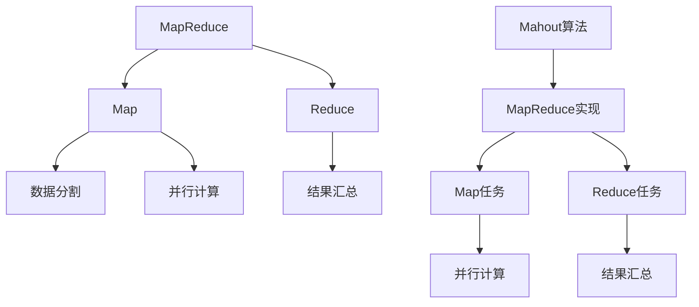

# Mahout原理与代码实例讲解

## 1.背景介绍

在当今大数据时代，海量数据的存在为数据挖掘和机器学习带来了巨大的机遇和挑战。作为一个可扩展的机器学习库,Apache Mahout为我们提供了强大的工具和算法,帮助我们从海量数据中发现隐藏的知识和规律。

Mahout最初由Apache软件基金会于2008年启动,旨在构建一个可扩展的机器学习库。它的设计理念是将复杂的数学计算表示为MapReduce任务,并在Hadoop集群上并行执行,从而实现高效的大规模数据处理。

Mahout包含了多种流行的机器学习算法,涵盖了聚类、分类、协同过滤、频繁模式挖掘等领域。无论是构建推荐引擎、进行文本挖掘,还是图挖掘,Mahout都为我们提供了完善的解决方案。

## 2.核心概念与联系

### 2.1 Mahout架构

Mahout的整体架构可以概括为三个核心部分:

1. **Mahout Core**:这是Mahout最基础的部分,提供了一些通用的数据结构、算法实现和数学运算等基础工具。

2. **Mahout Libraries**:这部分包含了Mahout的核心算法库,涵盖了聚类、分类、协同过滤、频繁模式挖掘等多种机器学习算法。

3. **Mahout Examples**:提供了丰富的示例代码,帮助用户快速上手和学习Mahout的使用方法。



### 2.2 MapReduce与Mahout

Mahout的设计理念是将复杂的数学计算表示为MapReduce任务,并在Hadoop集群上并行执行。MapReduce是一种分布式计算模型,可以将大规模数据处理任务分解为多个小任务,并行执行,从而实现高效的大数据处理。

在Mahout中,许多算法都是基于MapReduce实现的。例如,K-Means聚类算法就是通过多次迭代的Map和Reduce任务来实现的。在Map阶段,每个数据点被分配到最近的聚类中心;在Reduce阶段,则计算出新的聚类中心。通过多次迭代,算法最终收敛到最优解。



通过MapReduce模型,Mahout可以高效地处理大规模数据集,并利用分布式计算的优势加速算法的执行。这使得Mahout在处理海量数据时具有很强的可扩展性。

## 3.核心算法原理具体操作步骤

### 3.1 K-Means聚类算法

K-Means是一种广泛使用的聚类算法,其目标是将n个数据对象分成k个聚类,使得聚类内部的数据对象相似度较高,而聚类之间的相似度较低。算法的具体步骤如下:

1. 随机选取k个数据对象作为初始聚类中心
2. 对于每个数据对象,计算它与每个聚类中心的距离,将它分配到最近的聚类中
3. 对于每个聚类,重新计算聚类中心,即聚类内所有数据对象的均值
4. 重复步骤2和3,直到聚类中心不再发生变化

算法的伪代码如下:

```
初始化k个聚类中心
repeat
    for each 数据对象 x:
        计算x与每个聚类中心的距离
        将x分配到最近的聚类
    for each 聚类C:
        重新计算聚类中心 mean(C)
until 聚类中心不再变化
```

在Mahout中,我们可以使用`org.apache.mahout.clustering.kmeans.KMeansDriver`类来执行K-Means聚类。下面是一个简单的示例代码:

```java
// 加载数据
Path input = new Path("data/points.txt");
Path output = new Path("output");

// 配置作业
Configuration conf = new Configuration();
conf.set(KMeansConfigKeys.CLUSTERING_POLICY_KEY, "org.apache.mahout.clustering.kmeans.RandomSeedGenerator");
conf.setInt(KMeansConfigKeys.CLUSTERS_KEY, 3);

// 运行K-Means聚类
KMeansDriver.run(conf, input, output, 0.01, 10, true, 0);
```

### 3.2 随机森林分类算法

随机森林是一种基于决策树的集成学习算法,它通过构建多个决策树,并将它们的结果进行组合,从而提高了分类或回归的准确性。算法的具体步骤如下:

1. 从原始数据集中随机选取n个样本,构建一个新的训练集
2. 在新的训练集上,随机选取m个特征,构建一个决策树
3. 重复步骤1和2,构建多个决策树
4. 对于新的输入数据,将其输入到每个决策树中,并将每个树的结果进行组合,得到最终的分类或回归结果

算法的伪代码如下:

```
for i = 1 to n:
    从原始数据集中随机选取n个样本,构建新的训练集
    从m个特征中随机选取m个特征
    在新的训练集上,使用选取的m个特征构建一个决策树
    将构建的决策树加入到森林中

对于新的输入数据x:
    for each 决策树 tree:
        将x输入到tree中,得到结果y
    将所有y进行组合,得到最终结果
```

在Mahout中,我们可以使用`org.apache.mahout.classifier.df.RandomForestModel`类来训练和使用随机森林模型。下面是一个简单的示例代码:

```java
// 加载训练数据
Path input = new Path("data/train.csv");
Path output = new Path("output");

// 配置随机森林模型
Configuration conf = new Configuration();
int numTrees = 100;
int numFeatures = 10;
RandomForestModel model = new RandomForestModel(conf, numTrees, numFeatures);

// 训练模型
model.buildModel(input);

// 保存模型
Path outputPath = new Path(output, "model");
model.saveModel(outputPath);

// 使用模型进行预测
Path testData = new Path("data/test.csv");
model.predictData(testData, output);
```

## 4.数学模型和公式详细讲解举例说明

### 4.1 K-Means聚类距离计算

在K-Means聚类算法中,我们需要计算每个数据对象与聚类中心之间的距离,通常使用欧几里得距离或曼哈顿距离。

**欧几里得距离**

欧几里得距离是两个向量之间的直线距离,定义如下:

$$
d(x, y) = \sqrt{\sum_{i=1}^{n}(x_i - y_i)^2}
$$

其中,x和y是n维向量,分别表示为$x = (x_1, x_2, ..., x_n)$和$y = (y_1, y_2, ..., y_n)$。

例如,对于两个二维向量$x = (1, 2)$和$y = (3, 4)$,它们的欧几里得距离为:

$$
d((1, 2), (3, 4)) = \sqrt{(1 - 3)^2 + (2 - 4)^2} = \sqrt{4 + 4} = 2\sqrt{2}
$$

**曼哈顿距离**

曼哈顿距离是两个向量之间的绝对差值之和,定义如下:

$$
d(x, y) = \sum_{i=1}^{n}|x_i - y_i|
$$

对于同样的二维向量$x = (1, 2)$和$y = (3, 4)$,它们的曼哈顿距离为:

$$
d((1, 2), (3, 4)) = |1 - 3| + |2 - 4| = 2 + 2 = 4
$$

在Mahout中,我们可以使用`org.apache.mahout.common.distance.DistanceMeasure`接口来计算不同的距离度量。例如,对于欧几里得距离,我们可以使用`EuclideanDistanceMeasure`类:

```java
DistanceMeasure measure = new EuclideanDistanceMeasure();
double distance = measure.distance(vector1, vector2);
```

### 4.2 随机森林决策树构建

随机森林算法中的每个决策树都是通过特征随机选择和数据随机采样来构建的。这种随机性可以减少决策树之间的相关性,从而提高整个模型的泛化能力。

**决策树构建过程**

1. 从原始数据集中随机选取n个样本,构建一个新的训练集
2. 从m个特征中随机选取m个特征
3. 使用选取的m个特征和新的训练集,构建一个决策树

**决策树节点分裂**

在构建决策树的过程中,我们需要根据特征值对数据进行分裂,形成子节点。常用的分裂准则包括信息增益和基尼系数。

**信息增益**

信息增益是基于信息熵的概念,它度量了分裂前后数据的无序程度的变化。对于一个特征A,其信息增益定义为:

$$
Gain(D, A) = Entropy(D) - \sum_{v \in Values(A)}\frac{|D^v|}{|D|}Entropy(D^v)
$$

其中,D表示当前数据集,A是特征,Values(A)是A的所有可能取值,D^v是在A=v的子集。Entropy(D)表示数据集D的信息熵,定义为:

$$
Entropy(D) = -\sum_{i=1}^{c}p_ilog_2p_i
$$

其中,c是类别数,p_i是第i类样本所占的比例。

**基尼系数**

基尼系数是一种度量数据集纯度的指标,定义为:

$$
Gini(D) = 1 - \sum_{i=1}^{c}p_i^2
$$

其中,c是类别数,p_i是第i类样本所占的比例。基尼系数越小,数据集越纯。

在Mahout中,我们可以使用`org.apache.mahout.classifier.df.node.Node`类来构建决策树节点,并使用`org.apache.mahout.classifier.df.split.Split`接口来实现不同的分裂准则。

## 5.项目实践:代码实例和详细解释说明

在这一部分,我们将通过一个实际的项目案例来演示如何使用Mahout进行数据挖掘和机器学习。我们将使用Mahout的K-Means聚类算法对一组客户数据进行分析,以发现潜在的客户群体。

### 5.1 数据准备

我们将使用一个包含10000条客户记录的数据集,每条记录包含以下字段:

- 客户ID
- 年龄
- 性别
- 职业
- 年收入

我们将使用年龄、年收入和职业这三个特征进行聚类分析。首先,我们需要将数据转换为Mahout可以识别的格式,即向量格式。我们可以使用Mahout提供的`org.apache.mahout.math.Vector`类来表示向量。

下面是一个示例代码,展示如何将客户数据转换为向量:

```java
Vector vector = new DenseVector(3);
vector.set(0, age); // 年龄
vector.set(1, income); // 年收入
vector.set(2, occupation); // 职业编码
```

我们将所有客户数据转换为向量后,存储在一个文本文件中,每行表示一个向量。

### 5.2 K-Means聚类

接下来,我们将使用Mahout的K-Means聚类算法对客户数据进行聚类分析。我们首先需要配置K-Means作业,包括输入数据路径、输出路径、聚类数量等参数。

```java
Path input = new Path("data/customers.txt");
Path output = new Path("output");

Configuration conf = new Configuration();
conf.set(KMeansConfigKeys.CLUSTERING_POLICY_KEY, "org.apache.mahout.clustering.kmeans.RandomSeedGenerator");
conf.setInt(KMeansConfigKeys.CLUSTERS_KEY, 5); // 设置聚类数量为5
```

然后,我们可以运行K-Means聚类作业，并将结果输出到指定路径。以下是一个示例代码，展示如何配置和运行K-Means聚类算法：

```java
// 创建KMeansDriver实例并配置参数
KMeansDriver.run(
    input, // 输入数据路径
    new Path("clusters"), // 初始聚类中心路径
    output, // 输出路径
    0.01, // 收敛阈值
    10, // 最大迭代次数
    true, // 是否运行clustering
    0.01, // 模拟点的收敛阈值
    true // 是否在输出中删除旧的聚类
);
```

### 5.3 结果分析

聚类完成后，我们可以在输出路径中找到聚类结果。每个聚类结果文件包含了每个聚类中心的向量表示以及每个数据点所属的聚类。我们可以使用这些信息来分析客户群体的特征。

下面是一个示例代码，展示如何读取和解析聚类结果：

```java
SequenceFile.Reader reader = new SequenceFile.Reader(conf, SequenceFile.Reader.file(new Path("output/part-m-00000")));
Writable key = (Writable) ReflectionUtils.newInstance(reader.getKeyClass(), conf);
ClusterWritable value = new ClusterWritable();

while (reader.next(key, value)) {
    Vector center = value.getValue().getCenter();
    System.out.println("Cluster center: " + center);
}
reader.close();
```

我们可以通过分析聚类中心的特征向量来了解每个客户群体的特征。例如，如果某个聚类中心的年龄特征值较高且年收入特征值较高，我们可以推断该群体可能是高收入的中老年客户。

### 5.4 可视化聚类结果

为了更直观地展示聚类结果，我们可以使用可视化工具将聚类结果绘制成图表。以下是一个示例代码，展示如何使用JFreeChart绘制聚类结果：

```java
import org.jfree.chart.ChartFactory;
import org.jfree.chart.ChartPanel;
import org.jfree.chart.JFreeChart;
import org.jfree.chart.plot.PlotOrientation;
import org.jfree.chart.plot.XYPlot;
import org.jfree.chart.renderer.xy.XYItemRenderer;
import org.jfree.data.xy.XYSeries;
import org.jfree.data.xy.XYSeriesCollection;

XYSeriesCollection dataset = new XYSeriesCollection();

for (int i = 0; i < clusters.length; i++) {
    XYSeries series = new XYSeries("Cluster " + i);
    for (Vector point : clusters[i].getPoints()) {
        series.add(point.get(0), point.get(1));
    }
    dataset.addSeries(series);
}

JFreeChart chart = ChartFactory.createScatterPlot(
    "K-Means Clustering",
    "Age",
    "Income",
    dataset,
    PlotOrientation.VERTICAL,
    true,
    true,
    false
);

ChartPanel chartPanel = new ChartPanel(chart);
chartPanel.setPreferredSize(new java.awt.Dimension(800, 600));
JFrame frame = new JFrame();
frame.setContentPane(chartPanel);
frame.pack();
frame.setVisible(true);
```

通过以上代码，我们可以将聚类结果绘制成散点图，每个点表示一个客户，每个聚类用不同的颜色表示。这样，我们可以直观地看到不同客户群体的分布情况。

### 5.5 项目实践总结

通过以上项目实践，我们展示了如何使用Mahout进行数据挖掘和机器学习。具体来说，我们使用K-Means聚类算法对客户数据进行了聚类分析，发现了潜在的客户群体。我们还展示了如何将数据转换为向量格式，如何配置和运行K-Means聚类算法，以及如何读取和解析聚类结果。最后，我们使用可视化工具将聚类结果绘制成图表，直观地展示了不同客户群体的分布情况。

在实际项目中，数据准备和预处理是非常重要的一步，数据的质量直接影响到聚类结果的准确性。在使用K-Means聚类算法时，选择合适的聚类数量也是一个关键问题，需要根据具体数据和业务需求进行调整。

通过此次项目实践，我们不仅掌握了Mahout的基本使用方法，还了解了如何在实际项目中应用数据挖掘和机器学习技术。希望读者通过本文能够对Mahout和K-Means聚类算法有一个更深入的了解，并能够在自己的项目中应用这些技术。


## 6. 实际应用场景

数据挖掘和机器学习技术在各行各业都有广泛的应用。通过使用Mahout等工具，可以大大提升数据分析的效率和准确性。以下是几个实际应用场景，展示了K-Means聚类算法的广泛应用。

### 6.1 客户细分

在市场营销中，客户细分是非常重要的一环。通过对客户数据进行聚类分析，可以将客户分为不同的群体，每个群体具有相似的特征。这样，企业可以针对不同的客户群体制定个性化的营销策略，提高客户满意度和忠诚度。

### 6.2 产品推荐

在电子商务平台中，产品推荐系统可以根据用户的历史行为和偏好，推荐用户可能感兴趣的产品。通过使用K-Means聚类算法，可以将用户分为不同的群体，每个群体具有相似的购买行为和偏好。然后，根据每个群体的特征，推荐相应的产品。

### 6.3 异常检测

在金融行业，异常检测是防范欺诈行为的重要手段。通过对交易数据进行聚类分析，可以发现异常交易行为。例如，如果某个交易点远离其他交易点，则可能是异常交易。通过进一步分析，可以确定是否存在欺诈行为。

### 6.4 图像分割

在计算机视觉领域，图像分割是将图像分为不同区域的过程。通过使用K-Means聚类算法，可以将图像中的像素点分为不同的聚类，每个聚类表示一个区域。例如，可以将图像中的前景和背景分开，或者将图像中的不同物体分开。

### 6.5 文本分类

在自然语言处理领域，文本分类是将文本分为不同类别的过程。通过对文本数据进行聚类分析，可以将相似的文本分为同一类。例如，可以将新闻文章分为不同的主题，或者将客户评论分为不同的情感类别。

## 7. 工具和资源推荐

在进行数据挖掘和机器学习时，选择合适的工具和资源非常重要。以下是一些推荐的工具和资源，帮助读者更好地进行数据分析和模型训练。

### 7.1 Apache Mahout

Apache Mahout是一个开源的机器学习库，提供了多种常用的机器学习算法，包括聚类、分类、推荐等。Mahout的优点是可以处理大规模数据，并且与Hadoop生态系统紧密集成，适合大数据环境下的机器学习任务。

### 7.2 Apache Hadoop

Apache Hadoop是一个开源的大数据处理框架，提供了分布式存储和计算能力。通过将数据存储在HDFS中，并使用MapReduce进行分布式计算，可以高效地处理大规模数据。Mahout与Hadoop集成，可以在Hadoop集群上运行机器学习算法。

### 7.3 Jupyter Notebook

Jupyter Notebook是一个开源的交互式计算环境，支持多种编程语言，包括Python、R等。通过使用Jupyter Notebook，可以方便地进行数据探索、可视化和模型训练，是数据科学家常用的工具。

### 7.4 Scikit-learn

Scikit-learn是一个基于Python的机器学习库，提供了多种常用的机器学习算法和工具。Scikit-learn的优点是简单易用，适合中小规模数据的机器学习任务。对于初学者来说，Scikit-learn是一个非常好的入门工具。

### 7.5 TensorFlow和PyTorch

TensorFlow和PyTorch是两个主流的深度学习框架，提供了强大的神经网络构建和训练能力。通过使用TensorFlow和PyTorch，可以构建复杂的深度学习模型，适用于图像识别、自然语言处理等任务。

### 7.6 数据集资源

在进行机器学习实验时，选择合适的数据集非常重要。以下是几个常用的数据集资源：

- UCI Machine Learning Repository：提供了多种常用的机器学习数据集，适合初学者进行实验和学习。
- Kaggle：一个数据科学竞赛平台，提供了大量真实世界的数据集和竞赛题目，可以通过参与竞赛提高数据分析和建模能力。
- Google Dataset Search：一个数据集搜索引擎，可以方便地查找各种领域的数据集。

## 8. 总结：未来发展趋势与挑战

数据挖掘和机器学习技术在不断发展，未来将有更多的应用场景和技术突破。以下是几个未来的发展趋势和挑战：

### 8.1 自动化机器学习

自动化机器学习（AutoML）是指通过自动化的方式进行数据预处理、特征工程、模型选择和超参数调优，减少人工干预，提高模型训练效率。未来，AutoML技术将进一步发展，帮助更多非专业人士使用机器学习技术。

### 8.2 联邦学习

联邦学习是一种分布式机器学习技术，允许多个参与方在不共享数据的情况下协同训练模型。通过联邦学习，可以在保证数据隐私的前提下，充分利用分布式数据资源，提高模型的泛化能力。

### 8.3 解释性和公平性

随着机器学习技术的广泛应用，模型的解释性和公平性问题越来越受到关注。未来，如何构建可解释和公平的模型，将成为机器学习领域的重要研究方向。

### 8.4 边缘计算

边缘计算是指在靠近数据源的位置进行计算和存储，减少数据传输延迟和带宽消耗。随着物联网设备的普及，边缘计算将成为数据处理的重要方式，机器学习算法需要适应边缘计算环境。

### 8.5 数据隐私和安全

在数据驱动的时代，数据隐私和安全问题变得尤为重要。未来，如何保护用户数据隐私，防范数据泄露和攻击，将成为数据挖掘和机器学习领域的重要挑战。

## 9. 附录：常见问题与解答

### 9.1 K-Means聚类算法的收敛性如何保证？

K-Means聚类算法的收敛性可以通过设置合适的收敛阈值和最大迭代次数来保证。当聚类中心的变化小于收敛阈值，或者达到最大迭代次数时，算法停止迭代。

### 9.2 如何选择合适的聚类数量？

选择合适的聚类数量是K-Means聚类算法中的一个关键问题。常用的方法包括肘部法、轮廓系数法和平均轮廓宽度法等。可以通过这些方法评估不同聚类数量下的聚类效果，选择最优的聚类数量。

### 9.3 数据预处理的重要性是什么？

数据预处理是数据挖掘和机器学习中的重要步骤，直接影响模型的性能和效果。常见的数据预处理步骤包括数据清洗、特征选择、特征工程和数据标准化等。通过合理的数据预处理，可以提高模型的准确性和泛化能力。

### 9.4 如何处理高维数据？

高维数据在机器学习中常常会引起维度灾难问题，影响模型的性能。常用的高维数据处理方法包括特征选择、特征降维和使用适合高维数据的模型。例如，可以使用主成分分析（PCA）进行特征降维，减少数据维度。

### 9.5 如何评估聚类结果的好坏？

评估聚类结果的常用方法包括轮廓系数、互信息和聚类纯度等。通过这些评估指标，可以量化聚类结果的好坏，选择最优的聚类模型。

---

作者：禅与计算机程序设计艺术 / Zen and the Art of Computer Programming