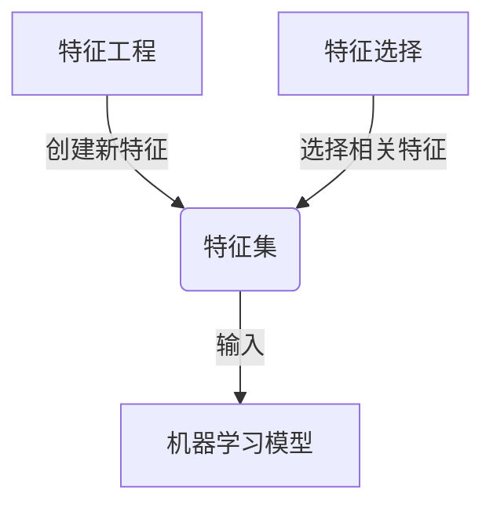
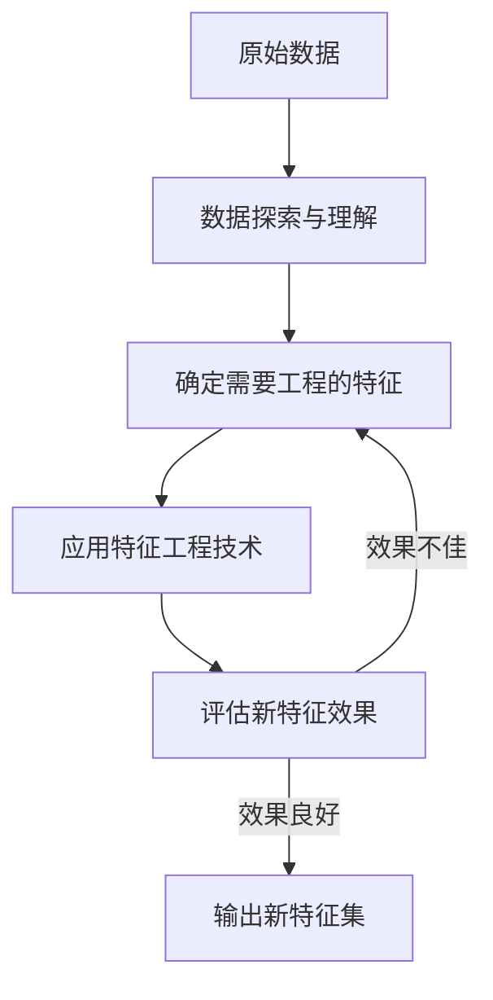
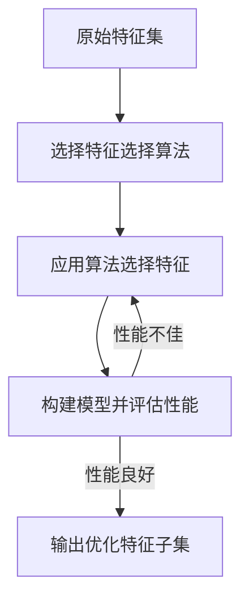

# Python机器学习实战：特征选择与特征工程的最佳实践

## 1.背景介绍

在机器学习项目中,数据预处理是确保模型性能的关键步骤之一。特征工程和特征选择作为数据预处理的重要组成部分,对于构建高质量的机器学习模型至关重要。本文将探讨Python中特征选择和特征工程的最佳实践,帮助您提高机器学习模型的准确性和效率。

### 1.1 什么是特征工程?

特征工程是从原始数据中构造出能更好地表示潜在问题的特征的过程。这些新特征可以是单个特征的组合、数学变换或完全新的特征。良好的特征工程可以极大地提高机器学习算法的性能。

### 1.2 什么是特征选择?

特征选择是从原始特征集中选择出对预测目标最相关的特征子集的过程。通过消除多余和无关的特征,特征选择可以简化模型,提高其准确性,减少过拟合风险,并加快训练速度。

## 2.核心概念与联系

特征工程和特征选择虽然是两个不同的概念,但它们在机器学习项目中是紧密相连的。



特征工程的目标是从原始数据中创建出新的、更具表现力的特征,从而增强特征集的表现能力。而特征选择则是从这个特征集中选择出对预测目标最相关的一部分特征,去除多余无关的特征。通过这两个过程的结合,我们可以为机器学习模型提供高质量的输入数据,从而提高模型的性能。

## 3.核心算法原理具体操作步骤

### 3.1 特征工程算法

常用的特征工程技术包括:

#### 3.1.1 数值特征工程

- **缺失值处理**: 填充缺失值(均值/中位数/最频繁值等)、删除缺失值等
- **异常值处理**: 用分位数或者固定阈值去除异常值
- **数值离散化**: 将连续值转换为分类值,如年龄区间
- **数据变换**: 对数变换、指数变换等,使数据更加符合正态分布

#### 3.1.2 类别特征工程 

- **编码技术**: 如One-Hot编码、Label编码等,将类别值转换为数值向量
- **计数特征**: 对类别值进行计数,构造新的计数特征
- **目标编码**: 将类别值映射为该类别的目标均值

#### 3.1.3 组合特征工程

- **多特征组合**: 将多个原有特征进行乘积、比值等算术运算组合
- **特征交叉**: 构造特征与特征之间的组合作为新特征

具体的特征工程步骤如下:



1. 探索和理解原始数据,熟悉数据的分布和特征之间的关系
2. 确定需要进行特征工程的特征列表
3. 应用上述特征工程技术对目标特征进行加工
4. 评估新特征对模型性能的影响
5. 如果效果不佳,重复步骤3尝试其他技术;如果效果良好,输出新特征集

### 3.2 特征选择算法

常用的特征选择算法有:

#### 3.2.1 Filter方法

利用统计方法评分每个特征与目标值的相关性,保留得分最高的前N个特征。常用的Filter方法包括:

- 相关系数法: 计算每个特征与目标值的相关系数
- 卡方检验: 对于分类目标,利用卡方统计量评分
- 互信息法: 计算每个特征与目标值的互信息

#### 3.2.2 Wrapper方法 

利用机器学习模型自身作为评分机制,每次选择一部分特征训练模型,保留效果最好的那部分特征。常用的Wrapper方法有:

- 递归特征消除(RFE)
- 贪心算法(前向选择、后向消除)

#### 3.2.3 Embedded方法

在机器学习算法训练的过程中自动完成特征选择。常用的Embedded方法包括:

- Lasso回归中的特征选择
- 树模型(如随机森林)中的特征重要性评分

具体的特征选择步骤如下:



1. 选择合适的特征选择算法,如Filter、Wrapper或Embedded
2. 应用选定算法对原始特征集进行特征选择
3. 利用选出的特征子集构建机器学习模型,评估模型性能
4. 如果性能不佳,重复步骤2尝试其他算法;如果性能良好,输出优化后的特征子集

## 4.数学模型和公式详细讲解举例说明

### 4.1 相关系数法

相关系数法利用统计学中的相关系数来评估特征与目标值之间的相关程度。对于连续型目标值,常用的是**皮尔逊相关系数**:

$$r=\frac{\sum_{i=1}^{n}(x_i-\overline{x})(y_i-\overline{y})}{\sqrt{\sum_{i=1}^{n}(x_i-\overline{x})^2}\sqrt{\sum_{i=1}^{n}(y_i-\overline{y})^2}}$$

其中$x_i$是特征值,$y_i$是目标值,$\overline{x}$和$\overline{y}$分别是特征值和目标值的均值。

对于分类型目标值,常用的是**点双列相关系数**:

$$r=\frac{n_{00}n_{11}-n_{01}n_{10}}{\sqrt{n_0n_1n_{0.}n_{.1}}}$$

其中$n_{00}$表示特征值和目标值均为0的样本数,...,$n_0$和$n_1$分别表示目标值为0和1的样本数总数。

皮尔逊相关系数的取值范围是[-1,1],绝对值越大表示相关性越强。一般取绝对值最大的N个特征作为选择结果。

### 4.2 互信息法

互信息法基于信息论中的互信息概念,度量特征值对目标值的信息增益。对于离散特征X和目标值Y,其互信息定义为:

$$I(X;Y)=\sum_{x\in X}\sum_{y\in Y}p(x,y)\log\frac{p(x,y)}{p(x)p(y)}$$

其中$p(x,y)$是X和Y的联合概率分布函数,$p(x)$和$p(y)$分别是X和Y的边缘概率分布函数。

对于连续特征,需要先对特征值进行离散化处理。互信息的取值越大,表示该特征对目标值的信息增益越大,应当被选择为重要特征。

### 4.3 LASSO回归

LASSO(Least Absolute Shrinkage and Selection Operator)回归在训练线性模型的同时,通过对权重系数施加L1正则化约束,实现自动特征选择的功能。其目标函数为:

$$\min_{\beta_0,\beta}\left\{\frac{1}{2n}\sum_{i=1}^{n}(y_i-\beta_0-\sum_{j=1}^{p}x_{ij}\beta_j)^2+\lambda\sum_{j=1}^{p}|\beta_j|\right\}$$

其中$\lambda$是一个超参数,控制L1范数项的权重。当$\lambda$增大时,更多的权重系数$\beta_j$会被压缩为0,从而实现特征选择。

## 5.项目实践: 代码实例和详细解释说明

以下是一个使用Python中scikit-learn库进行特征工程和特征选择的实例:

```python
import pandas as pd
from sklearn.preprocessing import OneHotEncoder, StandardScaler
from sklearn.impute import SimpleImputer
from sklearn.pipeline import Pipeline
from sklearn.compose import ColumnTransformer
from sklearn.feature_selection import SelectKBest, f_classif, mutual_info_classif

# 加载数据
data = pd.read_csv('data.csv')
X = data.drop('target', axis=1)
y = data['target']

# 特征工程管道
numeric_transformer = Pipeline([
    ('imputer', SimpleImputer(strategy='median')), # 填充缺失值
    ('scaler', StandardScaler()) # 标准化
])

categorical_transformer = OneHotEncoder(handle_unknown='ignore') # One-Hot编码

preprocessor = ColumnTransformer([
    ('num', numeric_transformer, X.select_dtypes(include=['float64','int64']).columns),
    ('cat', categorical_transformer, X.select_dtypes(include=['object']).columns)
])

# 特征选择
selector = SelectKBest(score_func=mutual_info_classif, k=10) # 基于互信息选择前10个特征

# 构建流水线
pipeline = Pipeline([
    ('preprocess', preprocessor),
    ('select', selector)
])

# 执行特征工程和选择
X_new = pipeline.fit_transform(X, y)
```

代码解释:

1. 首先加载数据,分离出特征矩阵X和目标向量y
2. 构建特征工程管道preprocessor,包括对数值特征进行缺失值填充和标准化,对类别特征进行One-Hot编码
3. 选择互信息法作为特征选择算法,基于互信息评分保留前10个最重要的特征
4. 将特征工程和特征选择过程组合成一个流水线pipeline
5. 调用pipeline的fit_transform方法,一次性完成特征工程和特征选择,得到新的特征矩阵X_new

这个例子展示了如何使用scikit-learn中的现成模块和transformer类,组合出强大的特征工程和特征选择管道。

## 6.实际应用场景

特征工程和特征选择在各种机器学习任务中都有广泛应用,例如:

- **信用评分**: 从申请人的信息(如年龄、收入、历史记录等)中构造特征,并选择对评分最重要的特征,用于建立信用评分模型
- **欺诈检测**: 从金融交易数据中提取特征,并选择与欺诈行为高度相关的特征,训练检测欺诈的模型
- **推荐系统**: 从用户行为数据中构建特征,并选择对用户偏好最具预测能力的特征,提高推荐系统的精确度
- **计算机视觉**: 从图像像素数据中提取特征,并选择最能区分目标物体的特征,用于物体检测和识别任务
- **自然语言处理**: 从文本数据中提取字词、语法和语义特征,并选择对文本分类最有用的特征子集

总的来说,特征工程和特征选择可以为各种机器学习任务提供高质量的输入数据,从而提升模型的性能和泛化能力。

## 7.工具和资源推荐

以下是一些实现特征工程和特征选择的流行Python库和资源:

- **Scikit-learn**: 机器学习库,提供了数据预处理、特征工程和特征选择等多种工具
- **Feature-engine**: 一个专注于特征工程的Python库,包含多种特征变换和编码技术
- **Featuretools**: 一个自动特征工程库,可以从关系数据中智能构造特征
- **TPOT**: 一个自动机器学习工具,内置了特征预处理和特征构造模块
- **MLBox**: 一个机器学习的自动化工具,支持自动特征选择
- **Feature Selector**: 一个集成了多种特征选择算法的Python包

此外,Kaggle等数据科学竞赛平台上也有许多特征工程和特征选择的内核和教程值得学习参考。

## 8.总结: 未来发展趋势与挑战

随着机器学习算法和应用场景的不断发展,特征工程和特征选择也面临着新的发展趋势和挑战:

### 8.1 自动化特征工程

传统的特征工程过程需要数据科学家的领域知识和经验,是一个高度人工化的过程。未来,自动特征工程技术(如Featuretools)的发展将大大降低这一过程的人工成本。

### 8.2 端到端特征学习

深度学习