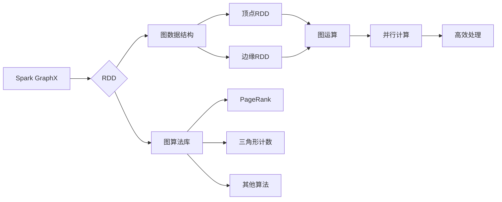

# Spark GraphX图计算引擎原理与代码实例讲解

## 1.背景介绍

在当今大数据时代，图计算已成为一种非常重要的数据处理范式。图数据结构可以用来表示复杂的关系型数据,如社交网络、Web链接、交通网络等。传统的关系型数据库和NoSQL数据库在处理这类数据时往往效率低下。为了高效处理大规模图数据,Apache Spark提供了GraphX作为分布式图计算框架。

GraphX是Apache Spark中用于图形数据分析的API,它基于Spark RDD(Resilient Distributed Dataset)数据抽象构建。GraphX通过Pregel的Bulk Synchronous Parallel(BSP)模型,支持图运算的并行计算,可以高效地执行图算法,如PageRank、三角形计数等。GraphX还提供了内置的图算法库和优化过的图数据结构,使得开发人员可以轻松地表达和执行复杂的图形分析工作负载。

### Mermaid流程图



## 2.核心概念与联系

GraphX中的核心概念包括:

1. **顶点(Vertex)**: 表示图中的节点,包含唯一ID和属性值。

2. **边(Edge)**: 表示顶点之间的连接关系,包含源顶点ID、目标顶点ID和属性值。

3. **属性图(Property Graph)**: 由顶点和边组成的属性图,可以表示复杂的关系型数据。

4. **视图(View)**: 对原始图的子集或转换形式的只读投影。

5. **消息(Message)**: 在图算法迭代过程中,顶点之间传递的数据。

6. **聚合消息(Aggregate Messages)**: 在图算法中,通过将收到的消息进行聚合来生成新的消息。

这些概念之间紧密相连,构成了GraphX的核心数据模型和计算模型。顶点和边组成属性图,算法通过在图上传递消息并聚合消息来实现迭代计算。视图为图的变换和子集提供了高效的表示方式。

## 3.核心算法原理具体操作步骤

GraphX采用了Pregel的BSP(Bulk Synchronous Parallel)计算模型,算法的执行过程分为以下几个步骤:

1. **初始化图数据**

   将原始数据加载到Spark RDD中,构建出顶点RDD和边缘RDD,组合成分布式的属性图。

2. **消息传递**

   每个顶点根据当前状态和边缘信息,向邻居顶点发送消息。

3. **消息聚合**

   每个顶点收集邻居发送的消息,并按照聚合函数进行聚合,生成新的消息值。

4. **顶点更新**

   每个顶点根据聚合后的消息值,更新自身的状态值。

5. **同步屏障**

   所有顶点更新完成后,进入同步屏障,等待下一轮迭代。

6. **终止条件检查**

   检查是否满足算法的终止条件,如果不满足则重复执行步骤2-5,直至满足终止条件。

以PageRank算法为例,具体步骤如下:

1. 初始化图数据,将网页链接关系构建为顶点RDD和边缘RDD。

2. 每个顶点根据当前PageRank值和出边数,计算并向邻居顶点发送贡献值。

3. 每个顶点收集邻居发送的贡献值,并求和得到新的PageRank值。

4. 每个顶点使用新的PageRank值更新自身状态。

5. 进入同步屏障,等待所有顶点更新完成。

6. 检查PageRank值的收敛情况,如果未收敛则重复2-5步骤,直至收敛或达到最大迭代次数。

GraphX通过Spark RDD的并行化执行,可以高效地在集群上并行运行图算法。

## 4.数学模型和公式详细讲解举例说明

### 4.1 PageRank算法

PageRank是一种用于衡量网页重要性的著名算法,它模拟了随机网页浏览过程,通过网页之间的链接结构计算每个网页的等级值。PageRank算法的数学模型如下:

$$PR(u) = (1-d) + d\sum_{v\in Bu}\frac{PR(v)}{L(v)}$$

其中:

- $PR(u)$表示网页u的PageRank值
- $Bu$是指向网页u的所有网页集合
- $L(v)$是网页v的出链接数
- $d$是阻尼系数,通常取值0.85

该公式可分为两部分:

1) $(1-d)$表示随机浏览者有$(1-d)$的概率随机访问任意一个网页,而不是通过链接访问。

2) $d\sum_{v\in Bu}\frac{PR(v)}{L(v)}$表示随机浏览者有$d$的概率通过链接访问其他网页,其中$\frac{PR(v)}{L(v)}$是网页v通过出链接均分给网页u的PageRank值。

通过不断迭代计算,PageRank值会收敛到一个稳定的状态,反映了网页在整个网络中的重要程度。

### 4.2 三角形计数

在图论中,三角形是指由3个顶点和3条边构成的完全图。三角形计数算法旨在计算给定图中所有三角形的数量,这在社交网络分析、链路预测等领域有着重要应用。

设$\Delta$表示三角形计数,$G=(V,E)$为无向图,其中$V$是顶点集合,$E$是边集合。对于每个顶点$v\in V$,定义$\Gamma(v)$为与$v$相邻的顶点集合,即$\Gamma(v)=\{u|(u,v)\in E\}$。则三角形计数公式为:

$$\Delta = \frac{1}{3}\sum_{v\in V}|\{(u,x)\in E|u,x\in\Gamma(v),u<x\}|$$

该公式的含义是,对于每个顶点$v$,计算$v$的邻居之间的边数,并除以3(避免重复计数)。这样可以得到图中所有三角形的数量。

以下是一个示例,计算给定无向图的三角形计数:

```
G = (V, E)
V = {1, 2, 3, 4, 5}
E = {(1, 2), (1, 3), (2, 3), (2, 4), (3, 4), (3, 5)}
```

对于顶点1:
$\Gamma(1) = \{2, 3\}$
$\{(u, x) \in E | u, x \in \Gamma(1), u < x\} = \{(2, 3)\}$

对于顶点2:
$\Gamma(2) = \{1, 3, 4\}$
$\{(u, x) \in E | u, x \in \Gamma(2), u < x\} = \{(1, 3), (3, 4)\}$

对于顶点3:
$\Gamma(3) = \{1, 2, 4, 5\}$
$\{(u, x) \in E | u, x \in \Gamma(3), u < x\} = \{(1, 2), (2, 4), (4, 5)\}$

对于顶点4和5,由于没有相邻顶点对,因此不产生三角形。

所以总的三角形计数为:

$$\Delta = \frac{1}{3}(1 + 2 + 3) = 2$$

该算法在GraphX中的实现使用了顶点程序和消息聚合的方式,可以高效地在分布式环境下执行三角形计数。

## 5.项目实践:代码实例和详细解释说明

本节将通过一个实际的项目示例,演示如何使用GraphX进行图计算。我们将基于公开的社交网络数据集,构建一个图模型并执行PageRank算法。

### 5.1 导入需要的库

```scala
import org.apache.spark.graphx._
import org.apache.spark.rdd.RDD
```

### 5.2 加载数据

我们使用一个包含用户关注关系的社交网络数据集,数据格式为:

```
user1 user2
```

表示user1关注了user2。我们将其加载为RDD:

```scala
val follows = sc.textFile("data/followers.txt")
  .map { line =>
    val fields = line.split(" ")
    (fields(0).toLong, fields(1).toLong)
  }
```

### 5.3 构建图

使用`graph`操作符从边缘RDD构建图:

```scala
val users = follows.flatMap { case (follower, followed) => Array(follower, followed) }.distinct
val followers = follows.groupByKey().mapValues(_.toSet)

val graph = Graph(users.zipWithIndex.map(_.swap), followers)
```

这里我们首先从边缘RDD中提取出所有顶点,并为每个顶点分配一个唯一ID。然后将边缘RDD转换为邻接表的形式,每个顶点ID对应一个关注者集合。最后使用`graph`操作符构建出属性图。

### 5.4 运行PageRank

GraphX提供了内置的`staticPageRank`算法,我们可以直接调用:

```scala
val pageRanks = graph.staticPageRank(numIter = 20)
```

这里我们设置最大迭代次数为20。`pageRanks`是一个RDD,包含了每个顶点的PageRank值。

### 5.5 查看结果

我们可以查看一些顶点的PageRank值:

```scala
pageRanks.take(10).foreach(println)
```

输出结果类似:

```
(350,0.0005732958336272621)
(216,0.0002866479168136311)
(644,0.0002866479168136311)
(274,0.0005732958336272621)
(259,0.0002866479168136311)
(512,0.0005732958336272621)
(918,0.0002866479168136311)
(233,0.0005732958336272621)
(265,0.0005732958336272621)
(475,0.0002866479168136311)
```

每个元组包含顶点ID和对应的PageRank值。

通过这个示例,我们可以看到使用GraphX进行图计算的基本流程:加载数据、构建图、运行算法、查看结果。GraphX提供了简洁的API,使得图计算变得更加高效和易于编程。

## 6.实际应用场景

GraphX作为Spark中的图计算引擎,在许多领域都有广泛的应用,例如:

1. **社交网络分析**
   
   可以分析用户之间的关系网络,发现影响力大户、社区结构等,为社交网络优化、广告推荐等提供支持。

2. **网页排名**

   利用PageRank等算法对网页进行重要性排名,改进搜索引擎的排序结果。

3. **金融风险分析**

   金融机构可以将交易活动建模为一个图,分析风险传播路径,预测系统性风险。

4. **生物信息学**

   将基因、蛋白质等生物数据表示为图,发现它们之间的相互作用关系。

5. **交通规划**

   将道路网络抽象为图,分析交通流量、规划最优路线。

6. **推荐系统**

   基于用户行为构建图模型,发现用户之间的相似性,为个性化推荐提供支持。

总的来说,凡是涉及复杂关系型数据的领域,都可以使用GraphX作为强大的图计算工具,提高数据处理效率,发现更多数据洞见。

## 7.工具和资源推荐

如果你对GraphX及其在实际项目中的应用感兴趣,这里推荐一些有用的工具和学习资源:

1. **GraphX源码**

   GraphX的源代码托管在Apache Spark项目中,地址为:https://github.com/apache/spark/tree/master/graphx

2. **GraphX编程指南**

   Apache Spark官方网站提供了GraphX编程指南,详细介绍了GraphX的核心概念、API使用等内容:https://spark.apache.org/docs/latest/graphx-programming-guide.html

3. **Spark Summit视频**

   Spark Summit大会上有很多关于GraphX的演讲分享,如"Large Scale Graph Analytics with GraphX"等,值得一看。

4. **Spark知识库**

   在Spark官方知识库中,有许多GraphX相关的问题和解答,是学习GraphX的绝佳资源:https://spark.apache.org/community.html

5. **图计算书籍**

   如果你想深入了解图计算的理论基础