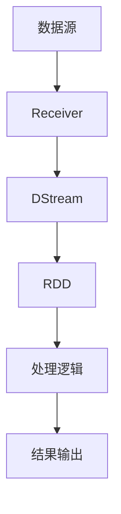

# Spark Streaming实时流处理原理与代码实例讲解

## 1.背景介绍

在大数据时代，实时数据处理变得越来越重要。传统的批处理系统无法满足对数据实时性要求较高的应用场景，例如金融交易监控、实时推荐系统和网络安全监控等。为了解决这一问题，Apache Spark推出了Spark Streaming，一个强大的实时流处理框架。Spark Streaming能够处理实时数据流，并提供高吞吐量和低延迟的处理能力。

## 2.核心概念与联系

### 2.1 Spark Streaming简介

Spark Streaming是基于Apache Spark的扩展，用于处理实时数据流。它将实时数据流分成小批次（micro-batches），然后使用Spark的批处理引擎进行处理。这样既能利用Spark的高效性，又能实现实时处理。

### 2.2 DStream（离散化流）

DStream（Discretized Stream）是Spark Streaming的核心抽象，代表一个连续的数据流。DStream由一系列小批次（RDDs）组成，每个小批次包含在特定时间间隔内接收到的数据。

### 2.3 关系与架构

Spark Streaming的架构可以用以下Mermaid图表示：



## 3.核心算法原理具体操作步骤

### 3.1 数据接收

Spark Streaming通过Receiver从数据源接收数据。Receiver可以从Kafka、Flume、Kinesis等多种数据源接收数据。

### 3.2 数据处理

接收到的数据被分成小批次（micro-batches），每个小批次被表示为一个RDD。然后，用户可以对这些RDD应用各种Spark操作，如map、reduce、filter等。

### 3.3 数据输出

处理后的数据可以被输出到多个目标，如文件系统、数据库或实时仪表盘。

## 4.数学模型和公式详细讲解举例说明

### 4.1 离散化流模型

DStream可以表示为一系列离散时间间隔内的RDDs：

$$
DStream = \{RDD_1, RDD_2, \ldots, RDD_n\}
$$

每个RDD表示在特定时间间隔内接收到的数据。

### 4.2 窗口操作

窗口操作允许用户对一段时间内的数据进行处理。假设窗口长度为 $W$，滑动间隔为 $S$，则窗口操作可以表示为：

$$
WindowedDStream = \{RDD_{t-W+1}, RDD_{t-W+2}, \ldots, RDD_t\}
$$

## 5.项目实践：代码实例和详细解释说明

### 5.1 环境配置

首先，确保你已经安装了Apache Spark和Scala。然后，创建一个新的Scala项目，并添加Spark Streaming依赖：

```scala
libraryDependencies += "org.apache.spark" %% "spark-streaming" % "3.1.2"
```

### 5.2 代码实例

以下是一个简单的Spark Streaming应用程序，它从TCP socket接收数据并计算每个单词的频率：

```scala
import org.apache.spark.SparkConf
import org.apache.spark.streaming.{Seconds, StreamingContext}

object NetworkWordCount {
  def main(args: Array[String]): Unit = {
    val conf = new SparkConf().setMaster("local[2]").setAppName("NetworkWordCount")
    val ssc = new StreamingContext(conf, Seconds(1))

    val lines = ssc.socketTextStream("localhost", 9999)
    val words = lines.flatMap(_.split(" "))
    val wordCounts = words.map(word => (word, 1)).reduceByKey(_ + _)

    wordCounts.print()

    ssc.start()
    ssc.awaitTermination()
  }
}
```

### 5.3 详细解释

1. 创建SparkConf对象并设置应用程序名称和运行模式。
2. 创建StreamingContext对象，并设置批处理间隔为1秒。
3. 从TCP socket接收数据，并将其转换为DStream。
4. 对DStream进行操作，计算每个单词的频率。
5. 启动StreamingContext并等待终止。

## 6.实际应用场景

### 6.1 金融交易监控

Spark Streaming可以用于实时监控金融交易，检测异常交易行为，并及时发出警报。

### 6.2 实时推荐系统

在电商平台中，Spark Streaming可以用于实时分析用户行为数据，提供个性化推荐。

### 6.3 网络安全监控

Spark Streaming可以用于实时分析网络流量，检测潜在的安全威胁。

## 7.工具和资源推荐

### 7.1 工具

- **Apache Kafka**：一个高吞吐量的分布式消息系统，常用于数据流的传输。
- **Apache Flume**：一个分布式、可靠的日志收集系统。
- **Grafana**：一个开源的实时数据监控和分析平台。

### 7.2 资源

- **官方文档**：Spark Streaming的官方文档是最权威的资源，包含详细的API说明和使用示例。
- **社区论坛**：Spark的社区论坛是解决问题和交流经验的好地方。
- **技术书籍**：推荐阅读《Learning Spark》和《Spark: The Definitive Guide》。

## 8.总结：未来发展趋势与挑战

### 8.1 发展趋势

随着物联网和大数据技术的发展，实时数据处理的需求将会越来越大。Spark Streaming作为一个强大的实时流处理框架，将在未来发挥更重要的作用。

### 8.2 挑战

- **数据延迟**：尽管Spark Streaming已经实现了低延迟处理，但在某些高实时性要求的场景下，仍需进一步优化。
- **容错性**：在分布式环境中，如何保证数据处理的容错性和一致性是一个重要挑战。
- **扩展性**：随着数据量的增加，如何保证系统的扩展性也是一个需要解决的问题。

## 9.附录：常见问题与解答

### 9.1 如何处理数据丢失？

可以使用Kafka等可靠的消息系统作为数据源，确保数据不会丢失。

### 9.2 如何优化性能？

可以通过调整批处理间隔、增加并行度和使用高效的序列化机制来优化性能。

### 9.3 如何处理数据倾斜？

可以使用随机前缀、分区器等方法来处理数据倾斜问题。

---

作者：禅与计算机程序设计艺术 / Zen and the Art of Computer Programming