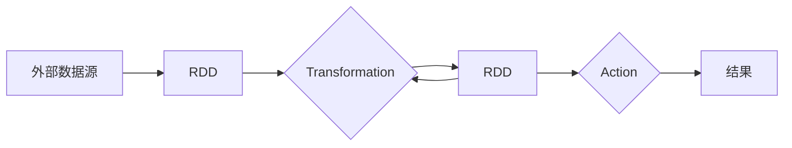
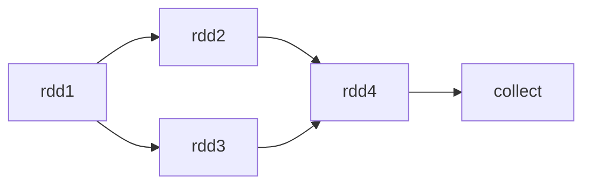

# Spark原理与代码实例讲解

## 1.背景介绍
### 1.1 大数据处理的挑战
在当今大数据时代,海量数据的处理和分析已成为各行各业面临的重大挑战。传统的数据处理方式难以应对数据量的爆炸式增长,亟需一种高效、可扩展的大数据处理框架。
### 1.2 Spark的诞生 
Spark作为新一代大数据处理引擎应运而生。它由加州大学伯克利分校AMP实验室于2009年开发,旨在解决Hadoop MapReduce面临的一些局限性,如数据复用、迭代计算等。Spark凭借其快速、通用、易用等特点迅速成为主流大数据处理框架。
### 1.3 Spark生态系统
围绕Spark核心,形成了一个丰富的生态系统,包括Spark SQL用于结构化数据处理、Spark Streaming用于实时流处理、MLlib用于机器学习、GraphX用于图计算等。这使得Spark能够应对各种大数据场景。

## 2.核心概念与联系
### 2.1 RDD
RDD(Resilient Distributed Dataset)是Spark的核心数据结构,表示一个不可变、可分区、里面的元素可并行计算的集合。RDD可以通过外部数据集创建,也可以从其他RDD转换而来。
### 2.2 DAG
Spark使用DAG(Directed Acyclic Graph)有向无环图来表示RDD之间的依赖关系和计算过程。DAG描述了RDD的转换关系和缓存情况,使得Spark可以进行优化和容错。
### 2.3 算子
Spark提供了一组丰富的算子(Operator)来操作RDD,分为Transformation和Action两大类。Transformation算子如map、filter等,对RDD进行转换,生成新的RDD;Action算子如reduce、collect等,触发RDD的计算,返回结果给Driver程序或写入外部存储系统。
### 2.4 Mermaid流程图
下面是Spark核心概念之间联系的Mermaid流程图:


## 3.核心算法原理具体操作步骤
### 3.1 RDD的创建
RDD可以通过两种方式创建:
- 由外部数据集并行化创建,如:
```scala
val rdd = sc.parallelize(Array(1, 2, 3, 4, 5))
```
- 由外部存储系统的数据集创建,如:  
```scala
val rdd = sc.textFile("hdfs://path/to/file")
```
### 3.2 RDD的转换
RDD经过一系列的Transformation算子转换,生成新的RDD。常见的Transformation算子包括:
- map: 对RDD中每个元素应用一个函数,返回新的RDD。
```scala
val rdd2 = rdd1.map(x => x * 2)
```
- filter: 对RDD应用一个布尔函数,返回满足条件的元素组成的新RDD。
```scala
val rdd2 = rdd1.filter(x => x > 10)
```
- flatMap: 与map类似,但每个输入元素可以被映射为0到多个输出元素。
```scala
val rdd2 = rdd1.flatMap(x => x.to(5))
```
### 3.3 RDD的缓存
Spark支持将RDD缓存在内存或磁盘中,提高数据的复用性和计算性能。可以通过persist或cache方法缓存RDD。
```scala
val rdd2 = rdd1.map(x => x * 2).persist()
```
### 3.4 RDD的计算
RDD的计算是由Action算子触发的。常见的Action算子包括:
- reduce: 对RDD中元素进行聚合。
```scala
val sum = rdd.reduce((x, y) => x + y)
```
- collect: 将RDD中所有元素返回给Driver程序。
```scala
val array = rdd.collect()
```
- saveAsTextFile: 将RDD中元素保存到文本文件。
```scala
rdd.saveAsTextFile("hdfs://path/to/file")
```

## 4.数学模型和公式详细讲解举例说明
Spark中一些核心概念可以用数学模型和公式来表示,这里举几个例子。
### 4.1 RDD的数学定义
RDD可以用一个三元组 $(D, P, F)$ 来表示:
- $D$: RDD中元素的有序列表,即数据集。
- $P$: 数据集 $D$ 的分区列表。每个分区是一个原子数据块,Spark以分区为单位进行计算和数据存储。
- $F$: 分区计算函数,每个分区 $p \in P$ 都有一个计算函数 $f \in F$ 作用于该分区上。

例如,对于RDD `rdd1 = [1, 2, 3, 4, 5]`,它可以表示为:
- $D = [1, 2, 3, 4, 5]$ 
- $P = [[1, 2], [3, 4], [5]]$
- $F = [\lambda x. x * 2, \lambda x. x * 2, \lambda x. x * 2]$

应用map算子 `rdd2 = rdd1.map(x => x * 2)` 后,新的RDD为:
- $D = [2, 4, 6, 8, 10]$
- $P = [[2, 4], [6, 8], [10]]$ 
- $F = [\lambda x. x, \lambda x. x, \lambda x. x]$

### 4.2 DAG的数学表示
DAG可以用一个有向无环图 $G = (V, E)$ 表示,其中:
- $V$: 图的顶点集,每个顶点表示一个RDD。
- $E$: 图的有向边集,每条边 $e = (u, v) \in E$ 表示RDD之间的依赖关系,即 $v$ 依赖于 $u$。

例如,对于以下Spark程序:
```scala
val rdd1 = sc.parallelize(1 to 5)
val rdd2 = rdd1.map(x => x * 2) 
val rdd3 = rdd1.filter(x => x % 2 == 0)
val rdd4 = rdd2.union(rdd3)
val result = rdd4.collect()
```
其DAG可以表示为:

对应的数学表示为:
- $V = \{rdd1, rdd2, rdd3, rdd4\}$
- $E = \{(rdd1, rdd2), (rdd1, rdd3), (rdd2, rdd4), (rdd3, rdd4)\}$

## 5.项目实践:代码实例和详细解释说明
下面通过一个实际的Spark项目来演示Spark的使用。该项目的目标是统计一个文本文件中单词的出现频率。
### 5.1 环境准备
首先需要配置Spark开发环境,可以使用Spark自带的shell,也可以在IDE中创建Spark项目。本例使用Scala语言编写。
### 5.2 读取文件,创建RDD
从HDFS读取文本文件,创建一个RDD:
```scala
val textFile = sc.textFile("hdfs://path/to/file.txt")
```
### 5.3 分词,转换RDD 
对每一行文本进行分词,转换成单词RDD:
```scala
val wordsRDD = textFile.flatMap(line => line.split(" "))
```
flatMap算子将每行文本映射成一个单词数组,再压平成一个单词RDD。
### 5.4 单词计数,生成(单词,1)键值对  
为每个单词创建一个计数值1:
```scala
val pairsRDD = wordsRDD.map(word => (word, 1))
```
此时RDD中每个元素是一个二元组(单词,1)。
### 5.5 按单词聚合,统计频率
对每个单词的计数值进行聚合,得到单词总频率:
```scala
val wordCountsRDD = pairsRDD.reduceByKey((x, y) => x + y)
```
reduceByKey算子按二元组的Key(即单词)进行分组,对每组的Value(计数值)进行聚合。
### 5.6 结果输出
将结果RDD保存到HDFS:
```scala
wordCountsRDD.saveAsTextFile("hdfs://path/to/output")
```
至此,一个简单的单词计数程序就完成了。可以看到,使用Spark进行大数据处理非常简洁和高效。Spark提供了一系列强大的API,使得复杂的数据处理过程可以用数行代码完成。同时,Spark也对这些操作进行了优化,利用内存计算、DAG等技术实现了高性能。

## 6.实际应用场景
Spark在工业界有非常广泛的应用,几乎覆盖了大数据处理的各个领域。下面列举几个典型的应用场景。
### 6.1 数据仓库
Spark可以用于ETL(Extract-Transform-Load)和数据分析,构建高效的数据仓库系统。使用Spark SQL可以方便地处理结构化数据,支持交互式查询和Ad-hoc分析。
### 6.2 机器学习
MLlib提供了一系列常用的机器学习算法,如分类、回归、聚类、协同过滤等,可以用于用户画像、个性化推荐、欺诈检测等场景。Spark的分布式内存计算使得机器学习算法可以处理超大规模数据集。
### 6.3 图计算
GraphX是Spark的图计算框架,支持图的并行处理。可以用于社交网络分析、PageRank算法等。
### 6.4 流处理
Spark Streaming支持实时数据流的处理,可以用于实时监控、异常检测、在线机器学习等。Spark Streaming与Spark Core无缝集成,可以实现Lambda架构,同时处理实时和离线数据。

## 7.工具和资源推荐
### 7.1 开发工具
- IntelliJ IDEA: 强大的Scala IDE,与Spark深度集成。
- Jupyter Notebook: 基于Web的交互式开发工具,支持Scala、Python等。适合数据探索和原型开发。
- Zeppelin: 另一个基于Web的Notebook工具,对Spark支持良好,可以直接在笔记中编写和执行Spark代码。
### 7.2 部署工具  
- Spark Standalone: Spark自带的资源管理和任务调度框架,可以快速部署Spark集群。
- YARN: Hadoop生态的资源管理系统,Spark可以运行在YARN上,实现资源共享。
- Mesos: 通用的集群资源管理系统,Spark也可以运行在Mesos上。
### 7.3 学习资源
- Spark官方文档: 提供了全面的Spark使用指南和API文档。
- Spark源码: 通过阅读Spark源码可以深入理解Spark原理。
- Spark Summit: Spark领域的顶级会议,分享最新的研究和应用成果。
- Github: 有大量的Spark项目和代码示例,是学习和借鉴的好资源。

## 8.总结:未来发展趋势与挑战
### 8.1 发展趋势
- 与AI深度融合: 随着AI尤其是深度学习的发展,Spark正在成为构建大规模AI系统的重要工具。未来Spark将与TensorFlow、PyTorch等深度学习框架进一步整合,实现数据处理和模型训练的无缝衔接。
- Serverless化: Serverless计算模式可以实现按需使用、自动扩缩容、按量付费等优点。Spark正在朝Serverless化方向发展,如Spark on Kubernetes就是一个很好的尝试。
- 简化和自动化: 为了降低使用门槛,Spark正在变得越来越智能。如Structured Streaming简化了流处理的编程模型;Adaptive Query Execution可以自动调优SQL查询;Data Source V2 API实现了读写外部数据源的标准化。
### 8.2 挑战
- 数据安全和隐私: 在处理敏感数据时,需要考虑安全和隐私保护,如何在分布式环境中实现细粒度的权限控制、数据脱敏等是一大挑战。
- 性能优化: 如何最大限度地发挥现代硬件如NVMe SSD、RDMA等的性能潜力,是Spark优化的重点方向。
- 容错和弹性: 在超大规模集群上,机器故障是常态。如何实现高效的容错和故障恢复,保证系统的弹性,也是Spark面临的挑战。
- 易用性: 如何让Spark更加易学易用,减少开发和维护成本,吸引更多用户,也是需要关注的问题。

## 9.附录:常见问题与解答
### 9.1 什么是Spark Application、Job、Stage