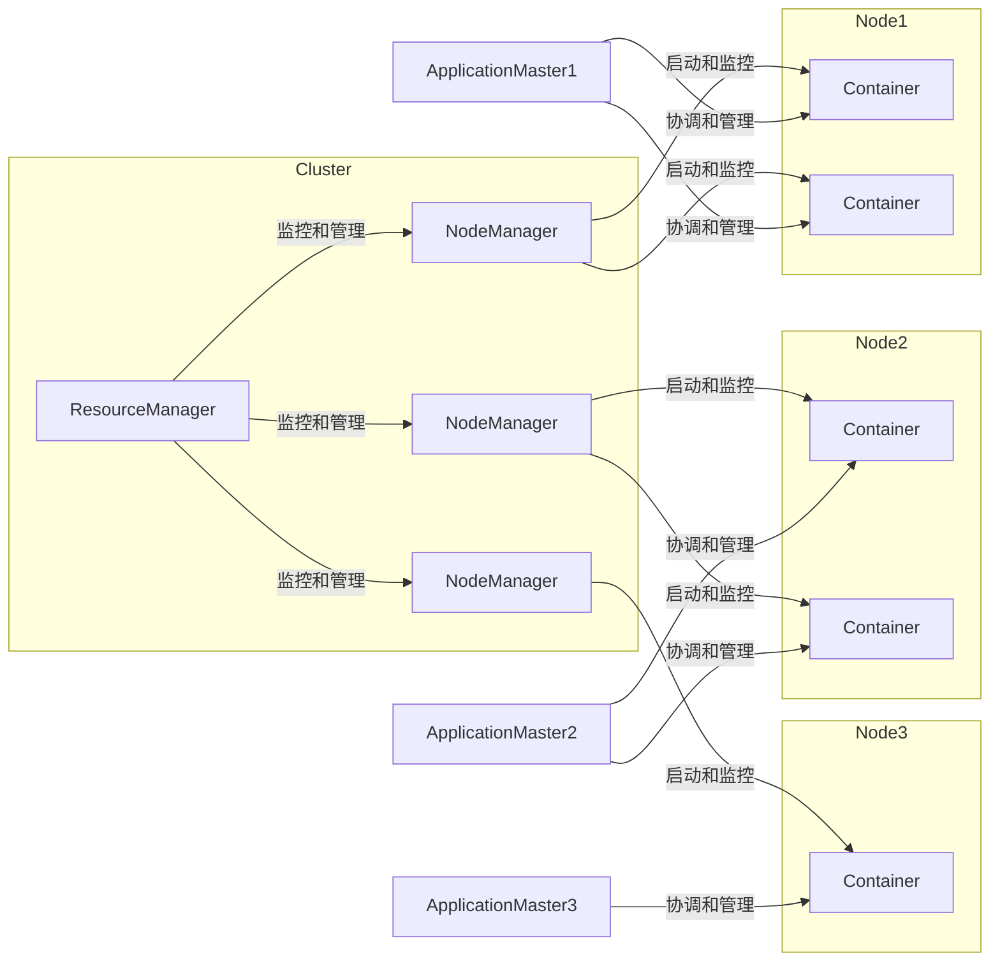

# Yarn原理与代码实例讲解

## 1.背景介绍

在大数据时代,Apache Hadoop作为一个开源的分布式系统基础架构,已经成为了企业存储和大数据处理的核心平台。Hadoop的两大核心组件是HDFS分布式文件系统和MapReduce计算框架。然而,MapReduce在处理大规模数据时存在许多不足,比如任务设置繁琐、资源利用率低、应用之间相互影响等。为了解决这些问题,Apache Hadoop 3.1.0版本引入了全新的资源管理和作业调度系统Yarn(Yet Another Resource Negotiator)。

Yarn的设计目标是将资源管理与作业监控分离,为上层计算框架(如MapReduce、Spark、Flink等)提供统一的资源管理和调度服务,实现资源的高效利用和多框架共存。Yarn的引入使得Hadoop从单一的MapReduce计算模型,发展成为一个通用的数据处理平台,支持多种上层应用程序。

## 2.核心概念与联系

### 2.1 Yarn核心组件

Yarn主要由ResourceManager、NodeManager、ApplicationMaster和Container等四个核心组件组成。



- **ResourceManager(RM)**: 整个Yarn集群的资源管理者和协调者,负责资源的分配和调度。
- **NodeManager(NM)**: 运行在每个节点上的资源和任务监控管理器,负责单节点上资源的管理和使用。
- **ApplicationMaster(AM)**: 每个应用程序的老大,负责应用的调度和协调,向RM申请资源,并监控应用的运行状态。
- **Container**: 资源抽象的单位,封装了一定量的内存、CPU等计算资源,是应用运行的单位。

### 2.2 Yarn工作流程

Yarn的工作流程如下:

1. 当一个应用程序提交到Yarn时,RM会为该应用程序分配一个Container,并在其中启动AM。
2. AM向RM申请资源(Container),获取到资源后,启动相应的任务在Container中运行。
3. NM定期向RM汇报本节点的资源使用情况和各个Container的运行状态。
4. 应用程序运行完成后,AM向RM注销并释放所有资源。

## 3.核心算法原理具体操作步骤 

### 3.1 资源模型

Yarn采用了一种统一的资源模型,将集群中的资源抽象为内存和CPU两种资源。每个节点的资源由一组`<内存, CPU>`元组表示,例如`<8192MB, 8vcores>`。

应用程序提交时需要指定资源需求,Yarn会根据集群的资源情况进行分配。资源分配遵循以下原则:

- 资源以整数形式分配,不可分割。
- 优先分配内存,直到内存或CPU任一种资源用尽。
- 同一个应用程序的不同任务可以使用不同数量的资源。

### 3.2 资源调度

Yarn采用了可插拔式的调度器框架,支持多种调度策略,常用的有三种:

1. **FIFO Scheduler**: 先来先服务,按照应用程序的提交顺序分配资源。适用于小集群和测试环境。

2. **Capacity Scheduler**: 多队列的容量调度器,为每个队列设置一定的资源量,遵循FIFO原则为队列中的应用程序分配资源。常用于多租户场景。

3. **Fair Scheduler**: 公平调度器,根据应用程序运行时间的权重动态调整资源分配,确保资源在应用程序之间公平分配。适用于大集群环境。

调度器的选择取决于具体的应用场景和需求,可根据需要进行配置和插件扩展。

### 3.3 容错机制

为了保证Yarn的高可用性,其采用了主备热备份机制:

- ResourceManager采用了主备两个实例,其中一个为Active状态,另一个为Standby状态。
- NodeManager会同时向两个RM实例汇报状态,但只接受来自Active RM的指令。
- 如果Active RM发生故障,则Standby RM会自动切换为Active状态,从而实现无缝failover。

此外,ApplicationMaster采用了重试执行机制,如果AM运行失败,Yarn会自动重新启动一个新的AM实例,继续执行应用程序。

## 4.数学模型和公式详细讲解举例说明

在资源分配和调度过程中,Yarn需要解决一个经典的bin packing问题,即如何将不同大小的对象(应用程序的资源需求)有效地装箱(分配到节点上)。这是一个NP完全问题,需要采用启发式算法来近似求解。

### 4.1 资源向量

Yarn使用向量来表示资源,其中每个维度代表一种资源类型。常见的资源类型有内存、CPU、GPU等。

设有$n$种资源类型,则资源向量可表示为:

$$\vec{r} = (r_1, r_2, \dots, r_n)$$

其中$r_i$表示第$i$种资源的数量。

### 4.2 资源局部性

为了提高数据局部性,Yarn在分配资源时会尽量将任务调度到数据所在的节点上。这可以通过为每个节点分配一个局部性权重向量$\vec{l}$来实现,其中$l_i$表示该节点对于第$i$种资源的局部性权重。

对于一个给定的资源请求$\vec{r}$,可以计算其在节点$j$上的加权资源需求$\vec{r'_j}$:

$$\vec{r'_j} = (r_1 \times l_{j1}, r_2 \times l_{j2}, \dots, r_n \times l_{jn})$$

调度器会优先选择加权资源需求最小的节点进行分配。

### 4.3 资源公平性

在Fair Scheduler中,需要保证不同应用程序之间的资源分配是公平的。这可以通过计算应用程序的资源déficit来实现。

设应用程序$i$的资源需求为$\vec{r_i}$,已分配的资源为$\vec{a_i}$,则其déficit为:

$$\text{déficit}_i = \max\limits_k \left\{\frac{r_{ik} - a_{ik}}{r_{ik}}\right\}$$

其中$k$为资源类型的索引。déficit值越大,表示该应用程序获得的资源越少,调度器会优先为déficit值高的应用程序分配资源。

通过上述数学模型,Yarn可以实现资源的高效利用、数据局部性优化和公平性保证。

## 5.项目实践:代码实例和详细解释说明

下面我们通过一个简单的WordCount示例,演示如何在Yarn上运行MapReduce作业。

### 5.1 项目结构

```
- wordcount/
    - pom.xml
    - src/
        - main/
            - java/
                - WordCount.java
            - resources/
                - input.txt
```

其中`WordCount.java`是MapReduce作业的主类,`input.txt`是输入文件。

### 5.2 WordCount代码

```java
import java.io.IOException;
import org.apache.hadoop.conf.Configuration;
import org.apache.hadoop.fs.Path;
import org.apache.hadoop.io.IntWritable;
import org.apache.hadoop.io.Text;
import org.apache.hadoop.mapreduce.Job;
import org.apache.hadoop.mapreduce.Mapper;
import org.apache.hadoop.mapreduce.Reducer;
import org.apache.hadoop.mapreduce.lib.input.FileInputFormat;
import org.apache.hadoop.mapreduce.lib.output.FileOutputFormat;

public class WordCount {

    public static class TokenizerMapper
            extends Mapper<Object, Text, Text, IntWritable>{

        private final static IntWritable one = new IntWritable(1);
        private Text word = new Text();

        public void map(Object key, Text value, Context context
        ) throws IOException, InterruptedException {
            String[] tokens = value.toString().split("\\W+");
            for (String token : tokens) {
                if (token.length() > 0) {
                    word.set(token);
                    context.write(word, one);
                }
            }
        }
    }

    public static class IntSumReducer
            extends Reducer<Text,IntWritable,Text,IntWritable> {
        private IntWritable result = new IntWritable();

        public void reduce(Text key, Iterable<IntWritable> values,
                           Context context
        ) throws IOException, InterruptedException {
            int sum = 0;
            for (IntWritable val : values) {
                sum += val.get();
            }
            result.set(sum);
            context.write(key, result);
        }
    }

    public static void main(String[] args) throws Exception {
        Configuration conf = new Configuration();
        Job job = Job.getInstance(conf, "word count");
        job.setJarByClass(WordCount.class);
        job.setMapperClass(TokenizerMapper.class);
        job.setCombinerClass(IntSumReducer.class);
        job.setReducerClass(IntSumReducer.class);
        job.setOutputKeyClass(Text.class);
        job.setOutputValueClass(IntWritable.class);
        FileInputFormat.addInputPath(job, new Path(args[0]));
        FileOutputFormat.setOutputPath(job, new Path(args[1]));
        System.exit(job.waitForCompletion(true) ? 0 : 1);
    }
}
```

代码解释:

1. `TokenizerMapper`是Map阶段的类,它将输入文本按单词分割,并为每个单词输出`<单词, 1>`键值对。
2. `IntSumReducer`是Reduce阶段的类,它对每个单词出现的次数进行求和。
3. `main`函数设置作业的配置,包括Mapper、Reducer类、输入输出路径等。
4. 通过`job.waitForCompletion`提交并等待作业执行完成。

### 5.3 在Yarn上运行

1. 将代码打包为jar文件:`mvn clean package`
2. 将输入文件`input.txt`上传到HDFS:`hadoop fs -put input.txt /user/input`
3. 运行作业:`yarn jar wordcount.jar /user/input /user/output`
4. 查看输出:`hadoop fs -cat /user/output/part-r-00000`

通过这个示例,我们可以看到在Yarn上运行MapReduce作业是非常简单的。Yarn为我们屏蔽了资源管理和任务调度的细节,开发者只需关注业务逻辑即可。

## 6.实际应用场景

Yarn作为Hadoop的新一代资源管理和调度框架,已经被广泛应用于各种大数据场景,包括但不限于:

1. **大数据处理**: Yarn支持在同一个集群上运行多种计算框架,如MapReduce、Spark、Flink等,可以高效处理各种批处理、流处理、机器学习等大数据应用。

2. **大数据分析**: 基于Yarn之上,可以构建交互式的大数据分析平台,如Apache Hive、Apache Zeppelin等,为数据分析人员提供高效的工具。

3. **物联网数据处理**: 在物联网领域,大量的传感器数据需要实时处理和分析。Yarn可以支持流式计算框架如Apache Storm、Apache Spark Streaming等,满足物联网场景的需求。

4. **云计算和容器化**: Yarn的资源管理能力可以很好地支持云计算和容器化技术,如Apache Hadoop YARN on Docker、Apache Hadoop YARN on Kubernetes等项目。

5. **科学计算和人工智能**: 在科学计算和人工智能领域,Yarn也发挥着重要作用。例如TensorFlow on Yarn、Horovod on Yarn等项目,为分布式训练提供了资源管理支持。

总的来说,Yarn作为一个通用的资源管理和调度框架,为大数据生态系统提供了强大的支撑,促进了大数据技术在各个领域的广泛应用。

## 7.工具和资源推荐

在使用Yarn时,有许多优秀的工具和资源可以帮助我们更高效地开发和运维。

### 7.1 开发工具

- **Apache Hadoop**: Yarn是Hadoop的核心组件,官方提供了完整的文档、示例代码和社区支持。
- **Apache